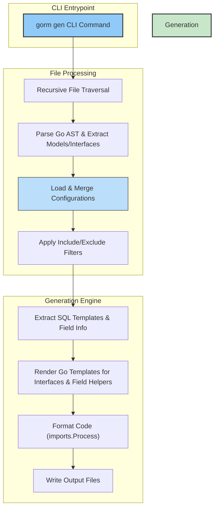

# System Architecture

Explore the backbone of GORM CLI’s code generation engine through a high-level walkthrough of its primary components. This guide explains how the CLI entry points interact with the underlying code generation engine, how field helper logic is integrated, and how the generated output is structured. Through this, you will understand how your user-defined Go interfaces and models are consumed and transformed into type-safe APIs, revealing the chain of data and control that drives automated GORM query code creation.

---

## Architecture Overview

At its core, GORM CLI transforms Go source files containing annotated SQL interfaces and models into robust, type-safe query APIs and field helpers. This process happens via these main components:

- **CLI Entrypoints**: The user-facing command `gorm gen` invoked from the terminal.
- **Code Generation Engine**: Processes Go source files to parse, analyze, and transform input into generated Go code.
- **Field Helper Logic**: Derives strongly typed helpers from your model structs for fluent filtering, updates, and association management.
- **Output Structure**: Organizes generated code files maintaining package and directory hierarchy for seamless integration.

These working parts collaborate to ensure your project consistently produces reliable APIs from evolving data models and query interfaces.

### User Flow

1. **Initiate Generation**: You run the `gorm gen` CLI command (from the root of your project or input directory) specifying input files and target output directory.
2. **File Collection & Parsing**: The generator traverses specified files, parsing Go source to extract interfaces, structs, annotations, and configuration hints.
3. **Config Resolution**: Applied configurations — including filtering rules and type mappings — are dynamically resolved per file, respecting both package and file-level contexts.
4. **AST Traversal & Extraction**: Interfaces and structs are fully analyzed, with method signatures, SQL templates, and field definitions captured.
5. **Code Template Rendering**: Using internal templates, the engine generates type-safe interface implementations and field helper constructs.
6. **Output Writing & Formatting**: Generated files are written under the configured directory, preserving input paths and formatted for idiomatic Go usage.

---

## Core Components

### 1. CLI Entrypoints

The CLI is your gateway to GORM CLI’s power. Executed via:

```bash
gorm gen -i <input_path> -o <output_path>
```

- `-i` points to the Go source directory or file containing your interfaces and models.
- `-o` designates where the generator will place output files (defaulting to `./g`).

Internally, the `gen` package’s `New()` function creates the CLI command registered with Cobra, ensuring flags are validated and processed.

### 2. Code Generation Engine

At the heart lies the `Generator` struct, which:

- Walks the input directory tree recursively to process source files.
- Parses each Go file into an Abstract Syntax Tree (AST), extracting package, imports, interfaces, and struct definitions.
- Detects and applies generation configurations declared in the source (via `genconfig.Config` variables).
- Filters interfaces and structs based on include/exclude rules from configurations.

Key tasks:

- **Interface Processing**: Extract each method’s signature; parse embedded SQL templates from method comments; validate return types for appropriate generation.
- **Struct Processing**: Analyze fields, including embedded anonymous structs, to define field helpers and association types.

### 3. Field Helper Logic

Field helpers provide strongly typed predicates and setters for your model fields. For each struct field:

- Basic types (e.g., `string`, `int`, `time.Time`) map to pre-defined helpers like `field.String`, `field.Number[int]`, or `field.Time`.
- Custom type mappings from configuration (`FieldTypeMap` and `FieldNameMap`) override these defaults.
- Association fields (e.g., slices, nested structs) generate specialized helpers enabling operations like create, update, unlink, and delete on related records.

The generator crafts variables and methods that expose these helpers with fluent chaining.

### 4. Output Structure

Generated files mirror the source directory structure, facilitating straightforward import paths and package organization. For each processed file:

- The generator applies any configured output path overrides.
- A corresponding Go file is created containing:
  - Implementations of your query interfaces with SQL template logic translated into GORM method chains.
  - Variables defining field helpers for models.

Files are formatted using `golang.org/x/tools/imports` to ensure idiomatic and clean generated code.

---

## Detailed Workflow Illustration

To help you visualize, here is a step sequence capturing the internal processing flow:

<Steps>
<Step title="Run CLI Command">
You invoke the command `gorm gen` with input/output options, triggering the generation process.
</Step>
<Step title="File Traversal and Parsing">
The generator discovers all matching Go source files, parses them into ASTs, and collects metadata.
</Step>
<Step title="Configuration Resolution">
For each file, applicable package-level and file-level configurations are loaded and merged.
</Step>
<Step title="Interface & Struct Extraction">
Interfaces are scanned for methods and SQL annotations; structs parsed for field details including embedded fields.
</Step>
<Step title="Filtering & Selection">
Based on `Include*` and `Exclude*` filters in configs, only matching interfaces and structs continue to generation.
</Step>
<Step title="Template Rendering">
Go templates render the final source code for interfaces, methods, and field helpers.
</Step>
<Step title="File Output & Formatting">
Generated files are saved with directory structure preserved and formatted for Go tooling.
</Step>
</Steps>

---

## Key Code Snippets & Explanations

### CLI Entrypoint Command Creation

```go
// New returns the `gorm gen` command
func New() *cobra.Command {
  var output string
  var input string

  cmd := &cobra.Command{
    Use: "gen",
    Short: "Generate GORM query code from raw SQL interfaces",
    RunE: func(cmd *cobra.Command, args []string) error {
      g := Generator{Files: map[string]*File{}, outPath: output}
      if err := g.Process(input); err != nil {
        return fmt.Errorf("error processing %s: %v", input, err)
      }
      if err := g.Gen(); err != nil {
        return fmt.Errorf("error render template got error: %v", err)
      }
      return nil
    },
  }

  cmd.Flags().StringVarP(&output, "output", "o", "./g", "Directory to place generated code")
  cmd.Flags().StringVarP(&input, "input", "i", "", "Path to Go interface file with raw SQL annotations")

  cmd.MarkFlagRequired("input")
  return cmd
}
```

This sets up flags and error handling, ensuring required inputs before code generation.

### Generator: Processing Files and Applying Configuration

The engine processes files recursively, parsing AST and resolving configurations:

```go
func (g *Generator) Process(input string) error {
  info, err := os.Stat(input)
  if err != nil { return err }

  if info.IsDir() {
    root, _ := filepath.Abs(input)
    return filepath.Walk(input, func(path string, info os.FileInfo, err error) error {
      if err == nil && !info.IsDir() {
        return g.processFile(path, root)
      }
      return err
    })
  }
  root, _ := filepath.Abs(filepath.Dir(input))
  return g.processFile(input, root)
}
```

Each file undergoes AST traversal extracting interfaces and structs.

### Interface Method Processing and SQL Extraction

Methods parse the SQL comments for templated queries:

```go
func (p *File) processInterfaceType(n *ast.TypeSpec, data *ast.InterfaceType) Interface {
  iface := Interface{Name: n.Name.Name, IfaceName: "_" + n.Name.Name, Doc: n.Doc.Text()}
  for _, m := range data.Methods.List {
    for _, name := range m.Names {
      method := &Method{Name: name.Name, Doc: m.Doc.Text(), SQL: extractSQL(m.Doc.Text(), name.Name), Interface: iface}
      iface.Methods = append(iface.Methods, method)
      method.Params = p.parseFieldList(m.Type.(*ast.FuncType).Params)
      method.Result = p.parseFieldList(m.Type.(*ast.FuncType).Results)
      // Validation on return values
    }
  }
  return iface
}
```

This ensures template-driven methods are understood properly for generation.

### Field Helper Type Determination

The generator derives the suitable helper type for each field:

```go
func (f Field) Type() string {
  // Config-based overrides
  for _, cfg := range f.file.applicableConfigs {
    if v, ok := cfg.FieldNameMap[f.NamedGoType]; ok {
      return fmt.Sprint(v)
    }
    if v, ok := cfg.FieldTypeMap[f.GoType]; ok {
      return fmt.Sprint(v)
    }
  }

  // Map basic Go types to standard helpers
  if mapped, ok := typeMap[f.GoType]; ok {
    return mapped
  }

  // Handle numbers generically
  if strings.Contains(f.GoType, "int") || strings.Contains(f.GoType, "float") {
    return fmt.Sprintf("field.Number[%s]", f.GoType)
  }

  // Handle association fields (structs or slices)
  if strings.HasPrefix(f.GoType, "[]") {
    elem := strings.TrimPrefix(f.GoType, "[]")
    return fmt.Sprintf("field.Slice[%s]", elem)
  } else if strings.Contains(f.GoType, ".") {
    return fmt.Sprintf("field.Struct[%s]", path.Base(f.GoType))
  }
  return fmt.Sprintf("field.Field[%s]", path.Base(f.GoType))
}
```


---

## Troubleshooting & Best Practices

- **File Skipping**: The generator automatically ignores previously generated code files to prevent recursion.
- **Configuration Application**: Apply `genconfig.Config` correctly per package or file to ensure your inclusion and exclusion rules work as expected.
- **Method Return Types**:
  - Methods finishing queries must return at least one value with the last being an `error`.
  - Chain-building methods return an interface for fluent calls.
- **Preserve Directory Structure**: Use input-output directory pairing so your generated code matches your project layout.
- **Field Type Mapping**: Customize field helper mappings to handle specialized Go types seamlessly.

---

## Summary

This guide illuminated GORM CLI’s system architecture, focusing on how user input files traverse the generator pipeline via CLI commands, AST parsing, and configurable filtering to produce clean, idiomatic, and type-safe Go code. Understanding this flow empowers you to align your project structure and annotations with GORM CLI’s processing model for maximum efficiency and safety.

For more detailed usage, consult guides on [Creating Query Interfaces](https://docs.gorm.io/guides/core-workflows/query-apis-and-templates.html), [Using Field Helpers](https://docs.gorm.io/guides/core-workflows/using-generated-field-helpers.html), and [Configuring Generation](https://docs.gorm.io/guides/advanced-usage/configuring-generation.html).

---

## Architecture Diagram



---

## Additional Resources

- [Core Concepts & Terminology](https://docs.gorm.io/overview/system-architecture-concepts/core-concepts-terminology.html)
- [Integration & Extensibility Overview](https://docs.gorm.io/overview/system-architecture-concepts/integration-and-extensibility.html)
- [Quickstart Workflow](https://docs.gorm.io/overview/feature-highlights-getting-started/quickstart-workflow.html)
- [Guide: Configuring Generation](https://docs.gorm.io/guides/advanced-usage/configuring-generation.html)

---

Get started with the core workflow: defining query interfaces and models, running `gorm gen`, and harnessing the power of generated APIs integrated seamlessly into your GORM projects.