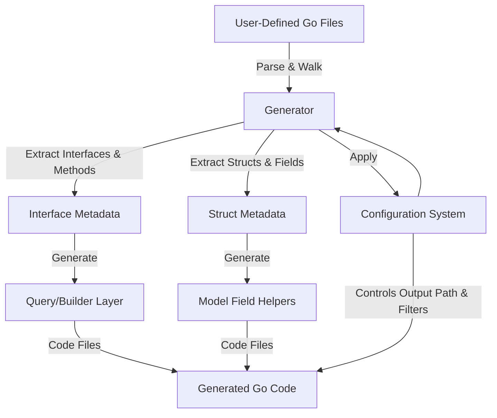

# Core System Components

Discover the foundational building blocks of the GORM CLI system. This guide explores the key components—the generator, query/builders, model analyzers, and configuration system—that interact to enable automatic, type-safe code generation and enhance developer productivity.

---

## Overview

At the heart of GORM CLI lies a modular design that processes your Go interfaces and models, producing fully generated code that brings type safety and fluent APIs to your data layer. Understanding these core components empowers you to leverage the tool efficiently and customize it if needed.

This page focuses specifically on the inner workings and roles of:

- The **Code Generator**: parses source files, interprets SQL templates, and generates Go code
- The **Query/Builder Layer**: builds type-safe query methods from interfaces
- The **Model Analyzer**: inspects Go structs to create model-driven field helpers
- The **Configuration System**: allows fine-grained control over what and how code is generated

These components collectively form the backbone of GORM CLI's workflow.

---

## 1. Generator Component

The **Generator** is the core workhorse responsible for reading your source Go files and producing generated code structures.

### Responsibilities:

- **File Processing:** Accepts directories or individual Go source files,
  walks through them, and skips files flagged as generated to avoid duplication.

- **Parsing Source:** Uses Go's `go/ast` package to parse and analyze Abstract Syntax Trees of interfaces and structs.

- **Extracting Interfaces & Methods:** 
  - Identifies interfaces annotated with SQL templates.
  - Extracts and validates method signatures, ensuring correct return types (typically an entity and/or error).
  - Parses SQL comments to formulate query-building logic.

- **Parsing Structs:** Inspects struct fields, including embedded anonymous fields, to generate type-safe field helpers for filtering and updates.

- **Handling Imports:** Collects import statements to appropriately map dependencies in the generated code.

- **Managing Configurations:** Applies package-level `genconfig.Config` settings to influence file-level inclusion/exclusion, output directories, and custom field mappings.

- **Generating Code Artifacts:** Uses templating (`text/template`) to render generated Go code files, ensuring idiomatic and well-formatted output including method implementations and field helper variables.

### Example Flow

```plaintext
User writes Go interfaces with SQL templates and struct models → Generator parses these Go files → Extracts interfaces, methods, and structs → Applies config filters → Generates corresponding Go code files with type-safe query APIs and field helpers
```

<Tip>
The Generator not only processes methods with SQL templates but also enforces method signature rules, such as protecting against missing return error values or excess return parameters, ensuring generated code maintains Go's idiomatic error handling.
</Tip>

---

## 2. Query/Builder Layer

The query and builder layer is automatically generated from your SQL-annotated interfaces.

### Core Concept

Each interface method with an embedded SQL comment becomes a concrete, type-safe method on the generated struct implementing query logic. These methods:

- Inject a `context.Context` parameter automatically if missing.
- Translate templated SQL DSL into dynamic, parameterized SQL queries.
- Return entities or results mapped to your Go models with proper error handling.

### How it Works

- **Interface to Implementation Mapping:** An interface such as `Query[T any]` generates a struct `QueryImpl[T]` with concrete methods.

- **Method Body Generation:** 
  - Methods processing raw SQL return final query results or execute commands.
  - Methods that allow chaining (e.g., filters) return modified builder interfaces enabling fluent API usage.

- **Parameter Mapping:** Method parameters are bound into SQL templates using placeholders (e.g., `@id`, `@user.Name`) with built-in safety.

- **Support for Conditional and Looping Constructs:** The DSL empowers complex queries with conditional SQL clauses and collection iteration, dynamically rendered at runtime.

### Example

```go
// User defines an interface method
// SELECT * FROM @@table WHERE id=@id
GetByID(id int) (T, error)

// Generated method snippet
func (e QueryImpl[T]) GetByID(ctx context.Context, id int) (T, error) {
   // builds and executes parameterized SQL
}
```

<Note>
Users benefit from the query/builders being generated with full type safety and context-awareness, reducing runtime errors and improving developer velocity.
</Note>

---

## 3. Model Analyzer (Struct Processing & Field Helpers)

GORM CLI also analyzes your Go structs to generate strong, expressive field helpers that enable fluent and safe filtering, updates, and associating operations.

### What It Does:

- **Registration of Struct Fields:** Parses exported fields including embedded structs and inline anonymous fields, flattening hierarchy.

- **Field Type Mapping:** Uses default maps (e.g., int, string, time.Time) and supports custom mappings configured via `genconfig.Config`.

- **Generates Field Helper Variables:** For each field, it generates a strongly typed helper representing a column, e.g., `User.Name`, `User.Age` with methods like `Eq()`, `Like()`, `Between()`, etc.

- **Supports Relationships:** Identifies associations (has one/many, belongs to, many2many) and generates specialized helpers to manage these relationships.

### Benefit to Users

- Write expressive filters without raw SQL coding.
- Compose safe updates using generated setters.
- Leverage association helpers to easily manipulate related data.

### Sample Field Helper Usage

```go
generated.User.Name.Eq("alice")              // name = 'alice'
generated.User.Age.Between(18, 65)            // age BETWEEN 18 AND 65
generated.User.Pets.Create(generated.Pet.Name.Set("fido")) // create associated pet
```

<Tip>
Custom field mappings in configs enable supporting complex or DB-specific types like JSON fields, ensuring the generated helpers generate correct SQL abstractions.
</Tip>

---

## 4. Configuration System

The configuration system provides flexible control over code generation, allowing you to fine-tune what code gets generated and where.

### Key Features:

- **Declaration:** Users define package-level `genconfig.Config` structs in their Go source files.

- **Control Generations:**
  - `OutPath` specifies output directory for generated code.
  - `IncludeInterfaces` / `ExcludeInterfaces` allow whitelisting/blacklisting interfaces by pattern or type.
  - `IncludeStructs` / `ExcludeStructs` perform similar filtering for model structs.
  - `FileLevel` controls whether config applies to individual files or the entire package.
  - `FieldTypeMap` and `FieldNameMap` allow mapping Go types or custom `gen` struct tag names to specific field helpers.

- **Fine-Grained Filtering:** Supports shell-style wildcard matching and type-literal references for precise control.

### How Configs Are Applied

- Generator discovers configs during AST traversal.
- Configs influence which interfaces and structs are included/excluded from generation.
- Allow overriding import handling and output paths on a per-directory/file basis.

### Example

```go
var _ = genconfig.Config{
  OutPath: "examples/output",
  IncludeInterfaces: []any{"Query*"},
  FieldNameMap: map[string]any{
    "json": JSON{},
  },
}
```

<Warning>
Incorrect configuration (e.g., conflicting includes and excludes) can result in missing generated code or unexpected outputs. Always review your config carefully and test generation outputs.
</Warning>

---

## Component Interaction Diagram



---

## Best Practices & Tips

- **Organize Your Code:** Keep interfaces and models in clean, dedicated packages or directories to simplify filtering and configuration.

- **Leverage Configs Early:** Use `genconfig.Config` to tailor generation paths, inclusion, and custom field types early in your project.

- **Maintain Consistent Method Signatures:** Follow the interface signature rules—always include error returns and contextual parameters—to avoid generation errors.

- **Use Embedding Wisely:** Anonymous struct embedding is unfolded by the generator, so complex inheritance can be flattened automatically.

- **Naming Conventions:** Use clear and consistent naming for interfaces (e.g., `Query`) and struct fields to ease filtering and readability.

- **Test Config Changes With Small Inputs:** When tweaking configs, test generation on minimal packages to confirm filtering results.

---

## Troubleshooting

<AccordionGroup title="Common Issues & Solutions">
<Accordion title="No Code Generated for My Interface or Struct">
Check your `genconfig.Config` settings.
 - Verify inclusion/exclusion patterns.
 - Ensure `FileLevel` is set correctly.
 - Confirm your source files are processed (not skipped as generated).
</Accordion>
<Accordion title="Method Signature Errors During Generation">
Ensure:
 - Methods return either a single `error` or `(T, error)`.
 - The last return value is always of type `error` when two returns are present.
 - A `context.Context` parameter is included or is auto-injected by the generator.
</Accordion>
<Accordion title="Output Directory Is Not As Expected">
 - Confirm the `OutPath` value in `genconfig.Config`.
 - If multiple configs apply, the last matching config's OutPath has priority.
 - Use relative or absolute paths correctly in config.
</Accordion>
<Accordion title="Generated Code Has Import or Formatting Issues">
The generator formats code with Go imports, but if issues occur:
 - Check your Go environment (`gofmt`, `goimports` availability).
 - Verify your import paths are correct and accessible.
</Accordion>
</AccordionGroup>

---

## Summary

GORM CLI Core System Components collaboratively enable reliable, type-safe, and automated code generation by:

- Parsing your Go source files, extracting interfaces, methods, and struct fields.
- Applying flexible configuration rules to control generation.
- Generating fluent, contextual query APIs and expressive field helpers.
- Ensuring compiled code maps strongly to your database model semantics.

Mastering these components unlocks powerful usage patterns, seamless integration with GORM, and streamlined, error-resistant database access code.

---

For deeper understanding and practical use, explore the following related documentation:

- [Preparing Models & Query Interfaces](../getting-started/first-codegen-workflow/prepare-models-interfaces) — Learn best practices to prepare your Go models and interfaces for generation.
- [Running the Code Generator](../getting-started/first-codegen-workflow/generate-code) — Step-by-step instructions for executing the CLI.
- [Using the Generated Code](../getting-started/first-codegen-workflow/using-generated-code) — How to consume generated APIs.
- [Basic Configuration Options](../getting-started/first-codegen-workflow/basic-configuration-options) — Customize your generation process.
- [Mastering the SQL Template DSL](../guides/advanced-patterns/templating-dsl) — Advanced usage of embedded SQL templates.

Also, review the [GORM CLI README](https://github.com/go-gorm/cli#readme) for an overview and practical examples.
