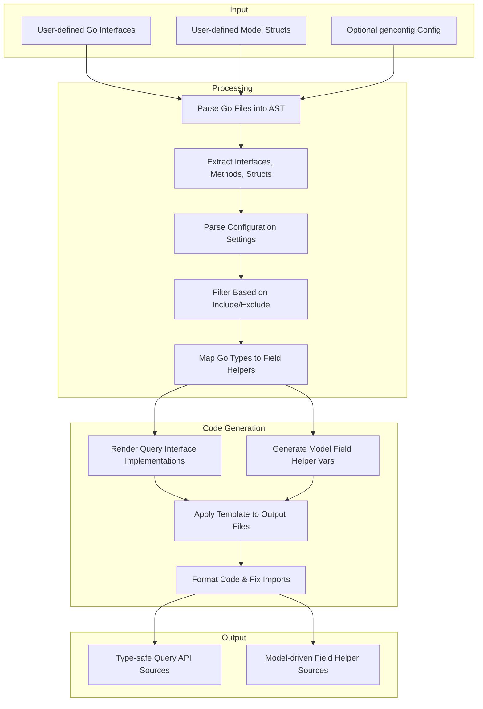

# How Generation Works

Discover the full journey of GORM CLI's code generation flow—from your Go interface and model definitions, through configuration influence and parsing, to the final creation of ready-to-use, type-safe query APIs and field helpers. This guide empowers you to understand the essential inputs, the internal decisions shaped by optional config overrides, and how you can fine-tune or extend this automated workflow to fit your application needs.

---

## Overview of the Generation Journey

At its core, GORM CLI transforms your Go source files—primarily interfaces with annotated SQL and your model structs—into well-structured, type-safe Go code that integrates naturally with the GORM ORM. This multi-phase process involves:

1. **Input Definition**: Your Go interfaces define query methods with embedded SQL templates, while your structs represent data models with fields.

2. **Optional Configuration**: A `genconfig.Config` instance can be declared in your package to customize output paths, types mapping, and selective generation patterns.

3. **Parsing & Analysis**: The generator parses your Go source files, extracting AST nodes for interfaces, methods, structs, and configuration.

4. **Filtering & Matching**: Based on your configuration, it determines which interfaces and structs to generate code for, applying inclusions and exclusions.

5. **Code Rendering**: Using a robust Go template, it emits the final source code files containing query interfaces with implementations, and model-driven field helpers.

6. **Formatting**: The generated code is automatically post-processed for idiomatic formatting and import correctness.

---

## Required and Optional Inputs

### 1. Go Interfaces with SQL Templates

- **Purpose**: These define the shape of your type-safe query API methods.
- **Structure**: Methods come with comments incorporating SQL and template directives (e.g., `{{where}}`, `@@table`).
- **Examples of use**:
  ```go
  type Query[T any] interface {
    // SELECT * FROM @@table WHERE id=@id
    GetByID(id int) (T, error)

    // UPDATE @@table
    // {{set}}
    //   {{if user.Name != ""}} name=@user.Name, {{end}}
    // {{end}}
    // WHERE id=@id
    UpdateInfo(user User, id int) error
  }
  ```

### 2. Model Structs

- Represent your underlying database entities.
- The generator parses fields, tags, and embedding to create field helpers.
- Supports basic types (e.g., int, string, time.Time) and associations (has one, many, belongs to).

### 3. Optional Generation Configuration (`genconfig.Config`)

- Declared as a package-level var to influence code generation within that package or subtree.
- Key options:
  - **OutPath**: Overrides default output directory.
  - **Include/Exclude Interfaces & Structs**: Patterns or explicit types control what to generate.
  - **FieldTypeMap & FieldNameMap**: Customize how fields map to helper types.
  - **FileLevel**: When true, config applies only to the specific file rather than the whole package.

Example:
```go
var _ = genconfig.Config{
  OutPath: "examples/output",
  IncludeInterfaces: []any{"Query*"},
  FieldTypeMap: map[any]any{ sql.NullTime{}: field.Time{} },
}
```

---

## Parsing & Internal Processing

The generator conducts a detailed AST traversal of your input Go files to discover:

- **Imports** to correctly resolve package paths.
- **Interfaces** and their methods, extracting method signature, SQL template-based comments, parameters, and return types.
- **Structs** with their fields, determining types, database column names, and embedding flattening.
- **Configs** via package-level variable declarations parsed into an internal `genconfig.Config` structure.

### Filtering Generation Targets

Using your declared or default configuration, the generator applies matching logic:

- When **Include** patterns are defined, only matching interfaces and structs are processed.
- Otherwise, **Exclude** patterns prune the generation targets.
- Patterns support glob-like syntax and explicit type references.

This filtering ensures your generated codebase remains focused and manageable, particularly in large projects.

---

## Code Generation Template

GORM CLI uses a comprehensive Go text template (`pkgTmpl`) to render generated code files.

### What is Generated?

- **Interface Implementations**
  - A Go struct implementing your interface, embedding the underlying generic `gorm.Interface`.
  - Methods concrete implementations parse the SQL templates into queries and bind parameters.

- **Field Helper Variables**
  - For each model struct, a variable is generated containing field helpers.
  - Helpers encompass predicates (`Eq`, `Gt`), setters (`Set`), and association management.

Example snippet for an interface and its implementation:

```go
func Query[T any](db *gorm.DB, opts ...clause.Expression) QueryInterface[T] {
  return QueryImpl[T]{
    Interface: gorm.G[T](db, opts...),
  }
}

type QueryInterface[T any] interface {
  gorm.Interface[T]
  GetByID(id int) (T, error)
  // ... other methods
}

type QueryImpl[T any] struct {
  gorm.Interface[T]
}

func (e QueryImpl[T]) GetByID(id int) (T, error) {
  // SQL template rendered as Go query string
  // Executes and returns data
}
```

Example field helper struct:

```go
var User = struct {
  ID field.Number[uint]
  Name field.String
  Pets field.Slice[Pet]
}{
  ID: field.Number[uint]{}.WithColumn("id"),
  Name: field.String{}.WithColumn("name"),
  Pets: field.Slice[Pet]{}.WithName("Pets"),
}
```

---

## Optional Customizations & Extensions

The generator unlocks extensibility points:

- **Custom Field Helpers**
  - Map specific Go types or struct tags to your custom helper types (e.g., JSON helpers).

- **Selective Generation**
  - Per-file or per-package control over exactly which interfaces and structs generate code.

- **SQL Template DSL**
  - Embed Go templating directives in your method comments for conditional SQL generation.

---

## Generation Workflow Illustrated



---

## Practical Tips to Succeed

- **Define Explicit Interfaces with Clear SQL Templates**
  - Use the provided template DSL to express dynamic SQL safely and clearly.

- **Leverage Config for Larger Projects**
  - Use `IncludeInterfaces` and `ExcludeStructs` to focus generation and reduce noise.

- **Use Custom Field Helpers for Complex Types**
  - Map JSON, enums, or other special types to custom helper implementations.

- **Keep Method Signatures Consistent**
  - Ensure that return values comply with expectations `(T, error)` or `error` where appropriate.

- **Check Generated Code Regularly**
  - Review generated sources after running to catch any unexpected results early.

---

## Troubleshooting Common Issues

| Issue                                    | Cause                                                      | Solution                                           |
|------------------------------------------|------------------------------------------------------------|----------------------------------------------------|
| No code generated for interfaces/structs | Config filters excluding targets or mismatched patterns   | Review `genconfig.Config` filters for correctness  |
| Syntax errors in generated code           | Invalid SQL templates or method return types               | Validate SQL comments and method signatures        |
| Imports missing or conflicting             | Incomplete or ambiguous imports in source files             | Import packages explicitly; check for naming clash |
| Unexpected field type helper mapping       | Missing or incorrect FieldTypeMap/FieldNameMap in config   | Define mappings carefully, e.g., for JSON fields    |

---

## Where Generation Fits in Your Workflow

Generation is the pivotal step that bridges your domain model and query intent written in Go interfaces, with safe, ergonomic API code you use daily in your app. By understanding and controlling this process,
- you gain confidence in correctness,
- reduce boilerplate,
- and accelerate your GORM data access layer development.

---

For deeper details on configuration, templating, and usage, refer to the related guides:

- [Your First Code Generation](../getting-started/configuration-first-usage/first-generation-run)
- [Customizing Code Generation with Config](../../guides/core-workflows/customizing-generation-config)
- [Writing Template-Based Queries](../../guides/best-practices-patterns/template-based-queries)

---

By mastering the generation workflow, you unlock the full power of GORM CLI's seamless, type-safe, developer-friendly ORM integration.
