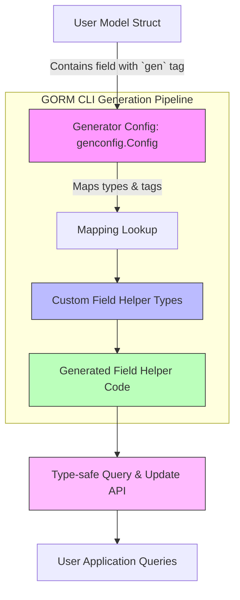

# Custom Field Helpers

This guide explains how to implement and register custom field helpers in GORM CLI. It covers the process of mapping new Go types or struct tags to specialized helper logic—such as supporting JSON columns or defining advanced field behaviors—and provides example patterns and extension hooks to empower you in extending your model-driven APIs.

---

## Why Custom Field Helpers Matter

GORM CLI automatically generates strongly-typed field helpers for common Go types like `int`, `string`, `time.Time`, and common nullable database types. However, many applications require custom behaviors on fields—for example, JSON column support, specialized SQL generation for certain types, or custom query expressions tied to your domain logic.

Custom field helpers unlock the ability to:

- Attach database-aware SQL logic tailored to your custom data types.
- Create extensible, reusable helpers for specialized predicates or update expressions.
- Map struct tags or Go types confidently to your custom logic, keeping the generated code idiomatic and type-safe.

Think of them as extensible building blocks that integrate cleanly with your fluent query and update APIs generated by GORM CLI.

---

## How Custom Field Helpers Work

Custom field helpers integrate into the generation process via two key mechanisms:

1. **Go Type Mapping:** You map a specific Go type to a custom field helper type.
2. **Struct Tag Mapping:** You tag model fields (e.g., with `gen:"json"`) so the generator uses a specific helper regardless of the Go type.

This mapping is declared in a `genconfig.Config` struct as part of the package being generated and is automatically picked up by the generator.

The custom field helpers themselves are standard Go types that implement expected field interfaces from `gorm.io/cli/gorm/field`. They can implement methods that emit custom SQL expressions dynamically according to the connected database dialect.

---

## Declaring Custom Field Helpers

### Step 1: Package-Level Generation Config

Define a `genconfig.Config` in your package source, mapping your Go types and tags to your custom helper.

```go
package examples

import (
    "database/sql"
    "gorm.io/cli/gorm/field"
    "gorm.io/cli/gorm/genconfig"
)

var _ = genconfig.Config{
    OutPath: "examples/output",
    FieldTypeMap: map[any]any{
        sql.NullTime{}: field.Time{},  // Example of mapping standard nullable types
    },
    FieldNameMap: map[string]any{
        "json": JSON{},               // Map fields with `gen:"json"` tag to custom JSON helper
    },
    IncludeStructs: []any{},          // Optionally specify structs to generate
}
```


### Step 2: Annotate Model Fields

Choose fields that require specialized helpers and add the `gen` struct tag referencing your helper key.

Example:

```go
package models

type User struct {
    // ... other fields ...
    // Clearly mark this field to use the custom JSON helper
    Profile string `gen:"json"`
}
```

This tells the generator to use your custom helper for the `Profile` field rather than the default `field.String`.

### Step 3: Implement the Custom Field Helper

Create your helper in Go as a struct implementing interfaces from `gorm.io/cli/gorm/field`. This typically includes:

- A constructor accepting a `clause.Column` representing the database column.
- SQL expression builders that handle database-specific syntax.
- Usable predicates and update/set methods.

Example JSON helper that generates dialect-specific SQL for JSON queries:

```go
package examples

import (
    "encoding/json"
    "gorm.io/gorm"
    "gorm.io/gorm/clause"
)

type JSON struct{ column clause.Column }

func (j JSON) WithColumn(name string) JSON {
    c := j.column
    c.Name = name
    return JSON{column: c}
}

// Equal creates a JSON path equality expression with database-specific SQL.
func (j JSON) Equal(path string, value any) clause.Expression {
    return jsonEqualExpr{col: j.column, path: path, val: value}
}

type jsonEqualExpr struct {
    col  clause.Column
    path string
    val  any
}

func (e jsonEqualExpr) Build(builder clause.Builder) {
    if stmt, ok := builder.(*gorm.Statement); ok {
        switch stmt.Dialector.Name() {
        case "mysql":
            v, _ := json.Marshal(e.val)
            clause.Expr{SQL: "JSON_EXTRACT(?, ?) = CAST(? AS JSON)", Vars: []any{e.col, e.path, string(v)}}.Build(builder)
        case "sqlite":
            clause.Expr{SQL: "json_valid(?) AND json_extract(?, ?) = ?", Vars: []any{e.col, e.col, e.path, e.val}}.Build(builder)
        default:
            clause.Expr{SQL: "jsonb_extract_path_text(?, ?) = ?", Vars: []any{e.col, e.path[2:], e.val}}.Build(builder)
        }
    }
}
```

---

## Using Custom Field Helpers in Queries

Once your custom field helper is registered and generated, use it seamlessly with the type-safe API:

```go
got, err := gorm.G[models.User](db).
    Where(generated.User.Profile.Equal("$.vip", true)).
    Take(ctx)
```

This expression compiles into optimized SQL that ensures database compatibility for JSON path queries.

---

## Mapping New Go Types

The type mapping configuration also lets you associate entire Go types with helpers.

Example:

```go
var _ = genconfig.Config{
    FieldTypeMap: map[any]any{
        sql.NullTime{}: field.Time{}, // converts sql.NullTime to generated Time field helper
    },
}
```

This informs the generator to use the `field.Time` helper for any fields of type `sql.NullTime`.

---

## Advanced Extension Points

- **Use `FieldNameMap` for Tag-Based Control:** Effective for adding multiple helpers in the same package using different struct tags.
- **Implement Custom SQL Clause Building:** Leverage the `clause.Expression` interface to write flexible SQL tailored to dialects.
- **Combine Helpers with Associations:** Custom helpers work alongside the association field helpers, enabling rich queries.
- **Override via `genconfig.Config`:** Controlled inclusion/exclusion to selectively apply your custom helpers.

---

## Practical Tips

- Always test generated SQL on your target databases to ensure compatibility.
- Use zero-value and expression setters on custom helpers for consistent update semantics.
- Consider naming conventions and tag consistency for maintainability.
- Review generated code for your custom helpers to verify expected behavior.

---

## Common Pitfalls

- Forgetting to add the `genconfig.Config` in the same package as your models.
- Mismatching struct tag key strings in `FieldNameMap` and your model.
- Implementing incomplete SQL builder logic causing runtime errors.
- Not accounting for dialect-specific nuances in SQL generation.

---

## Summary Diagram — How Custom Field Helpers Fit In



This flow shows how your model's special tags or types are detected, mapped by configuration to custom helpers, which are then used to generate code that users consume as fluent, type-safe APIs.

---

For detailed code examples, best practices, and integration with query APIs, explore the related example files and configuration samples in the [GORM CLI GitHub repository](https://github.com/go-gorm/cli).

---

## See Also

- [Generation Config & Overrides](https://gorm.io/docs/concepts/configuration-and-extensibility/generation-config-and-overrides.html)
- [Advanced: Defining and Using Custom Field Helpers (e.g., JSON Columns)](https://gorm.io/docs/guides/advanced-patterns/json-field-helpers.html)
- [Model Structs and Type Mapping](https://gorm.io/docs/concepts/data-models-and-schema-representation/model-structs-and-type-mapping.html)
- [Template-Based Query DSL](https://gorm.io/docs/guides/advanced-patterns/template-queries-dsl.html)

---

### Example Resources

- Sample `genconfig.Config` with custom JSON helper mapping (see `examples/query.go`)
- JSON helper type with dialect-aware SQL clause implementation
- Generated helper usage in queries with JSON path expressions

---

This guide equips you with the knowledge to customize your field helpers, fitting your domain needs while retaining all the benefits of type safety and fluent code generation that GORM CLI provides. Embrace extensibility to advance your data modeling and querying experience.

---

# Troubleshooting & Tips

<AccordionGroup title="Troubleshooting Custom Field Helpers">
<Accordion title="Custom Helper Not Generated">
Make sure your `genconfig.Config` is in the same package as the models and is correctly named (e.g., `var _ = genconfig.Config{}`). Check struct tags and the keys in your `FieldNameMap` for typos.
</Accordion>
<Accordion title="SQL Generation Errors">
Review your custom helper clause expressions thoroughly, ensuring SQL syntax is correct and compatible with each supported database dialect. Use the build method logs or verbose output to debug issues.
</Accordion>
<Accordion title="Generation Config Not Recognized">
Confirm that the configuration's file level (`FileLevel` flag) matches your project layout. Also, check that your generator is running over the package directory containing the config.
</Accordion>
</AccordionGroup>

<Tip>
Custom field helpers are a powerful extension point — start simple with one helper and expand iteratively. Keep tests to validate generated SQL and API behavior.
</Tip>

---

# Summary
This guide outlined how to implement and register custom field helpers in GORM CLI, including detailed configuration via `genconfig.Config`, mapping Go types and struct tags to helpers, example implementation of JSON field helpers with dialect-specific SQL expressions, and practical tips ensuring effective use and troubleshooting.

---