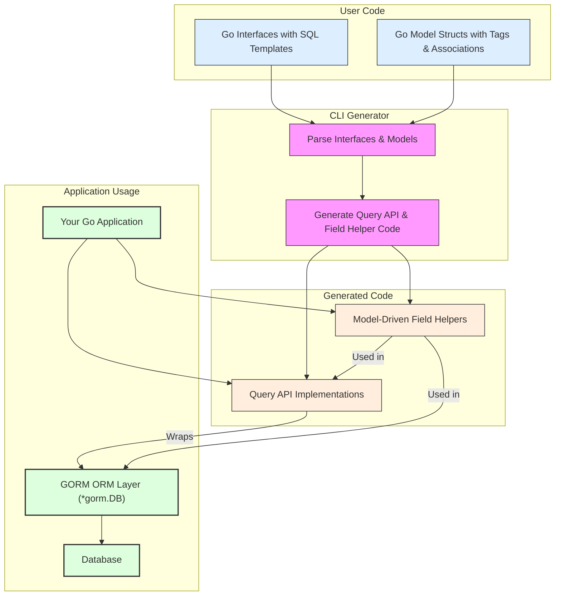

# Architecture Overview

GORM CLI transforms your Go code into powerful, type-safe database APIs by bridging Go interfaces, model structs, and GORM's ORM to deliver fluent, compile-time checked query and update capabilities. This page explains the high-level system architecture, revealing how the CLI generates two complementary artifact sets: query APIs from annotated interfaces and field helpers from models.

Understanding this architecture is the first pivotal step to mastering GORM CLI’s workflow and effectively leveraging its full potential in your Go projects.

---

## Dual Generator Approach: Query APIs and Field Helpers

At the heart of GORM CLI’s architecture lie two synergistic generators that produce code serving distinct but complementary roles:

### 1. Interface-driven Query API Generation

You define Go interfaces with methods annotated by raw SQL templates. These interfaces describe your desired queries and updates with embedded SQL and templating directives.

- **What happens?** The CLI parses these interfaces, interprets SQL and template comments, and generates concrete implementations exposing fluent, type-safe methods in Go.
- **User Value:** You gain compile-time checked, discoverable APIs for querying and data manipulation without writing boilerplate SQL wrappers.

### 2. Model-driven Field Helper Generation

From your Go structs that model database tables, GORM CLI generates typed field helpers tailored for querying, filtering, updating, and association management.

- **What happens?** The CLI reflects on your struct fields and associations (e.g., has one, has many, belongs to, many-to-many) and generates predicates and setters.
- **User Value:** These helpers seamlessly plug into both the generated query APIs and GORM’s ORM, enabling fluent use of type-safe filters, setters, and association operations.

Together, these generators build a foundation for safe, efficient, and scalable data operations.

---

## How the Architecture Works: User Journey Perspective

Imagine this practical flow as you integrate GORM CLI into your project:

1. **Author your interfaces and models:** You write Go interfaces that encapsulate your SQL queries using templated comments, and Go structs to represent your database models.
2. **Run the CLI generator:** Using `gorm gen -i ./yourpkg -o ./generated`, the CLI processes your sources, generating:
   - Implementations of your query interfaces exposing typed methods
   - Field helper structs with predicate and setter methods
3. **Use the generated APIs in your application:**
   - Query your database with methods like `generated.Query[User](db).GetByID(ctx, 123)`
   - Filter and update using model-driven helpers, e.g., `generated.User.Name.Eq("jinzhu")`
4. **Perform association operations:** The generated helpers empower creating, updating, unlinking, or deleting related records safely.

This user-centric pipeline abstracts away error-prone manual SQL handling and boilerplate CRUD operations.

---

## Core Components and Their Roles

| Component                                   | Description                                                                                              |
|---------------------------------------------|----------------------------------------------------------------------------------------------------------|
| **Input Interfaces**                        | User-written Go interfaces with SQL template annotations defining query and update contracts.             |
| **Model Structs**                           | Go structs modeling database tables and relationships with struct tags and association definitions.     |
| **CLI Parser & Generator**                  | Processes input sources to produce Go code for query implementations and field helpers.                   |
| **Generated Query API Code**                 | Concrete struct implementations that expose fluent, type-safe query/update methods derived from interfaces. |
| **Generated Field Helpers**                 | Typed structs representing model fields and associations with predicates and setters for fluent usage.  |
| **Integration Layer (GORM ORM)**             | Uses GORM’s `*gorm.DB` context; generated code wraps GORM’s APIs with enhanced type safety and discoverability. |

---

## Code Flow and Data Movement



---

## Key Architectural Principles That Benefit Users

- **Fluent, Discoverable APIs:** Auto-generated methods mirror your interfaces, offering intuitive, chainable usage.
- **Compile-Time Safety:** Type checking prevents common errors early, reducing runtime panics and subtle bugs.
- **Seamless GORM Integration:** Generated code operates directly on GORM’s `*gorm.DB` instances, enabling full ORM power combined with strong typing.
- **Flexible Configuration:** Via `genconfig.Config`, outputs, field mappings, and generation scope are customizable to fit project structure.
- **Association Support:** Rich handling of complex relationships is built-in, empowering safe create, update, unlink, and delete of related entities.

---

## Practical Example: From Interface to Typed Method

Consider a user-defined query interface:

```go
// Query defines queries for User.
type Query[T any] interface {
  // SELECT * FROM @@table WHERE id=@id
  GetByID(id int) (T, error)
}
```

Running the CLI generates a Go implementation roughly like:

```go
func Query[T any](db *gorm.DB, opts ...clause.Expression) QueryInterface[T] {
  return queryImpl[T]{gorm.G[T](db, opts...)}
}

type QueryInterface[T any] interface {
  GetByID(id int) (T, error)
}

type queryImpl[T any] struct {
  gorm.Interface[T]
}

func (q queryImpl[T]) GetByID(id int) (T, error) {
  // Underlying generated code to run SQL SELECT with id parameter
}
```

This method is both type-safe (returns T) and integrated with GORM’s ORM context.

---

## Configuration and Templates: Extending the System

The generator leverages both interface annotations and optional config (`genconfig.Config`) to influence code output:

- **Templates use directives** such as `@@table`, `@param`, `{{where}}`, allowing dynamic SQL construction embedded in comments.
- **Genconfig controls** output path, included/excluded structs/interfaces, and custom field type mappings to fit complex project layouts.

This two-pronged approach empowers both declarative SQL specification and pragmatic code tailoring.

---

## Troubleshooting Common Architecture-Related Issues

- **Missing or incomplete generated methods:** Ensure annotated interface methods have proper SQL templates; malformed or missing comments will skip generation.
- **Type mismatches in field helpers:** Confirm models’ structs use supported Go types or map custom types in config.
- **Association operations failing or generating invalid SQL:** Validate struct tags correctly define relationships per GORM conventions.
- **Unexpected output paths or missing files:** Check `genconfig.Config` settings for overrides that might redirect output.

Always start by validating interface method annotations and model struct correctness before inspecting the CLI workflow.

---

## Next Steps & Related Documentation

To deepen your understanding and master GORM CLI, explore:

- [Core Concepts & Terminology](../../overview/system-architecture/core-concepts-terminology) — learn foundational terms and ideas behind generated APIs and helpers.
- [Configuration & Customization Essentials](../../overview/features-and-integration/config-customization) — tailor the generation process to your project.
- [Template-based Query APIs](../../../guides/essential-workflows/template-based-query-apis) — authoring SQL templates effectively.
- [Model-Driven Field Helpers](../../../guides/essential-workflows/model-driven-field-helpers) — fine-tuning generated field helpers from your structs.
- [Integrating with GORM](../../overview/features-and-integration/integration-points) — how generated code cooperates with GORM’s ORM.

---

This overview sets the stage for practical mastery of GORM CLI’s architecture and empowers you to realize its full value in your Go projects.

---

## Summary

GORM CLI sits at the intersection of your Go code and database, transforming annotated interfaces and model structs into type-safe, ready-to-use APIs and helpers. Understanding this architecture clarifies how two generators collaborate, how templates and configuration influence code, and how generated code integrates naturally with GORM. This knowledge is vital for crafting maintainable, scalable, and robust database operations in Go applications.


## See Also
- [Feature Overview at a Glance](/overview/features-and-integration/feature-tour)
- [Getting Started with GORM CLI](/guides/essential-workflows/getting-started)
- [Working with Associations](/guides/real-world-patterns/working-with-associations)


---

_Practical tip:_ Keep your interfaces clean and your structs properly annotated — the architecture’s generators rely on precise input to deliver error-free, type-safe APIs.


---

## Source
<Source url="https://github.com/go-gorm/cli" branch="main" paths='[{"path":"internal/gen/gen.go","range":"1-60"},{"path":"internal/gen/template.go","range":"1-70"},{"path":"examples/query.go","range":"1-70"},{"path":"examples/models/user.go","range":"1-70"}]' />