# Architecture Overview

Gain a big-picture perspective on how GORM CLI orchestrates code generation. This overview explains the key components involved, how user-defined query interfaces and model structs are processed, and how the generator coordinates creation of type-safe query APIs along with model-driven field helpers that seamlessly integrate with GORM.

---

## High-Level Architecture

At its core, GORM CLI serves as a code generator that transforms your Go source files into two complementary outputs:

- **Type-safe query APIs** that correspond to user-defined interfaces with embedded SQL templates.
- **Model-driven field helpers** generated based on your struct definitions that provide fluent predicates and updater helpers.

The system emphasizes compile-time safety and expressive, discoverable APIs to enable robust database usage within Go applications leveraging GORM.

### Main Components

- **User Source Code:** Your Go packages containing:
  - **Query interfaces** annotated with SQL template comments
  - **Model structs** representing your database entities
- **GORM CLI Generator:** The engine that parses and analyzes your Go source, extracts interfaces, methods, structs, and generation configurations, and then emits generated code.
- **Generated Output:** Code files containing:
  - Concrete implementations of query interfaces with tailored SQL
  - Strongly typed field helpers for each model struct to aid in filters, updates, and association handling

These outputs integrate directly with `gorm.io/gorm`.

---

## Generator Command-Line Entry Point

The generation workflow is triggered using the CLI tool via the `gen` command:

```bash
gorm gen -i <input_path> -o <output_path>
```

- `-i, --input`: Specifies the path to the Go source file or directory containing your interfaces and models
- `-o, --output`: Directory where generated code will be placed (defaults to `./g` if omitted)

### Execution Flow

- The CLI parses the input path, recursively analyzing Go files.
- Each file is processed to:
  - Parse imports, interfaces, and structs using Go's `go/ast` package
  - Extract method signatures, SQL comments, and config annotations
  - Apply configuration filters for inclusion or exclusion of interfaces and structs
- The generator then renders templates into Go source code implementing the query interfaces and declares the model field helpers.

### Code Example: CLI Command Construction

```go
cmd := &cobra.Command{
   Use:   "gen",
   Short: "Generate GORM query code from raw SQL interfaces",
   RunE: func(cmd *cobra.Command, args []string) error {
       g := Generator{
           Files:   map[string]*File{},
           outPath: output,
       }

       if err := g.Process(input); err != nil {
           return fmt.Errorf("error processing %s: %v", input, err)
       }

       if err := g.Gen(); err != nil {
          return fmt.Errorf("error render template got error: %v", err)
       }

       return nil
   },
}
```

This command setup ensures users define the correct input interface source and optional output, while handling errors gracefully.

---

## Internal Generator Coordination

Once input files are parsed, the generator:

1. **Processes Interfaces:** Extracts all interface definitions, their methods, and attached SQL template annotations, verifying method return types.
2. **Processes Structs:** Collects struct declarations, fields, and any tagged type mappings to determine the appropriate field helper types.
3. **Applies Configurations:** Based on any `genconfig.Config` instances found within source files (or `FileLevel` flags), filters which interfaces and structs participate in generation using include/exclude patterns.
4. **Generates Code:** Using Go's `text/template` package, emits:
   - Implementation structs and methods for interfaces, injecting SQL strings with proper parameter bindings.
   - Declares and initializes strongly typed field helper variables for each struct's fields.
5. **Output and Formatting:** Writes generated code files to the designated output directory, formats them using `golang.org/x/tools/imports` for idiomatic import management and style.

### Generation Template Snippet (Simplified)

```go
func {{.Name}}[T any](db *gorm.DB, opts ...clause.Expression) {{$IfaceName}}Interface[T] {
 return {{$IfaceName}}Impl[T]{
    Interface: gorm.G[T](db, opts...),
 }
}

// Struct of field helpers
var {{.Name}} = struct {
  {{range .Fields}}
  {{.Name}} {{.Type}}
  {{end}}
} {
  {{range .Fields}}
  {{.Name}}: {{.Value}},
  {{end}}
}
```

This shows how dynamic code ties together generic GORM interfaces and strongly-typed fields.

---

## Integration & Output

### Generated Code Structure

- For **Query Interfaces:**
  - An interface subtype with generic parameter `[T any]` representing model type
  - Concrete implementation structs embedding GORM generics
  - Methods translating templated SQL comment bodies into executable queries with parameter and context handling

- For **Model Structs:**
  - Generated variables exposing field helpers (`field.String`, `field.Number`, or relationship fields) named after the struct
  - These helpers enable fluent, expressive conditions and updates integrated with GORM.

### User Workflow Illustration

1. **Define query interface and model struct**

   You write your interface with annotated SQL comments and accompanying Go structs representing the database schema.

2. **Run the generator**

   Execute `gorm gen` specifying the source directory.

3. **Use generated query APIs**

   From your application code, invoke the generated interface methods:

```go
user, err := generated.Query[User](db).GetByID(ctx, 123)
users, err := generated.Query[User](db).FilterByNameAndAge("alice", 30)
```

4. **Build queries with model field helpers**

```go
gorm.G[User](db).
 Where(generated.User.Name.Eq("bob")).
 Set(generated.User.Age.Set(35)).
 Update(ctx)
```

This design seamlessly links generated code with your live GORM workflows.

---

## Mermaid Diagram: Generation Workflow Overview

```mermaid
flowchart TD

  UserSource["User Source Code\n - Query Interfaces with SQL Templates\n - Model Structs"]
  CLICommand["CLI: gorm gen -i <input> -o <output>"]
  FileProcessing["File Parsing & AST Analysis"]
  InterfaceExtraction["Extract Interfaces & Methods"]
  StructExtraction["Extract Structs & Fields"]
  ConfigProcessing["Apply genconfig.Config Filters"]
  CodeGeneration["Render Templates to Generate Code"]
  OutputWrite["Write & Format Generated Files"]
  GeneratedCode["Generated Query APIs & Field Helpers"]
  GORMIntegration["Seamless Integration with gorm.io/gorm"]
  UserApp["User Application Code Using Generated APIs"]

  UserSource -->|Input| CLICommand
  CLICommand --> FileProcessing
  FileProcessing --> InterfaceExtraction
  FileProcessing --> StructExtraction
  InterfaceExtraction --> ConfigProcessing
  StructExtraction --> ConfigProcessing
  ConfigProcessing --> CodeGeneration
  CodeGeneration --> OutputWrite
  OutputWrite --> GeneratedCode
  GeneratedCode --> GORMIntegration
  GORMIntegration --> UserApp

  classDef userSource fill:#f9f,stroke:#333,stroke-width:2px;
  class UserSource userSource;

  class CLICommand,UserApp fill:#bbf,stroke:#333,stroke-width:1.5px;

  class InterfaceExtraction,StructExtraction,ConfigProcessing,CodeGeneration,OutputWrite,GORMIntegration fill:#bfb,stroke:#333,stroke-width:1.5px;

  class FileProcessing fill:#ffebcc,stroke:#333,stroke-width:1.5px;
```



---

## Practical Benefits

- **Type Safety:** Generate strongly-typed APIs eliminating runtime SQL errors and reducing debugging time.
- **Productivity:** Automate boilerplate creation for queries and updates based on interface and struct declarations.
- **Extensibility:** Configure inclusion/exclusion and custom field wrappers through `genconfig.Config` embedded in your Go files.
- **Seamless GORM Integration:** Use generated helpers as part of idiomatic GORM expressions without friction.

---

## Tips & Best Practices

- Organize your query interfaces and models cleanly in packages or directories, so the generator can recursively analyze files effectively.
- Use struct tags (`gen:"<name>"`) and type mappings in configs to customize field helper generation for specific database types (e.g., JSON fields).
- Declare `genconfig.Config` literals to tailor generation paths and filters to fit your project structure.
- Validate resulting code and run tests using the generated APIs to catch any mapping issues early.

---

## Troubleshooting Common Scenarios

- **Input Path Issues:** Ensure `-i` points to valid Go source files or directories with interfaces and structs.
- **Method Signature Validation:** Interface methods must return error as last return value, with no more than two returns.
- **Config Filtering:** If you find interfaces or structs missing in output, check your include/exclude patterns in `genconfig.Config`.
- **Output Location:** Verify `-o` path and config overrides to find generated code correctly.

---

## Further Reading

Explore related topics for deeper understanding and effective usage:

- [Core Concepts & Terminology](https://gorm.io/docs/concepts/core-concepts-terminology.html): Understanding interfaces, template DSL, field helpers.
- [Running the Generator](https://gorm.io/docs/getting-started/run-generator.html): Practical guide for generator invocation.
- [Using Generated APIs](https://gorm.io/docs/guides/using-generated-apis.html): Patterns for consuming generated query APIs.
- [Customizing Code Generation](https://gorm.io/docs/guides/customizing-generation-config.html): Fine-tuning generation with `genconfig.Config`.

---

This Architecture Overview equips you with the strategic knowledge needed to leverage GORM CLI code generation effectively, linking your Go code to safe, expressive database interactions through generated types and helpers.