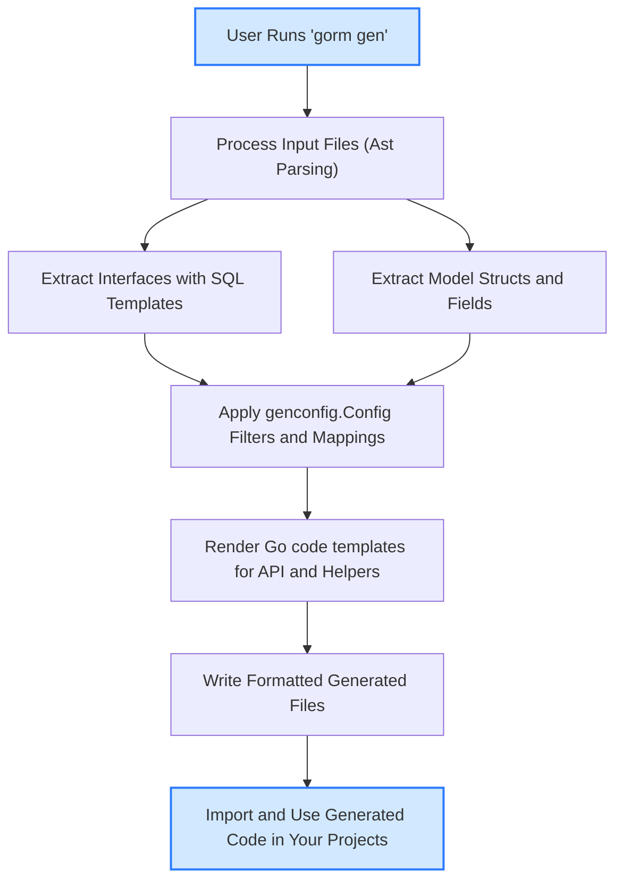

# How GORM CLI Generates APIs and Helpers

Explore the high-level architecture and lifecycle behind GORM CLI's code generation: how your user-defined Go models and interfaces are parsed and analyzed, the role of SQL templates and struct introspection in shaping generated code, and the step-by-step flow from invoking the CLI to producing fully typed output files. This guide provides a conceptual understanding to help you master and extend your use of GORM CLI’s code generation capabilities.

---

## Overview

GORM CLI transforms Go source code—specifically interfaces annotated with SQL templates and Go model structs—into two complementary forms of type-safe, idiomatic Go code:

- **Interface-driven query APIs**: concrete implementations of user-defined interfaces that embed SQL templates in comments
- **Model-driven field helpers**: strongly typed field and association helpers derived from model struct metadata

This architecture enables compile-time safety, expressive queries, and fluent updates while minimizing boilerplate.

The core is a **code generator** (the `gen.Generator`) that parses ASTs (abstract syntax trees) of your source files, interprets annotations and configurations, and renders templates into output Go code.

---

## Key Components in the Generation Process

### 1. Input: User-Defined Go Source

- **Interfaces with SQL Templates:** You define Go interfaces containing methods annotated with templated SQL in comments. These SQL comments use a DSL to include placeholders (e.g., `@@table`, `@param`), conditional clauses (`{{if}}`, `{{where}}`), and loops (`{{for}}`).

- **Model Structs:** Your data models, typically using GORM’s conventions, are parsed to extract fields, their Go types, and metadata such as tags and relations. This information drives generation of field helper variables for precise query building.

- **Optional Configuration:** Per-package `genconfig.Config` values let you override output paths, include or exclude specific interfaces/structs, or remap Go types to custom field helpers.

### 2. Parsing & Analysis

The `gen.Generator` walks the AST of each Go source file, extracting and analyzing:

- **Imports:** to resolve package paths and ensure generated imports are correct

- **Interfaces:** Parse method signatures, extract embedded SQL templates from method comments, and ensure method return types meet expectations (e.g., single or paired return values with error as last).

- **Structs:** Discover exported fields, including those embedded anonymously. Field Go types are converted to corresponding field helper types, with IoC for custom mappings and association detection.

- **Configs:** Identify per-package `genconfig.Config` literals to drive selective generation and customizations.

### 3. Code Generation Templates

Templates define the output Go code structure. For example, `internal/gen/template.go` contains the main template that:

- Declares package and imports
- Generates interface wrappers and implementation structs for each user interface
- Implements methods that embed SQL logic, binding Go parameters and handling query execution or chaining
- Emits field helper variables and struct definitions with metadata

Templates use method metadata (parameters, results, SQL snippet) and struct metadata to produce idiomatic, type-safe code.

### 4. Output and Writing

The generator:

- Determines output directories based on CLI flags and config values
- Applies include/exclude filters for interfaces and structs
- Writes generated files, maintaining directory structure relative to input
- Runs code formatting (`goimports`) to ensure clean imports and style compliance

---

## Lifecycle of Generation: From CLI to Generated Code

### Step 1: CLI Invocation

You invoke the `gorm gen` command, specifying:

- `-i/--input` path to your Go source directory or file
- `-o/--output` directory for generated code (default `./g`)

The CLI command creates a new `Generator` instance and calls its `Process` and `Gen` methods.

### Step 2: Processing Input

- Recursive directory traversal gathers Go source files.
- Each file is parsed into an AST.
- AST nodes are visited to extract interfaces, structs, imports, and config.

### Step 3: Interface & Struct Processing

- Interfaces: Method signatures and SQL comments are parsed. Method parameter and return types are normalized (injecting `context.Context` if missing).
- SQL templates are validated and stored for rendering.
- Structs: Fields and embedded structs are flattened. Field types are mapped to field helper types, including recognition of associations and custom mappings.

### Step 4: Applying Configurations

- Configurations enable controlling generation granularity and mapping.
- OutPath overrides default output directory.
- Include/Exclude rules filter interfaces and structs.

### Step 5: Code Template Rendering

- For each processed file that passes filtering, the generation template executes, interpolating data about interfaces, methods, structs, and fields.
- Methods become wrappers executing raw or template-based SQL with typed parameters.
- Structs become statically declared field helper variable sets.

### Step 6: Writing Output and Formatting

- Output directories and file paths are created if needed.
- Go code files are written.
- Code is formatted using `imports.Process` to fix imports and formatting.

### Step 7: Using Generated Code

Generated code is ready for import and use in your Go projects, providing:

- **Type-safe query methods** corresponding to your interfaces
- **Field helper variables** for filters, updates, and associations

---

## Illustrative Example

Suppose you define an interface method with SQL comment:

```go
// SELECT * FROM @@table WHERE id=@id
GetByID(id int) (T, error)
```

GORM CLI parses this and generates:

```go
func (e QueryImpl[T]) GetByID(ctx context.Context, id int) (T, error) {
  sb := &strings.Builder{}
  params := make([]interface{}, 0)
  sb.WriteString("SELECT * FROM users WHERE id=?")
  params = append(params, id)
  var result T
  err := e.Raw(sb.String(), params...).Scan(ctx, &result)
  return result, err
}
```

Simultaneously, for a model struct like:

```go
type User struct {
  ID   uint
  Name string
  Age  int
}
```

The generator produces field helpers like:

```go
var User = struct {
  ID field.Number[uint]
  Name field.String
  Age field.Number[int]
}{
  ID: field.Number[uint]{}.WithColumn("id"),
  Name: field.String{}.WithColumn("name"),
  Age: field.Number[int]{}.WithColumn("age"),
}
```

Your code can then build type-safe queries:

```go
u, err := generated.Query[User](db).GetByID(ctx, 123)
users, err := gorm.G[User](db).Where(generated.User.Age.Gt(18)).Find(ctx)
```

---

## Practical Tips & Best Practices

- **Organize your interfaces and models in the same package or directory** so the CLI can parse them together and relate types correctly.

- **Annotate your interface methods with precise SQL templates**, using placeholders (`@@table`, `@param`) and DSL directives for conditions and updates.

- **Use `genconfig.Config` for custom mappings or to control generation scope**, especially in larger projects.

- **Keep your interface methods' return signatures aligned with GORM CLI expectations**: either `(T, error)` or `error`, ensuring the last return is always `error`.

- **Leverage generated field helpers to build expressive, safe queries instead of hand-writing SQL strings at call sites.**

- **Run the generator frequently after model or interface changes to keep generated code in sync.**

---

## Troubleshooting Common Issues

- **Missing `context.Context` in methods?** GORM CLI injects it automatically if you omit it, so you can write simpler interface methods.

- **Empty generated files?** Verify your `genconfig.Config` include/exclude filters and that your input directory contains the files you expect.

- **Parsing errors?** Carefully confirm your interfaces use proper Go syntax and your SQL templates are valid.

- **Incorrect output location?** Check your `-o` CLI flag and any `OutPath` values in configs.

---

## Mermaid Diagram: Generation Flow



---

## Further Reading

To extend your mastery of GORM CLI generation internals, consider the following complementary concepts and guides:

- [Interface-Driven Query APIs](concepts/core-architecture/interface-query-generation)
- [Model-Driven Field Helpers](concepts/core-architecture/model-field-helpers)
- [Template-Based SQL Queries](guides/advanced-usage-patterns/template-queries)
- [Customizing Code Generation with Configuration](concepts/extensibility-integration/generation-config)
- [Using Generated Field Helpers](guides/getting-started-workflows/using-field-helpers)

---

With this conceptual foundation, you can confidently architect your Go codebase to fully leverage GORM CLI’s powerful, safe, and maintainable generation capabilities.