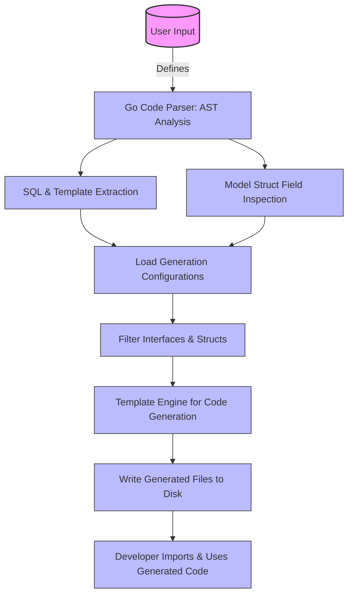

# How GORM CLI Works

An overview of how GORM CLI transforms user-defined Go interfaces and model structs into type-safe, fluent query APIs and field helpers. This page explains the conceptual workflow behind source parsing, configuration application, and code generation that results in compile-time safe, discoverable database code for GORM projects. Understanding this process provides the foundation for effective and confident use of GORM CLI.

---

## Introduction

GORM CLI automates the creation of two interconnected pieces of code:

- **Type-safe query APIs** generated from annotated Go interfaces representing raw SQL operations.
- **Model-driven field helpers** derived from Go structs for building filters, updates, and managing associations.

These components work together to streamline data access with reliable compile-time safety and fluent API design, replacing brittle hand-written SQL with generated, maintainable code.

---

## The GORM CLI Workflow: From User Input to Generated Code

GORM CLI's code generation process is a sequence of clear, user-focused steps designed to transform your model and interface definitions into ready-to-use, type-safe query APIs and helpers.

### Step 1: Define Models and Interfaces

You write Go structs that define your data models (including associations) and interfaces that specify query methods, annotated with SQL or templated SQL comments.

```go
// Your model struct
type User struct {
  ID   uint
  Name string
  Age  int
}

// Your query interface with SQL annotations
// SELECT * FROM @@table WHERE id=@id
GetByID(id int) (User, error)
```

### Step 2: Invoke GORM CLI with Inputs

Run the CLI specifying the path to your interface and model files:

```bash
gorm gen -i ./path/to/your/interfaces -o ./generated
```

Behind the scenes, GORM CLI:

- Parses all Go files in the input directory or single input file
- Extracts interface definitions and their SQL annotations
- Extracts struct definitions and inspects fields (including associations)
- Applies any package-level generation configurations

### Step 3: Configuration Resolution and Filtering

GORM CLI recognizes optional configurations written as a `genconfig.Config` Go value in your packages to customize generation.

Configuration options include:

- Output path overrides
- Inclusion/exclusion filters for interfaces and structs
- Field helper customization via type and naming maps

These configs influence what gets generated and where, ensuring integration fits your project structure.

### Step 4: Code Generation

Using a template-driven engine, GORM CLI generates:

- Concrete implementations of your interfaces with methods that run the annotated SQL
- Strongly-typed field helpers matching your models' fields and associations

The generated code lives under the specified output path, preserving package structure.

### Step 5: Import and Use Generated Code

Use the generated code in your GORM projects by importing the generated packages and calling the generated query methods and field helpers.


---

## Core Concepts Behind the Process

### 1. Parsing User Code

- **AST Analysis**: Go source files are parsed into abstract syntax trees (ASTs) to extract detailed metadata about interfaces and structs.
- **SQL Extraction**: Comments in interface methods are scanned to extract raw SQL or SQL templates.
- **Struct Field Inspection**: Each model struct's fields are identified, including types, tags, and embedded structs for inheritance.

### 2. Configuration Discovery

- The tool scans for package-level configurations to dynamically tailor code generation.
- Configurations enable fine-grained control, such as filtering which interfaces or structs are generated or customizing how fields translate to helper types.

### 3. Template-Based Code Output

- With all metadata and configuration collected, the generator applies Go templates to produce idiomatic source files.
- Code includes interfaces, their implementations with SQL bindings, and model field helpers with methods for predicates, updates, and association operations.

---

## User-Centric View: What You Gain

- **Compile-Time Type Safety** ensures that your SQL operations and filters align with your models’ definitions.
- **Discoverable Fluent APIs** let you compose queries efficiently, using generated field helpers for predicates like `Eq`, `Like`, or numeric operations.
- **Association Management Helpers** facilitate complex relational data operations such as create, update, unlink, and delete with clear, safe syntax.
- **Customizable Output** means generated code adapts to your project conventions and structures without manual adjustments.

---

## Troubleshooting & Best Practices

### Common Issues

- **Empty Generation Output:** Ensure your input path includes files with annotated interfaces and model structs, and verify inclusion filters if configured.
- **Incorrect Generated Paths:** Check `OutPath` in your `genconfig.Config` for overrides.
- **SQL Parsing Errors:** Review method comments for SQL syntax correctness and consistent placeholder usage.

### Tips for Success

- Keep interfaces and models logically grouped in packages to simplify generation.
- Use configuration to fine-tune generation granularity and output structure.
- Annotate your SQL templates clearly and test generated APIs via the accompanying validation guides.

---

## Diagram: High-Level Workflow in GORM CLI



---

## Next Steps

- Explore how to **Define Models and Query Interfaces** with annotated SQL in interfaces.
- Learn to **Run the Code Generator** and validate generated APIs.
- Discover **Field Helper Usage** for filters, updates, and associations.
- Customize generation behavior with `genconfig.Config` for tailored workflows.

For detailed instructions, visit the [Getting Started Guide](/guides/core-workflows/getting-started).

---

## Summary
This concepts page delivers a clear understanding of GORM CLI's internal workflow from user input parsing through configuration application to final source code generation, focusing entirely on what developers do and gain without digging into implementation internals.

---

### Example Code Snippet: Minimal Interface & Model

```go
// Model definition
package models

type User struct {
  ID   uint
  Name string
  Age  int
}

// Interface with SQL annotation
package queries

type UserQuery interface {
  // SELECT * FROM @@table WHERE id=@id
  GetByID(id int) (User, error)
}
```

Generate with:

```bash
gorm gen -i ./path/to/input -o ./generated
```

Use in code:

```go
u, err := generated.UserQuery(db).GetByID(ctx, 123)
```

---

## Related Documentation

- [What is GORM CLI?](/overview/product-intro/what-is-gorm-cli)
- [High-Level Architecture](/overview/architecture-core-concepts/high-level-architecture)
- [Configuration Basics](/getting-started/setup-and-installation/configuration-basics)
- [Getting Started: Generate Your First Query API](/guides/core-workflows/getting-started)
- [Field Helper Basics](/guides/core-workflows/field-helper-basics)

---

## Final Notes
This conceptual overview equips you with a strong mental model of GORM CLI’s role in producing type-safe, discoverable database access code to enhance productivity and maintainability in Go projects using GORM.

Stay confident as you proceed to hands-on guides and advanced customization tutorials to unlock the full power of GORM CLI.