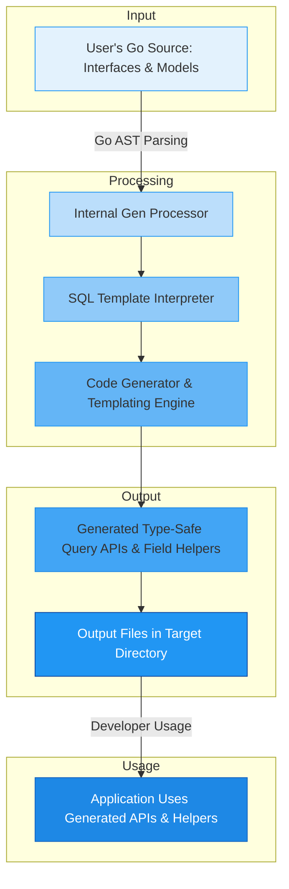

# Code Generation Workflow

Understand the complete journey from defining your query interfaces and model structs to producing robust, type-safe, and fluent APIs through the GORM CLI code generation process. This guide walks you through each step to visualize how your inputs transform into discoverable, compile-time safe Go code that seamlessly integrates with GORM.

---

## 1. Writing Query Interfaces and Model Structs

Every code generation run begins with your Go source code, primarily consisting of:

- **Query Interfaces**: Go interfaces where each method documents an SQL template. These templates embed raw or templated SQL with placeholders that bind parameters automatically.
- **Model Structs**: Your domain model definitions representing database tables, including fields and associations.

Example:

```go
// Query interface with embedded SQL templates
// SELECT * FROM @@table WHERE id=@id
GetByID(id int) (T, error)

// User model struct
type User struct {
  ID   uint
  Name string
  Age  int
}
```

Your interfaces define methods that encapsulate specific SQL queries or updates in comments. Models specify the fields and relationships the generator uses to create type-safe field helpers.

<Check>
Ensure your interfaces are placed in the same package or directory as your models for seamless code generation.
</Check>

---

## 2. Parsing Source: GORM CLI Input Processing

When you run the CLI with your input path (file or directory), it:

- Recursively walks through the source files.
- Parses each Go file to extract AST representations.
- Identifies and collects all query interfaces, their methods, and associated SQL templates.
- Extracts struct definitions and fields, including embedded structs.
- Detects any `genconfig.Config` literals to apply generation configurations.

The CLI respects include/exclude patterns defined in configurations to control which interfaces and structs are processed.

---

## 3. SQL Template Interpretation

Each method's SQL template embedded in doc comments undergoes special processing:

- Recognizes placeholders like `@@table` and `@@column` to map table and column names based on model metadata.
- Supports parameter binding with `@param` references that directly bind Go method params.
- Allows conditional fragments using directives like `{{where}}`, `{{set}}`, `{{if}}`, and loops with `{{for}}`.

This template DSL ensures your queries remain type-safe, expressive, and dynamic without manual SQL string concatenation.

Example:

```sql
SELECT * FROM @@table
{{where}}
  {{if user.Name != ""}} name=@user.Name {{end}}
  {{if user.Age > 0}} AND age=@user.Age {{end}}
{{end}}
```

The processor validates these templates and prepares SQL snippets that will be embedded into the generated method implementations.

---

## 4. Generation of Type-Safe APIs and Field Helpers

Using the extracted interfaces, models, and parsed SQL templates, GORM CLI generates:

- **Query API Implementations:** Concrete Go structs implementing your query interfaces. Each method becomes a fluent, type-safe function with automatic context injection and SQL execution logic.

- **Model-Driven Field Helpers:** For each model struct, a global variable struct is created containing typed field helpers for each field and association. These helpers allow expressive and safe query construction using predicates and setters.

Example of generated API snippet:

```go
func Query[T any](db *gorm.DB, opts ...clause.Expression) _QueryInterface[T] {
  return _QueryImpl[T]{gorm.G[T](db, opts...)}
}

func (e _QueryImpl[T]) GetByID(ctx context.Context, id int) (T, error) {
  // SQL snippet execution here
  return e.Exec(ctx, "SELECT * FROM users WHERE id=?", id)
}
```

Field helpers enable:

```go
generated.User.Name.Eq("alice")        // name = 'alice'
gorm.G[User](db).Where(...).Find(ctx) // fluent query using generated predicates
```

---

## 5. Output: Files and Directory Structure

The generated source code files are written to your specified output directory (default `./g`). The generator preserves the relative directory structure of your input source files, applying any configuration overrides on output path or file-level generation.

Files generated typically include:

- Implementation of your query interfaces with method bodies embedding processed SQL templates.
- Model field helper definitions for each struct, supporting predicates, updates, and association operations.

<Note>
Configuring the output directory via CLI `-o` and package-level `genconfig.Config` allows fine control over where generated code lands.
</Note>

---

## 6. Post-Generation: Using the Generated Code

After generation, use your newly created APIs in your application idiomatically:

- Import generated packages.
- Instantiate query structs with your GORM `*gorm.DB` connection.
- Call generated methods for your typed queries, benefiting from compile-time safety and IDE discoverability.
- Use field helpers to create expressive filters, setters, and association operations.

Example:

```go
// Fetch user by ID
user, err := generated.Query[User](db).GetByID(ctx, 123)

// Query users with age > 18
users, err := gorm.G[User](db).
  Where(generated.User.Age.Gt(18)).
  Find(ctx)
```

---

## 7. Troubleshooting Common Issues

- **Missing Required Input Flag**: The CLI requires `-i` flag to specify input files; ensure it is set.
- **Skipped Files**: Generated files are automatically skipped to avoid reprocessing.
- **Template Parsing Errors**: Misformatted SQL templates cause generation failure; validate template syntax carefully.
- **No Interfaces or Structs Generated**: Check your include/exclude filters in config, and ensure interfaces and structs are properly defined and exported.

<Warning>
Review the CLI output logs for detailed error messages and fix them before regenerating.
</Warning>

---

## 8. Visualization of the Code Generation Pipeline



---

## Practical Tips & Best Practices

- Always keep your query interfaces and models in sync; changes to models affect field helper generation.
- Use `genconfig.Config` to tailor generation to your project structure, including selective inclusion/exclusion and custom type mappings.
- Write SQL templates with clarity, leveraging conditional and iterative directives to avoid redundant queries.
- Validate your SQL templates incrementally to detect parsing issues early.
- Regularly regenerate code after model or query changes to keep APIs updated.

---

By mastering the Code Generation Workflow, you'll harness the full power of GORM CLI, unlocking efficient, safe, and expressive data access tailored perfectly to your Go applications.

---

## Related Documentation

- [Core Terminology & Concepts](../core-concepts/core-terminology) — Understand key terms like query interfaces, field helpers, and SQL templates.
- [How GORM CLI Works](../core-concepts/how-gorm-cli-works) — Detailed explanation of internal processing stages.
- [Template DSL and SQL Templating](../core-architecture/template-dsl-concepts) — Deep dive into writing and using SQL templates.
- [Generating Type-Safe APIs and Helpers](../../getting-started/core-workflow-quickstart/generate-api) — Step-by-step generation instructions.
- [Troubleshooting Common Issues](../../getting-started/configuration-troubleshooting/troubleshooting-common-issues) — Guidance on fixing generation errors.

---

For comprehensive examples and configuration tips, explore the Quickstart guides and Advanced Configuration pages linked in the sidebar navigation.


