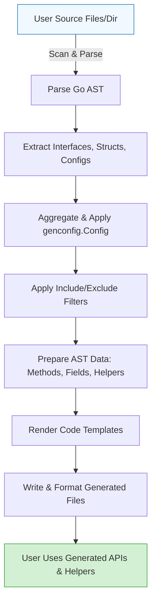

# Code Generation Workflow

Explore the end-to-end lifecycle of GORM CLI’s code generation process—from scanning user source files and parsing Go ASTs, through the application of configuration and template rendering, to the emission of ready-to-use Go files containing type-safe query APIs and model-driven helpers.

---

## Introduction

This guide illuminates how GORM CLI transforms your Go interfaces with embedded SQL templates and your model structs into generated code that you can immediately use in your applications.

You’ll learn the sequence from input processing, AST extraction, configuration application, filtering rules, to final code emission. This insight helps you understand how your changes in source code or configuration impact the generated output.

---

## Workflow Overview

The GORM CLI code generator operates through a series of well-defined stages:

1. **Input Processing and File Scanning**
    - Accepts input as either a single Go file or a directory.
    - Recursively scans directory inputs to identify all relevant Go source files.
    - Skips files it detects as generated, ensuring no duplicate or stale code is processed.

2. **Parsing Go Source into AST**
    - Parses each Go source file using Go’s standard `go/parser` to obtain the Abstract Syntax Tree (AST).
    - Traverses AST nodes to extract:
      - **Imports**: Tracks package imports needed for generation.
      - **Interfaces**: Extracts interface types annotated with SQL templates.
      - **Structs**: Extracts model struct definitions and their fields, including embedded structs via anonymous embedding handling.
      - **Config Literals**: Extracts any package-level `genconfig.Config` variables to feed into generation configuration.

3. **Applying Configuration and Filtering**
    - Configurations found in any of the processed files are aggregated.
    - Applies configuration options such as:
      - Custom output paths (`OutPath`).
      - Whitelist/blacklist filters for interfaces and structs to include/exclude generation.
      - Field helper mappings for Go types and tagged field names.
      - File-level overrides via `FileLevel`.
    - Filtering applies shell-style pattern matching and precise type-literal matches.

4. **AST Data Augmentation**
    - For each interface method:
      - Extracts SQL templates from method documentation comments.
      - Parses method parameters and return types.
      - Validates method return constraints (e.g., max two return values, last must be error).
    - For struct fields:
      - Determines the appropriate field helper type (e.g., `field.String`, `field.Time`, generic `field.Field[T]`), consulting configured mappings.
      - Supports embedded anonymous structs and external package structs.

5. **Code Generation via Templates**
    - Uses text/template to render code for:
      - Query API implementations for each interface, generating concrete, generic type-safe methods.
      - Model field helper structs with strongly typed predicates and association helpers.
    - Adds context parameter automatically if not present.
    - Generates method bodies by transforming SQL templates into functional code that composes SQL fragments and parameters.

6. **Code Output and Formatting**
    - Writes generated code to the configured output directory, preserving package and relative paths.
    - Creates directories if missing.
    - Applies `goimports` for formatted and clean output, ensuring imports are correctly ordered and organized.

7. **Logging and User Feedback**
    - Prints informative messages about files being generated.
    - Skips files as needed with concise log messages to keep the user informed.

---

## Detailed Steps and User Considerations

### 1. Input Processing

You provide either:

- A single Go file containing your interfaces and/or structs.
- A directory containing multiple files.

GORM CLI walks through directories recursively to process every `.go` file.

<Tip>
Use consistent project organization to ensure configs and files are detected correctly during recursive scanning.
</Tip>

### 2. Parsing and AST Traversal

Every file goes through:
- Parsing into Go AST with full comment retention for SQL template extraction.
- Walking the AST to identify:
  - Imported packages to build import lists for generated files.
  - Interface declarations and their methods.
  - Struct type declarations.
  - Package-level variable declarations to detect config literals.

Field extraction involves detecting field names, Go types, DB column names (via tags), and custom generation hints.

<AccordionGroup title="AST Node Types and What is Extracted">
<Accordion title="Import Specifications">
Tracks import package names and paths for correct import statements in generated code.
</Accordion>
<Accordion title="Interface Types">
Extracts interface name, methods, method signatures, and SQL templates from method docs.
</Accordion>
<Accordion title="Struct Types">
Extracts struct name and ordered fields, including embedding anonymous structs recursively.
</Accordion>
<Accordion title="Variable Declarations">
Detects `genconfig.Config` composite literals to customize code generation behavior.
</Accordion>
</AccordionGroup>

### 3. Configuration Handling and Filtering

GORM CLI automatically picks up any `genconfig.Config` variables declared in processed packages.

You can configure:

- **Output paths:** Override the directory where generated code files will be written.
- **Field mappings:** Specify how Go types or special `gen:"tag"` annotations map to specialized field helper types.
- **Filtering:** Include or exclude interfaces and structs by exact type names or shell-style glob patterns.
- **FileLevel mode:** When true, configuration applies only to the file it’s declared in, not the entire package.

Filtering logic prioritizes whitelists (`Include*`); if these are present, excludes (`Exclude*`) are ignored.

<Warning>
Incorrect or overly broad filters may exclude your interfaces or structs unintentionally—verify your whitelist/blacklist carefully.
</Warning>

### 4. Preparing Data for Generation

Before code generation:

- Each method's SQL template is parsed and validated.
- Parameters and results are typed and their signatures formatted.
- Field helpers are resolved through configured mappings or intelligent defaults (e.g., `field.String` for `string` fields).
- Associations and composite types are recognized as specialized field helpers.

<Tip>
Add or adjust your `genconfig.Config` for custom field helpers to reflect your domain-specific needs.
</Tip>

### 5. Code Template Rendering

The core generator uses a template that renders:

- Interfaces as generic, type-safe APIs with method implementations.
- Field helpers for models, exposing predicate builders and association accessors.

Method bodies are generated either as:

- Executing the raw SQL with parameters when methods return single values or errors.
- Returning chaining query builder calls when no raw SQL is given.

Context parameters are injected automatically if missing, relieving you from manual context management.

### 6. Emitting Generated Files

Generated files are written:

- To the configured output path or a default directory `./g`.
- With directory structure reflecting original package paths.
- After which the code is formatted with `goimports` to assure idiomatic Go output.

---

## Troubleshooting Common Scenarios

<AccordionGroup title="Code Generation Issues and Tips">
<Accordion title="No generated files appear">
Verify your input path and filters in `genconfig.Config`. Ensure your interfaces and structs match include/exclude patterns.
</Accordion>
<Accordion title="Generated code has missing imports or formatting issues">
Check that your Go environment is set up correctly, and `goimports` is available in your PATH.
CLI attempts to auto-format but external tool failures may cause issues.
</Accordion>
<Accordion title="SQL template parsing errors">
Ensure method comments are well-formed and template variables correspond to method parameters.
Avoid empty or improperly structured templates.
</Accordion>
</AccordionGroup>

---

## Example: From Source to Generated File

Suppose you have an interface:

```go
// Query interface with SQL template in comment
// SELECT * FROM @@table WHERE id=@id
GetByID(id int) (T, error)
```

GORM CLI parsing extracts the interface and method, parses the SQL, and generates:

```go
func Query[T any](db *gorm.DB, opts ...clause.Expression) _QueryInterface[T] {
  return _QueryImpl[T]{gorm.G[T](db, opts...)}
}

func (e _QueryImpl[T]) GetByID(ctx context.Context, id int) (T, error) {
  sb := &strings.Builder{}
  sb.WriteString("SELECT * FROM users WHERE id=?")
  return e.Exec(ctx, sb.String(), id)
}
```

This example shows context is auto-inserted even though missing in the interface, and the SQL template is baked into a concrete Go method.

---

## Visualizing the Workflow



---

## Best Practices and Tips

- Declare your `genconfig.Config` in the same package to easily customize generation.
- Use filtering to limit generation scope in large projects for faster builds.
- Take advantage of field helper mappings to support special types like JSON or SQL-nullable fields.
- Write clear SQL templates following the DSL for maximum type safety and expressiveness.
- Regularly validate generated code using the [Quick Validation Steps](/getting-started/validation-and-troubleshooting/quick-validation) guide.

---

## Next Steps

After understanding the code generation workflow, you can dive deeper into:

- [Core Concepts & Terminology](/overview/introduction-and-key-concepts/core-concepts-and-terminology) to ground yourself in GORM CLI's terminology.
- [Configuration Basics](/getting-started/essential-setup/configuration-basics) to master `genconfig.Config` options.
- [Your First Code Generation](/getting-started/essential-setup/first-code-generation) to see a hands-on example.
- [Working with Field Helpers](/guides/core-workflows/working-with-field-helpers) to leverage model-driven predicates.
- [Writing and Using Template-Based Queries](/guides/advanced-patterns/template-dsl-guide) for advanced SQL templating.


---

## References

- [GORM CLI GitHub Repository](https://github.com/go-gorm/cli)
- CLI Command Definition: `gen.go` (entrypoint for code generation command)
- Template Definition: `template.go` (text/template string defining generated code structure)

---