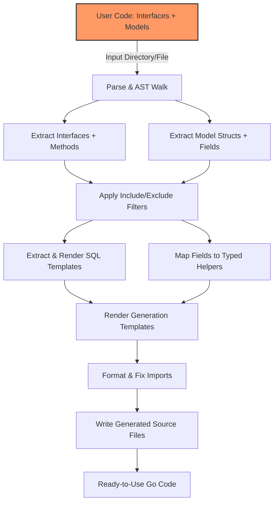

# Code Generation Workflow

Understanding the full code generation workflow is crucial to effectively leverage GORM CLI. This guide walks you through the process, starting from your source Go code with interfaces and models, moving through parsing and analysis, SQL template interpretation, and finally producing ready-to-use, type-safe Go source files that integrate seamlessly with GORM.

---

## 1. Overview: From Source Code to Generated APIs

At its core, GORM CLI transforms your explicitly defined query interfaces annotated with SQL templates, along with your Go model structs, into two powerful outputs:

- **Type-safe Query APIs** — Concrete method implementations from your SQL-annotated interfaces.
- **Model-driven Field Helpers** — Strongly typed field and association helpers derived from struct definitions.

This workflow ensures that rather than handcrafting redundant boilerplate, you write declarative interfaces and models, and GORM CLI emits fluent, compile-time-safe APIs ready for your application.

### User Journey Example

```go
// Step 1: Define your interface with SQL templates in comments
type Query[T any] interface {
  // SELECT * FROM @@table WHERE id=@id
  GetByID(id int) (T, error)
}

// Step 2: Define your model struct
type User struct {
  ID   uint
  Name string
}

// Step 3: Run the generator
gorm gen -i ./examples -o ./generated

// Step 4: Use generated API
user, err := generated.Query[User](db).GetByID(ctx, 123)
```

---

## 2. Input Discovery & Parsing

### File Input Types
- **Directories:** GORM CLI recursively walks all `.go` files.
- **Single files:** It can target individual interface/model files.

### Parsing Process
- Uses Go's `go/parser` and `go/ast` packages to parse files into Abstract Syntax Trees (AST).
- Extracts package-level declarations, imports, interfaces, and struct types.

### Interfaces Extraction
- Captures all Go interfaces, focusing on those matching configured include/exclude filters.
- Parses interface methods, gathering method signatures and extracting SQL templates annotated in comments.

### Struct Extraction
- Processes structs, unraveling fields including embedded ones.
- Captures fields’ Go types, tags, and any custom `gen` tags influencing field helper generation.

### Generator Configuration
- Loads any package-level `genconfig.Config` to control:
  - Output directories
  - Field type/name mappings
  - Include/exclude filters for interfaces and structs
  - File-level or package-level scope

<Tip>
This step ensures your input interfaces and models are fully understood and filtered correctly before code generation.
</Tip>

---

## 3. SQL Template Extraction & Interpretation

GORM CLI uses SQL templates embedded in interface method comments to generate query implementations.

### Template Annotations
- Templates are extracted via special comment parsing using `extractSQL` logic.
- Recognizes directives like:
  - `@@table` (model’s table name)
  - `@@column` (dynamic column binding)
  - `@param` (binds Go params to SQL params)
  - `{{where}}`, `{{set}}`, `{{if}}`, and `{{for}}` DSL blocks for conditional logic

### Template Parsing
- Uses a specialized internal renderer to convert SQL DSL into Go code that builds SQL strings and parameter slices.
- Maintains strong typing by binding inputs directly to method params.

### Generation of Method Bodies
- Depending on the method signature and returned values:
  - **Finish methods:** return concrete query results. The method body builds, executes, and scans SQL.
  - **Chain methods:** return interface for fluent chaining, building query conditions progressively.

### Example - Generated Method Body for `GetByID`:

```go
func (e QueryImpl[T]) GetByID(ctx context.Context, id int) (T, error) {
  var sb strings.Builder
  params := make([]any, 0, 2)
  sb.WriteString("SELECT * FROM ? WHERE id=? AND name = \"@name\"")
  params = append(params, clause.Table{Name: clause.CurrentTable}, id)
  var result T
  err := e.Raw(sb.String(), params...).Scan(ctx, &result)
  return result, err
}
```

<Info>
Methods without explicit SQL templates generate chainable methods mapping SQL conditions to Go method calls, supporting fluent query building.
</Info>

---

## 4. Struct Field Analysis & Helper Generation

GORM CLI deeply analyzes model structs to generate typed field helpers that enable fluent, type-safe predicates, setters, and association operations.

### Field Discovery
- Walks all exported struct fields, handling embedded structs (flattened).
- Extracts:
  - Field names
  - DB column names (based on conventions or struct tags)
  - Go types, including pointer and slice types
  - Custom `gen` tags for special mapping

### Type Mapping
- Applies type mappings configured in `genconfig.Config` for:
  - Mapping native types (e.g., `time.Time`) to field helper types (e.g., `field.Time`)
  - Custom field types (e.g., JSON helpers)

### Field Helper Generation
- For primitives (int, string, bool, time), generates corresponding predicate and actuator methods.
- For associations (`struct`, `[]struct`), generates association helpers to
  - Create, Update, Unlink, Delete
  - Include batch operations

### Example Field Helper Usage

```go
generated.User.Name.Eq("jinzhu")      // name = 'jinzhu'
generated.User.Pets.Create(...)      // create a pet linked to a user
```

<Note>
Embedding anonymous structs merges their fields into the parent struct for inclusive field helper generation.
</Note>

---

## 5. Applying Configuration & Filtering

GORM CLI allows fine-grained control over code generation behavior through `genconfig.Config`.

### Configuration Scopes
- Package-level (default for all files in a package)
- File-level (overrides package-level when `FileLevel` is true)

### Filters
- **IncludeInterfaces / ExcludeInterfaces:** Shell-pattern names or concrete types
- **IncludeStructs / ExcludeStructs:** Controls which models get helpers

### Type Mappings
- Map custom Go types or struct tags to special field helper types

### Effect on Generation
- Files and types not passing filters are skipped.
- Output directories (`OutPath`) can be customized per config.

<Warning>
Misconfigurations can lead to missing generated files; always verify your filters and paths carefully.
</Warning>

---

## 6. Code Emission & Formatting

### Template Rendering
- The `template.go` package contains the core Go text template applying all extracted data.
- Generates concise, idiomatic Go code for:
  - Query interface implementations
  - Field helper variables with predicate/setter methods

### Output Organization
- Preserves directory structure relative to input.
- Writes output under configured or default (./g) directories.

### Formatting & Imports
- Uses `golang.org/x/tools/imports` to format and fix imports automatically.
- Ensures generated code complies with `gofmt` standards.

### File Rename & Write
- Creates directories as needed with secure permissions.
- Writes generated source files safely with error checking.

---

## 7. End-to-End Flow Diagram



---

## 8. Troubleshooting & Best Practices

### Common Issues
- **Methods without return values or inconsistent signatures:** The generator enforces signatures with an error return.
- **Invalid SQL templates:** Syntax errors in templates cause parsing failures; verify template syntax.
- **Filtered-out types:** Confirm filters to ensure intended interfaces and structs are included.

### Best Practices
- Keep SQL templates concise and leverage GORM CLI’s DSL for clarity.
- Define configurations early in the package for predictable generation.
- Use meaningful struct tags (`gen`) for custom field helpers.
- Run `gorm gen` frequently during development to catch issues early.

<Check>
Always validate the generated code compiles and matches expected behaviors before integrating into production workflows.
</Check>

---

## 9. Further Reading

For more in-depth knowledge, reference the following documentation:
- [Model-Driven Field Helpers](#/concepts/data-models-and-templates/model-driven-field-helpers)
- [Template DSL Concepts](#/concepts/data-models-and-templates/template-dsl-concepts)
- [Configuring Code Generation](#/concepts/configuration-and-extensibility/configuring-generation)
- [Working with Associations](#/guides/real-world-patterns/working-with-associations)

Explore the [Architecture Overview](#/concepts/core-architecture/architecture-overview) for system-level understanding of GORM CLI.

---

## 10. Source Code Key Highlights

- **Generator struct (`internal/gen/generator.go`)**: Core engine handling parsing, filtering, and generation.
- **SQL template parser (`internal/gen/sqlparser_test.go`)**: Validates SQL template rendering logic.
- **Template (`internal/gen/template.go`)**: Go `text/template` defining the generated code structure.
- **CLI entry (`main.go`)**: Initiates the generation process via Cobra commands.

<Source url="https://github.com/go-gorm/cli" paths={[{"path": "internal/gen/generator.go"}, {"path": "internal/gen/sqlparser_test.go"}, {"path": "internal/gen/template.go"}, {"path": "main.go"}]} />
