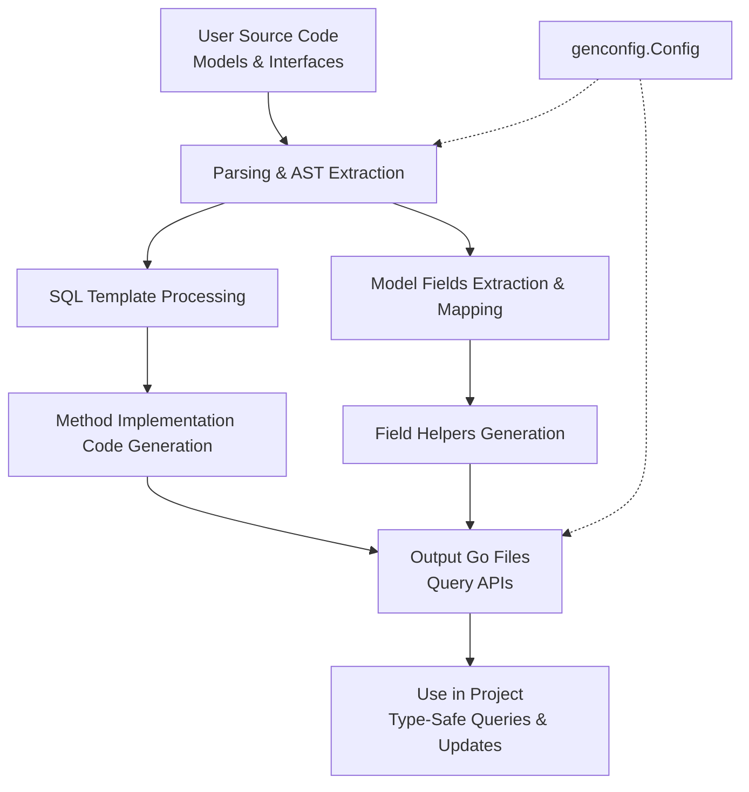

# Data Flow: From Model to API

Understanding how your Go code travels through GORM CLI illuminates the path from raw struct definitions and annotated interfaces to robust, type-safe query APIs and expressive model-driven field helpers. This guide unpacks each transformation stage—starting with your source Go files, moving through parsing, templating, and generation—and highlights where customization can shape output. By mastering this flow, you gain clarity on how to craft your models and interfaces for maximum power and flexibility.

---

## 1. User Input: Models and Query Interfaces

GORM CLI begins with **user-defined source code**, typically:

- **Go model structs** that represent your database tables and their relations,
- **Go interfaces** with annotated SQL templates defining your query intentions.

### Example Model Struct

```go
package models

type User struct {
    ID        uint
    Name      string
    Age       int
    CreatedAt time.Time
    // Relations and other fields omitted for brevity
}
```

### Example Query Interface with SQL Template

```go
type Query[T any] interface {
    // SELECT * FROM @@table WHERE id=@id
    GetByID(id int) (T, error)

    // UPDATE @@table
    // {{set}}
    //   {{if user.Name != ""}} name=@user.Name, {{end}}
    //   {{if user.Age > 0}} age=@user.Age {{end}}
    // {{end}}
    // WHERE id=@id
    UpdateUser(user User, id int) error
}
```

**User Input Intent Focus**:  
The goal here is to clearly express the database schema through models, and the desired queries through interfaces with embedded SQL templating.

---

## 2. Parsing & AST Extraction

When you invoke the generator (`gorm gen`), GORM CLI parses your provided Go source files into abstract syntax trees (ASTs). This parsing captures:

- Model struct definitions, their fields, and tags,
- Interface definitions, method signatures, and SQL template annotations in comments,
- Configuration structs (if any) for custom overrides.

The generator walks the AST to build internal representations of:

- **Structs**: with full knowledge of fields, types, export status, and tags such as `gen:"json"` to enable specialized field helpers,
- **Interfaces**: with extracted methods, parameter and return types, plus SQL templates parsed from documentation comments.

At this stage, relative package paths and import dependencies are noted to correctly resolve types.

### Behind the Scenes
Parsing ensures syntactic correctness and builds the foundation for precise, type-safe generation by relying solely on your source inputs without assumptions.

---

## 3. SQL Template Processing

For each interface method, the embedded SQL template is processed to generate executable query fragments:

- Placeholders like `@@table` and `@@column` get mapped to the relevant table and column names,
- Parameters like `@id`, `@user.Name` bind to method arguments,
- DSL directives such as `{{where}}` and `{{set}}` are expanded into Go code with conditional logic,
- The code generator ensures that context (`ctx context.Context`) is included even if omitted by the user.

This step converts raw SQL text into **Go code that builds parameterized, safe SQL commands dynamically**.

---

## 4. Model-Driven Field Helper Generation

Separately, the generator translates your model structs into **field helper variables and types** that empower fluent, type-safe query building:

- Basic fields (ints, strings, time, nullable types) are transformed into predicate setters (e.g., `.Eq()`, `.Like()`, `.Incr()`).
- Relationships (has-one, has-many, belongs-to, many-to-many, polymorphic) become nested helper structures reflecting association semantics.
- Field tags and configuration mappings (such as `gen:"json"` or custom `FieldNameMap`) enable plugging in custom field helpers like JSON handlers.

This abstraction layer lets developers compose SQL queries and updates using auto-completed, discoverable Go expressions instead of raw strings.

### Example Field Helper Usage

```go
// Filtering by age greater than 18
users, err := gorm.G[User](db).Where(generated.User.Age.Gt(18)).Find(ctx)

// Creating with association
gorm.G[User](db).Set(
  generated.User.Name.Set("Alice"),
  generated.User.Pets.Create(generated.Pet.Name.Set("Fido")),
).Create(ctx)
```

---

## 5. Code Generation & Output File Structure

After gathering models and interfaces with their parsed SQL metadata and field helpers, GORM CLI generates Go source files.

- Each input file produces a corresponding output file preserving package structure.
- Output includes:
  - Concrete implementations of the query interface with generated method bodies,
  - Declaration of model-driven field helper variables,
  - Necessary imports and package declarations.

By default, files are placed under a directory like `./g` unless overridden with custom `genconfig.Config` settings.

---

## 6. Generator Customizations & Filtering

Customization points are integrated into the flow:

- `genconfig.Config` can specify output paths, mappings from Go types to custom field helpers, and interface or struct inclusion/exclusion filters.
- These configs can be declared in source files where the generator applies them automatically.
- Filters ensure that only selected interfaces or structs are processed, enabling large projects to modularize code generation.

This extensibility complements the generation pipeline without interrupting the seamless user workflow.

---

## 7. Integration with Your Codebase

The generated code fits naturally into your Go project using GORM:

- Generated query APIs are invoked using generic helpers (e.g., `generated.Query[User](db)`), offering fluent and type-safe database interaction.
- Model-driven field helpers integrate with existing GORM query builders for predicates, updates, and association operations.
- You retain idiomatic Go and GORM usage while gaining compile-time guarantees and reduced boilerplate.


---

## Visualizing the Data Flow



This diagram highlights the dual generation paths (query APIs and field helpers) converging into your integrated output.

---

## Practical Tips & Best Practices

- **Define clear, precise SQL templates in interfaces** to leverage full compile-time safety.
- **Annotate models with tags** like `gen:"json"` for custom helpers to handle special field types.
- **Use configuration files to tailor generation output**, ensuring only relevant files or interfaces are included.
- **Regularly validate generated code** by invoking your queries in tests (e.g., `Validate Your Setup` guide).
- **Compose complex queries using generated helpers** to avoid SQL injection and improve readability.

---

## Troubleshooting Common Issues

- **No generated output?** Check if `Include*` or `Exclude*` patterns in config are filtering out your code.
- **SQL template parsing errors?** Ensure query method comments follow the expected format with correct placeholders.
- **Unexpected type mappings?** Use `FieldTypeMap` and `FieldNameMap` in config to explicitly map types.
- **Import resolution errors?** Confirm source files have correct package imports and module paths.

Consult the `Common Issues & Troubleshooting` guide for detailed solutions.

---

## Further Exploration

To deepen your understanding and mastery:

- Visit [Architecture Overview](https://gorm.io/docs/cli/overview/architecture-concepts/architecture-overview) to grasp the big picture.
- Explore [Core Concepts & Terminology](https://gorm.io/docs/cli/overview/architecture-concepts/core-concepts-terminology) for foundational knowledge.
- Learn how to [Customize Generation](https://gorm.io/docs/cli/guides/advanced-features-patterns/customizing-generation-config) for advanced control.
- See practical usage in [Using Generated APIs](https://gorm.io/docs/cli/guides/core-workflows/using-generated-apis).

---

# Summary

You now have a clear, end-to-end understanding of how your Go code is transformed by GORM CLI—starting from your cleanly defined models and raw interfaces, flowing through sophisticated parsing and templating, ultimately generating fluent, type-safe APIs and helpers to accelerate your database interactions with confidence and clarity.

Harnessing this knowledge empowers you to customize, optimize, and troubleshoot your GORM CLI integration like a pro.

---