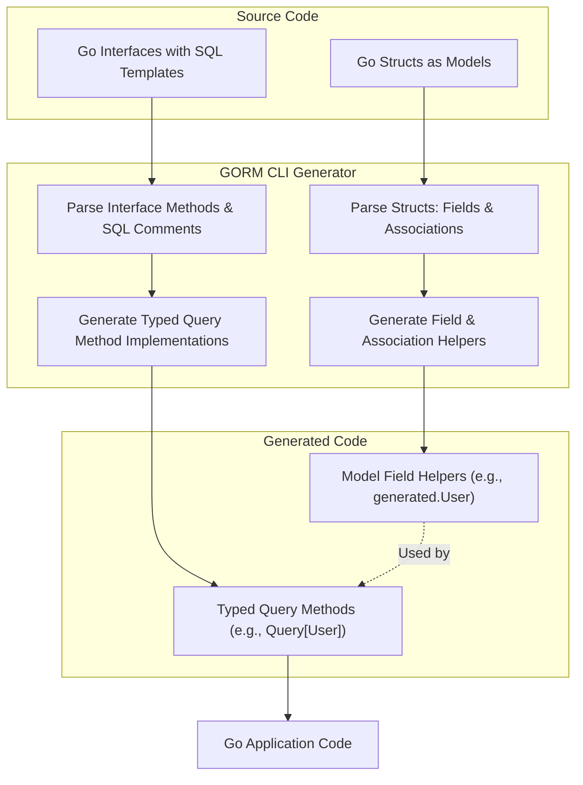

# Data Models, Interfaces, and Schemas

GORM CLI transforms your Go code into powerful, type-safe query APIs by interpreting Go structs as data models and interfaces as query contracts. This page unpacks how your struct definitions map into generated field helpers, how interface methods with embedded SQL templates become concrete query methods, and how associations enrich the dynamic query and update building process.

---

## Overview

At its core, GORM CLI leverages Go's type system and structured comments in interfaces to generate strongly-typed query APIs and model-driven field helpers. These helpers reflect your schema design and SQL query intent, delivering compile-time safety and expressive querying capabilities.

- **Go structs** define your database schema.
- **Go interfaces** declare queries with SQL templates in documentation comments.
- **Code generation** parses your definitions, templated SQL, and relationships to produce idiomatic, type-safe code.

This approach bridges the gap between raw SQL strings and Go type safety, empowering you to write fluent, maintainable data access code.

---

## How GORM CLI Interprets Data Models

### Structs as Database Schemas

Your Go structs represent database tables. Each field corresponds to a table column or an association. GORM CLI inspects these structs to generate **field helpers**, which are type-safe, fluent interfaces for query predicates, updates, ordering, and association operations.

**Example: User Struct Model**

```go
package models

import (
	"database/sql"
	"time"

	"gorm.io/gorm"
)

// User model with various fields and associations
// - Basic fields: ID, Name, Age, Role, etc.
// - Associations: Account (has one), Pets (has many), Languages (many to many), Manager (belongs to), Team (has many)
type User struct {
	gorm.Model
	Name      string
	Age       int
	Birthday  *time.Time
	Score     sql.NullInt64
	LastLogin sql.NullTime
	Account   Account
	Pets      []*Pet
	Toys      []Toy `gorm:"polymorphic:Owner"`
	CompanyID *int
	Company   Company
	ManagerID *uint
	Manager   *User
	Team      []User     `gorm:"foreignkey:ManagerID"`
	Languages []Language `gorm:"many2many:UserSpeak"`
	Friends   []*User    `gorm:"many2many:user_friends"`
	Role      string
	IsAdult   bool   `gorm:"column:is_adult"`
	Profile   string `gen:"json"`
}
```

#### Key Insights

- **Basic fields** generate predicates and setters reflecting their Go types.
- **Nullable types** like `sql.NullInt64` and `sql.NullTime` map correctly to nullable fields.
- **Tagged fields** (e.g., `gen:"json"`) enable custom field helper mapping (see JSON fields).
- **Associations** become rich helpers for related data management.

### Associations in Models

GORM CLI recognizes associations from your struct tags and field types and generates corresponding helper methods that make relational operations fluent and safe.

| Association Type       | Description                                       | Generated Helper Type              | Semantics                         |
|------------------------|-------------------------------------------------|----------------------------------|----------------------------------|
| **Has One**            | One-to-one with child storing foreign key       | `field.Struct[T]`                 | Create / Update / Unlink / Delete |
| **Has Many**           | One-to-many with child storing foreign key      | `field.Slice[T]`                  | CreateInBatch + full relation ops |
| **Belongs To**         | Parent relation with FK on the struct            | `field.Struct[T]`                 | Unlink sets FK NULL; Delete deletes associated rows |
| **Many to Many**       | Join table manages many-to-many between tables  | `field.Slice[T]` with `many2many` tag | Unlink/Delete affect join rows only |

Example associations for `User`:

- `Account` is a has-one association.
- `Pets` is has-many.
- `Languages` is many-to-many.
- `Manager` and `Team` exemplify single-table associations.

These associations generate helper methods that you can use to create, update, unlink, or delete related entities within fluent queries.

---

## Interfaces as Query Contracts

### Defining Queries with Interface Methods

GORM CLI reads your Go interfaces to generate type-safe query APIs. You define methods with SQL templates in their comments. These interfaces act as contracts that declare *what* you want to query, not *how*.

Example from `examples/query.go`:

```go
package examples

type Query[T any] interface {
	// GetByID query data by id and return it as struct
	//
	// SELECT * FROM @@table WHERE id=@id AND name = "\@name"
	GetByID(id int) (T, error)

	// SELECT * FROM @@table WHERE @@column=@value
	FilterWithColumn(column string, value string) (T, error)

	// Dynamic WHERE with conditional fields
	// SELECT * FROM @@table
	//   {{if user.ID > 0}}
	//       WHERE id=@user.ID
	//   {{else if user.Name != ""}}
	//       WHERE name=@user.Name
	//   {{end}}
	QueryWith(user models.User) (T, error)

	// Dynamic UPDATE with conditional field sets
	UpdateInfo(user models.User, id int) error

	// Complex filter with iteration and conditionals
	Filter(users []models.User) ([]T, error)

	// Simple where clause helper
	FilterByNameAndAge(name string, age int)

	// Time range filtering
	FilterWithTime(start, end time.Time) ([]T, error)
}
```

### Template DSL

GORM CLI supports a templating syntax inside method comments:

| Directive   | Purpose                                   | Example                                       |
|-------------|-------------------------------------------|-----------------------------------------------|
| `@@table`   | Table name for the model                  | `SELECT * FROM @@table WHERE id=@id`          |
| `@@column`  | Dynamic column binding                    | `WHERE @@column=@value`                        |
| `@param`    | Bind Go method param to SQL parameter    | `WHERE name=@user.Name`                        |
| `{{where}}` | Conditional WHERE clause                   | `{{where}} age > 18 {{end}}`                   |
| `{{set}}`   | Conditional SET clause for UPDATE         | `{{set}} name=@name {{end}}`                    |
| `{{if}}`    | Conditional SQL fragment                   | `{{if age > 0}} AND age=@age {{end}}`           |
| `{{for}}`   | Iteration over collections                 | `{{for _, t := range tags}} ... {{end}}`         |

This DSL enables dynamic creation of SQL queries based on your input parameters, while the generator converts these into safe, compile-time checked Go methods.

### Generated API from Interfaces

GORM CLI processes these interfaces and generates concrete implementations with method signatures matching your declaration, enriched with context injection and parameter type safety.

Example usage:

```go
// Fetch user by ID
user, err := generated.Query[User](db).GetByID(ctx, 123)

// Filter users by name and age
users, err := generated.Query[User](db).FilterByNameAndAge("jinzhu", 25).Find(ctx)

// Update user info
err := generated.Query[User](db).UpdateInfo(ctx, User{Name: "jinzhu", Age: 20}, 1)
```

---

## Schema Inference and Naming Conventions

### Field Name to Column Name Mapping

GORM CLI respects your struct tags and naming strategies to generate database column identifiers:

- Uses the GORM `gorm:"column:<name>"` tag if present.
- Defaults to converting Go field names to snake_case using GORM's naming strategy.

Example:

```go
IsAdult bool `gorm:"column:is_adult"`
```
Generates field helper column ``is_adult``.

### Field Type Mapping

Field types in Go, including basic types and special types like `sql.NullInt64`, map to various generated field helpers. Your `genconfig.Config` can customize these mappings.

Example from configuration:

```go
var _ = genconfig.Config{
	FieldTypeMap: map[any]any{
		sql.NullTime{}: field.Time{},
	},
	FieldNameMap: map[string]any{
		"json": JSON{},
	},
}
```

This enables specific handling and SQL generation for JSON fields and nullable times.

---

## Behind the Scenes: Field Helpers

Generated `field` package helpers offer type-safe predicates and updates for each model field.

### Basic Field Helpers

- `field.String` for string fields
- `field.Number[T]` for numeric types
- `field.Time` for time fields
- `field.Bool` for booleans
- `field.Field[T]` for more complex, custom or interface-implementing types

Example from generated model (partial snippet):

```go
var User = struct {
	ID        field.Number[uint]
	Name      field.String
	Age       field.Number[int]
	IsAdult   field.Bool
	Profile   examples.JSON
}{
	ID:        field.Number[uint]{}.WithColumn("id"),
	Name:      field.String{}.WithColumn("name"),
	Age:       field.Number[int]{}.WithColumn("age"),
	IsAdult:   field.Bool{}.WithColumn("is_adult"),
	Profile:   examples.JSON{}.WithColumn("profile"),
}
```

### Associations as Helpers

Association fields generate:

- `field.Struct[T]` for singular relations (e.g., `Account`, `Company`)
- `field.Slice[T]` for collections (e.g., `Pets`, `Languages`, `Team`)

These helpers provide methods to create, update, unlink, delete, or batch-create associated records linked to your primary entity.

---

## User Journey: From Struct and Interface to Working API

1. **Define your models** as Go structs with fields and associations.
2. **Write interfaces** with method comments describing SQL templates.
3. **Configure generation** optionally with `genconfig.Config` to customize output path and type mappings.
4. Run `gorm gen` CLI to process your source files.
5. Generated code exposes:
   - A rich `generated.Model` struct with field helpers.
   - Concrete implementations of query interfaces.
6. Use generated APIs in your application for type-safe, expressive database operations.

---

## Practical Tips and Best Practices

- **Use interfaces to centralize SQL queries**: Keep query logic declarative and reusable.
- **Annotate json or custom fields** for special field helper mappings.
- **Leverage associations helpers** to streamline relational data operations.
- **Avoid raw SQL strings** in application code; use generated methods for safety and maintainability.
- **Keep your model associations consistent**; this ensures correct helper generation and relational semantics.

---

## Troubleshooting

- **No generated methods for an interface?**
  - Ensure your interface methods have SQL templates in method comments.
  - Confirm the interface is included via `IncludeInterfaces` filter if configured.

- **Field mapping not applying?**
  - Check if your `genconfig.Config` correctly maps types or names.
  - Verify struct field tags are correctly set (e.g., `gen:"json"`).

- **Association helpers missing?**
  - Confirm association tags are properly defined per GORM conventions.
  - Check the field types correspond to valid association patterns.

---

## Diagram: Data Model to Generated Helpers Flow



---

## See Also

- [Core Concepts & Terminology](/overview/introduction-and-key-concepts/core-concepts-and-terminology)
- [Working With Field Helpers](/guides/core-workflows/working-with-field-helpers)
- [Associations Guide](/guides/core-workflows/associations-guide)
- [Writing and Using Template-Based Queries](/guides/advanced-patterns/template-dsl-guide)
- [Customizing Generation with genconfig](/guides/advanced-patterns/customizing-generation)

---

This page prepares you to reason effectively about GORM CLI’s inputs and outputs. Armed with these insights, you’ll maximize your productivity and code safety when generating GORM-powered database queries with Go.

