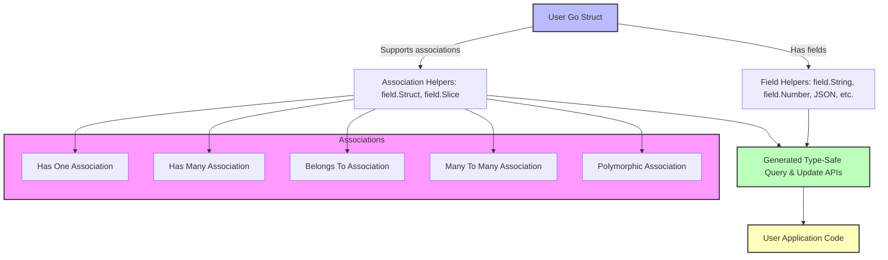

# Data Modeling & Associations

Understanding how GORM CLI processes your Go model structs to generate rich, type-safe field helpers and association APIs is key to unlocking the tool's full power. This guide exposes the conventions, patterns, and decision rules that transform your Go structs into expressive, fluent, and efficient query helpers with full support for complex relationships.

---

## Introduction

Whether you are modeling a simple table or a complex domain with multiple related entities, GORM CLI converts your Go model structs into generated types that help you write code-safe, readable, and maintainable data operations. This page focuses specifically on **model-driven code generation**: which struct fields produce what kinds of generated code, how associations are discovered and represented, and how you can design models to maximize tooling benefits.

---

## What is Model-Driven Generation?

GORM CLI analyzes your Go structs to generate:

- **Field Helpers:** Strongly typed predicates and setters for individual columns, enabling fluent filtering and updates.
- **Association Helpers:** Specialized helpers for relational associations—has one, has many, belongs to, many-to-many—including polymorphic relationships.

### Value For End Users

Imagine you have a `User` struct. Model-driven generation allows you to write expressions like:

```go
// Predicates
generated.User.Name.Eq("jinzhu")      // WHERE name = 'jinzhu'
generated.User.Age.Gt(18)               // WHERE age > 18

// Association Creates
generated.User.Pets.Create(generated.Pet.Name.Set("fido"))
```

All with compile-time type safety, completion, and clear semantics.

---

## Field Helper Generation: From Struct Fields to Fluent APIs

### Basic Field Types

GORM CLI recognizes primitive Go types and common SQL nullable types to generate corresponding field helpers wrapped in generic types:

- Numeric types (`int`, `uint`, `float32`, etc.) become `field.Number[<Type>]` helpers.
- Strings map to `field.String`.
- Booleans to `field.Bool`.
- Time types to `field.Time`.
- Nullable SQL types (e.g., `sql.NullInt64`, `sql.NullTime`) also translate to appropriate helpers.

These helpers expose predicates like `.Eq()`, `.NotEq()`, `.Lt()`, `.In()`, and update setters like `.Set()`, `.SetExpr()`.

### Custom or Named Types

If your struct field uses a named Go type or custom type (e.g., a type implementing `Scanner`/`Valuer` or GORM serializer), GORM CLI inspects configuration mappings (`FieldTypeMap`, `FieldNameMap`) to generate the appropriate helper (e.g., a custom `JSON` helper).

### Field Naming and Configuration

- The generator uses the struct field's Go name as the helper name.
- The column name is resolved from GORM tags or defaults to snake_case conversion.
- You can customize the behavior by adding struct tags like `gen:"json"` to map a field to a custom helper.

### Example

Given this snippet from a `User` model:

```go
type User struct {
  ID        uint
  Name      string
  Age       int
  Profile   string `gen:"json"`
}
```

GORM CLI will generate field helpers similar to:

```go
var User = struct {
  ID      field.Number[uint]
  Name    field.String
  Age     field.Number[int]
  Profile JSON
} {
  ID:      field.Number[uint]{}.WithColumn("id"),
  Name:    field.String{}.WithColumn("name"),
  Age:     field.Number[int]{}.WithColumn("age"),
  Profile: JSON{}.WithColumn("profile"),
}
```

---

## Association Discovery and Generation

Associations in GORM define relationships between entities and enable ORM features like eager loading, cascading updates, and relational navigations.

GORM CLI detects and generates helpers for the following association types:

### 1. Has One

- **Definition:** One model has exactly one corresponding associated model.
- **Example:** 
  - `User.Account` (one Account per User)

- **Generated Helper:** `field.Struct[T]` where `T` is the associated type.

- **Behavior:** Supports create, update, unlink (set FK to NULL), delete.

### 2. Has Many

- **Definition:** One model has many associated models.
- **Example:**
  - `User.Pets` (multiple Pets per User)
  - `User.Team` (multiple Users managed by a User)

- **Generated Helper:** `field.Slice[T]` for slice of associated type.

- **Behavior:** Supports batch create/link, update with conditions, unlink (clear child FK), delete.

### 3. Belongs To

- **Definition:** The model holds the foreign key of another model, expressing ownership.
- **Example:**
  - `User.Company` (User belongs to a Company)
  - `User.Manager` (User belongs to another User as Manager)

- **Generated Helper:** `field.Struct[T]` with corresponding FK field (e.g., `CompanyID`).

- **Behavior:** Unlink sets FK to NULL; delete removes associated rows.

### 4. Many To Many

- **Definition:** Many models are related to many other models through join tables.
- **Example:**
  - `User.Languages` (User speaks many languages)
  - `User.Friends` (mutual friendship)

- **Generated Helper:** `field.Slice[T]` with join table metadata.

- **Behavior:** Create batch link; unlink/delete only remove join rows, preserving parent and child rows.

### 5. Polymorphic Associations

- **Definition:** A model can be associated to multiple other models via a polymorphic interface.
- **Example:**
  - `User.Toys` (Toys owned by User, Pet, or other)
  - `Pet.Toy` (single toy polymorphically owned)

- **Generated Helper:** `field.Slice[T]` or `field.Struct[T]` with polymorphic keys (`OwnerID`, `OwnerType`).

- **Behavior:** Support dynamic linking/unlinking respecting polymorphic discriminator columns.

### How Associations Are Detected

The generator inspects:

- Field types and their slice nature (`[]T`, `[]*T` vs. `T` or `*T`).
- GORM struct tags such as `gorm:"foreignkey:..."`, `gorm:"many2many:..."`, `gorm:"polymorphic:..."`, and standard key conventions.
- Foreign key fields often paired with association fields, e.g., `CompanyID` alongside `Company`.

### Example Modeling Associations

```go
type User struct {
  gorm.Model

  Account   Account          // Has One
  Pets      []*Pet           // Has Many
  Toys      []Toy `gorm:"polymorphic:Owner"` // Polymorphic Has Many
  CompanyID *int             // FK
  Company   Company          // Belongs To
  ManagerID *uint            // FK
  Manager   *User            // Belongs To (Self-Reference)
  Team      []User `gorm:"foreignkey:ManagerID"` // Has Many (Self-Reference)

  Languages []Language `gorm:"many2many:UserSpeak"` // Many To Many
  Friends   []*User    `gorm:"many2many:user_friends"` // Many To Many
}
```

---

## Using Generated Association Helpers

Generated association helpers let you express sophisticated operations fluidly and safely:

- **Create** and link associations in one go.
- **Update** related records conditionally.
- **Unlink** to remove relationships without deleting records.
- **Delete** to remove related records (behavior varies by association).
- **CreateInBatch** for efficient batch inserts and links.

### Example Usage

```go
// Create a User with one Pet
gorm.G[User](db).Set(
  generated.User.Name.Set("alice"),
  generated.User.Pets.Create(generated.Pet.Name.Set("fido")),
).Create(ctx)

// Update User's Pet name
gorm.G[User](db).Where(generated.User.ID.Eq(1)).Set(
  generated.User.Pets.Where(generated.Pet.Name.Eq("fido")).Update(generated.Pet.Name.Set("rex")),
).Update(ctx)

// Unlink pets from User
gorm.G[User](db).Where(generated.User.ID.Eq(1)).Set(
  generated.User.Pets.Unlink(),
).Update(ctx)

// Delete old pets
gorm.G[User](db).Where(generated.User.ID.Eq(1)).Set(
  generated.User.Pets.Where(generated.Pet.Name.Eq("old")).Delete(),
).Update(ctx)

// Link Languages batch
gorm.G[User](db).Where(generated.User.ID.Eq(1)).Set(
  generated.User.Languages.CreateInBatch([]models.Language{{Code: "EN"}, {Code: "FR"}}),
).Update(ctx)
```

---

## Best Practices for Modeling to Maximize Codegen

- **Consistently use embedded GORM model types** such as `gorm.Model` for automatic ID and timestamps.
- **Define explicit foreign key fields** (e.g., `CompanyID`) alongside association structs (e.g., `Company`) to enable clear belongs-to relations.
- **Annotate polymorphic associations** correctly with struct tags (`gorm:"polymorphic:Owner"`) to generate polymorphic helpers.
- **Use slice pointers (`[]*T`) or slices (`[]T`) consistently.** The generator detects associations regardless, but be explicit.
- **Avoid ambiguous field types that don’t relate clearly to structs or primitives, as these can’t generate meaningful helpers.**
- **Consider using struct tags like `gen:"json"` to map fields to specialized helpers if your project requires advanced typing (e.g., JSON).**

---

## Troubleshooting & Common Pitfalls

<AccordionGroup title="Troubleshooting Model-Driven Generation Issues">
<Accordion title="No Field Helpers Generated for Some Fields">
Check that the field is exported (starts with uppercase), has a recognized Go type, and is not anonymous. Review struct tags; unsupported or missing types may fallback to generic helpers or be skipped.
</Accordion>
<Accordion title="Associations Not Recognized or Incorrectly Generated">
Verify the association is properly defined with matching foreign keys and GORM struct tags. Self-referential associations require correct FK design as well. Missing required tags like `many2many` or `polymorphic` cause missing features.
</Accordion>
<Accordion title="Polymorphic Associations Are Not Working as Expected">
Ensure polymorphic tags include both `OwnerID` and `OwnerType` fields in the associated structs. Confirm you have correctly specified the polymorphic name in the tag (e.g., `gorm:"polymorphic:Owner"`).
</Accordion>
<Accordion title="Custom Field Helper Not Generated for Expected Fields">
Validate that your `genconfig.Config` includes appropriate mappings in `FieldNameMap` or `FieldTypeMap`. Confirm the named Go type or struct tag matches the config exactly.
</Accordion>
</AccordionGroup>

---

## Summary

This guide has revealed how GORM CLI translates your Go models into a rich ecosystem of typed helpers by:

- Mapping primitive and custom field types into fluent, type-safe field helpers
- Discovering associations automatically via types and GORM tags
- Generating helpers for CRUD operations on relations, including polymorphic and many-to-many
- Offering actionable best practices to model properly for maximum generated code gains

Mastering these conventions lets you leverage GORM CLI for safer, clearer, and more maintainable data layer code.

---

## Related Documentation

- [Model-Driven Field Helper Generation](../guides/core-workflows/model-driven-field-helpers)
- [Working with Associations & Relationships](../guides/advanced-patterns/working-with-associations)
- [Defining Query Interfaces & Models](../getting-started/first-run-and-validation/defining-interfaces-models)
- [Customizing Code Generation & Field Mapping](../guides/advanced-patterns/customizing-code-generation)
- [SQL Template DSL for Custom Queries](../guides/advanced-patterns/template-sql-dsl)

---

## Additional Resources

- Visit the [GORM CLI GitHub Repository](https://github.com/go-gorm/cli) for source and examples.
- Explore the auto-generated model and example files under `examples/output/models`.

---

## Diagram: Model to Generated Code Flow


