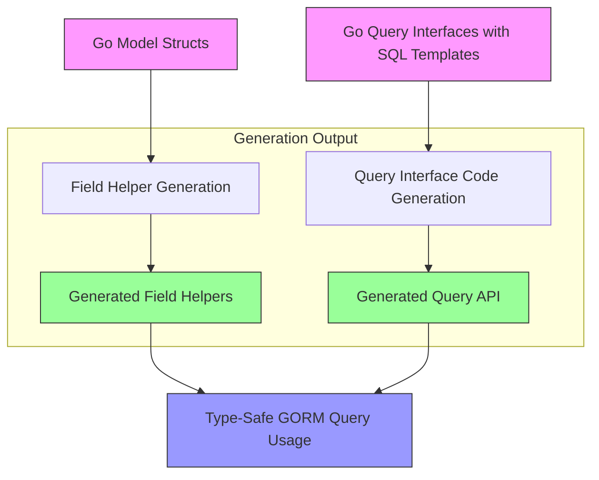

# Data Models: Structs and Query Interfaces

Explore how your Go structs become models and how query interfaces with SQL templates are interpreted in GORM CLI. This guide breaks down the conventions, tagging, and generation patterns that enable your Go data shapes to produce type-safe, expressive APIs for querying and manipulating your database.

---

## Introduction

GORM CLI transforms your Go structs and interfaces annotated with SQL templates into fluent and type-safe query APIs. Understanding the relationship between your source Go code and the generated artifacts is critical for writing effective and maintainable queries.

This page covers:

- How model structs map to generated field helpers
- How query interfaces define type-safe query methods with embedded SQL templates
- Conventions and tagging for controlling generation
- Best practices for defining data shapes that bridge your Go code and database schema

---

## Model Structs and Field Helpers

Your Go struct types — the data models — define the shape of your database tables and the fields within them. GORM CLI inspects these structs to generate rich, type-safe *field helpers* used for filters, updates, and association operations.

### How Structs Translate into Field Helpers

Each exported field in a struct generates a corresponding field helper in the output. These helpers are strongly typed and provide predicate and setter methods, enabling compile-time safety and fluent query building.

For example, consider the `User` model:

```go
// User model with various field types and associations
var User = struct {
  ID        field.Number[uint]
  Name      field.String
  Age       field.Number[int]
  Birthday  field.Time
  Score     field.Field[sql.NullInt64]
  Account   field.Struct[models.Account]
  Pets      field.Slice[models.Pet]
  Role      field.String
  IsAdult   field.Bool
}{
  ID:        field.Number[uint]{}.WithColumn("id"),
  Name:      field.String{}.WithColumn("name"),
  Age:       field.Number[int]{}.WithColumn("age"),
  Birthday:  field.Time{}.WithColumn("birthday"),
  Score:     field.Field[sql.NullInt64]{}.WithColumn("score"),
  Account:   field.Struct[models.Account]{}.WithName("Account"),
  Pets:      field.Slice[models.Pet]{}.WithName("Pets"),
  Role:      field.String{}.WithColumn("role"),
  IsAdult:   field.Bool{}.WithColumn("is_adult"),
}
```

#### Field Helpers Types

- **Basic Fields** (`field.String`, `field.Bool`, `field.Number[T]`, `field.Time`): primitives like numbers, strings, time, and booleans are wrapped with typed helpers providing methods like `.Eq()`, `.Lt()`, `.Incr()`, `.Set()`, etc.
- **Nullable fields** use `field.Field[T]` with special types like `sql.NullInt64` to handle nullable SQL columns.
- **Associations:**
  - `field.Struct[T]` represents a ‘has one’ or ‘belongs to’ relation
  - `field.Slice[T]` represents ‘has many’ or ‘many2many’ relations

#### Mapping Rules & Tags

- Field names default to corresponding database columns by converting Go field names (`CamelCase`) to `snake_case`, configurable via struct tags.
- Use `gen:"json"` and similar tags to map fields to customized field helpers (e.g., JSON helpers).
- Associations (has one, has many, belongs to, many2many) generate struct or slice helpers allowing CRUD and linking operations on related rows.

### Example: Relationships in Models

Related entities show up as field helpers with nested types:

```go
User.Account.Create(...)      // Has one Account, create & link
User.Pets.Delete()            // Has many Pets, delete children
User.Languages.CreateInBatch() // Many2many linking languages
```

### Benefits of Field Helpers

- Drift prevention: Typed fields catch mistakes before runtime
- Fluent querying: Composable predicates and setters
- Association management: Precise control over related data

---

## Query Interfaces & SQL Templates

Your Go interfaces define *what* data is queried or modified, and comments with embedded SQL templates define *how*.

### Structure of Query Interfaces

Query interfaces are generic over a model type `T` and declare methods with SQL templates in the associated comments:

```go
// Query interface example
type Query[T any] interface {
  // SELECT * FROM @@table WHERE id=@id
  GetByID(id int) (T, error)

  // UPDATE @@table
  // {{set}}
  //   {{if user.Name != ""}} name=@user.Name, {{end}}
  // {{end}}
  // WHERE id=@id
  UpdateUser(user User, id int) error
}
```

- `@@table` dynamically resolves to the model’s table name.
- `@param` links Go parameters to SQL parameters safely.
- DSL blocks like `{{where}}`, `{{set}}`, and `{{if}}` enable dynamic SQL generation based on input.

### Generated Query Interface Methods

The generator analyzes these SQL-annotated interfaces and produces concrete, type-safe implementations with:

- Automatic context parameter injection.
- Query builders fluent with GORM’s API.
- Safe binding of parameters preventing SQL injection.

### Example Usage

```go
// Fetch by ID
user, err := generated.Query[User](db).GetByID(ctx, 123)

// Update user info with conditional fields
err := generated.Query[User](db).UpdateUser(ctx, user, userID)
```

### SQL Template DSL Directives

| Directive   | Purpose                              | Example Usage                                  |
|-------------|------------------------------------|------------------------------------------------|
| `@@table`   | Resolves to the model's table name | `SELECT * FROM @@table WHERE id=@id`            |
| `@@column`  | Dynamic column substitution         | `SELECT * FROM @@table WHERE @@column=@value`   |
| `@param`    | Binds Go parameter to SQL param    | `WHERE name=@user.Name`                          |
| `{{where}}` | Conditional WHERE block             | `{{where}} age > 18 {{end}}`                     |
| `{{set}}`   | Conditional SET block (UPDATE)      | `{{set}} name=@name {{end}}`                     |
| `{{if}}`    | Conditional fragments               | `{{if user.Age > 0}} ... {{end}}`                |
| `{{for}}`   | Iterate collections in queries      | `{{for _, tag := range tags}} ... {{end}}`       |

---

## Conventions & Best Practices

### Defining Models

- Export all fields you want to generate helpers for.
- Use standard GORM tags (`gorm:"..."`) to define relationships and customize DB column names.
- Use `gen:"json"` or other `gen` tags to hook custom helpers.
- Define associations consistently to leverage generated association helpers.

### Designing Query Interfaces

- Write clear, SQL-annotated method comments.
- Use generics to bind query types to models.
- Utilize the full power of the template DSL for dynamic queries.
- Ensure methods return `(T, error)`, `(error)`, or `([]T, error)` as appropriate.

### Configuration Tips

- Use `genconfig.Config` for custom output paths, field name/type mappings, and interface/struct inclusion/exclusion.
- Leverage type mappings to handle special Go types like `sql.NullTime`.

---

## Troubleshooting Common Issues

<AccordionGroup title="Common Pitfalls and Their Solutions">
<Accordion title="Missing or Incorrect Field Helpers">
Ensure your struct fields are exported and properly tagged. Fields with non-exported names or types incompatible with the generator will be omitted.
</Accordion>
<Accordion title="Unrecognized Template Syntax">
Verify your SQL template directives are correctly formatted and supported. Misplaced or malformed blocks (e.g., unclosed `{{if}}`) will cause generation errors.
</Accordion>
<Accordion title="Incorrect Return Types in Query Interfaces">
Methods must return either `(T, error)`, `(error)`, or `([]T, error)`. Mismatches cause generator panics.
</Accordion>
<Accordion title="Unmapped Custom Field Types">
Use `FieldTypeMap` and `FieldNameMap` in `genconfig.Config` to map custom Go types or struct tags to appropriate field helpers.
</Accordion>
</AccordionGroup>

---

## Summary

By mastering the relationship between your Go structs and query interfaces, you unlock the full power of GORM CLI's generated APIs. Structs provide the foundation for strong field helpers, while query interfaces with embedded SQL templates empower you to define safe, flexible, and maintainable database access layers.

Refer to related guides on **Writing Type-Safe Queries from Interfaces**, **Using Field Helpers**, and **Managing Associations** for deeper workflow insights.

---

## Visualizing the Code Generation Flow



---

## Additional Examples

### Defining a Struct With Tags for Custom Behavior

```go
type User struct {
  ID      uint      `gorm:"primaryKey"`
  Profile string    `gen:"json"`
  Name    string
  Age     int
  Account Account
}
```

### Writing a Query Interface Method With Template

```go
type Query[T any] interface {
  // SELECT * FROM @@table WHERE id=@id
  GetByID(id int) (T, error)

  // UPDATE @@table
  // {{set}}
  //   {{if user.Name != ""}} name=@user.Name, {{end}}
  // {{end}}
  // WHERE id=@id
  UpdateUser(user User, id int) error
}
```

### Using Generated API

```go
user, err := generated.Query[User](db).GetByID(ctx, 42)
err = generated.Query[User](db).UpdateUser(ctx, user, 42)
```

---

For an end-to-end example and best practice workflows, see the [How Code Generation Works](/concepts/core-architecture/how-code-generation-works) and [Writing Type-Safe Queries from Interfaces](/guides/core-workflows/writing-type-safe-queries) guides.

---

## References

- [GORM CLI Overview](../overview/product-intro-value/product-purpose)
- [Writing Type-Safe Queries from Interfaces](/guides/core-workflows/writing-type-safe-queries)
- [Using Field Helpers for Filters & Updates](/guides/core-workflows/using-field-helpers)
- [Managing Associations with Helpers](/guides/core-workflows/association-operations)
- [Configuration & Customization](/concepts/scalability-integration/configuration-and-customization)
- [Template DSL for Dynamic Queries](/guides/advanced-usage-patterns/template-dsl)

---

For issues, consult the Troubleshooting section under Getting Started or reach out via the GORM community channels.
