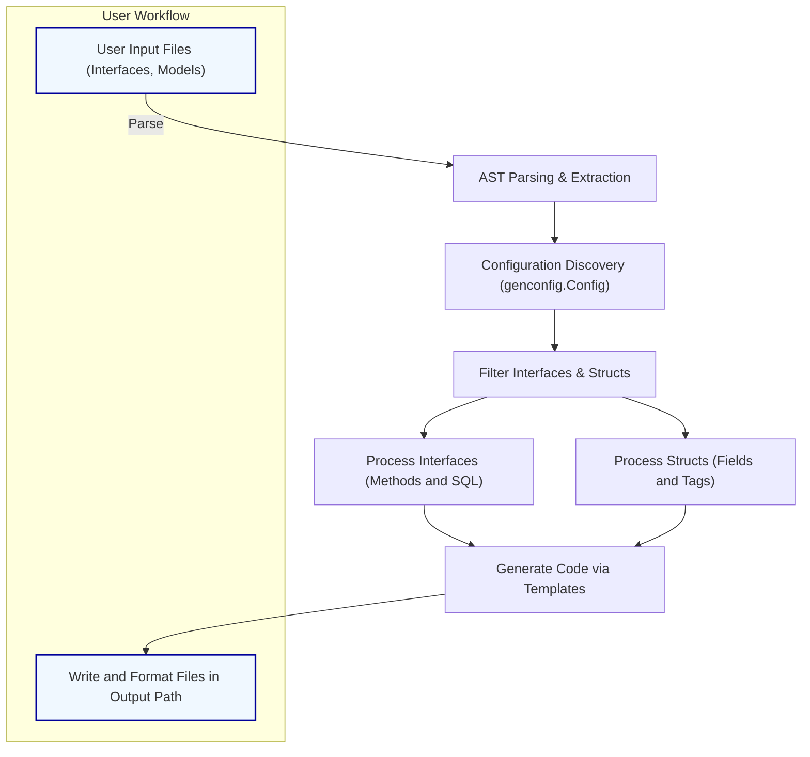

# Generation Workflow Overview

Understand how GORM CLI transforms your Go interfaces and models into type-safe query APIs and strongly typed field helpers through code generation. This guide walks you through the key steps, from providing your source code input to obtaining ready-to-use APIs for querying and manipulating your database with compile-time safety.

---

## Introduction

GORM CLI’s code generation centers around parsing your Go interface definitions annotated with SQL templates and your model structs to produce two intertwined outputs:

- **Type-safe query APIs**: Interface-driven implementations that wrap raw SQL template methods into fluent, safe method calls.
- **Model-driven field helpers**: Typed field helpers for model structs that enable concise filter, update, and association expressions.

This workflow is fully automatic, robust, and customizable via package-level configurations. GORM CLI scans your input files, analyzes their Abstract Syntax Tree (AST), applies config-driven filters and mappings, and generates clean, ready-to-import code that integrates seamlessly with GORM.

---

## Overview of the Generation Flow

The generation process unfolds in four primary stages:

### 1. Input Processing — Scanning and Parsing

- **Input**: You specify either a Go source file or directory containing your interfaces and model structs.
- **Parsing**: The generator recursively walks the filesystem (if a directory), parsing each Go file.
- **AST Extraction**: Using Go’s `go/parser` package, it obtains a detailed AST representing packages, imports, interfaces, and structs.
- **File Metadata**: Each file is stored with its relative path, package information, and collected imports for later reference.

<Tip>
The generator skips already generated files and preserves your directory structure in the output path.
</Tip>

### 2. Configuration Discovery and Filtering

- **Config Detection**: Within each package, the generator looks for `genconfig.Config` literals declared as package-level variables.
- **Config Parsing**: It reads configuration options such as output path overrides, field type and name mappings, interface/struct inclusion or exclusion patterns, and file-level flags.
- **Applying Filters**: Based on configs, the generator filters which interfaces and structs to process, honoring whitelists and blacklists. This allows fine-grained control over generation scope.

<Note>
Configs are applied hierarchically and combined, ensuring overlapping config specifications merge logically.
</Note>

### 3. Interface and Struct Metadata Extraction

- **Interface Metadata**:
  - Extract interface names, methods, and their Go parameters and return types.
  - Parse SQL templates embedded in method comments (raw SQL or DSL), capturing placeholders and conditional blocks.
  - Validate method signatures, enforcing expected return value rules for finished (return data) and chained (return interface) methods.

- **Struct Metadata**:
  - Extract struct names and their exported fields.
  - Parse Go types and struct tags to identify DB column names and type mappings.
  - Handle embedded structs by recursively flattening fields.
  - Use configuration mappings to adjust or customize generated helper types for specific fields.

<Info>
Method parsing enforces safety by verifying that SQL-template methods return appropriate values, e.g., error as the last return.
</Info>

### 4. Code Generation and Output

- **Template Rendering**: Using Go’s `text/template`, the generator composes the final source with:
  - Interface wrappers implementing type-safe query methods.
  - Struct field helpers with strongly typed predicates, setters, and association helpers.
- **Import Management**: Merges file imports and config-defined helper packages for clean imports.
- **Filtering by Config**: Respects per-file level config (e.g., `FileLevel`) to generate code at appropriate granularity.
- **Output Writing**: Writes the generated Go code to the configured output directory (default `./g`), replicating the input directory structure.
- **Formatting**: Runs Go `imports` tool to format and tidy the imports automatically.

<Check>
Successful generation prints progress logs for each file and confirms placement in the output directory.
</Check>

---

## User Workflow: From Interface to Generated Code

Follow these key steps when working with GORM CLI:

<Steps>
<Step title="Step 1: Define Your Interfaces and Models">
Create Go interfaces annotated with SQL templates as method comments and define your model structs with appropriate tags.
</Step>
<Step title="Step 2: Optionally Add Configuration">
Declare `genconfig.Config` literals in the same package to customize output paths, filtering, or field helper mappings.
</Step>
<Step title="Step 3: Run the Generator">
Use the CLI command `gorm gen -i ./path/to/interfaces -o ./path/to/output` to start code generation.
</Step>
<Step title="Step 4: Import and Use Generated Code">
Your generated code will provide fluent, type-safe query interfaces and model field helpers ready to use with GORM.
</Step>
</Steps>

---

## Code Generation Internals (User-Visible Aspects)

To provide clarity on how GORM CLI transforms inputs, here are important concepts in the generation pipeline:

### Interface Processing

- Methods are parsed for their parameters and return types.
- SQL templates are extracted and interpreted.
- Methods with raw SQL produce direct query executions returning results or errors.
- Methods without raw SQL but with SQL DSL generate chainable query builders.

### Struct Processing

- Exported fields become typed field helpers with predicates like `.Eq()`, `.Like()`, `.Between()`.
- Embedded structs are expanded inline to expose all relevant fields.
- Associations generate specialized helpers for related CRUD operations.
- Generated fields use configured mappings for custom types (e.g., JSON, Time).

### Output Structure

- For each interface in the input, there is an interface and a struct implementation with matching methods.
- For each struct, a global variable represents the field helper container object.

---

## Troubleshooting Common Generation Issues

- **No files generated**: Check your `IncludeInterfaces` and `IncludeStructs` filters. An empty whitelist means no generation.
- **Unexpected method signature errors**: Ensure method return values adhere to expected error conventions.
- **Incorrect output path**: Verify or set `OutPath` in `genconfig.Config` for your package.
- **Model fields missing helpers**: Confirm fields are exported and types recognized or mapped.
- **Confusing import errors**: Generator merges imports from source files and config; check for naming conflicts and missing imports.

<Tip>
Run the generator with verbose output and double-check the folder structure and input root.
</Tip>

---

## Summary Mermaid Diagram

This diagram illustrates the logical flow from input source through parsing, config application, processing, and generation:

---

## Practical Tips

- Keep interfaces and models in clear package structures to simplify config and generation.
- Use `IncludeInterfaces` and `IncludeStructs` with shell-style patterns for selective generation.
- Leverage field type and name map in configuration for custom field helpers like JSON or specialized types.
- Make sure SQL template annotations in interface comments are correctly formatted and pass `go vet` style syntax.
- Always use the context-aware method signatures; the generator auto-injects `context.Context` if missing.

---

For in-depth examples of defining interfaces, using generated APIs, managing associations, and advanced templating, refer to these [related guides](../../../guides/core-workflows/using-generated-apis), [configuration](../../../overview/features-and-workflows/configuring-generation), and [template DSL](../../../guides/advanced-patterns/template-based-sql).

---

## See Also

- [Core Concepts & Terminology](/overview/architecture-and-core-concepts/core-concepts-terminology)
- [Using Generated APIs Guide](/guides/core-workflows/using-generated-apis)
- [Configuration & Extensibility](/overview/features-and-workflows/configuring-generation)
- [Template-Based SQL Generation](/guides/advanced-patterns/template-based-sql)

---

## References

- Source code insight: [internal/gen/generator.go](https://github.com/go-gorm/cli/blob/main/internal/gen/generator.go)
- Generator CLI command source: [internal/gen/gen.go](https://github.com/go-gorm/cli/blob/main/internal/gen/gen.go)
- Generator templates: [internal/gen/template.go](https://github.com/go-gorm/cli/blob/main/internal/gen/template.go)

---

This overview empowers you to understand, customize, and troubleshoot how GORM CLI transforms your Go code into expressive, safe queries and helpers for your database layers.