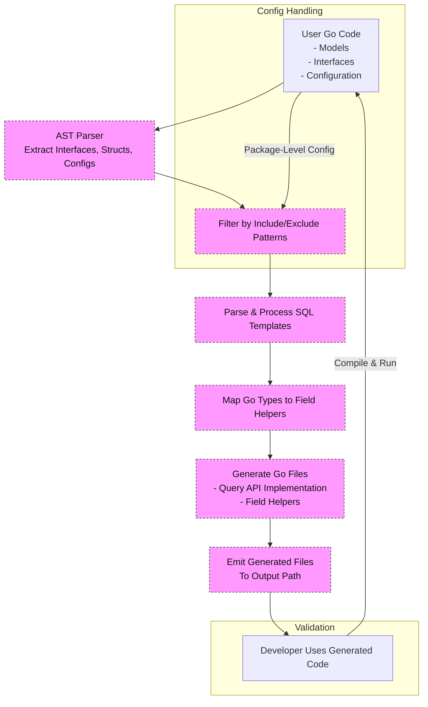

# How GORM CLI Code Generation Works

GORM CLI transforms your user-defined Go query interfaces and model struct definitions into robust, type-safe database query APIs and field helpers. This page guides you through the high-level pipeline—from parsing source code and interpreting configuration, through SQL template processing and type mapping, to generating ready-to-use Go code that integrates seamlessly with GORM.

---

## Overview of the Generation Pipeline

The GORM CLI code generation process is a well-orchestrated sequence designed to convert raw Go source code with embedded SQL annotations into strongly typed query methods and field helper constructs. Understanding this pipeline empowers users to customize configurations, troubleshoot issues, and leverage the tool effectively.

### Step 1: Source Parsing and Metadata Extraction

- **Input**: Go source files containing interface definitions with SQL template comments and model structs.
- The generator parses Abstract Syntax Trees (AST) of the input files to discover:
  - Interfaces and their methods, including raw SQL templates in comments.
  - Structs and their fields, along with struct tags (especially `gen` tags) and imported types.
  - Package-level configuration literals of type `genconfig.Config` if declared.

### Step 2: Configuration Collection and Application

- The generator collects all applicable configurations declared in the scanned packages.
- Configurations include:
  - Output path overrides
  - Custom field type mappings (Go types to field helpers)
  - Field name mappings (mapping struct tags to helpers)
  - Interface/struct inclusion and exclusion filters
  - File-level application flags

### Step 3: Filtering Interfaces and Structs

- Based on include/exclude lists provided by the configuration, files undergo filtering.
- This ensures only relevant interfaces and structs are selected for code generation, preventing unnecessary output.

### Step 4: SQL Template Processing

- SQL directives embedded in interface method comments are interpreted using GORM CLI’s SQL template DSL including:
  - Placeholders like `@@table`, `@@column`, and `@param`
  - Conditional `{{if}}`, iterative `{{for}}`, and dynamic `{{where}}` or `{{set}}` blocks
- The SQL templates are converted to Go code that emits properly parameterized and type-checked SQL queries.

### Step 5: Field Type Mapping and Helper Resolution

- The generator maps struct fields to corresponding field helper types (e.g., Int, String, Time, JSON) based on:
  - Explicit configuration in `FieldTypeMap` and `FieldNameMap`
  - Default built-in mappings for primitives and common types
  - Detection of relation types for generating association helpers
- This mapping creates strongly typed field helpers that offer fluent predicates and update expressions.

### Step 6: Code Generation from Templates

- Using the extracted metadata and configurations, the generator populates predefined Go templates.
- It generates:
  - Query interface implementations as Go structs embedding GORM interfaces plus methods with concrete SQL logic
  - Field helper variables representing model fields with typed predicates and setters
- The generator maintains clear package imports and applies formatting to ensure clean, idiomatic code.

### Step 7: File Emission and Output Structure

- Generated Go files are emitted respecting the configured output directory structure.
- If multiple configuration declarations exist, layered application determines output dirs.
- The generator skips files without any applicable interfaces or structs to avoid clutter.

### Step 8: Final Developer Experience

- The generated code provides fluent, type-safe query APIs and model-based field helpers.
- Developers can call generated query methods and compose predicates and associations intuitively with compile-time validation.
- The integration layer with GORM (`gorm.G[T](db)`) ensures seamless use within existing data access layers.

---

## User Flow and Value

Imagine you are building a Go project with GORM and want safer, clearer database access:

1. **Define your models as Go structs**, optionally tagging fields for custom helpers.
2. **Write interfaces with method comments containing SQL templates** representing your desired queries.
3. **Place a package-level `genconfig.Config` if needed** to customize mappings or generation options.
4. **Run the generator CLI with `-i` input and `-o` output flags**, pointing to your code directory.
5. **Receive generated Go files** with prebuilt, tested, and typed query methods alongside field helpers.
6. **Use the generated APIs in your application code** to safely build and execute queries.

This workflow replaces error-prone handwritten SQL strings and boilerplate with automated, maintainable, and type-enforced code.

---

## Practical Tips and Best Practices

- **Use `genconfig.Config` to tailor generation:**
  - Override the output location to keep generated code separate.
  - Map custom SQL types or special field tags to your own helpers.
  - Include or exclude interfaces or structs by name patterns to focus generation.
- **Embed clear and complete SQL templates** in interface methods for precise query behavior.
- **Tag model fields with `gen` tags** to enable special field helper mapping (e.g., JSON columns).
- **Keep models and query interfaces in coherent packages** to ensure easy scanning and configuration.
- **Verify generation results by compiling and running examples early** to catch configuration or template errors promptly.

---

## Troubleshooting Common Scenarios

- **No output files generated:** Ensure your interfaces or structs match include lists or are not filtered out.
- **Incorrect field helper types:** Double-check `FieldTypeMap` and `FieldNameMap` in your config.
- **SQL template errors:** Verify syntax in comments, especially template directives and placeholders.
- **Files skipped unexpectedly:** Confirm file-level vs package-level config usage.

Refer to [Troubleshooting Common Issues](/getting-started/troubleshooting-validation/troubleshooting) for detailed guidance.

---

## Diagram: High-Level Code Generation Workflow

---

## Next Steps

- Explore [Query Interfaces and SQL Templates](/concepts/core-architecture/query-interface-concept) to master writing SQL in Go interface methods.
- Learn about [Field Helpers and Associations](/concepts/core-architecture/field-helpers-and-associations) to effectively interact with models.
- Review [Customizing Code Generation](/guides/advanced-usage/customizing-generation) to tailor the process further.
- Begin with [Preparing Your Project](/getting-started/first-code-gen/project-setup) and [Writing Models & Interfaces](/getting-started/first-code-gen/writing-models-interfaces) to practice.

---

For detailed examples and source code, see the [GORM CLI GitHub Repository](https://github.com/go-gorm/cli) and always check the latest docs for updates.

---

<Check>
Ensure your input Go files contain clearly defined interfaces with SQL templates and struct models, optionally configured with `genconfig.Config` to harness GORM CLI’s full potential.
</Check>

---

## References

- [Package-level genconfig.Config Declaration](genconfig/config.go)
- [GORM CLI README with Usage Examples](README.md)
- [Examples of Inclusion/Exclusion Configurations](examples/filters/whitelist/config.go)
- [Generator Core Implementation](internal/gen/generator.go)

---

##### Document generated to clarify the end-to-end GORM CLI code generation pipeline, enabling you to harness its power to build safe and efficient Go database APIs.
