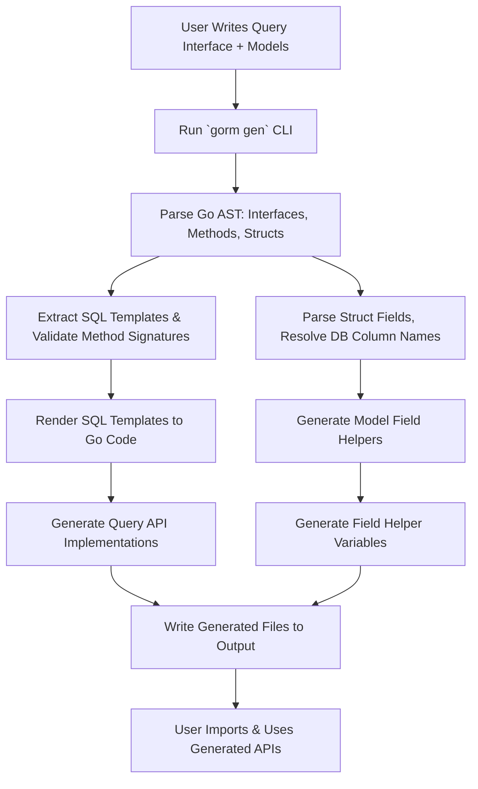

# How Code Generation Works

Discover the inner workings of GORM CLI's code generation process and understand how it transforms your Go interfaces and model structs into powerful, type-safe APIs. This page walks you through the critical concepts of interface parsing, model struct processing, and SQL template rendering that combine to produce fluent, compile-time safe database interactions. By mastering these concepts, you'll be empowered to write flexible, reliable code without sacrificing expressiveness or safety.

---

## 1. Foundations: From Go Interfaces and Structs to Generated Code

At its core, GORM CLI generates two complementary code artifacts:

- **Type-safe Query APIs** derived from Go interfaces annotated with SQL templates.
- **Model-driven Field Helpers** derived from user model structs representing database tables.

This dual generation enables expressive queries and updates with full compile-time validation and discoverability.

### What Happens When You Run `gorm gen`?

When you invoke the GORM CLI code generation (`gorm gen`), the tool performs these actions:

1. **File or Directory Processing**: Accepts a file or directory containing your Go source code with interfaces and structs.
2. **AST Parsing**: Parses Go Abstract Syntax Trees (AST) to find interfaces, methods, structs, and relevant doc comments.
3. **Configuration Load**: Looks for optional package-level configs (`genconfig.Config`) to customize output paths and field mappings.
4. **Interface Extraction**: Extracts query interfaces and their methods, parsing SQL templates and method signatures.
5. **Struct Introspection**: Analyzes struct definitions and embedded fields, extracting fields, types, and DB column names.
6. **Template Rendering**: Applies internal Go text templates to generate Go code implementing the query interfaces and field helpers.
7. **Output Writing & Formatting**: Writes generated files to the designated output path, formatting with Go imports and `goimports`.

<Check>
The generator preserves your package directory structure, respects inclusion/exclusion filters from config, and skips already generated code files.
</Check>

---

## 2. Interfaces and Method Parsing: Creating Type-Safe Query APIs

### Interface-Driven Queries

You define query behavior by writing **Go interfaces** with methods that include SQL templates in their doc comments:

```go
// Query[T any] interface with SQL template methods
 type Query[T any] interface {
   // SELECT * FROM @@table WHERE id=@id
   GetByID(id int) (T, error)

   // UPDATE @@table
   // {{set}}
   //   {{if user.Name != ""}} name=@user.Name, {{end}}
   // {{end}}
   // WHERE id=@id
   UpdateInfo(user User, id int) error
 }
```

### Parsing Method Signatures and SQL

- The **method name** and **parameters** are parsed for generating function signatures.
- Embedded SQL templates in the doc comments are extracted, supporting directives like `@@table` (dynamic table names), `@param` (parameter binding), and conditional blocks (`{{if}}`, `{{where}}`, `{{set}}`).
- Return values are validated to ensure either:
  - Methods returning data have result structs and error.
  - Methods finishing an operation return an error only.

### Generated Query API

The code generator produces:
- Concrete structs implementing the interfaces.
- Methods with properly injected `context.Context` parameters.
- Embedded SQL statement generation, parameter binding, and query execution.

Example generated method body snippet:

```go
func (e _QueryImpl[T]) GetByID(ctx context.Context, id int) (T, error) {
  // SQL: SELECT * FROM @@table WHERE id=@id
  return e.Exec(ctx, sb.String(), params...)
}
```

<Note>
If your method lacks a `context.Context` parameter, the generator automatically injects it to support modern Go concurrency best practices.
</Note>

---

## 3. Struct Parsing for Model-Driven Field Helpers

### Understanding Model Structs

Your model structs represent database tables, and GORM CLI parses their exported fields, tags, and embedded structs to:
- Generate strongly typed field helpers for predicates, setters, and association handling.
- Extract the exact database column names using GORM's naming strategy and `gorm:"column:"` tags.
- Identify associations such as has-one, has-many, belongs-to, and many2many relations.

Example struct:

```go
 type User struct {
   ID        uint
   Name      string
   Email     string
   Age       int
   CreatedAt time.Time
 }
```

### Handling Embedded and Anonymous Fields

Embedded structs and anonymous fields are fully unpacked so their fields become part of the parent struct's generated helpers.

### Field Type Mapping and Customization

- Basic Go types (e.g., string, int, time.Time) are mapped to specialized field helpers like `field.String`, `field.Number[int]`, or `field.Time`.
- Custom types implementing database interfaces such as `Scanner` and `Valuer` are supported.
- You can override default mapping by declaring a `genconfig.Config` with `FieldTypeMap` or `FieldNameMap`.

### Example Generated Field Helper Block

```go
var User = struct {
  ID   field.Number[uint]
  Name field.String
  Age  field.Number[int]
}{
  ID:   field.Number[uint]{}.WithColumn("id"),
  Name: field.String{}.WithColumn("name"),
  Age:  field.Number[int]{}.WithColumn("age"),
}
```

---

## 4. Template Expansion: Bringing SQL and Go Together

### Template DSL

GORM CLI supports a rich SQL templating DSL within method comments, enabling dynamic and flexible queries while preserving type safety. The DSL supports:

| Directive    | Role/Use Case                                    |
|--------------|-------------------------------------------------|
| `@@table`    | Resolves to the generated table name            |
| `@@column`   | Binds dynamic column name                        |
| `@param`     | Binds Go method params safely to SQL values     |
| `{{where}}`  | Conditional `WHERE` interpolation                |
| `{{set}}`    | Conditional `SET` clause for `UPDATE`            |
| `{{if}}`     | Injects conditionally included SQL snippets     |
| `{{for}}`    | Iterates over collections to build predicates   |

### SQL Template Rendering

During code generation, the SQL templates are parsed and converted into Go code that builds SQL strings safely, binding parameters to prevent injection risks.

### Contextual Parameter Binding

Method parameters correspond to place-holders in the SQL templates and generate the appropriate call arguments to be passed down to GORM's query builders.

<Warning>
Incorrect template syntax or mismatched parameters will cause generation failures. Pay close attention to closing `{{end}}` statements and parameter names.
</Warning>

---

## 5. Workflow Summary: From Source to Generated API



---

## 6. Best Practices and Tips for Successful Code Generation

- **Keep Interface Methods Focused:** Each interface method should represent a discrete query or modification operation, with clear SQL templates.
- **Define Models Clearly:** Exported fields should align well with database columns and GORM conventions.
- **Leverage Config for Custom Types:** Use `genconfig.Config` for mapping special Go types to custom field helpers.
- **Validate SQL Templates:** Ensure all template directives are syntactically correct; unclosed statements are a common pitfall.
- **Context Injection:** You do not need to manually add `context.Context` to interface methods as it's handled automatically.
- **Preserve Directory Structure:** Organize source files carefully to leverage include/exclude filters and config scoping.
- **Check Output:** Generated files have a header indicating they are auto-generated; do not edit them manually.

---

## 7. Troubleshooting Common Issues

<Accordion title="SQL Template Parsing Errors">
If the generator fails with parsing errors related to SQL templates:
- Double-check all `{{if}}`, `{{else}}`, and `{{end}}` directives.
- Ensure all parameters referenced in templates match method parameters exactly.
- Confirm that dynamic directives like `@@table` and `@@column` are used appropriately.
</Accordion>
<Accordion title="Missing or Incorrect Return Types">
- Method signatures must return an error or (result, error).
- Single return value methods must return `error` only.
- Dual return methods must have the last return as `error`.
</Accordion>
<Accordion title="Field Type Mapping Issues">
- Unsupported types without proper mapping might generate incorrect helpers.
- Use `genconfig.Config.FieldTypeMap` to explicitly map custom types.
</Accordion>
<Accordion title="Output Goes to Unexpected Location">
- Verify if a `genconfig.Config` overrides the `OutPath`.
- Confirm input paths and relative paths are set correctly when running the CLI.
</Accordion>

---

## 8. Further Exploration

- **Understand Data Models:** Use the [Data Models: Structs and Query Interfaces](../../concepts/core-architecture/data-models-structs-and-interfaces) page to dive deeper.
- **Field Helpers:** Explore model-driven field helper generation in [Field Helpers: Type-Safe Predicates & Setters](../../concepts/core-architecture/field-helper-generation).
- **Writing Queries with Templates:** Gain practical query templating skills with [Writing Type-Safe Queries from Interfaces](../../guides/core-workflows/writing-type-safe-queries).
- **Customize Generation:** Learn advanced customization via [Customizing Generation via Config](../../guides/advanced-usage-patterns/customizing-generation-config).

---

By grasping how GORM CLI bridges your Go code and SQL through structured parsing and templating, you unlock a powerful workflow that elevates your database operations with safety, clarity, and flexibility.