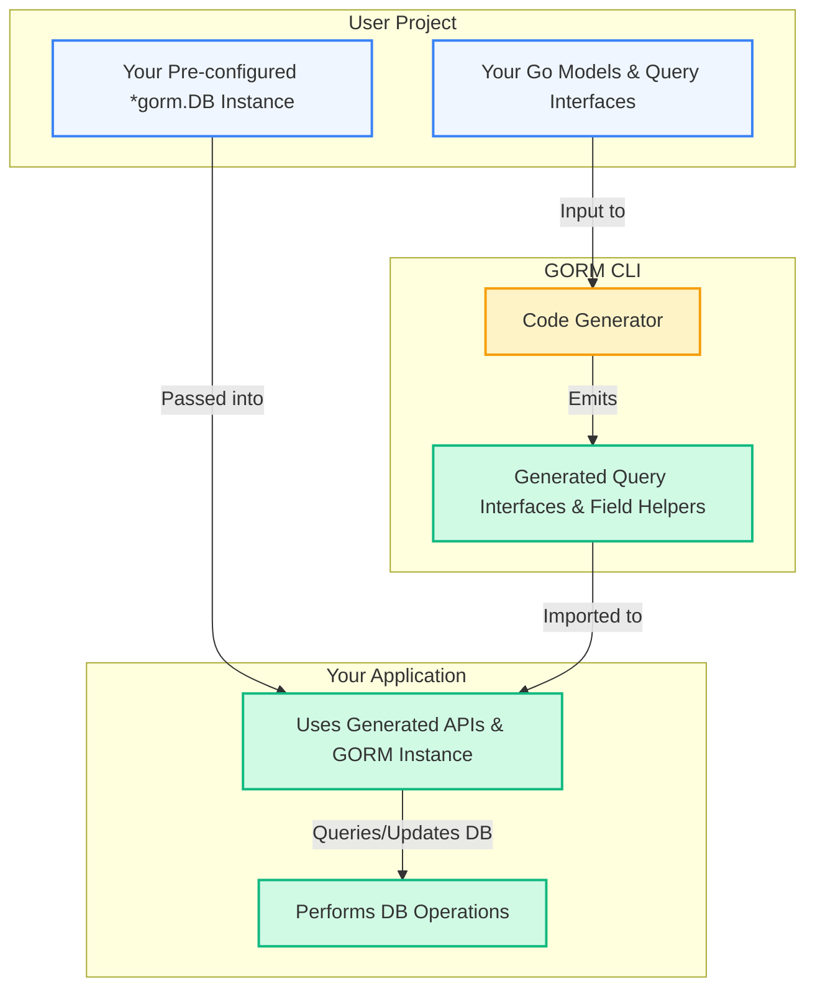

# Integration Patterns with GORM

GORM CLI is designed to seamlessly fit into your existing Go projects using the [GORM ORM](https://gorm.io). This integration guide unwraps best-practice patterns for working with the generated type-safe query APIs and model-driven field helpers alongside native GORM instances and your model namespaces. By understanding these patterns, you will unlock smooth developer experiences that require minimal friction, making your database interactions both safer and more fluent.

---

## Why Integration Matters

Generated code is only useful if it plays well with your everyday tooling. GORM CLI’s output is fully idiomatic Go code built on top of standard GORM builders and models. This means:

- **Native compatibility with `*gorm.DB` instances**: Use your own pre-configured GORM instances (with hooks, plugins, or custom settings) as the starting point.
- **Model namespace alignment**: Generated field helpers and query interfaces are structured to integrate naturally with your model packages.
- **Minimal cognitive overhead**: No need to learn new APIs outside of what GORM and your domain model already provide.


---

## Core Integration Patterns

### 1. Starting with Your GORM `*gorm.DB`

The generated query APIs and field helpers accept your existing GORM DB instances as inputs. This lets you:

- Use transaction contexts, prepared statements, logging, and other GORM features transparently.
- Compose generated helper predicates and setters with raw GORM `Where()`, `Set()`, or `Find()` calls.

**Example:** Using a pre-configured GORM instance with generated APIs

```go
// Assume db is a *gorm.DB with your own configuration
userQuery := generated.Query[User](db)

// Fetch user by ID using generated interface
user, err := userQuery.GetByID(ctx, 123)

// Compose a typed WHERE condition with generated field helper
users, err := gorm.G[User](db).
  Where(generated.User.Age.Gt(18)).
  Find(ctx)
```

---

### 2. Leveraging Generated Field Helpers Alongside Your Models

Generated code provides field helpers under the `generated` namespace (or your chosen output package), aligned by model type. This ensures:

- Field helpers map directly to your model fields, making queries and updates fluent and compile-time safe.
- Association helpers reflect your relational setup, supporting operations such as create, update, unlink, or delete with type safety.

**Example:** Updating a record using generated setters

```go
err := gorm.G[User](db).
  Where(generated.User.ID.Eq(123)).
  Set(
    generated.User.Name.Set("alice"),
    generated.User.Age.Set(30),
  ).
  Update(ctx)
```

---

### 3. Combining Template-Based Query Interfaces with GORM Operations

The generated query interfaces encapsulate SQL template-defined logic within Go methods, supporting:

- Parameter binding with type safety
- Dynamic SQL fragments within templates
- Seamless composition with standard GORM queries and chains

You can invoke these methods directly, passing your `*gorm.DB` instance for context-aware, fluent querying.

**Example:** Using a generated query interface method

```go
userQuery := generated.Query[User](db)

user, err := userQuery.FilterByNameAndAge(ctx, "jinzhu", 25)

// Equivalent raw GORM usage
users, err := gorm.G[User](db).
  Where(generated.User.Name.Eq("jinzhu")).
  Where(generated.User.Age.Eq(25)).
  Find(ctx)
```

---

### 4. Handling Associations Through Generated Helpers

Association operations integrate naturally with your GORM transactions and queries:

- Use association helpers on generated model types for create, update, unlink, delete, and batch operations.
- Combine the helpers with the parent model’s `Set()` and `Where()` chaining for atomic updates.

**Example:** Creating a user with associated pets

```go
gorm.G[User](db).
  Set(
    generated.User.Name.Set("alice"),
    generated.User.Pets.Create(generated.Pet.Name.Set("fido")),
  ).
  Create(ctx)
```

---

## Best Practices for Smooth Integration

- **Reuse your configured `*gorm.DB` instance:** Keep your connection, logging, and plugin settings consistent by passing the same DB object.
- **Namespace your imports clearly:** To avoid conflicts, import generated code under a distinct alias, e.g., `generated`.
- **Prefer generated predicates and setters:** They ensure SQL safety, type correctness, and easy maintenance.
- **Mind association semantics:** Understand unlink vs. delete operations, as they affect foreign keys or join tables differently.
- **Use template query interfaces for specialized logic:** Write raw SQL templates in interfaces when a fluent builder is insufficient.

---

## Troubleshooting Common Integration Issues

<AccordionGroup title="Common Problems and Solutions">
<Accordion title="Issue: Generated helpers don't compile with my GORM version">
Ensure your project uses a supported GORM version compatible with GORM CLI generation. Mismatched GORM versions can cause method or type incompatibilities.
</Accordion>

<Accordion title="Issue: Association helpers not found on generated models">
Confirm associations are correctly defined in your model structs (e.g., `hasMany`, `belongsTo`) and that the generator processed those files. Also, check your `genconfig.Config` does not exclude those structs.
</Accordion>

<Accordion title="Issue: Template query interfaces not reflecting recent code changes">
Run the generator again after model or interface updates. Check that interface patterns in `genconfig.Config` include the relevant interfaces.
</Accordion>
</AccordionGroup>

---

## Integration Flow Diagram



---

## Summary

This guide illustrates how GORM CLI’s generated code fits within your existing GORM-based Go applications. By passing your configured GORM DB instances to generated query APIs and using model-aligned field helpers, you establish a fluent, type-safe, and idiomatic workflow. Whether performing simple queries, complex dynamic template-driven operations, or managing associations, GORM CLI integration patterns empower you to write robust, maintainable code effortlessly.


---

## Additional Resources

- [Using Generated APIs in Real Projects](https://your-docs-domain/guides/core-workflows/using-generated-apis) — Practical usage examples and walkthroughs.
- [Model-driven Field Helpers for Queries and Updates](https://your-docs-domain/guides/advanced-features-patterns/working-with-field-helpers) — Deep dive into field helpers.
- [Writing Template-based Queries](https://your-docs-domain/guides/core-workflows/template-queries-quickstart) — Learn the SQL template DSL.
- [Basic Generator Configuration](https://your-docs-domain/getting-started/project-initialization/basic-configuration) — Customize generation outputs.


<Check>
Ensure you have run the generator using your preferred config, imported the generated code properly, and are passing your active `*gorm.DB` instances for seamless integration.
</Check>
