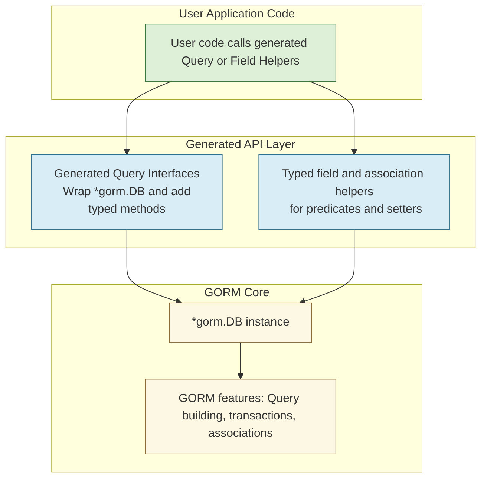

# Integration with GORM

Discover how the generated APIs from GORM CLI seamlessly integrate with GORM's powerful ORM capabilities. This page guides you through how generated query interfaces, field helpers, and association management align precisely with GORM’s core abstractions for an intuitive and type-safe data access experience.

---

## Overview

GORM CLI builds on top of GORM by generating type-safe query interfaces and model-driven field helpers that directly wrap and extend *gorm.DB instances. This integration ensures that developers can operate fluently within GORM’s ecosystem, leveraging its features such as query building, association management, and transaction handling without losing type safety or runtime expressiveness.

You use the generated code as natural extensions of GORM, benefiting from compile-time checks, discoverable APIs, and idiomatic Go usage.

---

## How Generated APIs Interface with GORM

At the heart of this integration is the way generated query interfaces and helpers encapsulate `*gorm.DB` instances, acting as thin, type-safe wrappers that maintain full compatibility with GORM’s chaining and querying mechanisms.

- **Query Interfaces:** Automatically generated from user-defined Go interfaces with SQL templates, these interfaces embed GORM’s generic interface `gorm.Interface[T]`. This allows your generated query methods to call directly into GORM query builders while enriching them with strongly typed, domain-specific methods.
- **Field Helpers:** Derived from the model structs, these helpers provide typed predicates and setters that you use inside `Where()`, `Set()`, and association operations, tightly aligned with GORM’s column and association semantics.

This design lets you switch effortlessly between declarative, template-driven queries and GORM’s fluent builder style, blending the best of both worlds.

---

## Key Integration Points

### 1. Wrapping *gorm.DB

Generated query implementations accept a `*gorm.DB` pointer and return typed API interfaces. Internally, they wrap this `*gorm.DB`, enabling all GORM chainable functions (`Where`, `Find`, `Create`, `Update`, etc.) to work seamlessly with the generated typed methods.

```go
// Generated Query interface implementation wraps GORM's *gorm.DB
func Query[T any](db *gorm.DB, opts ...clause.Expression) QueryInterface[T] {
  return QueryImpl[T]{Interface: gorm.G[T](db, opts...) }
}
```

This pattern means you can pass your standard GORM DB instances directly to generated methods without extra casting or boilerplate.

### 2. Model-driven Field Helpers

The generated field helpers map model fields and associations to strongly typed predicate and setter operators.

Example predicates and setters:

```go
// Using generated field helpers in queries
result, err := gorm.G[User](db).
  Where(generated.User.Name.Eq("alice"),
        generated.User.Age.Gt(18)).
  Find(ctx)
```

These helpers return GORM-compatible expressions that integrate flawlessly with the fluent chain.

### 3. Fluent Association Management

Associations defined in models become first-class field helpers for creating, updating, unlinking, or deleting related rows via generated helpers.

Operations like:

- `Create()` / `CreateInBatch()` to insert associated records
- `Update()` to apply changes on associations
- `Unlink()` to clear foreign keys or join table links
- `Delete()` to remove associated records

All integrate with GORM’s association handling semantics while ensuring type safety.

Example:

```go
// Create a user and associate pets using generated helpers
err := gorm.G[User](db).
  Set(
    generated.User.Name.Set("bob"),
    generated.User.Pets.Create(generated.Pet.Name.Set("fido")),
  ).
  Create(ctx)
```

### 4. Support for Transactions and Context

All generated methods accept a `context.Context` parameter, respecting Go best practices for cancellation and deadlines. The underlying `*gorm.DB` can use transactions or scoped contexts consistently.

You can start transactions with GORM normally and pass the transactional `*gorm.DB` to generated APIs.

```go
// Example transaction with generated Query
err := db.Transaction(func(tx *gorm.DB) error {
  q := generated.Query[User](tx)
  user, err := q.GetByID(ctx, 123)
  // ... process user ...
  return err
})
```

---

## Practical Example Walkthrough

Consider the following workflow:

1. **Setup your GORM DB instance:**

```go
db, err := gorm.Open(sqlite.Open("test.db"), &gorm.Config{})
// handle err
```

2. **Generate Query Interfaces and Field Helpers:** (run CLI)

```bash
gorm gen -i ./examples -o ./generated
```

3. **Use Generated Query API with GORM:**

```go
query := generated.Query[models.User](db)
user, err := query.GetByID(ctx, 42)
if err != nil {
    // handle error
}

// Update user info
err = query.UpdateInfo(ctx, models.User{Name: "alice", Age: 30}, int(user.ID))
```

4. **Use Field Helpers with Fluent GORM:**

```go
users, err := gorm.G[models.User](db).
  Where(generated.User.Role.Eq("admin"), generated.User.IsAdult.Eq(true)).
  Find(ctx)
```

5. **Manage Associations:**

```go
// Link languages to a user (many to many)
err := gorm.G[models.User](db).
  Where(generated.User.ID.Eq(user.ID)).
  Set(generated.User.Languages.CreateInBatch([]models.Language{{Code: "EN"}, {Code: "FR"}})).
  Update(ctx)
```

---

## Advanced Tips and Best Practices

- **Context Usage:** Always pass a `context.Context` from your application to harness cancellation and tracing features.
- **Transaction Safety:** Wrap sequences of generated calls within GORM transactions to ensure atomicity.
- **Leverage Field Helpers for Conditionals:** Use generated predicates to build complex, expressive filters while maintaining type safety.
- **Batch Operations:** Favor `CreateInBatch()` and similar batch helpers for efficient insertions.
- **Unlink vs Delete:** Understand that `Unlink()` clears relationships without deleting data, while `Delete()` removes associated rows or join table entries — choose appropriately.
- **Debugging:** Enable GORM’s debug mode with generated queries for SQL inspection.

---

## Troubleshooting Common Integration Issues

<AccordionGroup title="Common Problems and Solutions">
<Accordion title="Generated APIs Not Recognizing *gorm.DB">
Ensure you pass a valid `*gorm.DB` instance to generated APIs. If you wrap or modify the DB, retain the original type. Avoid passing nil or incompatible types.
</Accordion>
<Accordion title="Type Mismatch Errors When Using Field Helpers">
Verify that your models correspond exactly to those used during generation. Regenerate APIs after model changes.
</Accordion>
<Accordion title="Association Operations Not Reflecting in Database">
Check that you call `Create(ctx)` or `Update(ctx)` on the GORM builder after applying association helpers to commit changes.
</Accordion>
<Accordion title="Context Cancellation Does Not Propagate">
Ensure that the `context.Context` you pass is active and propagated throughout your call chain.
</Accordion>
</AccordionGroup>

---

## Integration Workflow Diagram



---

## Summary

This page zoomed in on the critical integration points between GORM CLI's generated APIs and GORM’s ORM core. By wrapping `*gorm.DB` in typed query interfaces and providing model-driven field helpers tuned for predicates, setters, and associations, GORM CLI delivers a fluent, safe, and fully compatible developer experience.

Understanding this integration empowers you to adopt GORM CLI-generated code confidently within existing GORM projects, leverage advanced ORM features, and build maintainable data access layers.

---

For comprehensive usage, see [Model-Driven Field Helpers](https://yourdocs/concepts/data-models-and-templates/model-driven-field-helpers) and [Working with Associations](https://yourdocs/guides/real-world-patterns/working-with-associations).


---

## See Also

- [Feature Overview at a Glance](https://yourdocs/overview/features-and-integration/feature-tour)
- [Seamless GORM Integration](https://yourdocs/guides/integration-and-best-practices/seamless-gorm-integration)
- [Template-based Query APIs](https://yourdocs/guides/essential-workflows/template-based-query-apis)
- [Performance Optimization Tips](https://yourdocs/guides/integration-and-best-practices/performance-tuning)
- [Configuration & Customization Essentials](https://yourdocs/overview/features-and-integration/config-customization)

---

If you encounter issues or want to master the code generation and integration process, review the workflow in the [Architecture Overview](https://yourdocs/concepts/core-architecture/architecture-overview) and the [Code Generation Workflow](https://yourdocs/concepts/core-architecture/code-generation-workflow) pages.
