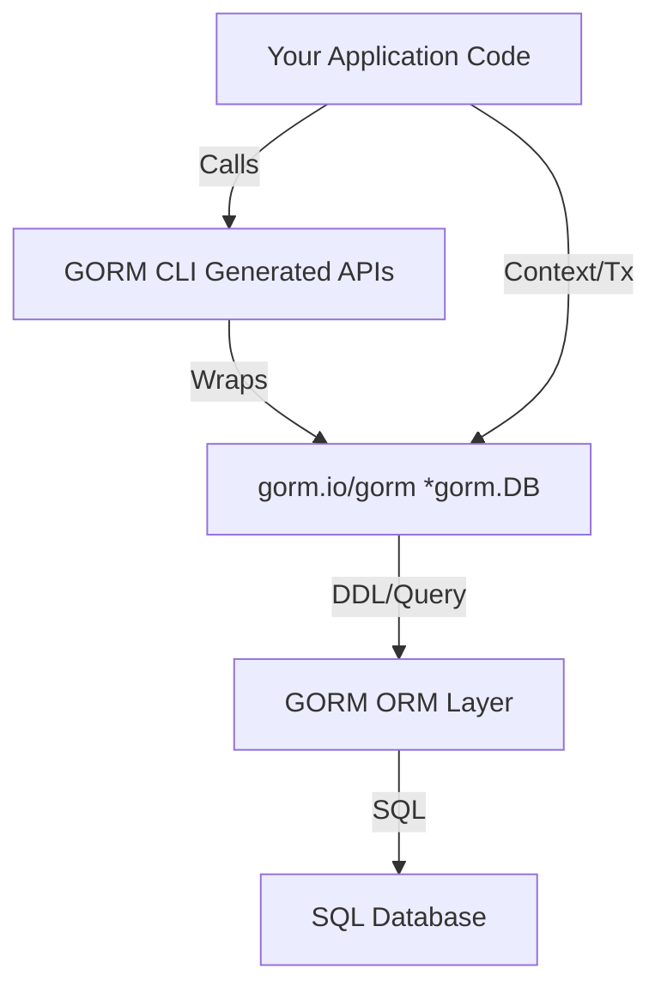

# Integration with GORM and Application Workflows

GORM CLI's generated APIs are designed to integrate effortlessly with the core `gorm.io/gorm` package, enabling you to build type-safe, readable, and maintainable data access layers. This integration empowers you to write queries, filters, updates, and association operations that harness both the powerful GORM ORM capabilities and the safety guarantees of compile‑time checks.

---

## Why Integration Matters

While GORM provides a rich ORM experience with fluent chaining and database-agnostic features, manually writing queries and managing associations can be error-prone and repetitive. GORM CLI bridges this gap by generating strongly typed query interfaces and model-driven field helpers that:

- Reduce boilerplate code
- Prevent common runtime errors with compile-time validation
- Provide intuitive discovery of fields, filters, and associations in IDEs
- Seamlessly leverage GORM's features such as transactions, hooks, and context propagation

This tight coupling with GORM preserves your existing workflows while adding a robust type-safe layer.

---

## Using Generated Query Interfaces with GORM

The generated interfaces wrap your GORM DB instance with type safety and convenient methods derived from your interface definitions. Here's how to use them effectively in your application:

### Typical Flow

1. **Initialize with a `*gorm.DB` instance**
2. **Chain generated query methods that correspond to your SQL template interfaces**
3. **Apply model-driven filters and predicates for fine-grained querying**
4. **Execute queries and handle results with full type safety**

### Example

```go
// Assume generated.Query[User] exists from your interface generation
ctx := context.Background()
db := gorm.Open(...)

// Query by ID using generated method
user, err := generated.Query[User](db).GetByID(ctx, 123)
if err != nil {
  // Handle error
}

// Compose additional predicates using model-driven field helpers

users, err := generated.Query[User](db).
  FilterByNameAndAge("jinzhu", 25).
  Find(ctx)  // Find fetches multiple results

if err != nil {
  // Handle error
}
```

**Outcome:** `user` and `users` are strongly typed, eliminating common mistakes like mistyped column names or mismatched parameters.

---

## Leveraging Model-Driven Field Helpers

GORM CLI generates per-model field helpers that you use to build predicates and update setters fluently. These helpers map your Go struct fields to strongly typed methods that reflect the underlying SQL operations.

### Filtering Example

```go
// Filtering users older than 18 and whose name contains "jinzhu"
users, err := gorm.G[User](db).
  Where(
    generated.User.Age.Gt(18),
    generated.User.Name.Like("%jinzhu%"),
  ).
  Find(ctx)
```

### Updating Example with Expressions

```go
gorm.G[User](db).
  Where(generated.User.Name.Eq("alice")).
  Set(
    generated.User.Age.Incr(1),
    generated.User.Status.Set("active"),
  ).
  Update(ctx)
```

This explicit and typed approach minimizes SQL injection risk and enhances readability.

---

## Performing Association Operations Safely

Associations (has one, has many, belongs to, many-to-many) receive dedicated helpers that allow you to perform CRUD-like operations with compile-time safety.

### Key Association Operations

| Operation    | Meaning                                         | Example Use Case                      |
| ------------ | ----------------------------------------------- | ------------------------------------ |
| Create       | Creates and links a related entity              | Creating a user with pets in one call|
| Update       | Updates associated records matching conditions | Updating a user's pet name             |
| Unlink       | Removes link without deleting the record        | Clearing a user's reference to a pet |
| Delete       | Deletes associated records (joins for many2many)| Removing obsolete associations        |
| CreateInBatch| Batch creation or linking for multiple entries | Adding multiple languages to a user  |

### Example: Create Associated Records

```go
gorm.G[User](db).
  Set(
    generated.User.Name.Set("alice"),
    generated.User.Pets.Create(generated.Pet.Name.Set("fido")),
  ).
  Create(ctx)
```

### Example: Unlink and Delete Association

```go
gorm.G[User](db).
  Where(generated.User.ID.Eq(1)).
  Set(generated.User.Pets.Unlink()).
  Update(ctx)

gorm.G[User](db).
  Where(generated.User.ID.Eq(1)).
  Set(generated.User.Pets.Delete()).
  Update(ctx)
```

Each operation respects the association semantics depending on the type of relationship, preventing unsafe partial updates.

---

## Integration with GORM Context and Transactions

All generated APIs integrate naturally with GORM's context and transaction features:

- **Context propagation:** Every generated method expects a `context.Context` parameter, allowing cancellation, deadlines, or tracing.

- **Transaction management:** Invoke generated queries or association setters within GORM-managed transactions using `db.Transaction` or manual `db.Begin()`/`Commit()`.

### Example: Transactional Usage

```go
err := db.Transaction(func(tx *gorm.DB) error {
  _, err := generated.Query[User](tx).GetByID(ctx, 123)
  if err != nil {
    return err
  }

  return gorm.G[User](tx).
    Where(generated.User.ID.Eq(123)).
    Set(generated.User.Status.Set("active")).
    Update(ctx)
})
if err != nil {
  // handle transaction error
}
```

This preserves atomicity and consistency in your data operations.

---

## Best Practices and Tips

- **Use generated helpers for all query parameters:** Avoid hand-writing raw SQL or strings when constructing query conditions to maintain safety.

- **Organize model and interface definitions together:** Since GORM CLI processes your interfaces and models in the same package or directory, keeping them close improves maintainability.

- **Leverage configuration (`genconfig.Config`) for customization:** Map custom types or apply fine-grained inclusion filtering to control code generation scope.

- **Test associations with unlink vs delete carefully:** Understand the semantics for each association type to avoid unintentional data deletion.

- **Use context for cancellation and timeout:** Propagate the app’s context actively to manage query lifecycle and prevent resource leaks.

- **Follow naming conventions for clarity:** Use clear, consistent names for interfaces, methods, and model fields to leverage the discoverability of generated APIs fully.

---

## Troubleshooting Common Issues

<AccordionGroup title="Common Integration Challenges">
<Accordion title="Generated API Not Recognized in IDE or Build">
- Ensure you have run the CLI code generation with the correct input/output paths.
- Confirm your project imports the generated package.
- Check if `genconfig.Config` filters exclude interfaces or structs unintentionally.
</Accordion>
<Accordion title="Context Missing from Method Calls">
- All generated methods expect `context.Context`. If missing, add it explicitly per method signature.
- You can wrap with background context for simple cases, but using a live context is best practice.
</Accordion>
<Accordion title="Association Operations Not Working as Intended">
- Verify your associations in the model structs conform to GORM's association conventions.
- Double-check operation semantics (unlink vs delete) to avoid data loss.
- Use logging or debug the generated SQL with GORM’s logger to trace execution.
</Accordion>
</AccordionGroup>

---

## Visualizing the Integration Flow



---

## Next Steps

To deepen your mastery of GORM CLI integration, consider exploring:

- [Quickstart: Generate Type-Safe APIs](https://.../guides/core-workflows/quickstart-generate) — how to define interfaces and generate code.
- [Working with Model-Driven Field Helpers](https://.../guides/core-workflows/using-field-helpers) — advanced pattern use of generated predicates and setters.
- [Managing Associations Safely](https://.../guides/core-workflows/association-operations) — comprehensive guide on association operations.
- [Generation Configuration](https://.../concepts/generation-configuration/genconfig-overview) — customize code generation to suit your project.

For troubleshooting integration issues, refer to the [Troubleshooting Common Issues](https://.../getting-started/configuration-troubleshooting/troubleshooting-common-issues) guide.

---

This page solidifies your understanding of how to bring GORM CLI-generated APIs into your real-world applications, maximizing safety, clarity, and the power of both GORM and Go’s type system.