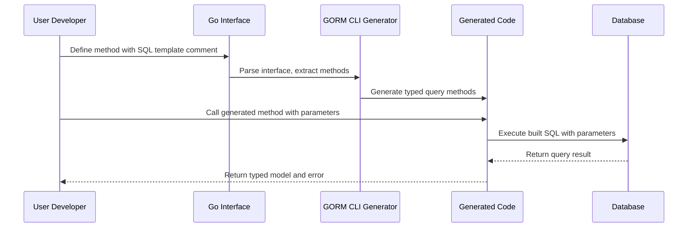

# Interface-driven Query APIs & Template Language

Unlock the power of GORM CLI’s interface-driven query approach, where your Go interfaces become the source of type-safe, fluent, and expressive database query APIs. This page demystifies how you define query methods using annotated comments, leveraging a custom SQL template DSL that seamlessly bridges your interface intentions and the generated executable code.

---

## Why Interface-driven Query APIs?

GORM CLI’s core innovation is letting developers declare database queries as Go interface methods annotated with SQL templates. This approach achieves several key benefits:

- **Type Safety at Compile Time:** Generated code aligns strictly with your method signatures and model types, eliminating runtime query errors and mismatches.
- **Clear Separation of Intent and Execution:** Your SQL logic stays close to method declarations, improving maintainability and expressiveness.
- **Fluent Go API for Queries:** Generated methods yield clean, discoverable APIs that integrate naturally into your Go code, boosting productivity.

Imagine authoring your query logic like this:

```go
// Query interface with typed query methods
type Query[T any] interface {
  // SELECT * FROM @@table WHERE id=@id
  GetByID(id int) (T, error)

  // where("name=@name AND age=@age")
  FilterByNameAndAge(name string, age int)
}
```

This simple, annotated interface is transformed into a fully functional, type-safe query implementation tailored for your models and database.

---

## Anatomy of Interface-driven Queries

GORM CLI parses your interface methods and their documentation comments to extract SQL query logic expressed in a special template syntax. Here's how the core parts work:

### 1. Method Signatures

Your interface method signature defines:

- **Parameters:** The Go function parameters are used as bound variables in the SQL template.
- **Return Types:** Usually include the result model type and an error; these define the generated method's output.

Example:

```go
GetByID(id int) (T, error)
```

### 2. SQL Template Comments

You write SQL templates inside the method’s leading comment block. These templates form the basis of the generated query logic, using special placeholders and directives.

Example:

```go
// SELECT * FROM @@table WHERE id=@id
// GetByID finds a record by ID
GetByID(id int) (T, error)
```

### 3. Placeholders & Special Variables

GORM CLI recognizes a set of placeholders to dynamically bind your Go method parameters and model metadata:

| Placeholder | Purpose                                  | Example                              |
|-------------|------------------------------------------|------------------------------------|
| `@@table`   | Automatically replaced with model’s DB table name | `SELECT * FROM @@table`             |
| `@@column`  | Dynamic column binding                   | `WHERE @@column=@value`             |
| `@param`    | Binds Go method parameters               | `WHERE id=@id AND name=@name`       |

Placeholders enable writing expressive, reusable SQL templates without hardcoding table or column names.

---

## The SQL Template DSL Explained

This custom Domain Specific Language empowers dynamic, conditional, and iterative SQL generation.

### Key DSL Directives

| Directive    | Description                                                      | Example Usage                                                                             |
|--------------|------------------------------------------------------------------|------------------------------------------------------------------------------------------|
| `{{where}}`  | Defines a conditional WHERE clause block                          | ```sql
SELECT * FROM @@table
{{where}}
  {{if age > 18}} age>@age {{end}}
{{end}}
```                                               |
| `{{set}}`    | Conditional SET clause for UPDATE statements                      | ```sql
UPDATE @@table
{{set}}
  {{if name != ""}} name=@name, {{end}}
  {{if age > 0}} age=@age {{end}}
{{end}}
WHERE id=@id
```           |
| `{{if}}`     | Conditional logic based on parameter values                       | See above examples showcasing `{{if ...}} ... {{end}}`                                                      |
| `{{for}}`    | Iterates over collections to generate repeated SQL fragments     | ```sql
SELECT * FROM @@table
{{where}}
  {{for _, tag := range tags}}
    tags LIKE concat('%',@tag,'%') OR
  {{end}}
{{end}}
``` |

These directives let you craft flexible query templates that adapt to input parameters at runtime, all statically checked and generated as idiomatic Go.

### Example Query with Conditional WHERE Clause

```go
// Search users with dynamic conditions
// SELECT * FROM @@table
// {{where}}
//   {{if user.ID > 0}}
//     WHERE id=@user.ID
//   {{else if user.Name != ""}}
//     WHERE name=@user.Name
//   {{end}}
// {{end}}
SearchUsers(user User) ([]T, error)
```

This interface method defines a search that adapts based on `user`'s fields.

---

## User Flow: From Interface to Executable Queries

1. **Define Query Interface:** Write Go interfaces with method signatures and annotated SQL templates.
2. **Run GORM CLI Generator:** Run `gorm gen -i ./path/to/your/interfaces -o ./generated`.
3. **Use Generated APIs:** Import and call generated code in your application, e.g.,

```go
u, err := generated.Query[User](db).GetByID(ctx, 123)
```

4. **Enjoy compile-time safety and fluent querying** with clear method contracts matching your SQL logic.

---

## Best Practices & Tips

- **Keep SQL Templates Close:** Write your SQL in the method comments to ensure traceability.
- **Leverage Placeholders:** Use `@@table` and `@@column` for portability and refactoring safety.
- **Use DSL Conditionals Wisely:** Avoid overly complex nested conditionals; keep templates readable.
- **Define Explicit Return Types:** Always return `(T, error)` or `([]T, error)` from your query methods for clarity.
- **Combine with Model Field Helpers:** Use generated field helpers alongside query APIs for filters and updates.

---

## Common Pitfalls & Troubleshooting

<AccordionGroup title="Troubleshooting Interface-Driven Query APIs">
<Accordion title="Method Return Types Must Match">
Each query method that finishes a SQL command (e.g., SELECT or UPDATE) must have appropriate return types. Typically, this is the model type `T` and an `error`. Missing or incorrect returns will trigger generation errors.
</Accordion>
<Accordion title="Placeholders Are Case Sensitive and Must Match">
Placeholders like `@param`, `@@table`, and `@@column` must be typed exactly. Incorrect cases or typos will cause generation failures or runtime errors.
</Accordion>
<Accordion title="Avoid Mixing Implementation in Interfaces">
Only write method signatures with annotated comments. Do not try to put actual Go code implementations inside interfaces.
</Accordion>
</AccordionGroup>

---

## Diagram: Query Method Lifecycle



This sequence shows how your interface method transforms through generation to runtime execution.

---

## Additional Resources

- [Quick Start: From Models to Queries](https://gorm.io/cli/gorm/overview/quickstart-features/quickstart-workflow)
- [Template DSL Tutorial](https://gorm.io/cli/gorm/guides/query-and-model-helpers/template-dsl-tutorial)
- [Model Field Helpers](https://gorm.io/cli/gorm/guides/query-and-model-helpers/model-driven-field-helpers)
- [Association Guides](https://gorm.io/cli/gorm/guides/query-and-model-helpers/association-guides)

Harness the full power of GORM CLI by pairing interface-driven queries with generated field helpers and association operations, constructing robust, safe, and efficient data access layers with ease.

---

## Summary

Interface-driven Query APIs in GORM CLI let you specify your database queries declaratively in Go interface method comments, using a powerful SQL Template DSL to shape compiled, type-safe methods. This paradigm ensures safe binding of parameters with dynamic SQL construction via directives like `{{where}}` and placeholders such as `@@table`, tightly aligning database access with your models.

You gain:
- Clear, maintainable interface contracts for queries
- Rich DSL for conditional and dynamic SQL
- Type safety integrated into Go tooling

Review the examples provided and experiment with the DSL to unlock seamless, compile-time safe querying in your projects. For practical usage, combine this knowledge with the Model Field Helpers and Association Guides found elsewhere in this documentation.

---