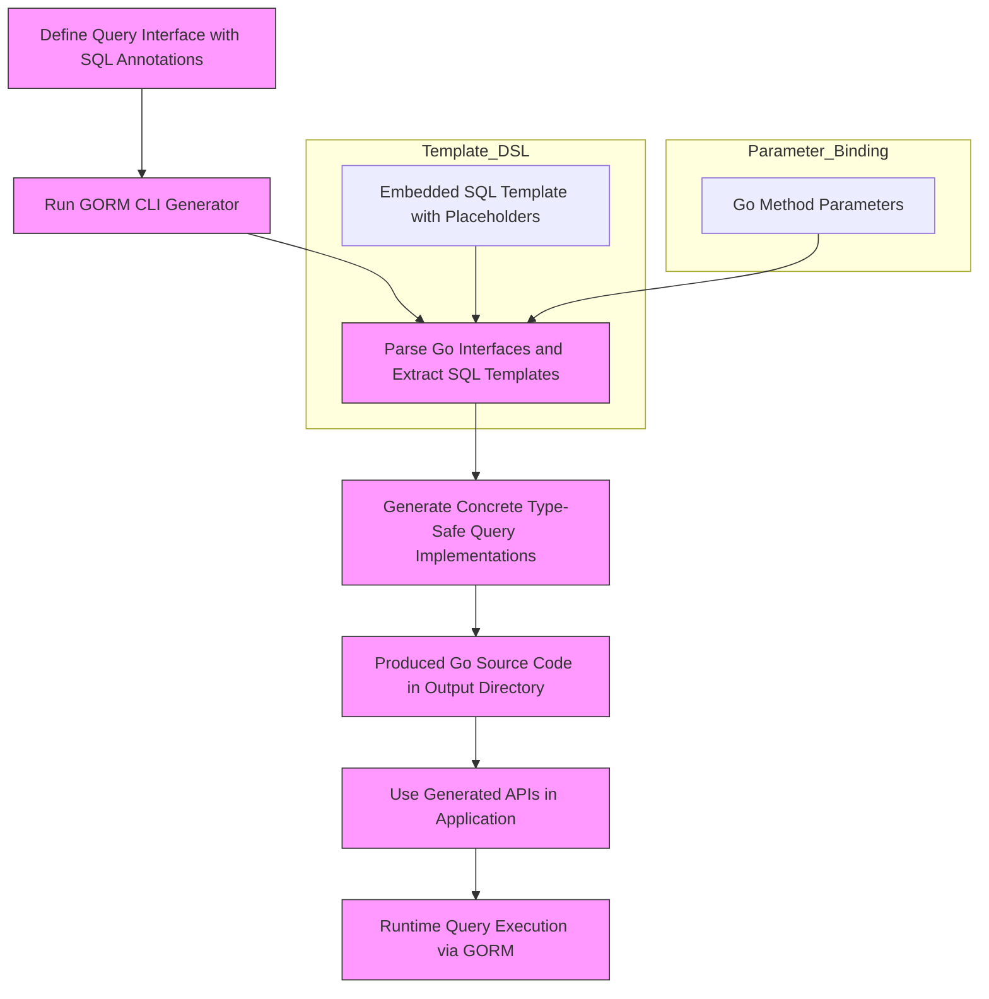

# Interface-Driven Query APIs

Gain a conceptual understanding of how method signatures, SQL-comment templates, and parameter mapping drive the creation of type-safe query methods. Learn how the system uses Go interfaces annotated with SQL comments to deliver precise, fluent APIs.

---

## Overview

In GORM CLI, interface-driven query APIs form the foundation of generating type-safe, fluent data access methods from clean, declarative Go interfaces. Users write simple Go interfaces whose methods are annotated with raw SQL templates or DSL-like SQL comments. The CLI then processes these interfaces to create fully implemented, idiomatic, and type-safe query methods reusable across your application.

This page explains the core concepts behind this process, highlighting how method signatures, SQL-comment templates, and parameter mappings cooperate to produce powerful, compile-time verified query APIs.

---

## What Are Interface-Driven Query APIs?

Interface-driven query APIs transform your Go interface definitions into concrete, type-safe implementations that execute queries based on the SQL templates you embed in method comments.

- **Interfaces:** Define your queries as Go interfaces with methods specifying parameters and results.
- **SQL Templates:** Use the method's associated comment to embed SQL or templating DSL for dynamic, flexible queries.
- **Parameter Mapping:** Method parameters bind automatically to placeholders in your SQL templates.
- **Generated Code:** The generator produces Go code implementing these methods with full type safety and fluent API designs.

This approach eliminates boilerplate, enforces compile-time correctness, and seamlessly integrates with GORM’s existing APIs.

---

## Core Concepts

### 1. Writing Query Interfaces

At the heart, users write generic Go interfaces with methods annotated by SQL templates within comments. Each method signature expresses input parameters and output types, aligning with standard Go idioms.

Example interface snippet:

```go
// Query interface for generic database queries
// with SQL templates embedded in method comments.
type Query[T any] interface {
  // SELECT * FROM @@table WHERE id=@id
  GetByID(id int) (T, error)

  // SELECT * FROM @@table WHERE @@column=@value
  FilterWithColumn(column string, value string) (T, error)

  // Conditional where clause with Go struct binding
  // SELECT * FROM @@table
  // {{if user.ID > 0}}
  //    WHERE id=@user.ID
  // {{else if user.Name != ""}}
  //    WHERE name=@user.Name
  // {{end}}
  QueryWith(user models.User) (T, error)
}
```

#### Key Points
- `T` is a generic parameter representing the result type.
- SQL templates use placeholders such as `@@table` for dynamic table resolution and `@param` to bind method parameters.
- Complex, conditional SQL can be embedded inside multi-line comments leveraging `{{if}}` and `{{for}}` directives.

### 2. SQL Template Directives

The SQL comments support a domain-specific templating language to express dynamic SQL generation:

| Directive   | Purpose                                | Example                                            |
|-------------|--------------------------------------|----------------------------------------------------|
| `@@table`   | Model’s target database table name   | `SELECT * FROM @@table WHERE id=@id`               |
| `@@column`  | Dynamic column name binding           | `WHERE @@column=@value`                            |
| `@param`    | Maps Go method parameters             | `WHERE name=@user.Name`                            |
| `{{where}}` | Conditional WHERE clause composition  | `{{where}} age > 18 {{end}}`                       |
| `{{set}}`   | Conditional SET clause for updates    | `{{set}} name=@name {{end}}`                       |
| `{{if}}`    | Conditional SQL snippets              | `{{if age > 0}} AND age=@age {{end}}`              |
| `{{for}}`   | Iteration over collections            | `{{for _, tag := range tags}} ... {{end}}`         |

This DSL lets you express rich, complex queries with branching and iteration while still benefiting from safe parameter binding.

### 3. Parameter Mapping and Binding

GORM CLI automatically maps Go method parameters to SQL placeholders:

- Simple parameters like `id int` bind to `@id` in SQL.
- Struct parameters like `user models.User` bind to `@user.FieldName`.
- Collections are supported for bulk queries and iteration.
- The generator handles escaping and type mapping to prevent SQL injection.

This design empowers users to write intuitive interfaces while GORM CLI bridges method parameters to SQL safely and automatically.

### 4. Generated Query Implementations

After generation, your query interfaces become concrete, fluent APIs with implementations that embed your SQL logic, bind parameters, and return typed results.

Example generated method for `GetByID`:

```go
func (e QueryImpl[T]) GetByID(ctx context.Context, id int) (T, error) {
  var sb strings.Builder
  params := make([]any, 0, 2)

  sb.WriteString("SELECT * FROM ? WHERE id=?")
  params = append(params, clause.Table{Name: clause.CurrentTable}, id)

  var result T
  err := e.Raw(sb.String(), params...).Scan(ctx, &result)
  return result, err
}
```

- SQL templates are translated into SQL strings with placeholders.
- Parameters are assembled in order and safely passed.
- The method returns results of the generic type `T` with standard Go errors.

This pattern gives you compile-time safety and seamless GORM integration.

---

## Practical Workflow: From Interface to Usage

### Step 1: Define Your Interface

Declare interfaces with method signatures and SQL comments representing your queries.

### Step 2: Run the Generator

Use the GORM CLI command:

```bash
gorm gen -i ./path/to/your/interfaces -o ./generated
```

This scans your input, parses SQL comments, and produces concrete implementations.

### Step 3: Use Generated APIs

Import generated packages and call methods with full type safety and code completion support.

Example:

```go
// Fetch user with ID 123
user, err := generated.Query[models.User](db).GetByID(ctx, 123)

// Filter users by dynamic column
result, err := generated.Query[models.User](db).FilterWithColumn(ctx, "email", "user@example.com")
```

Your queries run safely with parameter binding and return typed results matching your data models.

---

## Best Practices & Tips

- **Use clear method names:** Method names dictate your API’s discoverability.
- **Write precise SQL comments:** The embedded template is the canonical query; keep it clean and testable.
- **Leverage parameter binding:** Avoid raw string concatenation; use the provided placeholders.
- **Handle context explicitly:** The generator automatically adds `context.Context` to support cancellation and tracing.
- **Utilize conditional blocks:** Use `{{if}}` and `{{where}}` to build dynamic filters.

---

## Common Pitfalls

- **Mismatched placeholders:** Ensure every `@param` has a matching method parameter.
- **Incorrect SQL syntax in templates:** Syntax errors in SQL comments lead to generation errors or runtime issues.
- **Unsupported types:** Only parameters and results supported by GORM and Go generics are allowed.
- **Forgetting to regenerate:** Update your interface or SQL comments? Run `gorm gen` again to refresh implementations.

---

## Summary Diagram

This Mermaid.js flowchart illustrates the journey from interface declaration to generated query methods at runtime:



---

## Additional Resources

To build on these concepts and deepen your mastery, explore:

- [Template-Based SQL Queries](../guides/advanced-usage-patterns/template-queries) — see detailed syntax and examples for the SQL DSL
- [Generating Type-Safe Code](../../getting-started/first-steps/generate-code) — how to run the generator and organize your code
- [Using Generated Field Helpers](../../guides/getting-started-workflows/using-field-helpers) — complement query APIs with model-driven field helpers
- [Managing Associations and Relationships](../../guides/advanced-usage-patterns/working-with-associations) — extending queries to related models

---

## Troubleshooting

<AccordionGroup title="Common Issues with Interface-Driven Query APIs">
<Accordion title="Method Signatures and Placeholders Do Not Match">
Check that every placeholder in SQL comments like `@param` corresponds exactly to a method parameter.

Mismatch leads to generation errors or runtime binding failures.

Adjust either the parameter list or the SQL comment placeholders accordingly.
</Accordion>
<Accordion title="SQL Template Syntax Errors">
Errors in the templating syntax (`{{if}}`, `{{for}}`, `{{set}}`) cause generation to fail.

Validate your SQL comments for correct Go template syntax and balanced blocks.
</Accordion>
<Accordion title="Context Parameter Missing in Interface Methods">
The generator automatically injects `context.Context` into generated implementations even if missing in your interface, but adding it explicitly clarifies usage.

Avoid confusion by including `ctx context.Context` as the first parameter in method signatures where appropriate.
</Accordion>
<Accordion title="Unsupported Parameter or Return Types">
Ensure your method parameters and return types are compatible with GORM and Go generics.

Complex or unsupported types such as channels, functions, or private structs will cause generation failures.

Use pointers or valid struct types instead.
</Accordion>
</AccordionGroup>

---

This page empowers you with a conceptual framework to confidently write and use interface-driven queries, harnessing GORM CLI’s strong, flexible SQL templating combined with type-safe Go idioms.

---