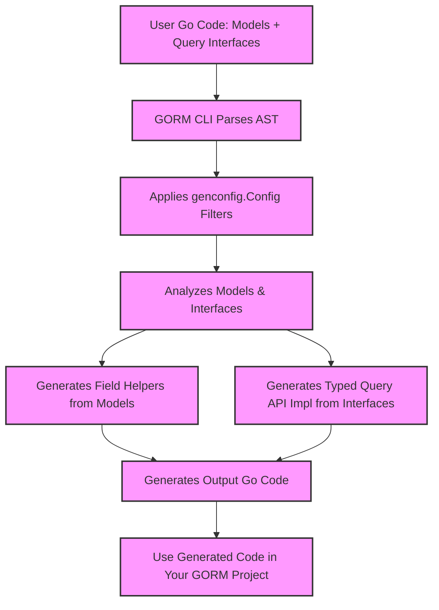

# Model and Interface Integration

GORM CLI builds powerful, type-safe query APIs and field helpers by integrating your Go model structs with user-defined query interfaces. This synergy enables you to write expressive SQL templates in interfaces and leverage your Go structs’ fields and associations, delivering a fluent, compile-time checked API tailored to your data model.

---

## Understanding the Integration

At its core, the integration links two essential inputs:

- **Model structs:** Go structs representing your database tables, complete with fields and relationships.
- **Query interfaces:** Go interfaces that describe query methods annotated with SQL templates.

The GORM CLI generator parses these artifacts together, merging model metadata with query interface definitions to produce:

- **Typed query APIs:** Methods mapping interface queries to generated implementations with context injection, parameter binding, and return type safety.
- **Field helpers:** Strongly typed representations of fields and associations to simplify filtering, updating, and manipulating related records.

This combination ensures your queries are aligned precisely with your models, minimizing runtime errors and maximizing developer productivity.

---

## How Models Influence Interface-Driven APIs

Your Go structs shape the generated APIs significantly. Each struct and its fields are analyzed to create:

- **Field Helper Types:** Each struct field generates a corresponding helper (e.g., `field.String`, `field.Number[int]`, `field.Time`) that enables you to write type-safe filter predicates and updates.

- **Association Helpers:** Relationships defined on structs (e.g., has one, has many, belongs to, many2many) produce helpers such as `field.Struct[Account]` or `field.Slice[Pet]`. These helpers support rich operations like create, unlink, update, and delete on associated data.

- **Custom Field Mappings:** Using `genconfig.Config` and struct tags (e.g., `gen:"json"`), you can customize how particular fields are represented by custom helpers, enhancing extensibility and SQL dialect support.

Example:

```go
// models/user.go
type User struct {
  ID        uint
  Name      string
  Age       int
  Pets      []*Pet
  Profile   string `gen:"json"`
}
```

This leads to generated code like:

```go
var User = struct {
  ID    field.Number[uint]
  Name  field.String
  Age   field.Number[int]
  Pets  field.Slice[Pet]
  Profile JSON
}{
  ID:    field.Number[uint]{}.WithColumn("id"),
  Name:  field.String{}.WithColumn("name"),
  Age:   field.Number[int]{}.WithColumn("age"),
  Pets:  field.Slice[Pet]{}.WithName("Pets"),
  Profile: JSON{}.WithColumn("profile"),
}
```

This lets you fluently express filters and associations in your queries, e.g., `User.Name.Eq("alice")` or `User.Pets.Create(...)`.

---

## Mapping Interfaces to Generated Implementations

Interfaces annotated with SQL templates define how to query or mutate data. The generator produces concrete implementations that:

- Inject `context.Context` automatically if missing in method signatures.
- Bind method parameters into SQL placeholders, supporting complex templating.
- Return strongly typed results aligned with the method signatures.

Example interface:

```go
type Query[T any] interface {
  // SELECT * FROM @@table WHERE id=@id
  GetByID(id int) (T, error)

  // SELECT * FROM @@table WHERE @@column=@value
  FilterWithColumn(column string, value string) (T, error)

  // UPDATE @@table
  // {{set}}
  //   {{if user.Name != ""}} name=@user.Name, {{end}}
  //   {{if user.Age > 0}} age=@user.Age {{end}}
  // {{end}}
  // WHERE id=@id
  UpdateUser(user User, id int) error
}
```

Generated code:

```go
func Query[T any](db *gorm.DB, opts ...clause.Expression) _QueryInterface[T] {
  return _QueryImpl[T]{Interface: gorm.G[T](db, opts...) }
}

func (e _QueryImpl[T]) GetByID(ctx context.Context, id int) (T, error) {
  // implementation binds id param and runs SQL
}

func (e _QueryImpl[T]) FilterWithColumn(ctx context.Context, column string, value string) (T, error) {
  // implementation builds SQL with dynamic column
}

func (e _QueryImpl[T]) UpdateUser(ctx context.Context, user User, id int) error {
  // implementation uses {{set}} templating
}
```

This approach unlocks powerful, concise, and type-safe database access that fully respects your Go models.

---

## Understanding Field and Association Exposure

Fields and associations declared on your models appear as exported helpers in generated code. These helpers expose:

- **Predicates:** e.g., `Eq`, `Like`, `Gt`, `Between` for filters
- **Setters:** e.g., `Set()`, `SetExpr()`, `Incr()` for updates and creations
- **Association Operations:** `Create()`, `CreateInBatch()`, `Update()`, `Unlink()`, `Delete()` allowing manipulation of related data

Example usage with associations:

```go
// Create a new user with associated pet
gorm.G[User](db).
  Set(
    generated.User.Name.Set("alice"),
    generated.User.Pets.Create(generated.Pet.Name.Set("fido")),
  ).
  Create(ctx)

// Update the pet's name where it matches
gorm.G[User](db).
  Where(generated.User.ID.Eq(1)).
  Set(
    generated.User.Pets.Where(generated.Pet.Name.Eq("fido")).Update(generated.Pet.Name.Set("rex")),
  ).
  Update(ctx)
```

Such APIs abstract the underlying SQL and foreign key management, providing a higher-level, type-safe, and fluent experience.

---

## How genconfig.Config Shapes Integration

Generation configuration via `genconfig.Config` lets you tailor the integration:

- Control output directory (`OutPath`)
- Specify interface and struct inclusion or exclusion lists (filters)
- Override field type mappings (`FieldTypeMap`) and name-based mappings (`FieldNameMap`)
- Set file-level vs package-level application

Example:

```go
var _ = genconfig.Config{
  OutPath: "examples/output",
  IncludeInterfaces: []any{"Query*"},
  ExcludeStructs: []any{"*DTO"},
  FieldNameMap: map[string]any{
    "json": JSON{},
  },
}
```

This config influences which interfaces and structs contribute to the generated APIs and how fields are represented, offering powerful customization to fit your codebase nuances.

---

## Best Practices for Effective Integration

- **Align your Models and Interfaces Clearly:** Keep models and query interfaces in related packages or directories to facilitate discovery and configuration application.

- **Use Configuration Wisely:** Apply filters in `genconfig.Config` to include only relevant query interfaces and structs, avoiding unnecessary code generation.

- **Leverage Struct Tags for Custom Mappings:** Use `gen:"name"` tags to trigger custom field helper usage and SQL generation.

- **Design Interfaces with SQL Templates Thoughtfully:** Use the template DSL to write concise, parameterized queries that clearly express intent while maintaining type safety.

- **Test Generated APIs Early:** After generation, validate usage with real queries and updates to catch edge cases and ensure alignment with models.

- **Understand Association Semantics:** Use the generated association helpers for managing linked data, respecting the rules for `Create`, `Update`, `Unlink`, and `Delete` based on association types.

---

## Troubleshooting Common Pitfalls

<AccordionGroup title="Common Issues and Solutions">
<Accordion title="Missing Generated Methods for Interfaces">
Make sure your interfaces are included in the generation using the `IncludeInterfaces` config or are not excluded unintentionally. Verify the patterns and exact names.
</Accordion>
<Accordion title="Fields Not Exposed as Helpers">
Confirm that the struct is included in generation and that fields are exported. Use `FieldNameMap` or `gen` tags for special field types.
</Accordion>
<Accordion title="Incorrect SQL Templating Results">
Validate your SQL templates for correct placeholder usage (`@param`, `@@table`, `@@column`), and test with small examples before scaling.
</Accordion>
<Accordion title="Association Operations Not Working as Expected">
Check the association type on your model struct and corresponding generated helpers. Confirm you're using the correct methods (`Create`, `Unlink`, etc.) per the association semantics.
</Accordion>
</AccordionGroup>

---

## Visualization of the Integration Workflow



This diagram illustrates how user-written models and interfaces flow through the GORM CLI processing pipeline, culminating in generated code ready for use.

---

## Summary

Integrating your Go structs with query interfaces via GORM CLI unlocks a robust, type-safe API for querying and updating your data with powerful support for associations. By understanding how models influence generated field helpers and how templates in interfaces translate to method implementations, you can write cleaner, safer, and more expressive database code. Configuration options let you customize output and mappings to meet your project’s nuances, ensuring seamless integration within your workflow.


---

## Additional Resources

- [Template-Based Queries: From Interface to Custom SQL](/guides/advanced-patterns/template-sql-workflows)
- [Model-Driven Field Helpers: Filters, Updates & Associations](/guides/core-workflows/field-helper-basics)
- [Customizing Code Generation with genconfig.Config](/guides/advanced-patterns/customizing-generation)
- [Working with Associations: Create, Update, Unlink & Delete](/guides/advanced-patterns/associations-deep-dive)
- [JSON Field Helper Extensibility](/guides/advanced-patterns/json-field-helpers)

Use these guides to deepen your knowledge of how models and interfaces collaborate within GORM CLI.

---

## See Also
- [How GORM CLI Works (Architecture Overview)](/concepts/core-architecture/architecture-overview)
- [Type Safety and Fluent API Concepts](/concepts/core-architecture/type-safety-and-api-design)
- [Generation Configuration and Filtering](/concepts/extensibility-templates-config/generation-configuration)

---

## Practical Next Steps
1. Define your Go model structs accurately with proper field types and associations.
2. Create query interfaces with annotated SQL templates matching your use cases.
3. Optionally declare `genconfig.Config` in your packages to customize generation.
4. Run GORM CLI to generate strongly typed queries and helpers.
5. Integrate and test generated code within your GORM projects for type-safe, fluent database operations.

This stepwise approach turns your declarative code into powerful and maintainable data layer APIs.
