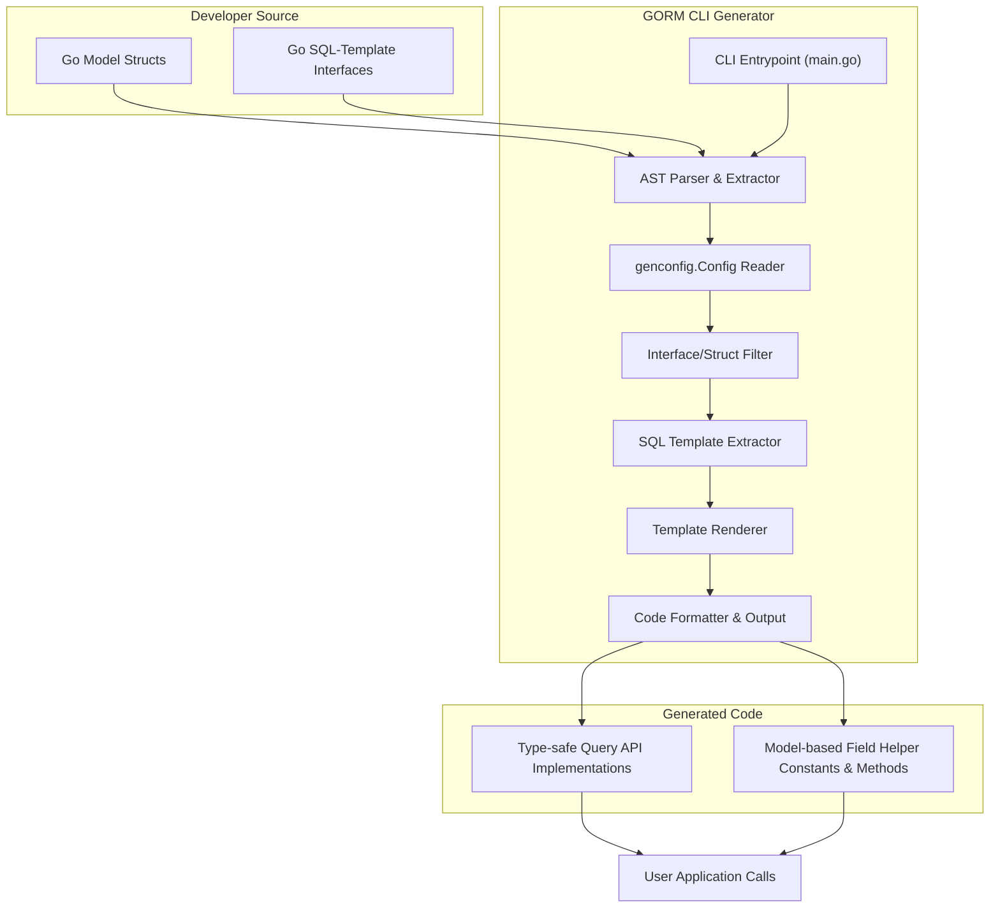

# System Overview & Main Components

GORM CLI transforms your Go code and SQL templates into fully type-safe, fluent APIs that streamline database access with GORM. This page unpacks the major building blocks inside GORM CLI, revealing how each component operates and interacts to generate these powerful APIs.

You will understand the generator engine’s role, the CLI entrypoint, and how query API generation differs from field helper creation — all orchestrated into a smooth, automated workflow that converts Go interfaces and models into ready-to-use code.

---

## 1. GORM CLI Purpose & Architecture

At its core, GORM CLI is a code generator designed to improve developer productivity and code safety for GORM projects. By parsing Go interface definitions with embedded SQL templates and your model structs, it generates:

- **Type-safe query APIs** based on interfaces annotated with SQL templates. This lets you write interface methods that translate into precise, compile-time checked query methods.
- **Model-driven field helpers** derived from your Go structs, offering expressive filters, update setters, and association management helpers with full type support.

Together, these generated components replace fragile string-based queries with a fluent API that catches errors early and boosts developer confidence.

## 2. Key Components Explained

### CLI Entrypoint (`main.go`)

The CLI entrypoint sets up your command environment using [cobra](https://github.com/spf13/cobra). The `gen` command is the primary interface to the generator:

- It takes user inputs like the path to your Go interface files and an output directory.
- Delegates code generation tasks to the generator engine.

This entrypoint shields users from internal complexity, exposing just the essential commands to generate code effortlessly.

### Generator Engine (`internal/gen/generator.go`)

This is the heart of GORM CLI’s code transformation:

- **Parsing:** Uses Go’s AST packages to parse your Go source files, extracting interfaces, methods, structs, and annotations.
- **Configuration:** Reads `genconfig.Config` from your packages to customize generation behavior (e.g., output paths, type mappings, filtering).
- **Filtering:** Applies include/exclude filters to interfaces and structs based on configuration.
- **SQL Template Extraction:** Processes method comments to extract SQL templates, helping to build type-safe queries.
- **Code Rendering:** Applies templates (`internal/gen/template.go`) to generate Go code files with query API implementations and field helpers.
- **Post-processing:** Runs formatting tools to ensure generated code adheres to Go standards.

### Template Engine (`internal/gen/template.go`)

Defines the Go text templates that form the skeleton of your generated code:

- Generates methods conforming to your interface signatures.
- Produces the strongly typed field helpers matching struct fields.
- Integrates GORM idioms and clause building inside generated code.

### User-Defined Interfaces & Model Structs

- **Interfaces:** You define Go interfaces with method signatures and SQL templates in comments. These SQL templates use placeholders like `@@table`, `@param`, and control directives for dynamic query building.
- **Model Structs:** Your Go structs represent database tables and drive generation of field helpers that support type-safe query construction and association operations.

## 3. Generation Workflow Overview

Using GORM CLI follows a smooth, linear workflow:

1. **Define Interfaces with SQL Templates**

   Write Go interfaces containing methods commented with SQL templates that describe queries, filters, and updates.

2. **Define Model Structs**

   Model your database tables as Go structs, including tags and any relevant annotations to guide field helper generation.

3. **Run the Generator**

   Invoke `gorm gen -i <input>` with optional output path—CLI parses your code, executes generation logic, and outputs ready-to-use Go files.

4. **Use Generated Code in Your Application**

   Import the generated package, call generated query methods, and use field helpers to build rich, safe queries and updates.

<Tip>
Each step offers customization hooks—use `genconfig.Config` to modify output paths, filter interfaces or structs, and map special types to custom field helpers.
</Tip>

## 4. Distinction Between Query API and Field Helpers

Understanding this separation is critical:

| Aspect                      | Query API Generation                              | Field Helper Generation                          |
|-----------------------------|-------------------------------------------------|-------------------------------------------------|
| **Source**                  | User-written Go interfaces with SQL templates   | User-defined Go model structs                     |
| **Goal**                    | Generate implementations of query methods       | Generate typed constants/functions for fields    |
| **Functionality**           | Execute raw SQL queries with type safety and parameters | Create predicates, updates, and association helpers |
| **Usage**                  | Called as methods to fetch or modify data        | Used to build expressions passed into GORM queries|
| **Example**                 | `Query[User].GetByID(ctx, 1)`                    | `User.Age.Gt(18)` as a filter predicate           |

This design divides concerns cleanly: one generates the workflows, the other supplies the expressive building blocks.

## 5. Data Flow: From Source to Output

This flowchart reveals that the generator takes your Go source files, applies configuration directives, extracts SQL, then renders output Go code files for consumption.

## 6. Practical Tips & Best Practices

- **Organize interfaces and models neatly:** Keeping query interfaces and model structs in the same or well-structured packages simplifies configuration and generation.
- **Annotate interfaces with clear, complete SQL templates:** This ensures your generated methods reflect precise queries and updates.
- **Use `genconfig.Config` wisely:** Tailor inclusion/exclusion filters, override output directories, and map fields thoughtfully to streamline generated outputs.
- **Leverage field helpers for safer queries:** Replace manual SQL strings with generated field predicates for maintainable and error-proof code.
- **Keep method signatures intuitive:** Follow the convention of taking `context.Context` implicitly where possible; the generator can insert it if omitted.

## 7. Troubleshooting Common Pitfalls

<AccordionGroup title="Common Issues and Solutions">
<Accordion title="No Code Generated or Empty Output">
Check if interfaces and structs match your `IncludeInterfaces` / `IncludeStructs` or `Exclude*` filters in your config. Also confirm you provided the correct input path.
</Accordion>
<Accordion title="Compilation Errors in Generated Code">
Verify that your SQL templates are syntactically valid and parameter bindings are properly declared. Also ensure Go structs and types are fully resolved.
</Accordion>
<Accordion title="Incorrect or Missing Field Helpers">
Ensure your structs are in the scanned package and not excluded by config filters; check that your field tags and genconfig mappings are accurate.
</Accordion>
<Accordion title="SQL Template Parsing Failures">
Make sure SQL annotations strictly follow the placeholders and DSL syntax rules. Avoid unsupported constructs inside comments.
</Accordion>
</AccordionGroup>

## 8. Next Steps & Related Documentation

- Dive into [Code Generation Workflow](/concepts/core-architecture/code-generation-workflow) to see detailed step-by-step processes.
- Explore [Type Safety and Query API Design](/concepts/operational-concepts/type-safety-and-query-apis) to master writing interfaces.
- Study [Field Helpers & Association Semantics](/concepts/operational-concepts/associations-and-field-helpers) to fully harness model-driven helpers.
- Review [System Architecture](/overview/product-architecture-overview/architecture-diagram) for a broader visual and conceptual overview.

---