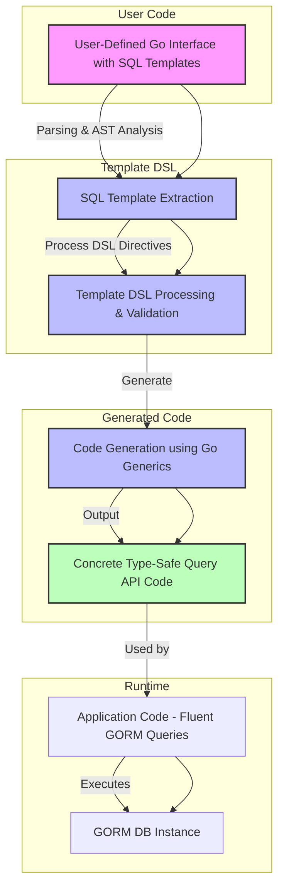

# Query API and Template Engine

Dive into the template-driven query generation model of GORM CLI, where Go interface methods annotated with SQL templates leverage Go's generics to create concrete, type-safe query APIs seamlessly embedded into GORM. This page explains the core concepts behind this generation approach, detailing how SQL template comments become powerful, compile-time checked query methods with sophisticated template language features ensuring correctness and expressiveness.

---

## Understanding the Template-Driven Query Generation

At the heart of GORM CLI lies a transformative approach: you write plain Go interfaces with special SQL templates embedded as method comments. The generator converts these into fully typed, concrete query APIs that integrate directly with GORM's DB object — providing fluent, discoverable, and type-safe database queries.

### What You Write vs What You Get

- **Developer Input:** An interface with methods whose comments contain raw SQL annotated using a custom SQL Template DSL.
- **Generated Output:** Concrete implementations of these interfaces leveraging generics (`T any`) 
  that produce type-safe, parameter-bound GORM queries.

This inversion of control means you focus on *what you want to query*, not *how* to implement it, gaining compile-time safety and rich expressiveness with minimal manual boilerplate.

---

## Core Components of the Query API Model

### 1. Interface Method Signatures

Each method in your Go interface:

- Uses Go generics (`T any`) to describe the model type the query operates on.
- Defines Go-typed parameters representing input.
- Annotates SQL queries using comments on methods.

For example:

```go
// SELECT * FROM @@table WHERE id=@id
GetByID(id int) (T, error)
```

Here, `@@table` is a placeholder that will be replaced by the model's table name, and `@id` binds the method parameter.

### 2. Annotated SQL Templates

The SQL queries inside the comments support a powerful templating language with directives:

| Directive   | Purpose                            | Example                                  |
| ----------- | ---------------------------------- | ---------------------------------------- |
| `@@table`   | Resolves to the model’s table name | `SELECT * FROM @@table WHERE id=@id`     |
| `@@column`  | Dynamic column binding             | `WHERE @@column=@value`                   |
| `@param`    | Maps Go method parameters to SQL params      | `WHERE name=@user.Name`                  |
| `{{where}}` | Starts a conditional WHERE clause  | `{{where}} age > 18 {{end}}`             |
| `{{set}}`   | Conditional SET clause for UPDATE  | `{{set}} name=@name {{end}}`             |
| `{{if}}`    | Conditional SQL fragments          | `{{if age > 0}} AND age=@age {{end}}`    |
| `{{for}}`   | Iteration over collections         | `{{for _, t := range tags}} ... {{end}}` |

The directives enhance queries to conditionally and dynamically build SQL ensuring queries are both flexible and safe.

### 3. Method Result Types and Execution

- Methods that return only an `error` typically perform database mutations (e.g., UPDATE).
- Methods that return a typed model and an `error` perform SELECT queries with automatic scanning into Go structs.

The generator emits methods that compile SQL strings, bind parameters, and execute queries safely using GORM's DB interface.

---

## How the Template DSL Works in Practice

### Binding Parameters

Placeholders prefixed with `@` bind Go method parameters into queries with automatic parameterization, preventing SQL injection.

Example:

```sql
SELECT * FROM @@table WHERE id=@id
```

- `@id` automatically uses the method parameter `id` to bind to the query.

### Dynamic References

- `@@table` resolves the model table name dynamically from the generic type `T`.
- `@@column` allows dynamic column specification, adding another layer of flexibility.

### Conditional Clauses

Templates can conditionally construct WHERE or SET clauses based on method parameters or struct fields, enabling tailored queries.

Example:

```sql
SELECT * FROM @@table
{{where}}
  {{if user.Name != ""}} name=@user.Name {{end}}
  {{if user.Age > 0}} AND age=@user.Age {{end}}
{{end}}
```

This generates WHERE clauses only if corresponding conditions are met.

### Iterations

The `{{for}}` directive allows looping over slices to build complex filters or batch operations.

Example:

```sql
SELECT * FROM @@table
{{where}}
  {{for _, tag := range tags}}
    {{if tag != ""}} tags LIKE concat('%',@tag,'%') OR {{end}}
  {{end}}
{{end}}
```

This loops through `tags` binding them safely and generating OR conditions dynamically.

---

## Step-by-Step User Workflow

<Steps>
<Step title="Define Your Query Interface">
Declare your Go interface with method signatures and embed your SQL queries in method comments using the template DSL.
</Step>
<Step title="Run the Generator">
Invoke the GORM CLI generator (`gorm gen`) on your package to produce concrete, typed implementations leveraging your interface.
</Step>
<Step title="Use Generated Query API">
Call the generated methods passing a GORM DB context and parameters. The generated code compiles your templated SQL, binds parameters, executes queries, and returns typed results.
</Step>
</Steps>

---

## Practical Examples

```go
// Interface definition
type Query[T any] interface {
  // SELECT * FROM @@table WHERE id=@id
  GetByID(id int) (T, error)

  // UPDATE @@table
  // {{set}}
  //   {{if user.Name != ""}} name=@user.Name, {{end}}
  //   {{if user.Age > 0}} age=@user.Age {{end}}
  // {{end}}
  // WHERE id=@id
  UpdateUser(user User, id int) error
}
```

Usage of generated code:

```go
// SELECT * FROM users WHERE id=123
user, err := generated.Query[User](db).GetByID(ctx, 123)

// UPDATE users SET name="jinzhu" WHERE id=1
err = generated.Query[User](db).UpdateUser(ctx, User{Name:"jinzhu"}, 1)
```

---

## What Makes This Approach Powerful?

- **Compile-Time Safety:** The generated methods bind parameters from strongly typed Go signatures, catching errors early.
- **Flexible Queries:** Through the template DSL, SQL adapts to inputs, supporting dynamic filtering, sorting, and updates.
- **Seamless Integration:** Generated APIs embed naturally with GORM's methods, supporting fluent calls.
- **Generics-Based:** Use of Go generics (`T any`) enables one interface definition to work with any model type.

---

## Troubleshooting & Best Practices

<AccordionGroup title="Common Troubleshooting Topics">
<Accordion title="SQL Template Syntax Errors">
Ensure your template syntax is correct, matching directives and proper parameter usage. Mistakes in `{{if}}`, `{{for}}`, or binding names cause generation errors.
</Accordion>
<Accordion title="Unmatched Return Types">
Query methods with SQL result templates must return the correct typed result and error. At minimum, mutation methods must return an error; query methods must return `(T, error)`.
</Accordion>
<Accordion title="Parameter Binding Issues">
Check that all SQL template parameters (`@param`) correspond to Go method parameters by name and type.
</Accordion>
</AccordionGroup>

<Tip>
Always start with simple SQL templates, verify generation and usage, then incrementally add conditionals and iterations for complex queries.
</Tip>

---

## Diagram: How Template-Driven Query API Generation Works



---

## Related Concepts and Next Steps

This page connects deeply with other crucial documentation areas:

- Explore the **[Template-Based Query Generation](../guides/advanced-patterns/template-based-sql.md)** guide to master SQL templating syntax and advanced query patterns.
- Learn about **[Using the Generated APIs](../guides/core-workflows/using-generated-apis.md)** for practical usage patterns and error handling.
- Understand how **Model-Driven Field Helpers** complement these query APIs for filter and update expressions.
- For customizing output and behavior, see **Configuration & Extensibility** documentation.

By combining these resources, you'll leverage GORM CLI's query engine to build robust, flexible, and maintainable data access layers in Go with GORM.
