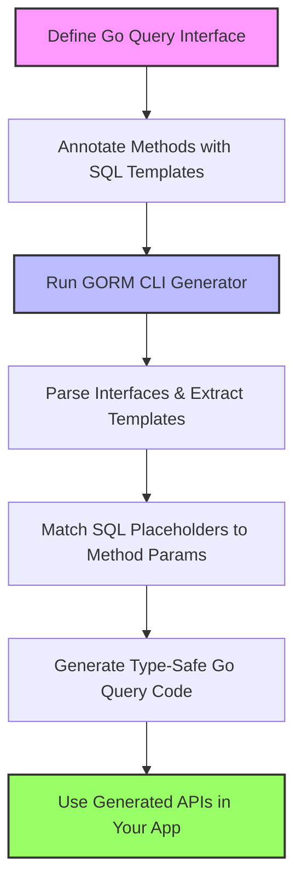

# Query Interfaces and SQL Templates

Understand how GORM CLI uses query interfaces annotated with SQL templates to define your data access layer. This page explains how Go method signatures align with SQL templates written in comments, how parameters bind automatically, and how this process generates clean, type-safe query code for seamless data interaction.

---

## Overview

At the heart of GORM CLI's query API generation lies the use of _query interfaces_. These are Go interfaces where each method represents a specific database query operation. Instead of manually writing query implementations, you simply annotate the method with raw SQL templates in comments. GORM CLI then parses these templates, correlates method parameters to SQL placeholders, and generates fully type-safe query implementations for you.

This model delivers a fluent, discoverable API that significantly improves compile-time safety and runtime reliability.

---

## Key Concepts

### Query Interface Definition

Your query interface is a regular Go interface describing the data retrieval or modification needs. Each method:

- Is annotated with one or multiple SQL templates inside method comments.
- Uses named parameters that correspond to method arguments.
- Defines return types specifying the expected data shape and error handling.

Example:

```go
// Query interface for user-related queries
 type Query[T any] interface {
   // SELECT * FROM @@table WHERE id=@id
   GetByID(id int) (T, error)
   
   // SELECT * FROM @@table WHERE @@column=@value
   FilterWithColumn(column string, value string) (T, error)

   // More complex query with conditional WHERE clauses
   // SELECT * FROM users
   // {{if user.ID > 0}}
   //   WHERE id=@user.ID
   // {{else if user.Name != ""}}
   //   WHERE name=@user.Name
   // {{end}}
   QueryWith(user models.User) (T, error)

   // UPDATE @@table
   // {{set}}
   //   {{if user.Name != ""}} name=@user.Name, {{end}}
   //   {{if user.Age > 0}} age=@user.Age, {{end}}
   //   {{if user.Age >= 18}} is_adult=1 {{else}} is_adult=0 {{end}}
   // {{end}}
   // WHERE id=@id
   UpdateInfo(user models.User, id int) error
 }
```

These interfaces declare exactly what you want to query or update without manually handling SQL or error-prone string concatenations.

---

### SQL Template DSL

GORM CLI provides an expressive SQL template DSL embedded in comments to make queries dynamic while ensuring safety.

| Directive   | Purpose                            | Example                                  |
|-------------|----------------------------------|------------------------------------------|
| `@@table`   | Resolves to the model’s table name | `SELECT * FROM @@table WHERE id=@id`     |
| `@@column`  | Dynamic column binding             | `@@column=@value`                        |
| `@param`    | Maps Go method parameters to SQL  | `WHERE name=@user.Name`                  |
| `{{where}}` | Optional WHERE clause block        | `{{where}} age > 18 {{end}}`             |
| `{{set}}`   | Dynamic SET clause for UPDATE     | `{{set}} name=@name {{end}}`             |
| `{{if}}`    | Conditional SQL fragments          | `{{if age > 0}} AND age=@age {{end}}`    |
| `{{for}}`   | Iteration over collections         | `{{for _, t := range tags}} ... {{end}}` |

These directives enable templates to adapt to input parameters at runtime, providing precise control over the generated SQL.

### Parameter Binding

Parameters are automatically bound by matching the `@param` placeholders in your comments to function arguments by name or struct field. This removes any manual parameter binding and guards against SQL injection.

For example:

```sql
SELECT * FROM @@table WHERE id=@id AND name=@name
```

automatically maps the `id` and `name` parameters to the method arguments with the matching names.

---

## How GORM CLI Generates Code

1. **Parse Interfaces:** GORM CLI reads the interface methods annotated with SQL templates.
2. **Extract Templates:** It extracts and analyzes SQL annotations from method comments.
3. **Match Parameters:** Method parameters are matched to `@` placeholders in SQL templates.
4. **Generate Code:** It produces concrete Go implementations with:
   - Type-safe method signatures including `context.Context` if missing.
   - Parameter binding applied in the generated query execution.
   - Actual SQL statements constructed according to the templates.

Here is how a generated method looks in practice:

```go
func (e _QueryImpl[T]) GetByID(ctx context.Context, id int) (T, error) {
    var sb strings.Builder
    params := make([]any, 0, 2)

    sb.WriteString("SELECT * FROM ? WHERE id=?")
    params = append(params, clause.Table{Name: clause.CurrentTable}, id)

    var result T
    err := e.Raw(sb.String(), params...).Scan(ctx, &result)
    return result, err
}
```

The above code shows the SQL built and parameters bound dynamically but safely, all wrapped in a strongly typed function.

---

## Usage Examples

### Simple Query

```go
// Fetch user by ID
user, err := generated.Query[User](db).GetByID(ctx, 123)
// Executes: SELECT * FROM users WHERE id=123
```

### Dynamic Query With Column

```go
user, err := generated.Query[User](db).FilterWithColumn(ctx, "role", "admin")
// Executes: SELECT * FROM users WHERE role='admin'
```

### Conditional Query

```go
// Query according to user fields set
result, err := generated.Query[User](db).QueryWith(ctx, models.User{Name: "alice"})
// Executes: SELECT * FROM users WHERE name='alice'
```

### Updates With Conditional Fields

```go
err := generated.Query[User](db).UpdateInfo(ctx, models.User{Name: "bob", Age: 30}, 7)
// Executes UPDATE users SET name='bob', age=30, is_adult=1 WHERE id=7
```

### Fluent Interface Returning Query Helper

```go
query := generated.Query[User](db)
query = query.FilterByNameAndAge(ctx, "alice", 20) // Chains WHERE name=? AND age=?
users, err := query.Find(ctx)
```

---

## Tips and Best Practices

- **Keep SQL Templates Clear and Simple:** Complex SQL logic can be written but should be well-tested for correctness.
- **Match Method Parameters Precisely:** Make sure parameter names and types match bindings in SQL templates.
- **Prefer Structs for Complex Filters:** When queries require multiple parameters, pass structs for better readability and maintainability.
- **Use the Template DSL for Conditionals:** Utilize `{{if}}` and `{{where}}` for dynamic WHERE clauses that depend on input data.
- **Generate and Review Output:** After running the generator, inspect the generated code to understand the mapping.

---

## Common Pitfalls & Troubleshooting

<AccordionGroup title="Common Challenges">
<Accordion title="SQL Placeholder and Parameter Mismatch">
If parameters referenced in SQL templates do not exactly match method parameter names (or struct fields), code generation will fail or compile with errors. Always ensure exact names.
</Accordion>
<Accordion title="Missing Context Parameter">
Generated code injects `context.Context` into method signatures if missing. For prior code compatibility, explicitly add `ctx context.Context` to your interface methods.
</Accordion>
<Accordion title="Complex SQL Logic Not Supported">
Very complex templating or database-specific SQL features may not be fully supported. Keep templates straightforward, and break complex logic into smaller interfaces if needed.
</Accordion>
<Accordion title="Unintended Hardcoded Values">
Beware of string literals in SQL templates that resemble parameter names. Use escaping (`\@name`) if you want literals that look like parameters.
</Accordion>
</AccordionGroup>

---

## How This Fits Into GORM CLI

This page complements the broader concept guides by focusing specifically on the query interface and SQL template layer. Understanding this page unlocks the power of defining your data access surface declaratively in Go code, which drives generation of type-safe, convenient query APIs.

To see how this integrates with GORM itself and joins with model-based field helpers, consult the following:

- [Core Concepts & Terminology](../overview/architecture-concepts/core-concepts-terminology)
- [How GORM CLI Code Generation Works](./generator-workflow)
- [Field Helpers and Associations](./field-helpers-and-associations)

---

## Illustrative Flowchart



---

## Summary

By writing simple Go interfaces with annotated SQL templates, GORM CLI frees you from hand-crafting query implementations. This leads to clean, type-safe, context-aware data access code that integrates seamlessly with GORM, improves developer productivity, and minimizes runtime errors.

Start by defining your query interfaces close to your models, write expressive SQL templates using the DSL, then run the generator and use the generated APIs for safe, maintainable database interactions.

---

For further learning, explore the [Template DSL Guide](../guides/advanced-usage/template-dsl-guide) for advanced SQL templating techniques, and [Managing Associations](../guides/advanced-usage/advanced-associations) to understand how generated field helpers complement query interfaces in managing relationships.
