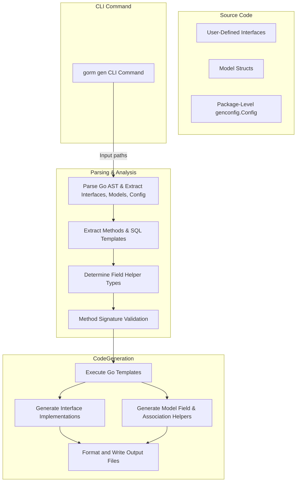

# System Overview & Workflow

Explore the overarching architecture and workflow of GORM CLI, understanding how your Go interfaces and model structs transform into type-safe, fluent APIs compatible with GORM. This guide explains how the command-line tool parses code, interprets embedded SQL templates, applies your configurations, and generates the final code that integrates seamlessly in your Go projects.

---

## Understanding the Big Picture

GORM CLI is designed to dramatically reduce boilerplate and improve type safety by automating the generation of query APIs and model helpers. This page maps out the full flow, from your raw Go source input through code analysis, template processing, to final generated output.

### Your Starting Point: Interfaces and Structs

You begin with plain Go code:

- **Interfaces**: Define methods annotated with SQL templates inside comments.
- **Model Structs**: Define typed Go structs representing database tables.

GORM CLI interprets these Go source files as the foundation for what to generate.

### The CLI Command (`gorm gen`)

The command-line interface (`gorm gen`) is the entry point into this pipeline:

- **Input**: You specify the path to your interfaces and model files via the `-i` flag.
- **Output**: Generated Go code is written to the output directory (`-o`), defaulting to `./g` if unspecified.

Upon running, the CLI triggers the generator engine to parse and process your inputs into strongly typed Go code.

---

## Core Workflow Stages

### 1. **Parsing and AST Analysis**

GORM CLI parses your Go source files and builds an Abstract Syntax Tree (AST). This step includes:

- Extracting package and import information to understand context.
- Pinpointing interfaces and their methods, capturing associated SQL templates from comments.
- Discovering model structs and their fields, including tags and embedded structs.
- Collecting configuration declarations (`genconfig.Config`) at package or file level to drive customization.

> The generator respects your project structure and maintains relative paths to preserve code organization.

### 2. **Configuration Processing**

GORM CLI merges configurations from any found `genconfig.Config` declarations:

- **Output paths**: Override where generated files go.
- **Field helper mappings**: Customize how Go types or tagged fields map to helper types.
- **Inclusion/Exclusion filters**: Selectively include or exclude specific interfaces and structs based on patterns or types.

This merging occurs hierarchically, considering both file-level and package-level configs.

### 3. **SQL Template Injection and Method Analysis**

Each interface method's SQL template is extracted and parsed, supporting features such as:

- **Placeholders**: Replace `@@table`, `@@column`, and parameter bindings `@param` with concrete values.
- **Conditional directives**: `{{where}}`, `{{set}}`, `{{if}}`, and `{{for}}` enable dynamic query generation.

The generator validates method return types rigorously, ensuring:

- Finish methods must return appropriate result and error values.
- Query methods without raw SQL yield fluent, chainable APIs.

### 4. **Type-Safe Field Helper Derivation**

For each struct field, GORM CLI determines the appropriate field helper type using:

- Basic mappings for Go primitives and common types (e.g., `string`, `int`, `time.Time`).
- Custom mappings from your configuration by Go type or `gen` struct tag.
- Recognition of association fields (has one, has many, belongs to, many2many) for generating association helpers.

Anonymous embedded structs are flattened to aggregate fields for comprehensive coverage.

### 5. **Code Generation and Output Writing**

Using a Go template engine, GORM CLI generates:

- **Interface implementations**: Concrete structs with methods implementing your interfaces.
- **Typed query APIs**: Methods that construct safely parameterized SQL according to templates.
- **Model-driven field helpers**: Fluent predicates and setters for filtering, updating, and association management.

The generator writes these results to disk in the configured output path, maintaining directory layout.

Generated code is then formatted automatically to comply with Go standards.

---

## Result: Seamless Integration into Your Project

The output source code plugs into your existing GORM-based applications:

- Instantiate generated query interfaces to perform complex, type-safe queries.
- Use field helpers for expressive filters and update clauses.
- Manage associations with fluent, safe helper methods.

This mechanism elevates your productivity by removing error-prone SQL crafting and manual DAO maintenance.

---

## Practical User Flow Example

Consider the typical user journey:

1. **Write Go interfaces** with embedded SQL templates.
2. **Define model structs** that represent database tables.
3. Optionally create a **`genconfig.Config`** to customize generation.
4. Run the CLI:

   ```bash
   gorm gen -i ./yourpkg -o ./generated
   ```

5. Import and use generated APIs:

   ```go
   user, err := generated.Query[User](db).GetByID(ctx, 123)
   users, err := gorm.G[User](db).Where(generated.User.Age.Gt(18)).Find(ctx)
   ```

---

## Tips for Success

- **Keep interfaces and models close**: Place them in the same package or directory for straightforward parsing.
- **Leverage config for complex projects**: Use inclusion/exclusion and field mapping to tailor generation.
- **Validate method returns**: Ensure your interface methods follow the required return conventions for consistent generation.
- **Use placeholders and templating**: Familiarize yourself with the SQL template DSL to maximize expressiveness.

---

## Troubleshooting Common Pitfalls

- **Parsing errors**: Check that your Go code compiles and is parseable.
- **Missing generated files**: Verify your `-o` (output) path and config overrides.
- **Method signature issues**: Return types must be either (`T, error`) or `error` for finish methods.
- **Field type mapping errors**: Confirm your model field Go types have correct helpers or mappings.

---

## Diagram: GORM CLI Processing Pipeline



---

## Further Learning and Next Steps

After mastering the overall system workflow:

- Deep dive into [Defining Query Interfaces & Models](/getting-started/first-run-and-validation/defining-interfaces-models) to learn interface design.
- Explore [Generating & Using Query APIs](/guides/core-workflows/generating-and-using-query-apis) for practical usage patterns.
- Customize generation with [Configuring the CLI](/getting-started/setup-essentials/configuring-cli) and [Customizing Code Generation & Field Mapping](/guides/advanced-patterns/customizing-code-generation).
- Leverage advanced SQL templating by studying [Template SQL DSL](/guides/advanced-patterns/template-sql-dsl).


---

## Summary
This page equips you with a holistic understanding of how GORM CLI translates your Go source code and annotations into typed, fluent APIs. By grasping this system overview and workflow, you are empowered to architect your codebase for maximum scalability, correctness, and developer efficiency.

---