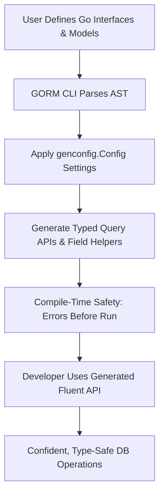

# Type Safety and Fluent API Concepts

GORM CLI revolutionizes database interaction in Go by providing strong compile-time guarantees through generated, interface-driven query APIs and model-driven field helpers. This page unpacks the principles behind these guarantees and illustrates how the CLI’s code generation produces a fluent, type-safe API that enables developers to catch errors early, write expressive queries, and streamline database operations with confidence.

---

## Why Type Safety Matters in Database APIs

Writing SQL queries directly in code can often lead to runtime errors caused by type mismatches, invalid column names, or faulty query constructs. GORM CLI eliminates these risks by generating code based on your Go interfaces and model structs, ensuring:

- **Compile-time validation** of method signatures, parameters, and return types.
- **Correct references** to columns and tables via generated strongly typed field helpers.
- **Early detection** of common errors without running the application.

This fail-fast design drastically reduces debugging time and supports maintainable, robust codebases.

---

## Interface-Driven Query APIs: Strong Contracts for Queries

At the heart of GORM CLI’s type safety is the generation of query APIs from your user-defined Go interfaces annotated with SQL templates.

### How It Works

1. **Define a Query Interface**: You write an interface with generic type parameters, providing method signatures for your queries.
2. **Annotate with SQL Templates**: Use SQL-styled comments to define the intended query logic with parameter bindings.
3. **Code Generation**: The CLI parses this interface, extracts the method signatures and SQL templates, and generates concrete implementations.

### Key Outcomes for Users

- Methods accept **strongly typed parameters**, matching your Go types exactly.
- Return types use your models, enabling easy integration and manipulation.
- Context objects (`context.Context`) are seamlessly injected if omitted, aligning with idiomatic Go.

### Example: Simple Query Interface

```go
// Query[T any] defines queries for the User model
// methods include type-safe parameters and returns

type Query[T any] interface {
  // Fetch a single record by ID
  // SQL: SELECT * FROM @@table WHERE id=@id
  GetByID(id int) (T, error)

  // Apply filters using dynamic columns
  // SQL: SELECT * FROM @@table WHERE @@column=@value
  FilterWithColumn(column string, value string) (T, error)
}
```

The generated API enforces parameter correctness and returns your concrete type (such as `User`), catching mismatches at compile time.

---

## Model-Driven Field Helpers: Expressive and Type-Safe Query Building Blocks

GORM CLI also generates field helpers directly from your Go model structs, turning fields into strongly typed helpers for filtering, updating, and associations.

### Core Concept

- For each model struct, a corresponding set of field helpers is generated.
- These helpers expose methods like `.Eq()`, `.Like()`, `.Between()`, and setters like `.Set()`, `.Incr()`, tailored to the field’s Go type.

### Why Strongly Typed Helpers Matter

- **Correct field usage**: Avoid mistakes such as quoting string values incorrectly or comparing integers to strings.
- **Fluent chaining**: Helpers can be combined to build expressive, readable queries.
- **Fail-fast behavior**: Typing errors or incorrect method usage are caught before runtime.

### Examples

```go
// Filtering users by age
users, err := gorm.G[User](db).
    Where(generated.User.Age.Gt(18)).
    Find(ctx)

// Updating fields with zero/false values safely
err = gorm.G[User](db).
    Where(generated.User.ID.Eq(1)).
    Set(
        generated.User.Name.Set("alice"),
        generated.User.IsAdult.Set(false),
        generated.User.Score.Set(sql.NullInt64{}),
    ).
    Update(ctx)
```

### Associations

Field helpers not only cover basic types but also associations (has-one, has-many, many-to-many). These are represented as typed `field.Struct[T]` or `field.Slice[T]` and support operations like create, update, unlink, and delete — all type-safe.

---

## Fluent API Design: Enhancing Developer Experience

The generated APIs emphasize fluent, discoverable method chains that feel natural to Go developers:

- Methods return interfaces or structs that support further chaining.
- Context arguments are auto-injected to conform to Go idioms.
- Selective filters and updates are expressed clearly with well-named helpers.

This design helps users intuitively construct complex queries without dealing with raw SQL strings or unsafe parameters.

---

## Behind the Scenes: Compile-Time Guarantees Through Code Generation

GORM CLI’s generator analyzes your code’s AST:

- **Interfaces**: Each method is parsed for parameters, results, and SQL templates.
- **Structs**: Fields and embedded structures are inspected, including type mappings and field tags.
- **Configurations**: `genconfig.Config` allows filtering and custom type mappings, controlling generation scope and behavior.

By producing concrete typed implementations, the generator enforces:

- Function signatures that align perfectly with your interfaces.
- Strongly typed helpers tailored to model fields.
- Fail-fast errors if interfaces are not properly defined, or template syntax is invalid.

---

## Practical Tips for Using Type Safety and Fluent APIs

- Always define your query interfaces with explicit, well-documented SQL templates.
- Use model tags (e.g., `gen:"json"`) and `genconfig.Config` for custom field helper mappings.
- Leverage generated helpers for filtering and updating to avoid manual SQL construction.
- Handle associations through generated `.Create()`, `.Update()`, `.Unlink()`, and `.Delete()` for consistent semantics.
- Rely on the generator’s compile-time errors as your first line of defense.

---

## Common Pitfalls and Troubleshooting

<AccordionGroup title="Troubleshooting Type Safety Issues">
<Accordion title="Method Signature Errors">
If the interface methods do not return an `error` as the last return value or have more than two return values, code generation will fail. Ensure your query interface methods comply with:

- Return types: `(T, error)` or `error` only
- No more than two return values
</Accordion>
<Accordion title="Mismatched SQL Templates">
Invalid or unparseable SQL template comments cause generation to panic. Validate your SQL template syntax and parameter mappings meticulously.
</Accordion>
<Accordion title="Missing Field Helper Mappings">
When the generator cannot infer a field’s helper type (especially for custom types), use `genconfig.Config` to define `FieldTypeMap` or use struct tags for explicit mapping.
</Accordion>
</AccordionGroup>

---

## Summary

Type safety and fluent API design in GORM CLI empower Go developers with strong compile-time assurances and expressive, readable query construction. By generating code from interfaces and models, GORM CLI reduces runtime errors and accelerates development with discoverable APIs that integrate seamlessly into GORM projects.

---

## Next Steps and Related Documentation

Explore these complementary guides for deeper mastery:

- [Model-Driven Field Helpers: Filters, Updates & Associations](/guides/core-workflows/field-helper-basics)
- [Template-Based Queries: From Interface to Custom SQL](/guides/advanced-patterns/template-sql-workflows)
- [Generation Configuration and Filtering](/concepts/extensibility-templates-config/generation-configuration)
- [Custom Field Helpers and Data Types](/concepts/extensibility-templates-config/field-helper-extensibility)

For users starting fresh, the [Getting Started: Generate Your First Query API](/guides/core-workflows/getting-started) is a practical launch point.

---

## Diagram: Simplified Workflow of Type Safety via GORM CLI


