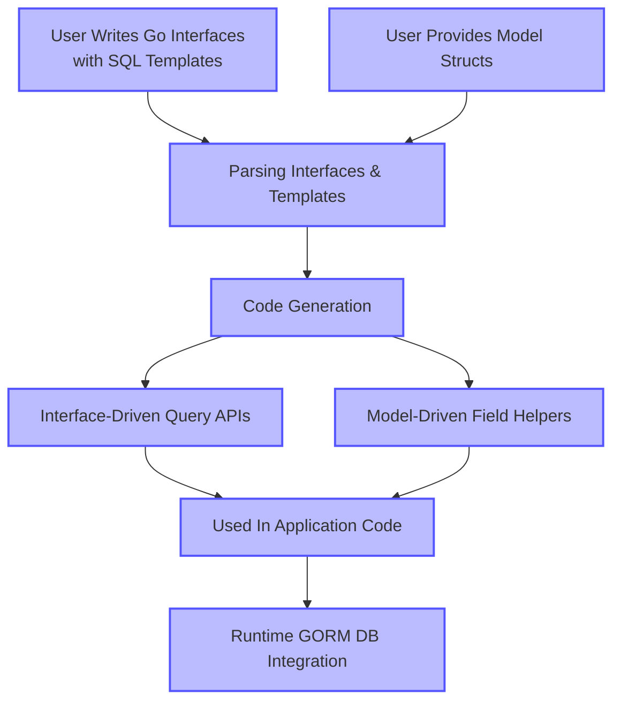

# Type-Safety and Fluent API Design

GORM CLI empowers Go developers with **compile-time type safety and fluent query APIs** tailored for GORM projects. This page dives deep into how GORM CLI transforms user-defined interfaces and model structs into powerful, type-safe, and discoverable methods that elevate developer productivity and code reliability.

---

## Introduction

At the core of GORM CLI are two synergistic generators:

- **Interface-driven query APIs:** You write Go interfaces with embedded SQL templates in method comments. GORM CLI parses these and generates concrete methods that are strongly typed and safe.
- **Model-driven field helpers:** From your Go model structs, GORM CLI generates field helpers that enable expressive, typesafe construction of predicates (filters), updates, and association operations.

Together, these components provide a fluent API with compile-time guarantees, reducing runtime errors and eliminating boilerplate code.

---

## Interface-Driven Query APIs: From Interface to Method

### User Intent

You want to declare your data access patterns clearly and concisely in Go interfaces, embedding SQL templates that describe your queries.

### How it Works

1. **Write interfaces with SQL templates:**

   ```go
   type Query[T any] interface {
       // SELECT * FROM @@table WHERE id=@id
       GetByID(id int) (T, error)

       // where("name=@name AND age=@age")
       FilterByNameAndAge(name string, age int)
   }
   ```

2. **SQL Template DSL:**

   GORM CLI supports placeholders and directives:

   - `@@table` resolves to the mapped table name for the model.
   - `@@column` allows dynamic column binding.
   - `@param` maps Go method parameters to SQL placeholders safely.
   - Control flow directives `{{if}}`, `{{where}}`, `{{for}}`, `{{set}}` enable dynamic SQL generation.

3. **Generation:**

   GORM CLI generates concrete implementations of the interfaces, producing methods that:
   - Inject `context.Context` automatically if absent.
   - Build SQL strings safely with placeholder-bound parameters.
   - Return strongly typed results (e.g., your model structs).

4. **Usage:**

   Use the generated APIs in your code for safe, type-checked queries:

   ```go
   user, err := generated.Query[User](db).GetByID(ctx, 123)
   users, err := generated.Query[User](db).FilterByNameAndAge("jinzhu", 25).Find(ctx)
   ```

### Benefits

- Avoid manual SQL string concatenation and human error.
- Gain autocomplete and compiler-checked method signatures.
- Compose complex queries declaratively.

---

## Model-Driven Field Helpers: Typesafe Filtering, Updating, and Associations

### User Intent

While querying, updating, or managing relationships, you want to write safe, clear, and fluent expressions for conditions, updates, and association operations without risking SQL injection or type mismatches.

### How it Works

From your model structs, GORM CLI generates field helpers for all the struct fields:

- **Basic Fields** get typed helpers corresponding to their Go types (e.g., `field.Number[int]` or `field.String`).
- **Associations** are exposed as specialized helpers, such as `field.Struct[T]` for one-to-one or `field.Slice[T]` for one-to-many/many-to-many.

### Example

```go
// Model example
type User struct {
    ID    uint
    Name  string
    Age   int
    Pets  []*Pet
}

// Generated helpers
generated.User.ID.Eq(1)                  // id = 1
generated.User.Name.Like("%jinzhu%")   // name LIKE '%jinzhu%'
generated.User.Age.Between(18, 65)       // age BETWEEN 18 AND 65

// Query example
users, err := gorm.G[User](db).
    Where(generated.User.Age.Gt(18)).
    Find(ctx)

// Update example
err := gorm.G[User](db).
    Where(generated.User.ID.Eq(1)).
    Set(
        generated.User.Name.Set("alice"),
        generated.User.Age.Incr(1),
    ).
    Update(ctx)
```

### Associations

You can manipulate ORM relationships safely with association helpers:

- `Create` / `CreateInBatch` create related records and link them
- `Update` updates associated rows via filters
- `Unlink` removes associations without deleting rows
- `Delete` removes associated rows or join records

Example:

```go
// Create user and link one pet
gorm.G[User](db).
  Set(
    generated.User.Name.Set("alice"),
    generated.User.Pets.Create(generated.Pet.Name.Set("fido")),
  ).
  Create(ctx)

// Update pets of a user
gorm.G[User](db).
  Where(generated.User.ID.Eq(1)).
  Set(generated.User.Pets.Where(generated.Pet.Name.Eq("fido")).
    Update(generated.Pet.Name.Set("rex")),
  ).
  Update(ctx)
```

### Semantics By Association Type

| Association Type | Unlink Behavior           | Delete Behavior            |
|------------------|--------------------------|---------------------------|
| Belongs To       | Sets foreign key to NULL  | Deletes associated row(s) |
| Has One / Many   | Sets foreign key to NULL  | Deletes child row(s)      |
| Many2Many        | Removes join rows only    | Removes join rows only    |

---

## Compile-Time Safety and Fluent Interface Design

### Safety Guarantees

- **SQL Injection Prevention:** All parameters are safely bound as query parameters.
- **Type Safety:** Field helpers and query methods enforce Go types at compile time.
- **Error Handling:** Generated methods clearly distinguish between data and error returns.

### Fluent API Style

- Methods return builder interfaces, allowing chaining such as `Where(...).Set(...).Update(ctx)`.
- Field helpers provide expressive predicate constructs like `.Eq()`, `.Gt()`, `.Like()`, `.Between()`, `.IsNull()`, and increment expressions.
- Association helpers provide targeted methods allowing complex relational interactions without verbose code.

---

## Practical Tips & Best Practices

- **Define Interfaces with Clear SQL Templates:** Keep your query interfaces focused and use template directives to simplify dynamic SQL.
- **Leverage Field Helpers for Common Queries:** Use generated field helpers rather than writing raw conditions.
- **Use Associations Helpers to Manage Relationships:** Avoid manual FK handling by using association methods.
- **Define `genconfig.Config` for Custom Mapping:** Customize output paths and field helper types to fit special field handling like JSON types.
- **Always Pass `context.Context`:** Though auto-injected if omitted, explicitly passing context improves clarity.

---

## Common Pitfalls & Troubleshooting

<AccordionGroup title="Common Issues with Type-Safety and Fluent API Design">
<Accordion title="Generated Method Does Not Accept Context">
The generator automatically adds `context.Context` if your interface method doesn't declare it. If you see a mismatch, ensure your method signatures follow the expected patterns.
</Accordion>
<Accordion title="Using Custom Field Types in Structs">
When using fields with custom types such as `sql.NullTime` or JSON, map these in `genconfig.Config.FieldTypeMap` and `FieldNameMap` to correct field helpers to retain type safety.
</Accordion>
<Accordion title="Association Operations Seem Incorrect">
Confirm you understand association semantics (belongs to, has many, many2many). Unintended deletes or foreign key nullifications can occur if operation semantics are misapplied.
</Accordion>
</AccordionGroup>

---

## Diagram: Overview of Type-Safe Generation Flow



---

## See Also

- [Generating & Using Type-Safe Query APIs](/guides/core-workflows/generating-and-using-query-apis)
- [Model-Driven Field Helper Generation](/guides/core-workflows/model-driven-field-helpers)
- [Working with Associations & Relationships](/guides/advanced-patterns/working-with-associations)
- [Using Template SQL & DSL in Custom Queries](/guides/advanced-patterns/template-sql-dsl)
- [Configuring the CLI](/getting-started/setup-essentials/configuring-cli)

---

## Summary
This page explains how GORM CLI enables type-safe data access patterns by transforming SQL-embedded interfaces and Go model structs into powerful, compile-time safe, fluent APIs. Focusing on both query method generation and field helper construction, it demonstrates how to write safer, cleaner code for filters, updates, and associations with concrete examples, practical insights, and cautionary guidance.