# Association Helpers and Semantics

GORM CLI generates powerful **association helpers** that let you safely and fluently manage relationships between your database models. This page explores how association operations like **Create**, **Update**, **Unlink**, and **Delete** work on the common association types — **has one**, **has many**, **belongs to**, and **many-to-many** — and clarifies the semantics for parent and child sides.

---

## Understanding Association Helpers

Association helpers are generated as part of your model's field helpers and are accessed as typed fields that represent related models or collections. They enable you to perform operations on associated records with full type safety and composability.

- **Single associations (has one, belongs to)** are represented as `field.Struct[T]`.
- **Collection associations (has many, many-to-many)** are represented as `field.Slice[T]`.

Each generated helper exposes a set of methods encapsulating the common operations you perform on associations.

## Supported Association Types

| Association Type | Description | Example Model Relationship |
| ---------------- | ----------- | -------------------------- |
| Has One          | One-to-one where the current model "has one" related child record (child has FK to parent) | `User.Account` |
| Has Many         | One-to-many where the current model "has many" child records (children have FK to parent) | `User.Pets` |
| Belongs To       | Many-to-one where the current model "belongs to" a parent (parent referenced by FK on current model) | `User.Company` |
| Many-to-Many     | Many-to-many relationship with join table | `User.Languages`, `User.Friends` |

Polymorphic associations (e.g. `Pet.Toy` where a toy could belong to pets or other models) are also supported analogously.

## Core Operations on Associations

You operate on associations primarily within `.Set(...)` calls followed by `.Update(ctx)` or `.Create(ctx)` on parent queries. The main association actions are:

- **Create**: Insert new associated records and link to each matched parent
- **CreateInBatch**: Batch-create multiple associated records at once
- **Update**: Modify existing associated records matching optional conditions
- **Unlink**: Remove the association link but keep associated rows
- **Delete**: Delete associated rows (or join rows in many-to-many)

### Using Association Helpers in Code

Here is the general pattern:

```go
// Create a new associated record (has one / belongs to)
gorm.G[User](db).
  Where(generated.User.ID.Eq(userID)).
  Set(
    generated.User.Account.Create(
      generated.Account.Number.Set("A-001"),
    ),
  ).
  Update(ctx)

// Create many associated records (has many / many2many)
gorm.G[User](db).
  Where(generated.User.ID.Eq(userID)).
  Set(
    generated.User.Languages.CreateInBatch([]models.Language{{Code: "EN"}, {Code: "FR"}}),
  ).
  Update(ctx)

// Update associated records with conditions
gorm.G[User](db).
  Where(generated.User.ID.Eq(userID)).
  Set(
    generated.User.Pets.Where(generated.Pet.Name.Eq("fido")).
      Update(generated.Pet.Name.Set("rover")),
  ).
  Update(ctx)

// Unlink associations (removes association but keeps child rows)
gorm.G[User](db).
  Where(generated.User.ID.Eq(userID)).
  Set(generated.User.Pets.Unlink()).
  Update(ctx)

// Delete associated records (removes child rows or join rows)
gorm.G[User](db).
  Where(generated.User.ID.Eq(userID)).
  Set(generated.User.Pets.Delete()).
  Update(ctx)
```

---

## Semantics by Association Type

Though operations are uniform in syntax, their effects vary based on the association type. Understanding this is key to correctly manipulating relationships.

### Has One and Has Many

- **Create:** Inserts a new child row and links it to every matched parent by setting the correct FK on the child (child foreign key points to parent primary key).
- **Update:** Updates child rows matching optional conditions for all matched parents.
- **Unlink:** Removes the association by setting the child's foreign key to `NULL`. Child rows remain untouched.
- **Delete:** Deletes matching child rows from the database.

### Belongs To

- **Create:** Inserts or links a parent record and sets the parent's PK as foreign key on the child model.
- **Update:** Updates parent records matching conditions.
- **Unlink:** Sets the foreign key on current (child) model to `NULL` but keeps the parent rows.
- **Delete:** Deletes matched parent rows (caution: this affects the parent directly).

### Many-to-Many

- **Create:** Creates new related rows and inserts join table rows to link them.
- **CreateInBatch:** Batch-creates multiple related rows, each linked via join table to matched parents.
- **Update:** Updates related rows matching conditions.
- **Unlink:** Removes join table entries to break links; related rows remain.
- **Delete:** Removes join table entries only; the related rows themselves are not deleted.

### Polymorphic Associations

Polymorphic associations behave like has one / has many but use a type and ID pair as keys.
- Unlink clears polymorphic foreign keys (sets ID to zero, type to empty).
- Create, Update, Delete follow similar semantics to regular associations.

---

## Parent Context Operations: Create vs Update

- **Parent Create (`.Create(ctx)`):** Inserts parent rows first using the set fields, then applies the configured association operations.
- **Parent Update (`.Update(ctx)`):** Updates matched parent rows according to `.Where(...)`, then applies the association operations.

This ensures associations are connected to the correct parent rows, whether creating a new parent or updating existing ones.

---

## Common Usage Patterns & Examples

### Creating and Associating a Record
```go
_, err := gorm.G[User](db).
  Set(
    generated.User.Name.Set("alice"),
    generated.User.Pets.Create(generated.Pet.Name.Set("fido")),
  ).
  Create(ctx)
if err != nil {
  // handle error
}
```
Creates the `User` named "alice" and creates one associated `Pet` named "fido" linked via foreign key.

### Unlinking a Has Many Association
```go
_, err := gorm.G[User](db).
  Where(generated.User.ID.Eq(userID)).
  Set(generated.User.Pets.Unlink()).
  Update(ctx)
```
Unlinks all `Pet` records from the user by setting `user_id` to NULL on the `pets` table, retaining the pet records.

### Deleting Related Belongs To Parent
```go
_, err := gorm.G[User](db).
  Where(generated.User.ID.Eq(userID)).
  Set(generated.User.Company.Delete()).
  Update(ctx)
```
Deletes the `Company` record that the user belongs to (dangerous; usually use cautiously).

### Batch Link Many-to-Many Associations
```go
_, err := gorm.G[User](db).
  Where(generated.User.ID.Eq(userID)).
  Set(generated.User.Languages.CreateInBatch(
    []models.Language{{Code: "EN"}, {Code: "FR"}},
  )).
  Update(ctx)
```
Creates and links multiple `Language` records to the user in a many-to-many relationship.

---

## Practical Tips and Best Practices

- **Use Unlink to safely detach associations without data loss.** Unlink zeroes foreign keys or removes join rows but leaves related rows intact.
- **Delete should be used cautiously.** Deleting a belongs-to association deletes the parent; deleting has-many deletes child rows; deleting many-to-many deletes only join rows.
- **Use conditions with Where() to target specific associated records when updating, unlinking, or deleting.**
- **Batch creation (`CreateInBatch`) is more efficient for many-to-many or has-many associations when adding multiple related records at once.**
- **Watch out for cascading effects when deleting parent or child records.** GORM’s association delete respects foreign key constraints at the database level.

---

## Common Pitfalls and Troubleshooting

- **Association not linking:** Verify foreign keys are correctly set in your models and that you are using `.Set(...).Create(ctx)` or `.Update(ctx)` correctly.
- **Unlink leaves unexpected records linked:** Ensure your unlink conditions match only the associations you want to clear.
- **Delete removes more rows than expected:** Double-check your conditions and understand your association direction (belongs to vs has many).
- **Batch creation errors:** Confirm the input slice has valid data and matches the field helper’s model type.

If you encounter issues, consult the [Working With Associations guide](/guides/core-workflows/working-with-associations) and examples in `examples/output/models_relations_test.go`.

---

## Visualizing Parent-Child Association Operations

```mermaid
flowchart TD

  subgraph ParentOperations[Parent Query]
    ParentUpdate["Update or Create Parent Rows"]
    AssociationOps["Apply Association Operations (Create, Update, Unlink, Delete)"]
  end

  subgraph Associations[Association Operation Semantics]
    HasOneCreate["Has One: Create child row with FK set to parent PK"]
    HasManyCreate["Has Many: Create multiple child rows with FK set"]
    BelongsToCreate["Belongs To: Create parent and set child FK"]
    Many2ManyCreate["Many2Many: Create related rows + join table entries"]

    HasOneUnlink["Has One: Set child's FK to NULL"]
    HasManyUnlink["Has Many: Set child's FK to NULL"]
    BelongsToUnlink["Belongs To: Set child's FK to NULL"]
    Many2ManyUnlink["Remove join table rows"]

    HasOneDelete["Has One: Delete child rows"]
    HasManyDelete["Has Many: Delete child rows"]
    BelongsToDelete["Delete parent rows"]
    Many2ManyDelete["Remove join table rows only"]
  end

  ParentUpdate --> AssociationOps
  AssociationOps --> HasOneCreate
  AssociationOps --> HasManyCreate
  AssociationOps --> BelongsToCreate
  AssociationOps --> Many2ManyCreate

  AssociationOps --> HasOneUnlink
  AssociationOps --> HasManyUnlink
  AssociationOps --> BelongsToUnlink
  AssociationOps --> Many2ManyUnlink

  AssociationOps --> HasOneDelete
  AssociationOps --> HasManyDelete
  AssociationOps --> BelongsToDelete
  AssociationOps --> Many2ManyDelete

  classDef parentOp fill:#f0f9ff,stroke:#0066cc,stroke-width:2px;
  classDef assocOp fill:#e6f7e6,stroke:#289229,stroke-width:2px;
  class ParentOperations parentOp;
  class Associations assocOp;

```



---

## Additional Resources

- [Working With Associations guide](/guides/core-workflows/working-with-associations) — step-by-step tutorial and deeper examples.
- [Model-Driven Field Helpers](/concepts/core-concepts/model-driven-field-helpers) — to understand predicates and setters on fields.
- [Interface-Driven Queries](/concepts/core-concepts/interface-driven-queries) — for using generated APIs in your Go code.
- Example tests in `examples/output/models_relations_test.go` from the GORM CLI repository demonstrate all association operations in real code.

---

Mastering association helpers is crucial for building robust, maintainable, and safe data models with GORM CLI. Use this guide as your reference for correct semantics and implement your association operations confidently.