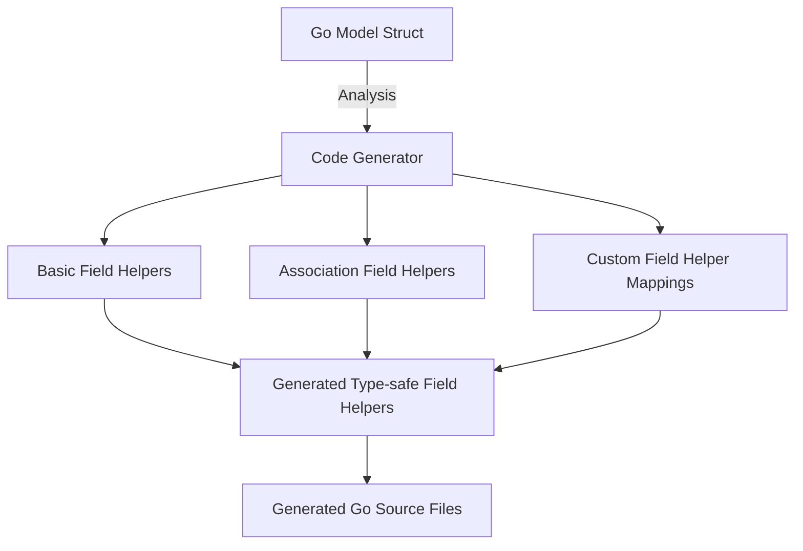

# Model-Driven Field Helpers

Explore how your Go model structs become the foundation for generating strongly-typed field helpers with GORM CLI. These helpers empower you to build fluent, type-safe queries and updates effortlessly, leveraging your existing models without writing boilerplate code.

---

## Introduction to Field Helpers

Field helpers are generated constructs that represent individual fields of your model structs as type-safe query and update builders. Instead of manually writing raw SQL or generic query expressions, you use these helpers to:

- Filter queries with concise and discoverable predicates
- Perform updates with setters that prevent common mistakes
- Express sorting (ordering) clearly
- Work with nullable fields and custom types safely
- Access and manipulate association fields intuitively

For example, a simple string model field `Name string` produces a `field.String` helper with methods like `.Eq()`, `.Like()`, and `.Set()`.

This generation transparently reflects both the basic scalar fields and the associations (has one, has many, belongs to, many2many) defined in your structs.

---

## Supported Field Types and Their Helpers

GORM CLI recognizes various Go types in your models and maps them to appropriate field helper types.

| Go Type                          | Field Helper Type           | Description                             |
| --------------------------------|----------------------------|-----------------------------------------|
| `string`                        | `field.String`              | String operations, pattern matching, regex|
| Numeric types (`int`, `uint`, `float`) | `field.Number[T]` (generic) | Numeric comparisons, increments/decrements|
| `bool`                         | `field.Bool`                | Boolean equality and state checks       |
| `time.Time`                    | `field.Time`                | Date/time comparisons and null checks  |
| Nullable types (e.g., `sql.NullInt64`, `sql.NullTime`) | `field.Field[T]`             | Nullable-aware field operations          |
| Byte slices (`[]byte`)         | `field.Bytes`               | Binary data field helpers                |
| Associations (struct or slice) | `field.Struct[T]` / `field.Slice[T]`  | Association field helpers, support for complex operations |
| Custom mapped types (via `genconfig.Config`) | Custom field helpers           | Allows extending with JSON fields, enums, or other specialized types|

The generator decides helper types by analyzing your model's Go types and configured mappings.

---

## Generating Predicates for Filtering

Each field helper provides strongly-typed predicates to build database filters seamlessly. These predicates generate SQL expressions internally, preserving safety and readability.

### Common Predicate Methods

- `.Eq(value)` / `.EqExpr(expression)`: Equals comparison
- `.Neq(value)` / `.NeqExpr(expression)`: Not equals
- `.Gt(value)` / `.GtExpr(expression)`: Greater than
- `.Gte(value)` / `.GteExpr(expression)`: Greater than or equal
- `.Lt(value)` / `.LtExpr(expression)`: Less than
- `.Lte(value)` / `.LteExpr(expression)`: Less than or equal
- `.In(values...)`: Inclusion in a list
- `.NotIn(values...)`: Exclusion from a list
- `.IsNull()`: Checks for NULL
- `.IsNotNull()`: Checks for NOT NULL

### String-Specific Predicates

- `.Like(pattern)` / `.NotLike(pattern)`: Pattern matching
- `.ILike(pattern)` / `.NotILike(pattern)`: Case-insensitive LIKE
- `.Regexp(pattern)` / `.NotRegexp(pattern)`: Regex matching

### Usage Example

```go
// Filter users with name like 'jinzhu' and age > 18
users, err := gorm.G[models.User](db).
  Where(generated.User.Name.Like("%jinzhu%"), generated.User.Age.Gt(18)).
  Find(ctx)
```

### Tips

- Use `.Expr()` and `.SetExpr()` for crafting custom SQL expressions.
- Combine multiple predicates by passing them as parameters to `Where()`.

---

## Setters for Updates and Creates

Field helpers offer `Set()` and `SetExpr()` methods for creating assignment expressions used in `UPDATE` and `CREATE` operations.

### Methods

- `.Set(value)`: Assign a specific value to the field.
- `.SetExpr(expression)`: Assign the result of an expression or another field.

### Additional Setter Capabilities

- Numeric fields support increment and decrement expressions (e.g., `.Incr(n)`, `.Decr(n)`).
- String fields offer transformation operations like `.Upper()`, `.Lower()`, `.Trim()`, `.Concat(value)` useful in updates.

### Usage Example

```go
// Update user 'bob', increment age and uppercase the name
rows, err := gorm.G[models.User](db).
  Where(generated.User.Name.Eq("bob")).
  Set(
    generated.User.Age.Incr(1),
    generated.User.Name.Upper(),
  ).
  Update(ctx)
```

### Best Practices

- Use `Set()` for straightforward value assignments.
- Employ `SetExpr()` to leverage raw SQL expressions safely.
- Combine multiple setters in a single `Set()` call to batch updates.

---

## Association Mapping and Helpers

GORM CLI converts associations in your models into specialized field helpers to support operations on related data with type safety.

### Association Types Supported

- **Has One / Has Many**: Represented as `field.Struct[T]` or `field.Slice[T]`.
- **Belongs To**: `field.Struct[T]` that links to the parent entity.
- **Many2Many**: `field.Slice[T]` reflecting join tables.
- **Polymorphic Associations**: Supported transparently with appropriate helper generation.

### Operations on Associations

Association helpers come with methods to:

- `Create()`: Insert and link related rows
- `CreateInBatch()`: Batch insert and link
- `Update()`: Update related entities with optional filters
- `Unlink()`: Remove association links (e.g., setting foreign keys to NULL or removing join rows)
- `Delete()`: Delete the associated rows themselves

### Example Workflow

```go
// Create a new user with a pet
err := gorm.G[models.User](db).
  Set(
    generated.User.Name.Set("alice"),
    generated.User.Pets.Create(generated.Pet.Name.Set("fido")),
  ).
  Create(ctx)

// Update pet where name='fido' for user with ID 1
err := gorm.G[models.User](db).
  Where(generated.User.ID.Eq(1)).
  Set(generated.User.Pets.Where(generated.Pet.Name.Eq("fido")).Update(generated.Pet.Name.Set("rex"))).
  Update(ctx)

// Unlink all pets from user 1
err := gorm.G[models.User](db).
  Where(generated.User.ID.Eq(1)).
  Set(generated.User.Pets.Unlink()).
  Update(ctx)
```

### Important Associations Semantics

| Association Type  | Unlink Effect                            | Delete Effect                           |
|-------------------|------------------------------------------|----------------------------------------|
| belongs to        | Sets parent FK to `NULL`                  | Removes associated rows                |
| has one / has many| Sets child FK to `NULL`                   | Deletes child rows                     |
| many2many         | Removes join table rows only               | Removes join table rows only           |

---

## Customizing Field Handling

You can tailor generated field helpers using `genconfig.Config` to handle custom types and advanced field mapping strategies.

### Mapping Go Types to Custom Helpers

Define your own helper types (e.g., for JSON columns) and associate them with Go native types via `FieldTypeMap` or field tag-based rules in `FieldNameMap`.

```go
var _ = genconfig.Config{
  FieldNameMap: map[string]any{
    "json": JSON{},  // map fields with `gen:"json"` tag to JSON helper
  },
}
```

### Annotating Fields in Models

Add struct tags like `gen:"json"` to map certain fields to your custom helpers.

### Example: JSON Field Helper

```go
type JSON struct{ column clause.Column }

func (j JSON) Equal(path string, value any) clause.Expression {
  // Custom SQL for different databases
}
```

In the model:

```go
type User struct {
  Profile string `gen:"json"`
}
```

Querying by JSON attribute:

```go
user, err := gorm.G[models.User](db).
  Where(generated.User.Profile.Equal("$.vip", true)).
  Take(ctx)
```

### Best Practices for Customization

- Use `genconfig.Config` in the same package as your models for automatic picking during generation.
- Prefer field tags for granular control without affecting other files.
- Test generated code to ensure your custom helpers produce valid SQL.

---

## Practical Tips & Common Pitfalls

- **Keep Column Names Consistent**: The generated helpers match your DB column names, including snake_case conventions. Avoid modifying DB names without updating model struct tags.

- **Nullable Fields**: Use the field helpers for nullable types (e.g., `sql.NullInt64`) carefully; leverage `IsNull()` and `IsNotNull()` predicates for NULL conditions.

- **Chaining Conditions**: Combine multiple predicates for complex filters by passing them all to `Where()`, ensuring intuitive, composable queries.

- **Zero Values in Updates**: Use `Set()` explicitly with zero values (e.g., empty string, zero int, false) to overwrite database values safely.

- **Association Operations Need Context**: When using association helpers like `Unlink()` or `Delete()`, ensure your `Where()` filters correctly identify the parent records to avoid unintended changes.

- **Custom Field Helpers Require Correct Mapping**: Mapping custom types or fields requires a correct `genconfig.Config` setup; otherwise, generation may fallback to default types.

---

## Diagram: Model Struct to Field Helpers Generation Flow



The generator analyzes Go structs, detects basic fields, associations, and applies any configured custom mappings, producing strongly typed field helpers for use in queries and updates.

---

## Summary

Model-driven field helpers represent the bridge between your Go models and concise, type-safe, fluent database operations. They simplify query building, updates, and handling of relational data while offering customization paths to handle complex or user-defined field behaviors.

Harnessing these helpers unlocks a new level of developer productivity and confidence in your GORM-powered applications.

---

## Further Reading and Related Documentation

- [Working with Field Helpers Guide](https://gorm.io/docs/guides/advanced-features-patterns/working-with-field-helpers) — Deep dive into practical usage
- [Customizing Generation Configuration](https://gorm.io/docs/guides/advanced-features-patterns/customizing-generation-config) — How to map custom types
- [Association Operations Guide](https://gorm.io/docs/guides/advanced-features-patterns/association-operations) — Association best practices
- [Template-based Query DSL](https://gorm.io/docs/guides/core-workflows/template-queries-quickstart) — Crafting dynamic queries
- [Core Concepts & Terminology](https://gorm.io/docs/concepts/architecture-core-concepts-query-interfaces) — Foundational ideas behind GORM CLI
- [Examples Directory](https://github.com/go-gorm/cli/tree/main/examples) — Explore generated helpers in tests

---

Explore the power of model-driven field helpers today to write safer, cleaner, and more expressive database interaction code with GORM CLI!