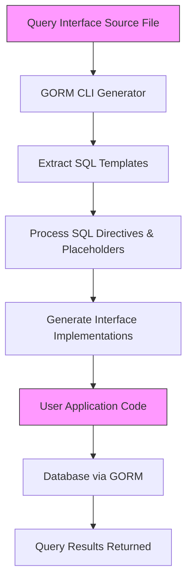

# Interface-Driven Query APIs

Discover how GORM CLI empowers you to build declarative, type-safe, and flexible database query APIs by writing Go interfaces annotated with expressive SQL templates. This page explores how query interfaces leverage templated SQL directly within Go method comments to generate fluent, context-aware query methods that seamlessly integrate with GORM.

---

## What Are Interface-Driven Query APIs?

Interface-driven query APIs enable you to declare the intent and structure of your database queries in Go interfaces using embedded SQL template annotations. The GORM CLI generator translates these annotated interfaces into concrete, type-safe implementations that produce efficient and maintainable SQL execution with compile-time safety.

This approach shifts your workflow from writing raw SQL strings in code to defining clear, reusable query contracts that expose rich query capabilities via method signatures.

## How They Work: The Declarative Flow

1. **Define interfaces with embedded SQL templates**: Write Go interfaces where each method includes a comment section with annotated SQL or templated SQL fragments, using placeholders and directives.

2. **Run the GORM CLI generator**: The tool parses your interfaces, extracts SQL templates, applies any configured mappings, and produces generated Go code implementing the interfaces.

3. **Use the generated query methods**: Call generated methods on the returned interface implementation to perform queries that are both expressive and statically checked.

### Example Interface Declaration

```go
// Query defines database query methods with templated SQL annotations
// for the generic type T representing a model.
type Query[T any] interface {
  // GetByID fetches a record by its ID with a name filter
  //
  // SELECT * FROM @@table WHERE id=@id AND name = "\@name"
  GetByID(id int) (T, error)

  // FilterWithColumn selects records matching dynamic column = value
  //
  // SELECT * FROM @@table WHERE @@column=@value
  FilterWithColumn(column string, value string) (T, error)

  // QueryWith runs a conditional query based on User fields
  //
  // SELECT * FROM @@table
  //   {{if user.ID > 0}}
  //       WHERE id=@user.ID
  //   {{else if user.Name != ""}}
  //       WHERE name=@user.Name
  //   {{end}}
  QueryWith(user models.User) (T, error)

  // UpdateInfo updates user info conditionally with dynamic SET
  //
  // UPDATE @@table
  //  {{set}}
  //    {{if user.Name != ""}} name=@user.Name, {{end}}
  //    {{if user.Age > 0}} age=@user.Age, {{end}}
  //    {{if user.Age >= 18}} is_adult=1 {{else}} is_adult=0 {{end}}
  //  {{end}}
  // WHERE id=@id
  UpdateInfo(user models.User, id int) error

  // Filter filters records matching any user in users slice
  //
  // SELECT * FROM @@table
  // {{where}}
  //   {{for _, user := range users}}
  //     {{if user.Name != "" && user.Age > 0}}
  //       (name = @user.Name AND age=@user.Age AND role LIKE concat("%",@user.Role,"%")) OR
  //     {{end}}
  //   {{end}}
  // {{end}}
  Filter(users []models.User) ([]T, error)

  // FilterByNameAndAge filters by name and age via a WHERE clause
  //
  // where("name=@name AND age=@age")
  FilterByNameAndAge(name string, age int)

  // FilterWithTime filters records by created_at time range
  //
  // SELECT * FROM @@table
  //  {{where}}
  //    {{if !start.IsZero()}}
  //      created_at > @start
  //    {{end}}
  //    {{if !end.IsZero()}}
  //      AND created_at < @end
  //    {{end}}
  //  {{end}}
  FilterWithTime(start, end time.Time) ([]T, error)
}
```

This interface uses the following key template directives and placeholders:

| Directive / Placeholder | Description                                                                                 |
|-------------------------|---------------------------------------------------------------------------------------------|
| `@@table`               | Replaces with the current model's database table name                                      |
| `@@column`              | Dynamically injects a column name                                                          |
| `@param`                | Binds Go method parameters to SQL parameters                                               |
| `{{where}}...{{end}}`   | Conditionally encloses WHERE clauses based on parameter values                             |
| `{{set}}...{{end}}`     | Conditionally builds SET clauses for UPDATE statements                                    |
| `{{if ...}}...{{end}}`  | Includes SQL fragments only if conditions validate                                         |
| `{{for ...}}...{{end}}` | Iterates over collections for constructing complex WHERE expressions                       |

## Connecting Go Types to SQL Templates

The generator directly maps Go method parameters, including struct fields, to SQL parameters. For example, fields in the `models.User` struct passed as a method argument can dynamically determine parts of the WHERE clause using conditional directives.

This creates a powerful declarative querying mechanism tied to your Go domain types.

## Generated Code Example

After running the generator, a corresponding implementation is created (simplified excerpt):

```go
func (e _QueryImpl[T]) GetByID(ctx context.Context, id int) (T, error) {
  var sb strings.Builder
  params := make([]any, 0, 2)

  sb.WriteString("SELECT * FROM ? WHERE id=? AND name = \"@name\"")
  params = append(params, clause.Table{Name: clause.CurrentTable}, id)

  var result T
  err := e.Raw(sb.String(), params...).Scan(ctx, &result)
  return result, err
}
```

This shows how the template is transformed by replacing `@@table` with a placeholder (`clause.Table{Name: clause.CurrentTable}`) and binding `id` as a parameter.

## Using Generated Query APIs

The resulting typed query APIs provide straightforward and safe methods.

Example usage from tests:

```go
query := Query[models.User](db)

// Fetch user by ID
user, err := query.GetByID(ctx, 123)

// Filter by dynamic column
u, err := query.FilterWithColumn(ctx, "role", "admin")

// Query using struct fields
result, err := query.QueryWith(ctx, models.User{Name: "dan"})

// Update user conditionally
err = query.UpdateInfo(ctx, models.User{Name: "Alice", Age: 25}, 1)

// Complex filtering with slices
users, err := query.Filter(ctx, []models.User{{Name: "alice", Age: 20}})

// Fluent filtering chaining
query.FilterByNameAndAge(ctx, "bob", 30).Find(ctx)

// Filter records within a time range
results, err := query.FilterWithTime(ctx, startTime, endTime)
```

These methods encapsulate SQL details while preserving flexibility and clarity.

## Best Practices

- **Always use context.Context**: The generator automatically injects `context.Context` parameters if missing.
- **Use meaningful parameter names**: To improve readability of templates and generated code.
- **Leverage conditional directives**: For dynamic SQL that safely adapts to variable inputs.
- **Combine with model-driven helpers**: For expressive filtering and updates.
- **Test generated code**: Validation tests like those in `examples/output/query_test.go` ensure correctness.
- **Configure mappings in genconfig**: Map custom field types appropriately to support complex templates.

## Common Pitfalls and Troubleshooting

<AccordionGroup title="Common Issues and Solutions">
<Accordion title="SQL Template Syntax Errors">
Improperly closed `{{if}}` or `{{for}}` directives may cause generation failures. Always match opening and closing directives and validate your templates.
</Accordion>
<Accordion title="Undefined Parameters in Templates">
Reference only method parameters or struct fields that exist. The generator binds parameters based on method signatures; using unknown names will cause errors.
</Accordion>
<Accordion title="Unmapped Custom Types">
If your model includes custom field types, add field mappings via `genconfig.Config` to connect them to appropriate field helpers, ensuring query code generation supports their use.
</Accordion>
<Accordion title="Context Parameter Missing">
The generator appends `context.Context` if the method doesn't specify it, but explicit declaration is recommended for clarity.
</Accordion>
</AccordionGroup>

## How This Fits into the GORM CLI Architecture

Interface-driven query APIs are one of the two foundational pillars of the GORM CLI tool (the other being model-driven field helpers). Together they generate:

- **Typed, fluent query methods matching your domain models**
- **Compile-time safety and reduced boilerplate**
- **Integration with core GORM APIs via interfaces and fluent chaining**

This documentation complements guides on [Model-Driven Field Helpers](https://gorm.io/docs/concepts/model-driven-field-helpers) and [Template DSL and SQL Templating](https://gorm.io/docs/concepts/template-dsl).

## Visualizing the Query API Data Flow




## Summary

Interface-driven query APIs offer a declarative, flexible, and type-safe method to write SQL queries embedded in Go interfaces. This technique dramatically reduces boilerplate and aligns well with idiomatic Go code, enabling faster development with fewer runtime errors.

---

## Additional Resources

- [Quick Start: Generate and Use APIs](/getting-started/first-run/quickstart-sample)
- [Template DSL and SQL Templating](/concepts/core-concepts/template-dsl)
- [Model-Driven Field Helpers](/concepts/core-concepts/model-driven-field-helpers)
- [Generation Configuration](/concepts/customization-configuration/generation-configuration)
- [Example Queries Source](examples/query.go)
- [Generated Output Example](examples/output/query.go)
- [Integration with GORM](/concepts/architecture-overview/integration-with-gorm)


<Check>
Ensure your interfaces include detailed SQL templates with correct placeholders for best generation results.
</Check>

---

## Example: Full Interface with SQL Template Comments

```go
package examples

import (
  "time"
  "gorm.io/cli/gorm/examples/models"
)

type Query[T any] interface {
  // SELECT * FROM @@table WHERE id=@id
  GetByID(id int) (T, error)

  // SELECT * FROM @@table WHERE @@column=@value
  FilterWithColumn(column string, value string) (T, error)

  // SELECT * FROM @@table
  // {{where}}
  //   {{if user.Name != ""}} name=@user.Name {{end}}
  //   {{if user.Age > 0}} AND age=@user.Age {{end}}
  // {{end}}
  QueryWith(user models.User) (T, error)

  // UPDATE @@table
  // {{set}}
  //   {{if user.Name != ""}} name=@user.Name, {{end}}
  //   {{if user.Age > 0}} age=@user.Age, {{end}}
  //   {{if user.Age >= 18}} is_adult=1 {{else}} is_adult=0 {{end}}
  // {{end}}
  // WHERE id=@id
  UpdateInfo(user models.User, id int) error

  // SELECT * FROM @@table
  // {{where}}
  //   {{for _, user := range users}}
  //     {{if user.Name != "" && user.Age > 0}}
  //       (name = @user.Name AND age=@user.Age AND role LIKE concat("%",@user.Role,"%")) OR
  //     {{end}}
  //   {{end}}
  // {{end}}
  Filter(users []models.User) ([]T, error)

  // where("name=@name AND age=@age")
  FilterByNameAndAge(name string, age int)

  // SELECT * FROM @@table
  // {{where}}
  //   {{if !start.IsZero()}}
  //     created_at > @start
  //   {{end}}
  //   {{if !end.IsZero()}}
  //     AND created_at < @end
  //   {{end}}
  // {{end}}
  FilterWithTime(start, end time.Time) ([]T, error)
}
```

This interface encapsulates varied query patterns, from simple primary key lookups to conditionally dynamic, iterative, and update queries.

---