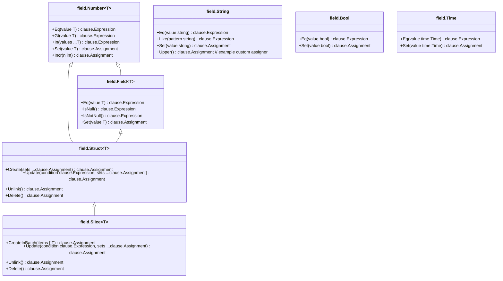

# Model-Driven Field Helpers

Learn how your struct fields and associations become dynamic, type-safe helpers for filtering, updates, and associations. Discover the rules for field inclusion, supported types, and association mapping.

---

## Introduction

Model-driven field helpers are generated Go variables that mirror your GORM model structs. Each field in your model gains a corresponding type-safe helper designed to facilitate concise and safe database operations such as filtering (`WHERE` clauses), updating, ordering, and handling associations.

These helpers create a seamless, expressive, and compile-time safe way to build queries without writing raw SQL strings manually. They enhance productivity by providing fluent APIs for common database operations directly tied to your model definitions.

## Why Field Helpers Matter

Imagine you need to query users where `age > 18` and `role = 'active'`. Normally, you'd write SQL or build GORM query clauses manually, risking typos and runtime errors.

With generated field helpers, your query flow looks like:

```go
gorm.G[models.User](db).
    Where(generated.User.Age.Gt(18), generated.User.Role.Eq("active")).
    Find(ctx)
```

This approach provides:

- **Type safety:** All fields and operators are checked at compile time.
- **IntelliSense support:** Auto-completion for fields and methods.
- **Reduced boilerplate:** No need to remember column names or write repetitive code.


## How Field Helpers Are Generated

GORM CLI reads your Go model struct definitions and produces field helpers by adhering to specific inclusion rules:

### Inclusion Rules for Fields

- **Basic fields:** These include primitives like `int`, `string`, `bool`, `float`, `time.Time`, and byte slices.
- **Named types implementing key interfaces:** Types that implement `database/sql.Scanner`, `database/sql/driver.Valuer`, or GORM's own `Valuer` and `SerializerInterface`. These allow custom field handling.
- **Nullable fields:** Support for nullable types like `sql.NullInt64`, `sql.NullTime`, etc.

### Handling Associations

Relationship fields are detected and categorized into appropriate helpers:

| Association Type      | Helper Generated                |
|----------------------|--------------------------------|
| `has one`            | `field.Struct[T]` helper        |
| `has many`           | `field.Slice[T]` helper         |
| `belongs to`         | `field.Struct[T]` helper        |
| `many2many`          | `field.Slice[T]` helper         |
| Polymorphic relations| Supported via `field.Slice` or `field.Struct` helpers with polymorphic metadata|

Each association helper provides actions like `Create`, `CreateInBatch`, `Update`, `Unlink`, and `Delete` aligned with the semantics of that relationship.

### Sample Generated Variables

Here is an excerpt from generated helpers for a `User` model: 

```go
var User = struct {
    ID        field.Number[uint]
    Name      field.String
    Age       field.Number[int]
    Role      field.String
    IsAdult   field.Bool
    Profile   examples.JSON // Custom JSON field helper

    Account   field.Struct[models.Account]   // has one
    Pets      field.Slice[models.Pet]       // has many
    Company   field.Struct[models.Company]   // belongs to
    Team      field.Slice[models.User]       // has many (self-reference)
    Languages field.Slice[models.Language]   // many2many
} {
    ID:        field.Number[uint]{}.WithColumn("id"),
    Name:      field.String{}.WithColumn("name"),
    Age:       field.Number[int]{}.WithColumn("age"),
    Role:      field.String{}.WithColumn("role"),
    IsAdult:   field.Bool{}.WithColumn("is_adult"),
    Profile:   examples.JSON{}.WithColumn("profile"),

    Account:   field.Struct[models.Account]{}.WithName("Account"),
    Pets:      field.Slice[models.Pet]{}.WithName("Pets"),
    Company:   field.Struct[models.Company]{}.WithName("Company"),
    Team:      field.Slice[models.User]{}.WithName("Team"),
    Languages: field.Slice[models.Language]{}.WithName("Languages"),
}
```

## Using Model-Driven Field Helpers

### Filtering Records

You can build complex, type-safe conditions like this:

```go
users, err := gorm.G[models.User](db).
    Where(
        generated.User.Age.Gt(18),
        generated.User.Role.Eq("active"),
    ).
    Find(ctx)
```

### Updating Records with Setters

Field helpers generate setter methods to update values, including zero values and SQL expressions:

```go
// Set role to active for users where role is pending
rows, err := gorm.G[models.User](db).
    Where(generated.User.Role.Eq("pending")).
    Set(generated.User.Role.Set("active")).
    Update(ctx)
```

Supports more complex updates:

```go
// Increment age by 1
rows, err := gorm.G[models.User](db).
    Where(generated.User.Name.Eq("bob")).
    Set(generated.User.Age.SetExpr(clause.Expr{SQL: "age + ?", Vars: []any{1}})).
    Update(ctx)
```

### Creating Records with Field Helpers

You can also create new records using `Set(...)` to specify fields:

```go
err := gorm.G[models.User](db).
    Set(
        generated.User.Name.Set("alice"),
        generated.User.Age.Set(29),
        generated.User.Role.Set("active"),
    ).
    Create(ctx)
```

### Working with Associations

Association helpers provide rich operations you can chain with your main model updates:

```go
// Create a new user with a pet
err := gorm.G[models.User](db).
    Set(
        generated.User.Name.Set("alice"),
        generated.User.Pets.Create(generated.Pet.Name.Set("fido")),
    ).
    Create(ctx)

// Update pets where name='fido'
gorm.G[models.User](db).
    Where(generated.User.ID.Eq(1)).
    Set(
        generated.User.Pets.Where(generated.Pet.Name.Eq("fido")).Update(generated.Pet.Name.Set("rex")),
    ).
    Update(ctx)

// Unlink all pets from a user
gorm.G[models.User](db).
    Where(generated.User.ID.Eq(1)).
    Set(
        generated.User.Pets.Unlink(),
    ).
    Update(ctx)
```

### Tips & Best Practices

- **Use zero-value setters** to explicitly set fields to default values or NULL (e.g., empty string, `false`, zero int).
- **Chain conditions with multiple helpers** in `Where` for precise filtering.
- **Leverage association helpers** for relational operations to maintain data integrity.
- **Consider `SetExpr`** for custom SQL expressions like increments or conditional updates.

### Common Pitfalls

- Forgetting to include `context.Context` in manual query methods when interfacing with generated APIs.
- Expecting association unlink or delete behavior identical to normal deletes; each association type has nuanced semantics.
- Using fields without correct tags or unsupported types may lead to missing helpers.

## Rules for Supported Types and Field Mapping

GORM CLI recognizes standard Go types and key interfaces to generate helpers:

- Basic primitives map to helpers like `field.Number[T]`, `field.String`, `field.Bool`, and `field.Time`.
- Nullable fields like `sql.NullInt64` get mapped to `field.Field[sql.NullInt64]`.
- Named types with `gen:"<name>"` tags can be mapped to custom helpers (e.g., a JSON helper) via `FieldNameMap` configuration.
- Structs representing associations are mapped to `field.Struct[T]` (single related) or `field.Slice[T]` (collections).

### Custom Field Mapping Example

```go
var _ = genconfig.Config{
    FieldNameMap: map[string]any{
        "json": JSON{},       // Map fields tagged with `gen:"json"` to custom JSON helper
    },
}
```

This allows you to integrate specialized SQL generation like JSON path queries.

## Integration with Query APIs

Field helpers work hand-in-hand with GORM CLI’s interface-driven query APIs to provide a complete database querying toolkit:

- Build filters and conditions with field helpers.
- Pass those predicates into generated query interface methods.
- Combine with the generator’s SQL template DSL for custom queries.

This layered approach ensures safe, idiomatic Go code with minimal runtime errors and maximum clarity.

## Troubleshooting

### Common Issues

| Problem                                  | Solution                                                  |
|------------------------------------------|-----------------------------------------------------------|
| Missing field helpers for fields or types| Ensure fields use supported types/interfaces or are correctly tagged and mapped in config. |
| Association helpers but operations fail  | Review association type and semantics; confirm foreign keys and tags on model fields. |
| Queries unexpectedly return no results   | Verify predicates use correct field helpers and database contains data; check zero-value conditions carefully. |
| Setting zero or NULL values doesn’t persist | Use `.Set` helpers explicitly with zero values or `sql.Null*` types as appropriate. |

### Tips for Success

- Regularly regenerate code after model changes.
- Use the comprehensive tests and examples to validate behavior.
- Review generated code under `examples/output` for insights.

## Related Documentation

- [Using Field Helpers for Filters, Updates, and Ordering](https://gorm.io/docs/guides/core-workflows/model-driven-helpers)
- [Handling Associations: Create, Update, Unlink & Delete](https://gorm.io/docs/guides/core-workflows/working-with-associations)
- [Interface-Driven Query APIs](https://gorm.io/docs/concepts/core-concepts/interface-driven-queries)
- [Generation Configuration & Custom Field Mapping](https://gorm.io/docs/concepts/customization/generation-configuration)

---

## Visual Overview of Field Helper Types



This class diagram summarizes the hierarchy and main methods available in the generated field helper types.

---

## Summary

Model-driven field helpers automatically map your struct fields and associations into rich, fluent, and type-safe Go variables. They make CRUD and associated operations safer, expressive, and more maintainable. By understanding the rules, supported types, and generated API semantics, you can unlock powerful patterns for database interaction tightly aligned with your GORM models.

---