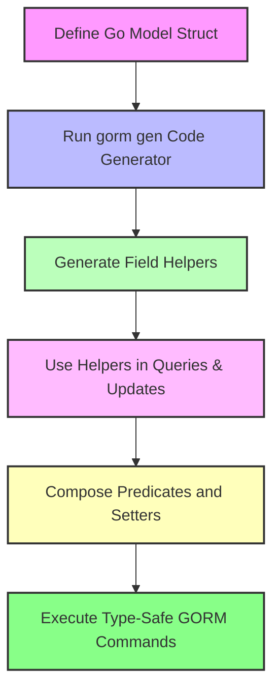

# Field Helpers and Predicates

Explore the power and purpose of **field helpers**—generated, type-safe methods for your model fields that simplify composing queries, filters, and updates in a fluent, compile-time safe way. Field helpers abstract raw SQL details, enabling you to focus on expressing your intent clearly and safely in Go.

---

## What Are Field Helpers?

Field helpers are generated for each field in your model structs during the GORM CLI code generation process. They provide type-safe methods to construct **predicates** (conditions) for filtering, as well as **setters** for updates and inserts.

Instead of manually writing raw SQL or generic GORM clauses, you use these domain-specific helpers to compose queries like `Age.Gt(18)` or updates like `Name.Set("alice")` that map directly to SQL expressions.

### Why Field Helpers Matter

- **Type Safety:** Compile-time checking ensures fields are used correctly with matching types.
- **Expressiveness:** Fluent, self-documenting API for common SQL operations.
- **Maintainability:** Changes to model fields automatically generate up-to-date helpers.
- **Safe Defaults:** Abstract complexity of SQL syntax, avoiding injection and errors.

---

## Common Operations and Their Helpers

The generated field helpers provide a rich set of operations tailored to the field type. Below is a categorized overview with examples.

### Predicates (Filters)

You use predicates to filter records in `Where` clauses and queries.

| Operation           | Description                                       | Example Code                        | Generated SQL                             |
|---------------------|-------------------------------------------------|------------------------------------|-----------------------------------------|
| `Eq(value)`         | Equals                                           | `generated.User.Age.Eq(30)`        | `age = 30`                              |
| `Neq(value)`        | Not equals                                       | `generated.User.Status.Neq("active")` | `status <> 'active'`                     |
| `Gt(value)`         | Greater than                                    | `generated.User.Age.Gt(18)`       | `age > 18`                              |
| `Gte(value)`        | Greater than or equal                           | `generated.User.Age.Gte(18)`      | `age >= 18`                             |
| `Lt(value)`         | Less than                                       | `generated.User.Age.Lt(65)`       | `age < 65`                              |
| `Lte(value)`        | Less than or equal                              | `generated.User.Age.Lte(65)`      | `age <= 65`                             |
| `Between(start, end)`| Value falls between a range                      | `generated.User.Age.Between(18, 65)` | `age BETWEEN 18 AND 65`                 |
| `Like(pattern)`     | SQL LIKE pattern (strings)                       | `generated.User.Name.Like("%jinzhu%")` | `name LIKE '%jinzhu%'`                 |
| `In(values...)`     | Included in a set of values                       | `generated.User.Role.In("admin", "user")` | `role IN ('admin', 'user')`         |
| `IsNull()`          | Field is NULL                                   | `generated.User.Score.IsNull()`   | `score IS NULL`                         |
| `IsNotNull()`       | Field is NOT NULL                               | `generated.User.LastLogin.IsNotNull()` | `last_login IS NOT NULL`               |

### Setters (Updates & Creates)

Setters build assignment expressions for update or insert operations.

| Operation               | Description                                     | Example Code                            | Generated SQL Assignment                     |
|-------------------------|-------------------------------------------------|----------------------------------------|---------------------------------------------|
| `Set(value)`            | Set field to a value                            | `generated.User.Name.Set("alice")`  | `name = 'alice'`                            |
| `SetExpr(clause.Expr)`  | Set field to a SQL expression                    | `generated.User.Age.SetExpr(clause.Expr{SQL: "GREATEST(?, ?)", Vars: []any{18, 65}})` | `age = GREATEST(18, 65)`        |
| `Incr(amount)`          | Increment numeric field by amount                | `generated.User.Age.Incr(1)`           | `age = age + 1`                             |
| `Upper()`               | Set string to uppercase (expression-based)      | `generated.User.Name.Upper()`              | `UPPER(name)` (database-specific SQL)       |

---

## How Field Helpers Work in Practice

Field helpers are used **with** GORM’s query builder to create readable, type-safe database interactions.

For example:

```go
// Query users with age greater than 18 and role 'active'
users, err := gorm.G[User](db).
    Where(
        generated.User.Age.Gt(18),
        generated.User.Role.Eq("active"),
    ).
    Find(ctx)
```

This generates a SQL: `SELECT * FROM users WHERE age > 18 AND role = 'active'`.

Similarly, to update a user's role safely:

```go
_, err := gorm.G[User](db).
    Where(generated.User.Name.Eq("bob")).
    Set(generated.User.Role.Set("admin")).
    Update(ctx)
```

This will create a parameterized SQL update statement setting the role.

### Creating with Setters

Use `Set(...)` with `.Create(ctx)` to initialize fields when inserting:

```go
gorm.G[User](db).
    Set(
        generated.User.Name.Set("alice"),
        generated.User.Age.Set(25),
        generated.User.IsAdult.Set(true),
    ).
    Create(ctx)
```

---

## Under-the-Hood: How Types and Fields Map

- Primitive types (int, string, bool, time.Time, etc.) generate appropriate predicates and setters.
- Nullable types (e.g., `sql.NullInt64`) have additional `IsNull()` and `IsNotNull()` predicates.
- Fields with struct or slice types that represent associations generate **Struct[T]** or **Slice[T]** helpers (covered in association helpers documentation).
- Custom field mappings can override the default type helpers, such as JSON support.

This mapping ensures predictive method availability and type correctness, which reduces runtime errors and improves IDE autocompletion.

---

## Best Practices with Field Helpers

- **Use field helpers for all filtering and updating:** Avoid string literals or raw SQL fragments.
- **Chain predicates for AND semantics:** Provide multiple predicates to `Where()` to combine multiple conditions.
- **Leverage zero-value setters explicitly:** Use `Set()` to update fields to zero values (e.g., empty string, false, null).
- **Use `SetExpr()` for complex updates:** When you need database expressions (e.g., increments or conditional sets).
- **Apply predicates thoughtfully:** For nullable fields, prefer `IsNull()`/`IsNotNull()` over equality with Go zero values.

---

## Common Pitfalls and How to Avoid Them

<AccordionGroup title="Common Issues with Field Helpers">
<Accordion title="Missing Type-Safe Methods">
Sometimes generated helpers don’t appear because the model field’s Go type isn’t supported by default.

**Solution:**
- Check your `genconfig.Config` for field type mappings (`FieldTypeMap`).
- Map custom Go types to helpers explicitly.
- Ensure your model fields implement interfaces like `sql.Scanner` or `driver.Valuer` if using custom mapping.
</Accordion>
<Accordion title="Zero Value Updates Not Persisting">
Setting a field to a Go zero value (e.g., `0`, `false`, `""`) might be ignored if you use naive GORM update calls.

**Solution:**
- Use the generated field helper setters (`Set()`) in the fluent `Set(...).Update(ctx)` call to ensure zero values update.
</Accordion>
<Accordion title="Using Predicates in Complex Queries">
Predicates should be combined correctly; mixing raw SQL strings with helpers can cause logical errors.

**Solution:**
- Prefer combining multiple predicates inside `Where()` calls.
- For OR logic or complex grouping, consider using `clause.Or` or grouping predicates carefully.
</Accordion>
</AccordionGroup>

---

## Example Scenarios

### Filtering Users by Age and Role

```go
var users []User
if err := gorm.G[User](db).
    Where(generated.User.Age.Gt(18), generated.User.Role.Eq("active")).
    Find(ctx, &users); err != nil {
    // handle error
}
```

### Updating User Status to "active" for All Pending Users

```go
rows, err := gorm.G[User](db).
    Where(generated.User.Role.Eq("pending")).
    Set(generated.User.Role.Set("active")).
    Update(ctx)
```

### Creating a New User Record

```go
gorm.G[User](db).
    Set(
        generated.User.Name.Set("jane"),
        generated.User.Age.Set(30),
        generated.User.IsAdult.Set(true),
    ).
    Create(ctx)
```

### Incrementing Age by 1

```go
rows, err := gorm.G[User](db).
    Where(generated.User.Name.Eq("bob")).
    Set(generated.User.Age.Incr(1)).
    Update(ctx)
```

---

## Integration with GORM CLI Workflow

Field helpers are a crucial piece of the generated code alongside your query interfaces:

1. **Generate**: Run `gorm gen` with your model structs.
2. **Use**: Import the generated package containing field helpers.
3. **Compose Queries and Updates**: Use predicates and setters for safe, expressive database operations.

This synergy enables writing compact, safe, and maintainable code without sacrificing the power of raw SQL or complex GORM querying.

---

## Summary
Field helpers empower Go developers to write fluent, type-safe queries and updates with confidence. They abstract away SQL intricacies and provide a consistent API tailored to your model fields. By mastering their use, you reduce boilerplate, catch errors early, and produce clearer, safer database code.

For comprehensive usage, also explore:

- [Working with Associations](https://docs.gorm.io/guides/using-generated-apis/working-with-associations)
- [Template-Driven Queries & SQL Templates](https://docs.gorm.io/guides/using-generated-apis/template-based-queries)
- [Custom Field Helpers & JSON Support](https://docs.gorm.io/guides/advanced-usage-best-practices/json-fields-and-custom-helpers)

---

### Related Concepts

- **Predicates:** Methods generating SQL conditions.
- **Setters:** Assignments for updates and creates.
- **Associations:** Relationship helpers for related models.
- **Template SQL DSL:** Embedded template language to define query interfaces.

---

### Additional Resources

- [GORM CLI README](https://github.com/go-gorm/cli#readme)
- [Using Generated APIs Guide](https://docs.gorm.io/guides/using-generated-apis/field-helpers-basics)
- [Quickstart Code Generation](https://docs.gorm.io/guides/getting-started/quickstart-code-generation)


---

## Visualizing Field Helper Use



This flow shows the path from your model definitions through code generation to fluent, type-safe usage.

---

## Troubleshooting Tips

If helpers are missing or behave unexpectedly:

- Confirm correct model struct locations and filenames in your code generation command.
- Inspect `genconfig.Config` for unexpected includes/excludes or type mappings.
- Ensure your Go types for fields match expected primitive or mapped types.
- Run tests covering generated helpers to validate behavior.


---

Feel confident manipulating database fields with helpers that guarantee safe, readable, and robust Go code.

# End of Field Helpers and Predicates Guide
