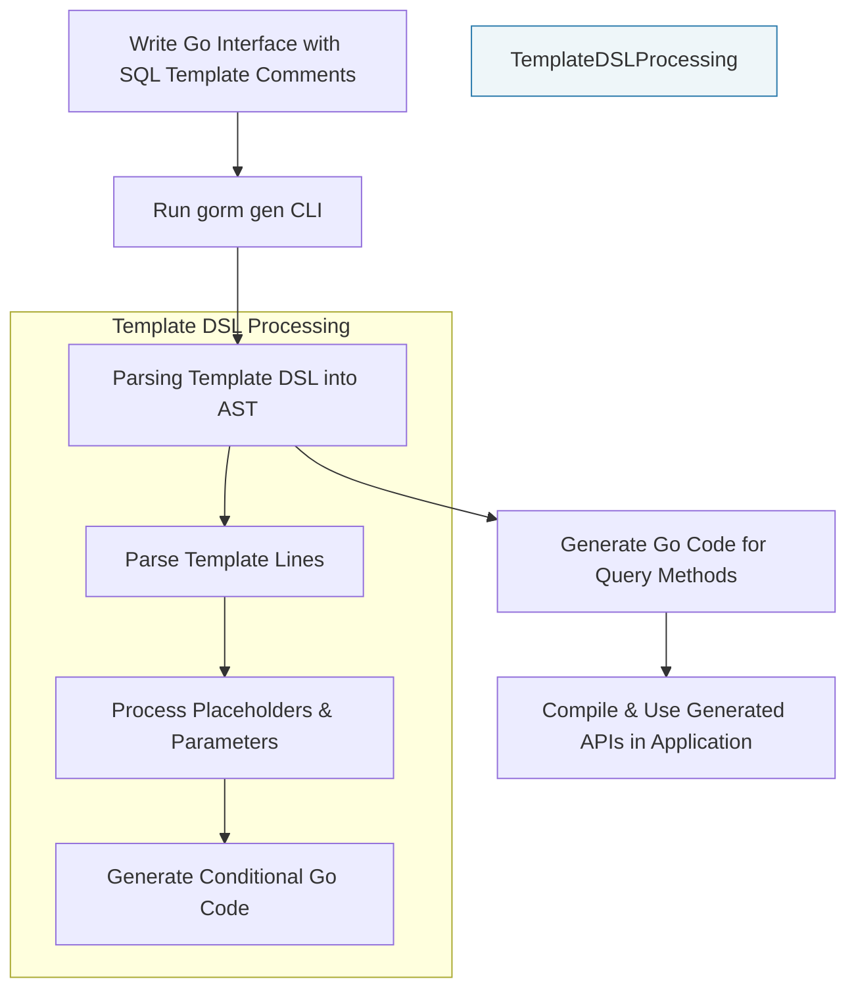

# Template-Based Query API: SQL Templating DSL

Master the custom SQL templating DSL used to define query methods on interfaces. Learn about directives, parameter mapping, conditional fragments, and safe dynamic SQL generation.

---

## Introduction

The GORM CLI leverages a powerful SQL templating Domain-Specific Language (DSL) embedded in Go interface method comments. This DSL allows you to define rich, type-safe query methods that integrate seamlessly with your Go codebase.

By mastering this templating DSL, you gain the ability to write custom SQL queries and updates directly within your Go interfaces, using expressive directives and conditionals to dynamically generate efficient, safe SQL statements.

This page focuses exclusively on understanding and using the SQL templating DSL to define query APIs.


## Why Use SQL Templates?

Rather than writing raw SQL strings in your application code, the SQL templating DSL lets you:

- **Define SQL alongside Go method signatures** for clear intent and type safety.
- **Automatically bind Go method parameters to SQL placeholders** with proper escaping.
- **Use directives** to represent model table and columns dynamically.
- **Embed conditional logic and loops** for flexible query construction.
- **Generate idiomatic, reusable Go code** implementing these query methods.

This approach provides compile-time checked SQL queries tailored to your models, improving safety, maintainability, and productivity.


## Core Directives & Syntax

The templating DSL uses custom placeholders and Go-style template directives wrapped in `{{ }}`. Here are the fundamental components you will use:

| Directive   | Purpose                             | Description & Example                                   |
|-------------|-----------------------------------|--------------------------------------------------------|
| `@@table`   | Model's table name                 | Replaced with the table name of the model.

```sql
SELECT * FROM @@table WHERE id=@id
```
| `@@column`  | Dynamic column name binding        | Allows safe, dynamic column naming.

```sql
SELECT * FROM @@table WHERE @@column=@value
```
| `@param`    | Bind Go parameter to SQL parameter | Automatically replaced with `?`, with Go param added.

```sql
WHERE name=@user.Name
```
| `{{where}}` | Conditional WHERE clause block     | Builds a WHERE clause only if inner fragments produce SQL.

```sql
{{where}}
  {{if age > 0}} age > @age {{end}}
{{end}}
```
| `{{set}}`   | Conditional SET clause block (UPDATE) | Builds a SET clause, trimming trailing commas.

```sql
{{set}}
  {{if user.Name != ""}} name=@user.Name, {{end}}
  {{if user.Email != ""}} email=@user.Email {{end}}
{{end}}
```
| `{{if}}`   | Conditional SQL fragment           | Runs if the provided expression is true.

```sql
{{if user.Age >= 18}} is_adult=1 {{else}} is_adult=0 {{end}}
```
| `{{for}}`  | Loop over collection               | Iterates over slices or arrays to produce repeated fragments.

```sql
{{for _, tag := range tags}}
  {{if tag != ""}} tags LIKE concat('%',@tag,'%') OR {{end}}
{{end}}
```


## Writing SQL Templates: User Workflow

1. **Define Go Interface Methods with SQL Template Comments**

Write your query method in a Go interface. Above the method, write SQL lines with placeholders and directives in the comment.

Example:

```go
// SELECT * FROM @@table WHERE id=@id AND name = "\@name"
GetByID(id int) (T, error)
```

Note: Use `\\@` to escape literal `@` characters.

2. **Use Placeholders to Bind Parameters**

- Use `@paramName` to bind Go parameters by name.
- Use `@@table` to refer to the model's table.
- Use `@@column` to dynamically bind a column safely.

3. **Leverage Conditional Clauses**

- Use `{{where}} ... {{end}}` to conditionally add WHERE clauses.
- Use `{{set}} ... {{end}}` to conditionally build UPDATE SET.
- Use `{{if}}`, `{{else if}}`, `{{else}}` for controlling SQL generation.
- Use `{{for}}` loops to iterate slices or arrays.

4. **Run the Generator**

Execute the CLI command to generate type-safe Go implementations of your interface methods, which build and execute the templated SQL safely.

5. **Use Generated Code in Your Application**

Call your generated methods with Go parameters, benefiting from type safety and expressive syntax.


## Example SQL Template Methods

```go
// SELECT * FROM @@table WHERE id=@id AND name = "\@name"
GetByID(id int) (T, error)

// SELECT * FROM @@table WHERE @@column=@value
FilterWithColumn(column string, value string) (T, error)

// SELECT * FROM users
//   {{if user.ID > 0}}
//       WHERE id=@user.ID
//   {{else if user.Name != ""}}
//       WHERE name=@user.Name
//   {{end}}
QueryWith(user models.User) (T, error)

// UPDATE @@table
//  {{set}}
//    {{if user.Name != ""}} name=@user.Name, {{end}}
//    {{if user.Age > 0}} age=@user.Age, {{end}}
//    {{if user.Age >= 18}} is_adult=1 {{else}} is_adult=0 {{end}}
//  {{end}}
// WHERE id=@id
UpdateInfo(user models.User, id int) error

// SELECT * FROM @@table
// {{where}}
//   {{for _, user := range users}}
//     {{if user.Name != "" && user.Age > 0}}
//       (name = @user.Name AND age=@user.Age AND role LIKE concat("%",@user.Role,"%")) OR
//     {{end}}
//   {{end}}
// {{end}}
Filter(users []models.User) ([]T, error)

// where("name=@name AND age=@age")
FilterByNameAndAge(name string, age int)

// SELECT * FROM @@table
//  {{where}}
//    {{if !start.IsZero()}}
//      created_at > @start
//    {{end}}
//    {{if !end.IsZero()}}
//      AND created_at < @end
//    {{end}}
//  {{end}}
FilterWithTime(start, end time.Time) ([]T, error)
```


## Template DSL Processing Internals (Conceptual Overview)

- The generator parses your SQL template string line by line, identifying the special directives.
- It builds an internal Abstract Syntax Tree (AST) representing sections like `{{where}}`, conditionals, and loops.
- Placeholders `@@table`, `@@column`, and `@param` are replaced with Go code that appends parameters safely.
- Conditional blocks generate Go `if`/`else` statements controlling if parts of SQL are included.
- Loops generate Go `for` loops to iterate over slices, building dynamic SQL fragments.
- Ultimately, the template compiles down to Go code that assembles the final SQL string and parameters slice.


## Best Practices & Tips

- Use `@@table` and `@@column` to safely inject table and column names instead of raw strings to avoid SQL injection risks.
- Escape literal `@` characters using `\\@` in SQL comments.
- Prefer using `{{where}}` and `{{set}}` blocks to generate conditional SQL clauses neatly.
- Write expressive conditions with `{{if ...}}` and use `{{else}}` to handle alternative SQL.
- Use `{{for ...}}` when binding slices or arrays to generate IN lists or multiple conditions.
- Keep your SQL templates readable and aligned with your Go method's parameters for maintainability.


## Common Pitfalls

<AccordionGroup title="Common SQL Templating Mistakes">
<Accordion title="Unclosed Template Blocks">
Always close `{{if}}`, `{{for}}`, `{{where}}`, and `{{set}}` blocks with `{{end}}`. Unclosed blocks cause generator errors.
</Accordion>
<Accordion title="Incorrect Parameter Names">
Ensure parameter names in SQL placeholders match the method parameters exactly, including struct field paths (e.g., `@user.Name`).
</Accordion>
<Accordion title="Using Raw String Without Escaping @">
Escape `@` characters as `\\@` in SQL comments if they are not meant as parameter placeholders.
</Accordion>
<Accordion title="Improper Use of Dynamic Column Names">
Always bind dynamic columns using `@@column` to generate safe, quoted column names.
</Accordion>
</AccordionGroup>


## Troubleshooting

If generated code doesn't work as expected:

- Check your SQL comment for unbalanced or missing template blocks.
- Verify that parameter names in SQL match those in method signatures and structs.
- Use verbose output or debugging flags in the CLI to inspect generated Go code.
- Consult the troubleshooting common issues guide if generator errors occur.


## Illustrated Workflow Diagram




## Further Learning & Related Documentation

To extend your mastery of the SQL templating DSL experience, explore:

- [Generating Type-Safe Query APIs](/guides/core-workflows/generate-type-safe-queries): Step-by-step instructions on writing and generating query code.
- [Template-Based Queries Quickstart](/overview/features-workflows/quickstart-workflow): For practical examples and usage.
- [Customizing Generation Configurations](/guides/advanced-usage-patterns/customizing-generation): To understand how to tailor code generation.
- [Validating Generated Code](/getting-started/first-use-validation/validate-generated-code): To verify your generated APIs behave correctly.


## Summary

This guide equips you to write expressive, type-safe SQL queries embedded in Go interface comments using GORM CLI's SQL templating DSL. Master directives, parameter binding, conditional logic, and iteration to produce flexible and safe SQL methods fully integrated into your Go projects.

Use the provided examples and best practices to create robust database queries, boost developer productivity, and reduce runtime errors.

---

# References
- [GORM CLI SQL Templating DSL Code Parsing](internal/gen/sqlparser.go)
- [Example Interface with Templates (examples/query.go)](examples/query.go)
- [SQL Template Rendering Tests](internal/gen/sqlparser_test.go)
- [Readme: Template-Based Queries Section](README.md#-template-based-queries)


