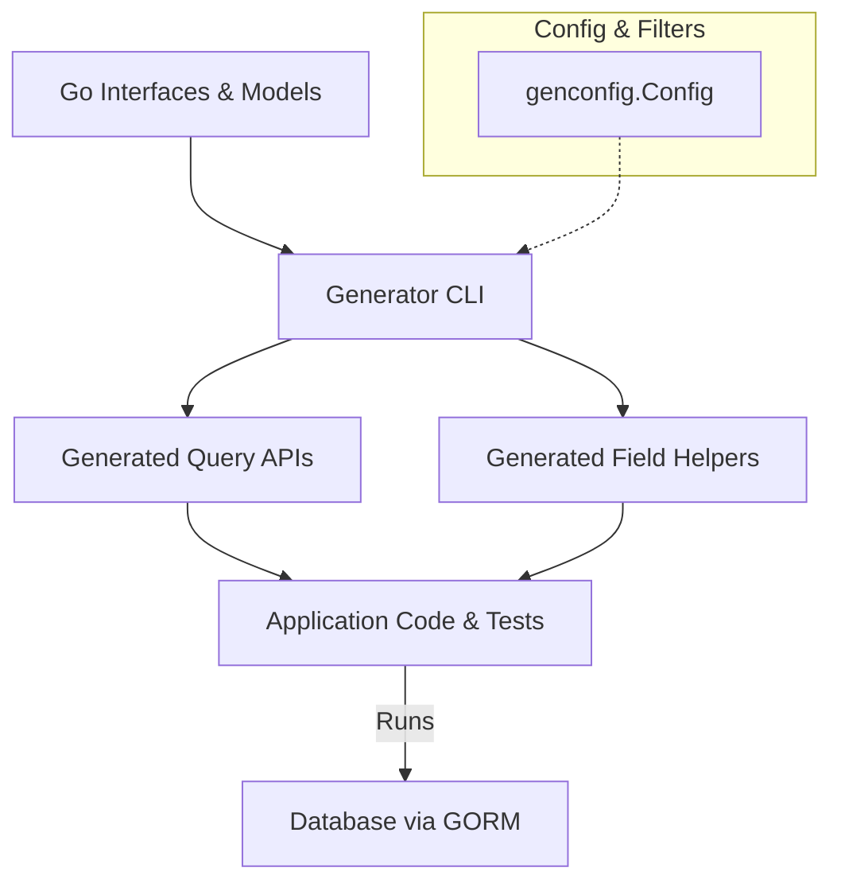

# Integrating Generated Code into Your Workflow

Managing generated code efficiently is crucial to harness the full power of GORM CLI while maintaining a clean, maintainable, and reproducible codebase. This guide walks you through best practices on where to place generated artifacts, how to keep them synchronized with your source models and query interfaces, and how to integrate the generated code with your existing workflows and GORM usage patterns.

---

## Why Integration Matters

Generated code from GORM CLI represents a valuable bridge between your Go interfaces, model structs, and database interactions. Proper integration means:

- **Maintainability:** Generated files are automatically kept clean, separated, and easily updatable.
- **Reproducibility:** You can regenerate code on demand, ensuring changes in interfaces or models reflect immediately.
- **Developer Experience:** Seamless integration means you write less database boilerplate and get immediate IDE hints, autocompletions, and type safety.

## Recommended Placement of Generated Files

### Keep Generated Code Separate from Source

Place all generated files in a dedicated output directory outside your version-controlled source tree or in a separate subdirectory within your module. This separation:

- Prevents manual edits to generated code, reducing merge conflicts
- Enables easy cleanup and regeneration
- Clearly distinguishes handwritten code from generated artifacts


```bash
# Example directory structure
/myproject
  /models         # Your handwritten model structs
  /queries        # Your handwritten query interfaces
  /generated      # Generated code output by GORM CLI
```

### Output Path Configuration

Control output directory via the `genconfig.Config.OutPath` or via the CLI `-o` flag. For instance:

```go
var _ = genconfig.Config{
    OutPath: "./generated",
}
```

Or on the command line:

```bash
gorm gen -i ./queries -o ./generated
```


### Version Control Guidance

- **Generated directory:** Typically *should* be checked in to support deterministic builds and allow team members to work without running the generator.
- **Regeneration on CI:** In CI pipelines, regenerate code on-demand during builds to catch drift.
- **Ignore if needed:** If your workflow prefers zero checked-in generated code, include the output path in `.gitignore` and enforce regeneration locally.

---

## Keeping Generated Code in Sync

Maintaining alignment between your source interfaces/models and generated code is vital.

### Workflow for Code Updates

1. **Modify your Go interfaces or model structs** to reflect required changes.
2. **Run the GORM CLI generator** with the same input and output settings.
3. **Review the generated code diff** and commit changes.
4. **Run your tests**, including any using the generated types, to verify code correctness.

### Automate Regeneration

Integrate code generation into your development lifecycle:

- Add a `make generate` or similar command in your `Makefile`.
- Use Git hooks to prevent commits with stale generated code.
- Include regeneration steps in your CI pipeline for checks.

### Troubleshooting Sync Issues

- **Unexpected compiler errors:** Often caused by outdated generated code; run generator again.
- **Partial regeneration or missing files:** Verify generator input flags, your interface and struct filters in `genconfig.Config`.
- **Manual code edits:** Avoid modifying generated files. Instead, update sources and regenerate.

---

## Using Generated Code with Your Models and GORM

The generated code fits naturally into common GORM workflows and Go codebases.

### Importing Generated Packages

Import the generated package where needed:

```go
import "myproject/generated"
```

### Using Query APIs

Invoke generated query interface implementations with a GORM `*gorm.DB` instance:

```go
userQuery := generated.Query[models.User](db)
user, err := userQuery.GetByID(ctx, 123)
```

This provides type-safe, SQL-template backed query methods with compile-time checks.

### Using Field Helpers

Leverage generated field helpers for filtering, updates, and associations:

```go
users, err := gorm.G[models.User](db).
  Where(generated.User.Age.Gt(18)).
  Find(ctx)

// Update example
err = gorm.G[models.User](db).
  Where(generated.User.ID.Eq(1)).
  Set(generated.User.Name.Set("jinzhu"), generated.User.IsAdult.Set(true)).
  Update(ctx)
```

### Association Operations

Generated association helpers enable rich operations:

```go
// Create with association
err := gorm.G[models.User](db).
  Set(
    generated.User.Name.Set("alice"),
    generated.User.Pets.Create(generated.Pet.Name.Set("fido")),
  ).
  Create(ctx)

// Unlink and Delete
err = gorm.G[models.User](db).
  Where(generated.User.ID.Eq(1)).
  Set(generated.User.Pets.Unlink()).
  Update(ctx)
```

---

## Integrating with Your Existing Code and Build Process

### Build and Tooling

- Generated code is fully valid Go code and integrates with your normal build process without modification.
- IDE tooling (e.g., GoLand, VS Code) recognizes types and offers autocompletion.

### Example: Typical Project Workflow

```bash
# 1. Write/update query interfaces & models
vim models/user.go
vim queries/user_queries.go

# 2. Run generation
gorm gen -i ./queries -o ./generated

# 3. Use generated APIs in application code
vim cmd/server/main.go

# 4. Build & run tests
go test ./... 
go build ./cmd/server
```

### Applying Custom Configuration

Adjust generation via `genconfig.Config` to customize output directory, map special types, or filter inclusions/exclusions. This config lives alongside your source and is automatically discovered:

```go
var _ = genconfig.Config{
  OutPath: "./generated",
  FieldNameMap: map[string]any{
    "json": JSON{},
  },
  IncludeInterfaces: []any{"Query*"},
}
```

---

## Troubleshooting and Best Practices

### Common Pitfalls

- **Editing generated code directly:** Causes conflicts and loss on regeneration.
- **Not regenerating after interface/model changes:** Leads to stale code and compile errors.
- **Mixing output directories with source:** Complicates code cleanup and version control.

### Tips for Success

- Automate generation as part of your build.
- Keep generated code segregated.
- Use clear, consistent naming and directory conventions.
- Use configuration to control what is generated.
- Validate generated code regularly and run integration tests.

---

## Architecture Overview Diagram

Below is a visualization of the typical workflow involving source code, configuration, generator process, and output integration.



---

## Recap

Integrating generated code into your workflow elevates your productivity by providing type-safe, maintainable, and expressive database operations in Go. Following these best practices ensures your generated APIs are reliable, up to date, and seamlessly fit into your existing GORM-based development process.

---

For detailed instructions on writing query interfaces, crafting SQL templates, using the field helpers, and customizing generation, explore related guides:

- [Generating Type-Safe Query APIs](../../guides/core-workflows/generate-type-safe-queries)
- [Generating Model-driven Field Helpers](../../guides/core-workflows/generate-field-helpers)
- [Customizing Code Generation with Configurations](../../guides/advanced-usage-patterns/customizing-generation)
- [Mastering the SQL Template DSL](../../guides/advanced-usage-patterns/template-sql-dsl)

For practical onboarding:

- [Quickstart Workflow](../../overview/features-workflows/quickstart-workflow)
- [Validating Generated APIs](../../getting-started/first-use-validation/validate-generated-code)

---

<Tip>
Make regeneration a seamless, automated part of your development and CI workflow to avoid stale generated code and enjoy smooth integration with your Go + GORM projects.
</Tip>

<Note>
Keep generated code isolated and under version control to balance reproducibility and ease of collaboration.
</Note>