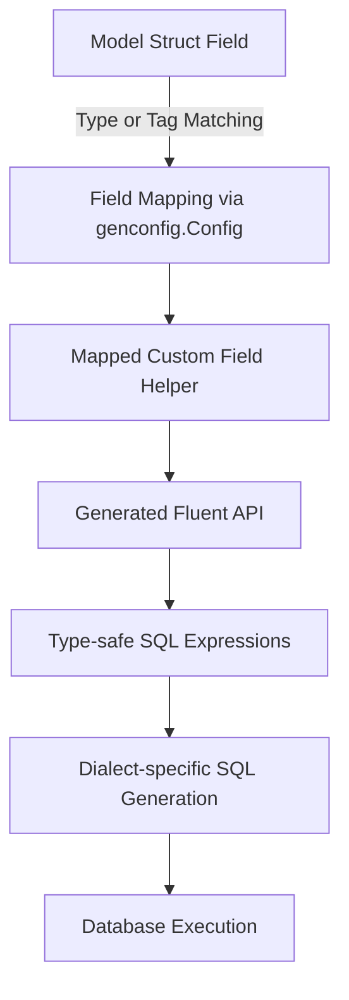

# Custom Field Mapping and Extensions

Customize your GORM CLI code generation to perfectly fit your project’s types and database needs. This guide shows you how to remap Go struct fields to use specialized field helpers, enable support for complex types like JSON, and extend the generator to handle database-specific behaviors. With these techniques, you can enrich the generated API surface, ensuring expressive, type-safe, and dialect-appropriate queries and updates.

---

## Why Customize Field Mapping?

Out of the box, GORM CLI generates field helpers for common Go types such as `int`, `string`, `time.Time`, and `sql.Null*` types. However, many projects require support for custom or semi-complex types, including JSON, encrypted fields, or domain-specific wrappers. By mapping these types to custom field helpers, you gain:

- **Dialect-aware SQL generation** tailored to your specialized fields.
- **Consistent APIs** matching your domain model’s needs.
- **Improved read/write semantics** for fields like JSON or custom serializers.

This flexibility turns your GORM CLI generated code into a fluent SDK for your data layer.

---

## How Field Mapping Works

GORM CLI uses the `genconfig.Config` struct at the package level to apply field type mappings and name-based overrides. It scans your model struct fields and:

- Checks if the type matches a map entry in `FieldTypeMap`.
- Checks if the field name (or struct tag) matches an entry in `FieldNameMap`.
- Applies the corresponding custom field helper type in the generated code.

These mappings control which wrapper type is used for predicates, setters, and association helpers.

---

## Declaring Custom Field Helpers

A custom field helper must:

- Implement a method `WithColumn(name string) YourFieldHelperType` that creates a new instance bound to the given column.
- Provide fluent and expressive methods to build SQL expressions (predicates) and setters.

### Example: JSON Field Helper

The JSON example demonstrates a wrapper `JSON` type that generates database-specific SQL expressions for comparing JSON column contents.

```go
package examples

import (
	"encoding/json"

	"gorm.io/gorm"
	"gorm.io/gorm/clause"
)

// JSON is a field helper for JSON columns with dialect-aware SQL generation.
type JSON struct {
	column clause.Column
}

// WithColumn binds the helper to a column name.
func (j JSON) WithColumn(name string) JSON {
	c := j.column
	c.Name = name
	return JSON{column: c}
}

// Equal builds a JSON equality predicate using appropriate database functions.
func (j JSON) Equal(path string, value any) clause.Expression {
	return jsonEqualExpr{col: j.column, path: path, val: value}
}

// Contains builds a JSON containment predicate.
func (j JSON) Contains(value any) clause.Expression {
	return clause.Expr{SQL: "JSON_CONTAINS(?, ?)", Vars: []any{j.column, value}}
}

type jsonEqualExpr struct {
	col  clause.Column
	path string
	val  any
}

func (e jsonEqualExpr) Build(builder clause.Builder) {
	if stmt, ok := builder.(*gorm.Statement); ok {
		switch stmt.Dialector.Name() {
		case "mysql":
			v, _ := json.Marshal(e.val)
			clause.Expr{SQL: "JSON_EXTRACT(?, ?) = CAST(? AS JSON)", Vars: []any{e.col, e.path, string(v)}}.Build(builder)
		case "sqlite":
			clause.Expr{SQL: "json_valid(?) AND json_extract(?, ?) = ?", Vars: []any{e.col, e.col, e.path, e.val}}.Build(builder)
		default:
			clause.Expr{SQL: "jsonb_extract_path_text(?, ?) = ?", Vars: []any{e.col, e.path[2:], e.val}}.Build(builder)
		}
	}
}
```

This custom type encapsulates the logic needed to generate valid SQL depending on the database dialect, avoiding repetitive conditional SQL scattered throughout your application.

---

## Applying the Custom Helper in Configuration

In your package where models and configurations reside, declare the following:

```go
package examples

import (
	"database/sql"
	"gorm.io/cli/gorm/field"
	"gorm.io/cli/gorm/genconfig"
)

var _ = genconfig.Config{
	OutPath: "examples/output",

	// Map package-level Go types or structs to custom field helpers
	FieldTypeMap: map[any]any{
		sql.NullTime{}: field.Time{}, // Built-in example
	},

	// Map struct field names (via gen tags or direct names) to custom helpers
	FieldNameMap: map[string]any{
		"json": JSON{}, // Custom JSON helper for fields tagged as `gen:"json"`
	},
}
```

Then, mark your struct fields appropriately, e.g.:

```go
package models

type User struct {
	// ... other fields ...
	Profile string `gen:"json"` // triggers use of JSON helper
}
```

---

## Generated Code Integration

Generated field helpers use the custom types to offer specialized predicates:

```go
// Example usage of generated JSON field helper
gorm.G[models.User](db).
  Where(generated.User.Profile.Equal("$.vip", true)).Take(ctx)
```

This will produce properly dialect-tailored SQL like:

- MySQL:  `JSON_EXTRACT(`profile`, "$.vip") = CAST("true" AS JSON)`
- SQLite: `json_valid(`profile`) AND json_extract(`profile`, "$.vip") = 1`

The fluent API encourages clear, safe, and expressive queries without embedding dialect-specific logic in your business code.

---

## Practical Tips & Best Practices

- **Map by type or field name:** Use the `FieldTypeMap` for type-based overrides and `FieldNameMap` for more granular field-name or tag-based mappings.
- **Custom helpers must implement `WithColumn`:** This enables chaining and reuse.
- **Test generated code:** Regularly generate and verify your code especially when changing mappings.
- **Keep helpers idiomatic:** Provide predicate and setter methods that closely match your domain semantics.
- **Consider dialect differences:** Embed SQL adaptations inside the helper to keep user code portable.

---

## Troubleshooting Common Issues

<AccordionGroup title="Common Challenges and Solutions">
<Accordion title="Custom Field Helper Not Used in Generated Code">
Ensure your `genconfig.Config` variable is declared at package level and properly imported; check that your field tags or types exactly match your `FieldNameMap` or `FieldTypeMap` entries.
</Accordion>
<Accordion title="SQL Generation Errors with Custom Fields">
Verify that your custom field implements `clause.Expression` interfaces correctly and handles all supported dialects as needed. Missing dialect cases can cause runtime SQL errors.
</Accordion>
<Accordion title="Conflicting Mappings or Overlaps">
Avoid overlapping or ambiguous mappings between `FieldTypeMap` and `FieldNameMap` to prevent unexpected helper usage.
</Accordion>
</AccordionGroup>

---

## Related Topics

- [Generation Configuration](https://gorm.io/docs/concepts/customization-configuration/generation-configuration) — configure generation options and filters
- [Model-Driven Field Helpers](https://gorm.io/docs/concepts/core-concepts/model-driven-field-helpers) — explore generated helpers for models and fields
- [Interface-Driven Query APIs](https://gorm.io/docs/concepts/core-concepts/interface-driven-queries) — understand query interface generation
- [JSON Fields: Custom Mapping & Cross-Database SQL](https://gorm.io/docs/guides/advanced-features/json-field-helpers) — in-depth JSON field handling

---

## Summary

Custom field mapping and extension in GORM CLI allow you to harness the power of specialized field helpers that enable domain-centric, dialect-aware, and expressive query construction. By mapping custom Go types or tagged fields to tailored helpers, you unlock advanced query capabilities while maintaining type safety and maintainability across your codebase.

Use the techniques shared here to integrate JSON or other complex fields seamlessly and consult the related guides to expand your expertise in GORM CLI customizations.

---

## Visual Overview (Conceptual)



This flow highlights how custom field types propagate from model definitions through generation to runtime SQL execution.

---