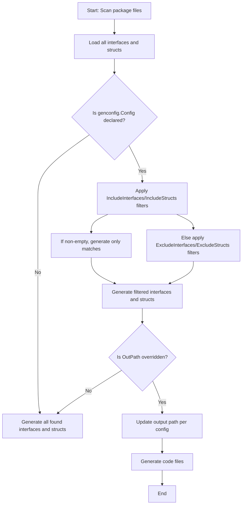

# Generation Configuration

GORM CLI empowers you with granular, package-level control over the code generation process through the use of `genconfig.Config`. This configuration object lets you precisely customize output paths, filter which interfaces and structs are generated, and map Go field types or tags to specialized field helper types. By embedding a single `genconfig.Config` variable within a Go package, you instruct the generator on how to best tailor your generated query APIs and model-driven helpers to fit your project’s architecture and coding style.

---

## Why Use Generation Configuration?

Out of the box, GORM CLI generates code for all interfaces and structs found in your input directory or package. However, larger projects or those with mixed legacy and modern code often need finer control to:

- Limit generation to relevant interfaces or models using whitelists or blacklists.
- Organize generated code into specific directories differing from the default output.
- Map specific Go field types or struct tags to customized helper types, for example, handling JSON or nullable time fields.

Adopting configuration is the recommended path to keep your generated codebase clean, maintainable, and adapted to your workflows.

---

## Declaring Configuration

To configure generation, declare a package-level _unexported_ variable of type `genconfig.Config` in the same package whose source code you are generating from. The generator will detect this variable and apply these options automatically.

```go
package examples

import (
    "database/sql"
    "gorm.io/cli/gorm/genconfig"
    "gorm.io/cli/gorm/field"
)

var _ = genconfig.Config{
    OutPath: "examples/output",

    FieldTypeMap: map[any]any{
        sql.NullTime{}: field.Time{},
    },

    FieldNameMap: map[string]any{
        "date": field.Time{},   // map gen:"date" tag to Time helper
        "json": JSON{},        // map gen:"json" tag to custom JSON helper
    },

    FileLevel: false,

    IncludeInterfaces: []any{"Query*", models.Query(nil)},
    ExcludeInterfaces: []any{"*Deprecated*"},

    IncludeStructs: []any{"User", "Account*", models.User{}},
    ExcludeStructs: []any{"*DTO"},
}
```

### Key Configuration Fields

| Field Name          | Description |
|---------------------|-------------|
| **OutPath**         | Overrides the output directory for generated files from this package or file. Useful to keep generated code isolated or organized separately from source code.
| **FieldTypeMap**     | Maps specific Go types (key) to a generator field helper type (value). Example: mapping `sql.NullTime{}` to `field.Time{}` creates helper functions suited for nullable timestamps.
| **FieldNameMap**     | Maps `gen` struct tags by name to a helper type (e.g., `json` tag mapped to a `JSON{}` field helper). Takes precedence over FieldTypeMap.
| **FileLevel**        | When `true`, applies the configuration only to the single file declaring it rather than the entire package. Ideal for package-scoped conditional generation.
| **IncludeInterfaces**| Whitelist of interface names or patterns to generate. If specified, only these will be generated (blacklist ignored). Supports shell-style patterns and type-conversion literals.
| **ExcludeInterfaces**| Blacklist of interfaces to exclude from generation. Applied only if IncludeInterfaces is empty.
| **IncludeStructs**   | Whitelist of struct types to generate helpers for. Supports patterns and type literals.
| **ExcludeStructs**   | Blacklist of structs to exclude from generation, applied only if IncludeStructs is empty.

---

## Filtering Interfaces and Structs

Use whitelists and blacklists to control explicit inclusion or exclusion of code generation targets. Patterns support shell-style matching, allowing flexible filtering.

- **IncludeInterfaces** has highest priority. If set, only matching interfaces are generated.
- Otherwise, **ExcludeInterfaces** applies to filter out unwanted interfaces.
- The same logic applies to **IncludeStructs** and **ExcludeStructs**.

This mechanism helps avoid generating code for deprecated, experimental, or otherwise irrelevant components.

### Examples

```go
// Only generate interfaces with prefix "Query" in their name
IncludeInterfaces: []any{"Query*"},

// Exclude interfaces containing "Deprecated" anywhere
ExcludeInterfaces: []any{"*Deprecated*"},

// Include specific shapes by literal type
IncludeStructs: []any{models.User{}, "Account*"},

// Exclude all DTO suffixed structs
ExcludeStructs: []any{"*DTO"},
```

---

## Custom Field Type and Tag Mappings

By default, the generator maps primitive Go types to standard field helpers like `field.String`, `field.Number[int]`, and so on. However, many applications require specialized handling for database types such as JSON columns or nullable timestamp fields.

### Mapping by Type

You can map specific Go types to helpers by providing a mapping in `FieldTypeMap`. The key must be a zero value instance of the source type, the value is a zero value instance of the helper type.

```go
FieldTypeMap: map[any]any{
    sql.NullTime{}: field.Time{},  // Use the Time field helper for nullable SQL times
}
```

### Mapping by Struct Tag Name

You can also map fields tagged with specific `gen` tag names to helpers via `FieldNameMap`. For example, if your struct's JSON columns are tagged `gen:"json"`, you can map these to a custom `JSON{}` field helper that generates database-specific JSON queries.

```go
FieldNameMap: map[string]any{
    "json": JSON{},  // Map json tagged fields to a custom JSON field helper
}
```

This approach offers maximum flexibility for adapting code generation to your project’s custom types or extended helper implementations.

---

## File-Level Versus Package-Level Configuration

By default, a `genconfig.Config` variable affects the entire package in which it appears. Setting `FileLevel: true` restricts the configuration’s scope to only the file declaring it. This is useful when different files in the same package require different generation rules.

```go
FileLevel: true
```

When multiple configs apply, the generator merges them carefully, favoring the most specific settings.

---

## How Configuration Affects Output Path

The `OutPath` option lets you override the output directory for generated files related to a package or file.

- If unspecified, the generator uses the CLI default `./g` or whatever you pass with the `-o` flag.
- If set, files from this package (or file if `FileLevel` is enabled) go to the specified directory.
- Relative paths under this directory mirror the input directory structure, ensuring layout consistency.

> **Tip:** Use `OutPath` to keep generated code separate, such as in `generated/` or `internal/generated/`, improving project organization.


---

## Example: Custom JSON Helper Mapping

1. Declare the configuration with a tag mapping:

```go
package examples

import "gorm.io/cli/gorm/genconfig"

var _ = genconfig.Config{
    OutPath: "examples/output",
    FieldNameMap: map[string]any{
        "json": JSON{}, // map fields tagged `gen:"json"` to the JSON field helper
    },
}
```

2. Define your model using the `json` tag:

```go
package models

type User struct {
    // ... other fields
    Profile string `gen:"json"`
}
```

3. Define the JSON helper type (example snippet):

```go
type JSON struct{ column clause.Column }

func (j JSON) WithColumn(name string) JSON {
    c := j.column
    c.Name = name
    return JSON{column: c}
}

// Equal generates a database-specific JSON comparison expression
func (j JSON) Equal(path string, value any) clause.Expression {
    return jsonEqualExpr{col: j.column, path: path, val: value}
}
```

4. Use the generated helper in queries:

```go
// This generates database-specific JSON search SQL expressions
_, err := gorm.G[models.User](db).
    Where(generated.User.Profile.Equal("$.vip", true)).Take(ctx)
```

---

## Filtering Logic Workflow

The generator applies filtering rules in the following manner:



---

## Best Practices & Tips

- **Start with minimal config:** Only add configuration when you face issues managing generated code scope or need specialized type mappings.
- **Prefer Include lists:** Use whitelists (`IncludeInterfaces`, `IncludeStructs`) to explicitly declare generated elements; safer than blacklists.
- **Use type literals for precision:** Adding concrete struct or interface literals ensures exact matching beyond string patterns.
- **Separate generated files:** Leverage `OutPath` to place generated code in its own directory, promoting cleaner version control and build setup.
- **Combine with filters:** Use configuration with Go module awareness and directory layout for scalable generation in large projects.

---

## Troubleshooting Configuration Issues

<AccordionGroup title="Common Pitfalls & Resolutions">
<Accordion title="Generated Code Missing Expected Methods or Types">
- Verify your interface and struct names match the patterns in `IncludeInterfaces` and `IncludeStructs`.
- Ensure you aren’t unintentionally excluding interfaces with `ExcludeInterfaces` that coincide with includes.
- Check if the config `FileLevel` boolean is set correctly for your use case.
</Accordion>
<Accordion title="Custom Field Mapping Does Not Apply">
- Confirm the Go type in `FieldTypeMap` matches exactly your field’s type (including package paths).
- Check the `FieldNameMap` key matches the field’s `gen` tag.
- Ensure your custom field helper is imported properly and recognized by the generator.
</Accordion>
<Accordion title="Generated Files Are Not Placed in Expected Directory">
- Confirm that the configured `OutPath` is relative to the module root or an absolute path.
- Remember that `OutPath` in a file-level config impacts only that file, not the package.
- Check the CLI `-o` flag does not override or conflict with your config.
</Accordion>
</AccordionGroup>

---

## Summary

Generation configuration in GORM CLI gives you powerful control over code output, filtering, and type mapping. The package-level `genconfig.Config` lets you:

- Override output directories for generated files
- Whitelist or blacklist interfaces and structs for generation
- Map Go field types and struct tags to specialized field helper types
- Scope configurations per package or per source file

By establishing clear, declarative generation rules, you ensure your codebase remains maintainable, scalable, and precisely tailored to your domain model and database quirks.

---

### See Also

- [Quick Start: Configuration and Customization](/getting-started/first-run/configuration-setup)
- [Advanced Features: Generation Configuration Guide](/guides/advanced-features/generation-configuration)
- [Model-Driven Field Helpers](/concepts/core-concepts/model-driven-field-helpers)
- [Interface-Driven Query APIs](/concepts/core-concepts/interface-driven-queries)
- [Handling Associations](/guides/core-workflows/working-with-associations)

---

### References

- Official GitHub repository with examples: [https://github.com/go-gorm/cli](https://github.com/go-gorm/cli)
- Go tooling and AST parsing details: internal documentation in `internal/gen/`

---

Explore configuration early to empower your generation workflow and unlock the full potential of GORM CLI’s type-safe and fluent database APIs.
