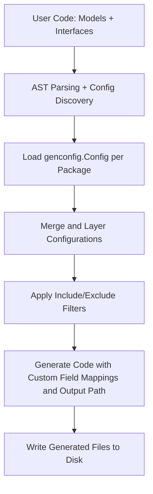

# Generation Configuration Patterns

Customize GORM CLI's code generation workflow precisely to your project needs using the `genconfig.Config` structure. This configuration enables package-level overrides that influence output paths, field helper mappings, and inclusion/exclusion filters for interfaces and structs. Understanding and leveraging these patterns empowers you to control what is generated, how it is generated, and where it lands.

---

## Why Customize Generation Configuration?

By default, GORM CLI scans your Go packages and generates code with sensible defaults. However, in larger or more complex projects, you often need finer control to:

- Organize generated code files in specific directories.
- Map custom Go types or struct tag names to specialized field helpers.
- Include or exclude certain interfaces or struct definitions from generation.

`genconfig.Config` provides a declarative way to express these rules transparently and declaratively, integrated right into your source package.

---

## Declaring `genconfig.Config`

Configuration is declared by creating a package-level variable of type `genconfig.Config`.

```go
package examples

import (
    "database/sql"
    "gorm.io/cli/gorm/field"
    "gorm.io/cli/gorm/genconfig"
)

var _ = genconfig.Config{
    OutPath: "examples/output",
    FieldTypeMap: map[any]any{
        sql.NullTime{}: field.Time{},
    },
    FieldNameMap: map[string]any{
        "date": field.Time{},  // map fields with `gen:"date"` tag
        "json": JSON{},        // map fields with `gen:"json"` tag
    },
    FileLevel: false,
    IncludeInterfaces: []any{"Query*", models.Query(nil)},
    ExcludeInterfaces: []any{"*Deprecated*"},
    IncludeStructs: []any{"User", "Account*", models.User{}},
    ExcludeStructs: []any{"*DTO"},
}
```

This example shows all major options in a single declaration.

---

## Core Configuration Fields

### OutPath
Overrides the default CLI output directory for files matched in the same package where this config lives.

```go
OutPath string // e.g. "examples/output"
```

This directs generated files to a custom folder, keeping your generated code organized.

### FieldTypeMap & FieldNameMap
Provide custom mappings from Go types or struct tag names to field helper types.

- **FieldTypeMap** maps Go type *instances* to wrapper field helper *instances*. Example:
  ```go
  FieldTypeMap: map[any]any{
    sql.NullTime{}: field.Time{},
  }
  ```
  This causes the generator to recognize certain Go types and emit specialized accompanying helper types.

- **FieldNameMap** maps a `gen:"tag"` struct tag name to a field helper instance.
  ```go
  FieldNameMap: map[string]any{
    "json": JSON{},
  }
  ```
  Fields tagged with `gen:"json"` will use the provided JSON helper mapped here.

These mappings allow deep customization, including the ability to define custom helpers for special database columns like JSON or encrypted fields.

### FileLevel

When set to true, this config applies only to the specific Go file it is declared in, rather than the whole package or folder. Useful for granular overrides.

### IncludeInterfaces & ExcludeInterfaces

These slice fields function as white/blacklists for interface types to include or exclude from generation.

- **Selectors Supported**:
  - String shell-style patterns, e.g., `"Query*"`, `"*Repo"`, `"pkg.Query"`
  - Type conversions, e.g. `pkg.Query(nil)` treated as the full type name

- **Filtering Rules**:
  - If `IncludeInterfaces` is non-empty, only those matching interfaces are generated.
  - Otherwise, `ExcludeInterfaces` filters out specified interfaces.

This lets you focus generation on a purposeful subset of your interfaces, avoiding legacy or unwanted types.

### IncludeStructs & ExcludeStructs

Same filtering logic as interfaces, but applies to struct types.

- Useful to selectively generate field helpers only for targeted model structs.

- Supports type literals (e.g., `models.User{}`) and shell patterns.

---

## How Configuration Applies in the Generation Workflow

- Configs declared per package are discoverable by scanning all files during the generation walk.
- Each processed file may have zero or more applicable configs (including configs declared higher in the directory tree).
- Configs are merged and layered with some rules:
  - Output path override (`OutPath`) is applied from the most appropriate enclosing package config.
  - Inclusion/exclusion filters are combined and applied to interfaces and structs.
  - Field mappings accumulate from all configs in scope.

This hierarchical approach allows both broad root config and deeper folder/file level overrides.

---

## Practical Examples

### Overriding Output Path

Place this `genconfig.Config` literal anywhere in a package to redirect generated files:

```go
var _ = genconfig.Config{
    OutPath: "internal/generated",
}
```

Now, generated files for this package output to `internal/generated/` instead of the CLI default `./g`.

### Mapping a Custom JSON Field Helper

Define a JSON helper type and map it to fields with a struct tag `gen:"json"`:

```go
var _ = genconfig.Config{
    FieldNameMap: map[string]any{
        "json": JSON{},
    },
}
```

Then, fields tagged as:

```go
Profile string `gen:"json"`
```

will use custom JSON helpers in the generated code.

### Selectively Include Only Query Interfaces Starting With "Query"

```go
var _ = genconfig.Config{
    IncludeInterfaces: []any{"Query*"},
}
```

This skips all interfaces whose name doesn't start with "Query".

### Exclude Deprecated Interfaces Globally

```go
var _ = genconfig.Config{
    ExcludeInterfaces: []any{"*Deprecated*"},
}
```

### Mixed Interface & Struct Filters

```go
var _ = genconfig.Config{
    IncludeInterfaces: []any{"Query*", models.Query(nil)},
    ExcludeInterfaces: []any{"*Deprecated*"},
    IncludeStructs: []any{"User", models.User{}},
    ExcludeStructs: []any{"*DTO"},
}
```

Controls precise generation based on names and types.

---

## Common Pitfalls and Tips

- **Config Placement:** Always declare `genconfig.Config` in the package where the related models and interfaces live.
- **FileLevel Use:** Use `FileLevel: true` sparingly for one-off file-specific customization.
- **Pattern Matching:** Patterns are shell-style, case-sensitive, and matched fully-qualified with package paths.
- **Mapping Types:** When mapping Go types, use *instances* like `sql.NullTime{}` as keys to ensure correct matching.
- **Excluding Deprecated Code:** Regularly exclude outdated interfaces and structs to keep generation clean.

---

## Troubleshooting Configuration Issues

- **No Effect of Configuration?**
  - Verify that the config variable is named anonymously (`var _ = genconfig.Config{}`) in the correct package.
  - Ensure the config file is parsed by Go tooling (belongs to the same module and directory).

- **Unexpected Generated Code?**
  - Check your inclusion/exclusion filters for mismatch or unintended overlaps.
  - Confirm field helper mappings are correct and types match exactly.

- **Output Directory Not Changing?**
  - Confirm the `OutPath` override is in the correct package and no other config overrides it.
  - Check the CLI `-o` flag; local `OutPath` can override it if set correctly.

- **Field Helper Mapping Not Applied?**
  - Verify struct tags correspond exactly to your `FieldNameMap` keys.
  - Ensure `FieldTypeMap` keys use zero-valued instances (e.g., `sql.NullTime{}`), not type strings.

---

## Configuration Flow Diagram



This flow highlights where config applies to influence generation.

---

## Next Steps & Related Documentation

- For detailed examples and best practices on working with `genconfig.Config`, visit [Basic Generator Configuration](/getting-started/project-initialization/basic-configuration).
- To extend field helpers, including custom JSON helpers, see [Extending with Custom Field Helpers](/guides/advanced-features-patterns/extending-with-custom-helpers).
- Learn how to write query interfaces and SQL templates to complement your configuration in [Template-based Queries](/concepts/core-concepts/template-dsl).
- For comprehensive understanding about generated field helpers and associations, review [Model-driven Field Helpers](/concepts/core-concepts/field-helpers) and [Associations Model & Semantics](/concepts/core-concepts/associations-model).
- Troubleshoot common issues from configuration misalignment in [Common Issues & Troubleshooting](/getting-started/troubleshooting-validation/common-issues).

---

By mastering generation configuration patterns, you ensure your GORM CLI integration feels natural and idiomatic to your project, minimizing manual tweaks and maximizing developer productivity.
