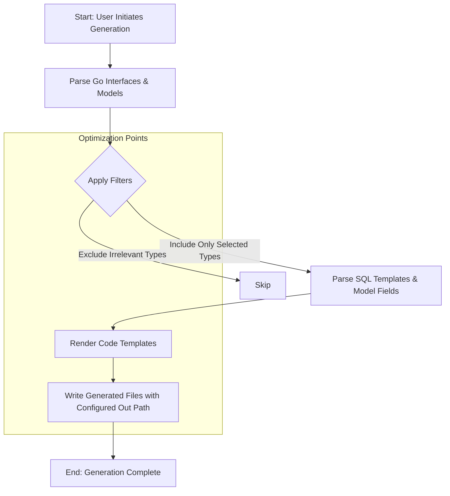

# Scalability & Performance Considerations

GORM CLI's code generation provides a powerful, type-safe interface to build queries and manage models in Go projects using GORM. To effectively use GORM CLI in large or complex applications, understanding the scalability characteristics of the generation process and the runtime behavior of generated code is critical. This guide breaks down the scalability aspects of the code generation, covering generation cost, output structure, runtime impact, and optimization strategies.

---

## 1. Generation Run Cost

The core of GORM CLI's scalability lies in its single-pass, AST-driven code generation, which carefully balances thoroughness and efficiency.

### What Happens During a Generation Run

- **AST Parsing:** The generator parses user-provided Go interfaces and model structs via Go's native parser, extracting method signatures, documentation annotations, and model field metadata.

- **Filtering & Configuration:** It applies any `genconfig.Config` filters like inclusion/exclusion patterns and file-level scoping to limit processed interfaces and structs.

- **SQL Template Processing:** The embedded SQL templates with conditional directives (`{{if}}`, `{{for}}`, `{{where}}`, `{{set}}`, etc.) are parsed and compiled into Go code snippets.

- **Code Rendering:** Templates generate fully typed method implementations and field helper declarations for each interface method and model field.

### Cost Considerations

- For **small to medium projects**, generation completes within seconds.

- As project size and interface/struct counts grow, generation cost scales roughly linearly with the number of Go source files and filtered elements, because all parsing and code rendering must be done for each relevant interface and struct.

- Excessive inclusion of unrelated interfaces or models can unnecessarily increase processing time and output file size.

### Best Practices

- Use **`IncludeInterfaces`** and **`IncludeStructs`** filters in your `genconfig.Config` to focus generation only on relevant types.

- Apply **`ExcludeInterfaces`** and **`ExcludeStructs`** to prevent generation from deprecated or auxiliary code.

- Use the **`FileLevel`** flag when you want generation config to apply narrowly to specific files, minimizing unexpected inclusions.

- Organize your project code into dedicated packages or directories to facilitate targeted generation runs.

---

## 2. Output File Structure and Organization

GORM CLI generates idiomatic Go code organized to support maintainability and logical separation.

### Generated Artifacts

- **Interface Implementation Files:** For each filtered interface, a Go file is generated containing a strongly-typed implementation struct with methods implementing the SQL templates.

- **Field Helper Variables:** For each filtered model struct, variables with typed field helpers for every field and association are provided. These variables support predicates, setters, and association operations.

- **Import Management:** Imports are merged intelligently to reduce duplication and ensure only required packages appear in generated files.

### Directory and Path Control

- The **output directory** defaults to `./g` but can be overridden with the CLI `-o` flag or via `genconfig.Config.OutPath` on a per-package basis.

- Preserves relative directory structures within the output to avoid name collisions and maintain clarity.

### Scalability Impact

- Logical output file separation helps developers **navigate generated code** easily, even as your codebase grows.

- Output scaling aligns with the number of interfaces and structs included — but careful filtering reduces unnecessary code generation.

- Explicit control over output paths prevents clutter and helps maintain clean project trees.

---

## 3. Runtime Impact of Generated Code

Understanding how generated field helpers and query APIs perform at runtime guides effective large-scale usage.

### Field Helpers

- Generated field helpers wrap model fields with a typed API for predicates and setters.

- Internally, they generate standard GORM conditions (`clause.Column`, `clause.Expr`) that compile efficiently with GORM’s query building.

- Field helpers are zero-cost abstractions, meaning they **do not add runtime overhead beyond the prepared statements and expressions** they generate.

### Query Methods

- Generated query interface methods execute SQL-style commands constructed with optimized string builders and parameter lists.

- Conditional SQL generation uses Go control flows that are **compiled away efficiently**, avoiding unnecessary computation for unused conditions.

- The generator ensures parameter binding is safe and efficient, with **no runtime reflection involved in query building**.

### Performance Considerations

- **No dynamic interpretation at runtime:** All query construction logic is compiled directly, resulting in faster execution than reflection or string concatenation at runtime.

- The code's usage of `strings.Builder` and pre-allocated slices minimizes memory allocations.

- Complex nested queries from templating are unfolded into clear control flow, allowing Go compiler optimizations.

### Potential Bottlenecks

While the generated code is performant, typical database-bound bottlenecks remain:

- Large or complex SQL queries impact the database engine rather than query construction.

- Excessive associations or batch operations may increase query complexity; ensure you use association helpers thoughtfully.

- Overly broad interface methods or poorly scoped filters can cause unnecessary data fetching.

---

## 4. Configuration & Patterns to Maximize Scalability

The design of GORM CLI includes tools and patterns to avoid code bloat and promote maintainability in large projects.

### Targeted Type Filtering

- Use **`IncludeInterfaces`** and **`IncludeStructs`** in `genconfig.Config` to whitelist only the types essential to your generated code.

- Exclude unused or deprecated interfaces and structs to keep the output clean.

### Scoped Generation

- The **FileLevel** config controls whether generation configs apply to each file independently or the entire package.

- Apply fine-grained configs when mixing legacy and new code in the same package.

### Custom Field Mappings

- Use **FieldTypeMap** and **FieldNameMap** to map specific Go types or tag-based fields (e.g., JSON) to specialized field helpers.

- Custom helpers avoid bloating generic field helpers and improve query expressiveness.

### Output Organization

- Override **OutPath** to route generated files into separate directories per package or feature area.

- This keeps generated code contained and easy to update incrementally.

---

## 5. Troubleshooting Common Scalability Challenges

### Excessive Generation Times

- _Cause:_ Broad IncludePatterns, many interfaces/models processed.

- _Solution:_ Narrow inclusion patterns, apply exclusions for irrelevant legacy code.

### Large Generated Files

- _Cause:_ Interfaces or structs with many methods/fields generated without filtering.

- _Solution:_ Split interfaces, break large models into smaller ones if feasible, and leverage FieldNameMap to focus only on needed fields.

### Build Slowdowns or Large Binaries

- _Cause:_ Largely expanded generated code in the project, possibly unused methods compiled.

- _Solution:_ Limit generation scope, refactor code gen config to exclude unused code.

- Consider modularizing your generated code and using build tags if needed.

### Complex SQL Templates Causing Code Blowup

- _Cause:_ Excessive nesting of conditional and iteration blocks inside method comments.

- _Solution:_ Simplify templates, break queries into smaller methods, or move complex logic into stored procedures or pre-processed queries.

---

## 6. Summary & Best Practices

| Best Practice                           | Reason/Benefit                                      |
|---------------------------------------|----------------------------------------------------|
| Use `IncludeInterfaces`/`IncludeStructs` | Limits generation scope, reduces cost and output bloat |
| Apply `ExcludeInterfaces`/`ExcludeStructs` | Filter deprecated or unrelated code                  |
| Set `FileLevel` selectively           | Allows granular config application per file         |
| Map custom fields with `FieldTypeMap` & `FieldNameMap` | Enable specialized helpers and optimize output       |
| Organize output via `OutPath`         | Keeps generated files clean and organized            |
| Write concise SQL templates            | Simplifies generated code and improves readability  |
| Regularly regenerate after code changes | Keeps generated code in sync and performant           |

Maintaining an optimized generation configuration is vital for scaling your GORM CLI usage without performance degradation.

---

## Diagrams

To visualize scalability, here is a high-level Mermaid flowchart illustrating the generation stages and optimization touchpoints:

---

## Additional Resources

- [Generation Configuration & Overrides](./generation-configuration) — How to finely control generation behavior
- [Custom Field Helper Patterns](./custom-field-helpers) — Tailor field helpers for your domain
- [Working With Associations](../../guides/best-practices-patterns/associations-and-relations) — Managing relations efficiently
- [Using Generated APIs in Your Application](../../guides/core-workflows/using-generated-apis) — Best practices for runtime usage
- [Writing Template-Based Queries](../../guides/best-practices-patterns/template-based-queries) — Keep SQL templates maintainable

---

By strategically applying code generation filters, organizing your project structure, and adhering to best practices in template design, GORM CLI can scale gracefully with your project's growth — delivering maintainable, efficient, and type-safe database interactions across even large and complex Go codebases.
