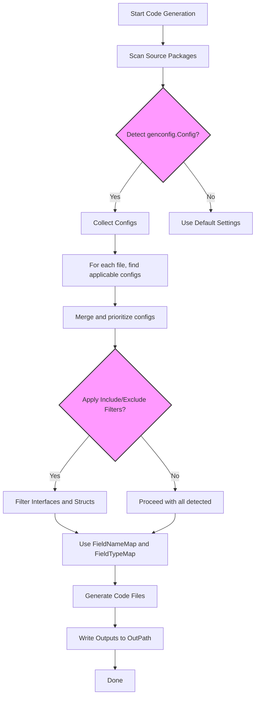

# Customizing Code Generation

Unlock the full power of GORM CLI's flexible configuration system to tailor your generated code exactly to your project's needs. This guide walks you through controlling output paths, including and excluding specific structs and interfaces, and mapping Go types to specialized field helpers, all via the `genconfig.Config` struct. Whether you want to shape file organization or enhance type safety with custom wrappers, mastering this configuration unlocks seamless, maintainable code generation tailored uniquely to your environment.

---

## Why Customize Code Generation?

By default, GORM CLI generates query APIs and field helpers for all interfaces and structs it detects in your project folder. However, real-world projects often require:

- Organizing output files into custom directories
- Generating code for only specific model structs or query interfaces
- Applying advanced mappings of Go types or struct tags to custom field helpers
- Avoiding noisy or deprecated interfaces during generation

Customization empowers you to optimize your development workflow, keep output relevant, maintainable, and aligned with project conventions.

---

## Overview of Configuration Options

The generator picks up a package-level variable of type `genconfig.Config` automatically during code generation if declared in the source package. This single struct governs all customization: output paths, inclusion/exclusion filters, and type-to-helper mappings.

### Key Fields in `genconfig.Config`

| Config Field         | Purpose                                                                                                            |
|----------------------|--------------------------------------------------------------------------------------------------------------------|
| `OutPath`            | Sets the output directory path for generated files from this package, overriding CLI `-o` default                 |
| `FieldTypeMap`       | Maps Go **types** (e.g., `sql.NullTime{}`) to custom field helper types (e.g., `field.Time{}`)                     |
| `FieldNameMap`       | Maps struct tag names in `gen` tags (e.g., `gen:"json"`) to custom field helper types                             |
| `FileLevel`          | When `true`, applies config only to files where declared; otherwise applies to entire package folder subtree       |
| `IncludeInterfaces`  | Optional whitelist patterns or types for generating query interfaces only                                          |
| `ExcludeInterfaces`  | Optional blacklist patterns or types for excluding query interfaces                                                |
| `IncludeStructs`     | Optional whitelist patterns or types for generating struct field helpers only                                      |
| `ExcludeStructs`     | Optional blacklist patterns or types for excluding struct field helpers                                            |

---

## How the Config Affects Generation

- The GORM CLI scans for all `genconfig.Config` declarations to build a prioritized list of configs.
- It applies the config with the best match per file, merging if multiple configs overlap.
- Inclusion filters (`Include*`) take precedence over exclusion (`Exclude*`).
- When whitelist filters are empty, all items are included by default unless excluded.
- Mapping fields guide generation of helper method types for fields and are prioritized: `FieldNameMap` overrides `FieldTypeMap`.

---

## Practical Examples

### 1. Override Output Directory

Control exactly where your generated files go to keep your source tree organized.

```go
package examples

import "gorm.io/cli/gorm/genconfig"

var _ = genconfig.Config{
    OutPath: "examples/output",
}
```

The above config ensures generated code from the `examples` package goes into `examples/output` instead of the CLI's default location.

### 2. Include Only Specific Interfaces and Structs

To focus generation on a subset of interfaces or structs, define whitelists:

```go
package whitelist

import "gorm.io/cli/gorm/genconfig"

var _ = genconfig.Config{
    IncludeInterfaces: []any{"Query*"},
    IncludeStructs:    []any{"User", "Account*"},
}
```

This configuration generates code only for interfaces starting with `Query` and structs named `User` or prefixed with `Account`.

### 3. Exclude Deprecated or Unwanted Items

To exclude interfaces or structs by name patterns or types:

```go
package blacklist

import "gorm.io/cli/gorm/genconfig"

var _ = genconfig.Config{
    ExcludeInterfaces: []any{"*Deprecated*"},
    ExcludeStructs:    []any{"*DTO"},
}
```

Interfaces or structs matching the wildcard patterns will not have code generated.

### 4. Map Go Types to Custom Field Helpers

Use `FieldTypeMap` to map Go database types or custom types to more expressive field helpers.

Example: Using `field.Time` instead of default `field.Field` for `sql.NullTime`:

```go
package examples

import (
    "database/sql"
    "gorm.io/cli/gorm/field"
    "gorm.io/cli/gorm/genconfig"
)

var _ = genconfig.Config{
    FieldTypeMap: map[any]any{
        sql.NullTime{}: field.Time{},
    },
}
```

### 5. Map Struct Tag Names to Field Helpers

Match struct tag values (in `gen` tags) to special helpers. For example, mapping a JSON helper:

```go
var _ = genconfig.Config{
    FieldNameMap: map[string]any{
        "json": JSON{},
    },
}
```

Then tagging your model fields:

```go
type User struct {
    Profile string `gen:"json"`
}
```

The generator uses the `JSON` helper for this field.

---

## Inclusion and Exclusion Patterns

- Filters accept shell-style wildcard patterns (`*`, `?`) or exact type literals (e.g., `models.User{}`).
- Interface filters match interface names; struct filters match struct names.
- `Include*` lists take precedence: if non-empty, only listed patterns/types are generated.
- `Exclude*` lists are applied only when the corresponding `Include*` list is empty.

### Applying Filters Hierarchically

- When `FileLevel` is `false` (default), config applies to the package folder and all subfolders.
- When `FileLevel` is `true`, config applies only to the individual file where declared.
- Multiple configs in nested directories merge; the closest config to a file takes priority.

---

## How Configuration Fits Into Your Workflow

1. **Define your configuration** early in your package source files to align generation with your project layout.
2. **Use type and field mappings** to improve query expressiveness and ensure generated APIs fit your domain types.
3. **Leverage inclusion/exclusion filters** to speed up generation, focus output, and avoid noise.
4. **Run code generation as usual**; the GORM CLI automatically detects your `genconfig.Config` and applies your rules.

---

## Tips and Best Practices

- Place your config in the package or directory that matches the Go code you are generating.
- Use `Include*` filters to explicitly list items when you want tight control.
- Use `Exclude*` filters to quickly omit deprecated or irrelevant types without whitelisting.
- Combine type and name mappings for full control over field helper generation.
- Use clear, consistent naming conventions to maximize pattern filter effectiveness.
- For very large projects, segment configs by package or folder with `FileLevel` set carefully for precision.

---

## Common Pitfalls & Troubleshooting

<AccordionGroup title="Common Issues & Solutions">
<Accordion title="Generated files not in expected location">
Ensure your `OutPath` is correct relative to the package directory. Remember it overrides the CLI `-o` option for that package and below unless overridden by nested configs.
</Accordion>
<Accordion title="Interfaces or structs missing from generated code">
Check your whitelist filters. If `IncludeInterfaces` or `IncludeStructs` are set, only those matching items are generated, ignoring others.
</Accordion>
<Accordion title="Unintended interfaces or structs are still generated">
Check your blacklist filters. Make sure `Exclude*` patterns are correctly spelled and that no conflicting `Include*` are empty.
</Accordion>
<Accordion title="Custom field helper mappings not applied">
Verify your `FieldTypeMap` and `FieldNameMap` keys: keys must be Go type instances (with `{}`) for `FieldTypeMap`, and strings matching `gen` tag values for `FieldNameMap`. Mapping values should be initialized helper struct instances.
</Accordion>
<Accordion title="Config not applying as expected in nested directories">
Use the `FileLevel` flag carefully; if false, the config applies to the entire package subtree; true limits it to the file declaring it.
</Accordion>
</AccordionGroup>

---

## Summary Diagram: Config Application Flow



---

## Further Reading & Related Documentation

- [Basic Configuration Options](../../getting-started/first-codegen-workflow/basic-configuration-options) — Introductory usage of `genconfig.Config`.
- [Preparing Models & Query Interfaces](../../getting-started/first-codegen-workflow/prepare-models-interfaces) — How to structure your types for generation.
- [Running the Code Generator](../../getting-started/first-codegen-workflow/generate-code) — Execute generation with custom configs.
- [Custom Field Helpers & JSON Mapping](../../guides/advanced-patterns/custom-fields) — Extend field helpers with custom types.
- [Validation & Troubleshooting](../../getting-started/first-codegen-workflow/validation-troubleshooting) — Debug config-related issues.

---

Harness the `genconfig.Config` to transform GORM CLI generation into a fine-tuned, scalable, and maintainable process perfectly aligned to your project's nuances. Tailor output structure, focus generation scope, and empower your type system with precision—all through this powerful seat of control.
