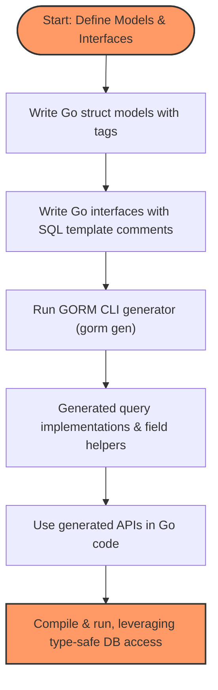

# Working with Models and Query Interfaces

Explore the design philosophy behind model-driven field helpers and interface-driven query APIs. Understand required model patterns, supported field types, and how to express queries as Go interfaces with SQL templates.

---

## Introduction

GORM CLI transforms how Go developers write database interactions by generating two core components:

- **Model-driven Field Helpers:** Type-safe, strongly typed helpers derived from your model structs to assist in building filters, updates, ordering, and managing associations.
- **Interface-driven Query APIs:** Fluent and type-safe query methods automatically implemented by generating concrete method definitions from user-written Go interfaces with embedded SQL templates.

Together, these components provide **compile-time safety**, **discoverability**, and **maintainability** for your database access code.

This page explains the core concepts behind models and query interfaces in GORM CLI, the supported patterns required, and how to express complex queries using SQL templates within interface methods.

---

## Model-Driven Field Helpers: Mapping Your Data Models

### Purpose and Benefits

The model-driven field helpers are generated from your Go struct definitions representing database models. These helpers enable you to construct type-safe, readable, and fluent expressions for querying and updating the database without manual SQL strings.

This approach expresses database fields, including primitive columns and associations, as Go struct fields with specialized helper types, such as:

- **Basic fields:** `field.String`, `field.Number[int]`, `field.Bool`, `field.Time`, etc.
- **Associations:** `field.Struct[T]` for single related structs and `field.Slice[T]` for related slices, supporting `has one`, `has many`, `belongs to`, and `many2many` relationships.

The generated helpers allow:

- **Predicate methods** for filtering (e.g., `Eq`, `Like`, `Between`)
- **Setter methods** for updates and record creation
- **Association operations** like create, update, unlink, delete, and batch creates.


### Required Model Patterns

To benefit from generation, your model structs should follow these patterns:

- Fields must be exported Go struct fields.
- Use GORM struct tags to specify column names, polymorphic settings, and relationships.
- Supported field types include basic Go primitives (string, int, bool, time.Time), nullable types such as `sql.NullInt64`, and custom types implementing certain interfaces (e.g., Scanner, Valuer, Serializer).
- Associations must use conventional GORM patterns (`has one`, `has many`, `belongs to`, `many2many`) with properly annotated tags.
- Polymorphic associations are fully supported and handled as slices or structs.


### Examples

```go
// User model with fields, associations, and GORM tags
type User struct {
  gorm.Model
  Name      string
  Age       int
  Birthday  *time.Time
  Score     sql.NullInt64
  Account   Account          // has one
  Pets      []*Pet           // has many
  Languages []Language       `gorm:"many2many:UserSpeak"` // many2many
  Role      string
  IsAdult   bool   `gorm:"column:is_adult"`
  Profile   string `gen:"json"`  // custom JSON helper
}
```

From this model, GORM CLI generates a `User` struct value with corresponding field helpers:

```go
var User = struct {
  Name    field.String
  Age     field.Number[int]
  Birthday field.Time
  Score   field.Field[sql.NullInt64]
  Account field.Struct[Account]
  Pets    field.Slice[Pet]
  Languages field.Slice[Language]
  Role    field.String
  IsAdult field.Bool
  Profile JSON // custom JSON field helper
}{
  Name:    field.String{}.WithColumn("name"),
  Age:     field.Number[int]{}.WithColumn("age"),
  // ...
}
```

This structure allows crafting predicate filters such as:

```go
// Find users where age is 21 and name contains "jinzhu"
gorm.G[User](db).Where(
  generated.User.Age.Eq(21),
  generated.User.Name.Like("%jinzhu%"),
).Find(ctx)
```

---

## Interface-Driven Query APIs: Defining Type-Safe Queries with SQL Templates

### Philosophy and Approach

Traditional SQL embedded as raw strings leads to runtime errors, low discoverability, and high maintenance costs. GORM CLI empowers developers to write **Go interfaces that describe query intent**, embedding SQL as declarative templates in method comments.

From these interfaces, **type-safe implementations are generated**, exposing fluent methods that return concrete types aligned with your models.


### Defining Query Interfaces

- Define an interface with generic type parameter `[T any]` corresponding to the model type.
- Annotate the SQL query templates in method comments precisely using the **GORM CLI SQL Template DSL**.
- Place the interface and model definitions in the same package or directory to ensure proper mapping.

Example interface:

```go
// Query interface for model T
// Contains embedded SQL in comments that define behavior

type Query[T any] interface {
  // SELECT * FROM @@table WHERE id=@id
  GetByID(id int) (T, error)

  // SELECT * FROM @@table WHERE @@column=@value
  FilterWithColumn(column string, value string) (T, error)

  // Dynamic WHERE clauses with conditional template blocks
  SearchUsers(user User) ([]T, error)

  // UPDATE @@table SET ... WHERE id=@id
  UpdateUser(user User, id int) error
}
```


### The SQL Template DSL Essentials

The DSL in interface comments defines queries dynamically and safely:

| Directive   | Purpose                            | Example                                  |
| ----------- | ---------------------------------- | ---------------------------------------- |
| `@@table`   | Current model's table name         | `SELECT * FROM @@table WHERE id=@id`     |
| `@@column`  | Dynamic column placeholder         | `@@column=@value`                        |
| `@param`    | Bind Go method parameters to SQL  | `WHERE name=@user.Name`                  |
| `{{where}}` | Conditional WHERE clause blocks    | `{{where}} age > 18 {{end}}`             |
| `{{set}}`   | Conditional SET clause (UPDATEs)   | `{{set}} name=@name {{end}}`             |
| `{{if}}`    | Conditionals within templates      | `{{if age > 0}} AND age=@age {{end}}`    |
| `{{for}}`   | Loop over collections in queries   | `{{for _, tag := range tags}} ... {{end}}` |


### Using Generated Query APIs

Once generated, your query interface implementations can be used with concrete methods that match your interface signatures. Example usage:

```go
// Fetch user by ID
user, err := generated.Query[User](db).GetByID(ctx, 123)

// Filter users by dynamic column
result, err := generated.Query[User](db).FilterWithColumn("name", "jinzhu")

// Update user data
err = generated.Query[User](db).UpdateUser(ctx, User{Name: "newname"}, 123)
```

GORM CLI auto-injects a `context.Context` parameter even if omitted from your interface method signature.


---

## Supported Field Types & Generators

### Basic Fields and Custom Types

- Supports primitive Go types (string, int, bool, floats), `time.Time`, byte slices.
- Nullables such as `sql.NullInt64`, `sql.NullTime` are supported with configuration mapping to appropriate field helpers.
- Custom types implementing `Scanner`, `Valuer`, or GORM's `SerializerInterface` integrate smoothly.
- Special tags (`gen:"json"`) enable custom field helpers like JSON to handle JSON columns per database dialect.


### Associations and Relation Fields

- Recognizes and generates helpers for
  - `has one` (single related struct)
  - `has many` (slice of related structs)
  - `belongs to` (foreign key relations)
  - `many2many` (join table relations)
  - Polymorphic associations are fully supported with polymorphic tags.

Each association mapping produces either `field.Struct[T]` for single-entity relations or `field.Slice[T]` for collections.


### How Field Helpers Are Expressed

Each generated field helper adopts a fluent API, for example:

```go
generated.User.Name.Eq("alice")           // WHERE name = 'alice'
generated.User.Age.Between(18, 65)          // WHERE age BETWEEN 18 AND 65
generated.User.Score.IsNull()                // WHERE score IS NULL
```

For updates and creates, setters allow zero-values and expressions:

```go
gorm.G[User](db).
  Set(
    generated.User.Name.Set("alice"),
    generated.User.Age.Set(0),
    generated.User.IsAdult.Set(false),
  ).
  Create(ctx)
```


---

## Best Practices & Tips

- **Keep Interfaces and Models Together:** Place your query interface and model struct definitions in the same package or directory for automatic association.
- **Use Generics `[T any]` in Your Interfaces:** This empowers GORM CLI to generate reusable, type-safe implementations.
- **Leverage Template DSL for Complex Queries:** Conditional blocks and iterations let you express dynamic SQL cleanly and safely.
- **Customize Using genconfig.Config:** Use configuration to map custom types, control output paths, and include or exclude particular types or interfaces.
- **Test Generated Code Early:** Use validation guides to verify generated API correctness.
- **Manage Associations Through Helpers:** This removes manual join and foreign key manipulations and ensures compile-time safety.


---

## Troubleshooting Common Scenarios

- **Method Signature Issues:** Ensure interface methods return expected types; either `(T, error)` or `(error)`. The last return must be `error`.
- **Missing Context Parameter:** GORM CLI adds `context.Context` automatically if not present.
- **Unsupported Field Types or Tag Misuse:** Unsupported or unrecognized types will not generate proper helpers. Use configuration to map or correct.
- **Incorrect Template Syntax:** Review template DSL directives and placeholders carefully for syntax errors.


---

## Visualizing the Workflow



---

## Further Reading and Next Steps

- Explore the [Building Type‑Safe Queries with Interfaces](/guides/core-workflows/type-safe-queries) guide for advanced interface design and practical tips.
- Learn to use [Model-Driven Field Helpers](/guides/core-workflows/field-helpers) for comprehensive field predicates and association management.
- Customize generation with [Configuring the Generator](/getting-started/configuration/generator-configuration) to map custom types or tune outputs.
- Troubleshoot complex usage scenarios in [Troubleshooting Common Issues](/getting-started/validation/troubleshooting).


---

By mastering models and query interfaces using GORM CLI, you unlock a powerful, reliable, and maintainable approach to Go database programming that blends developer productivity with strong static guarantees.