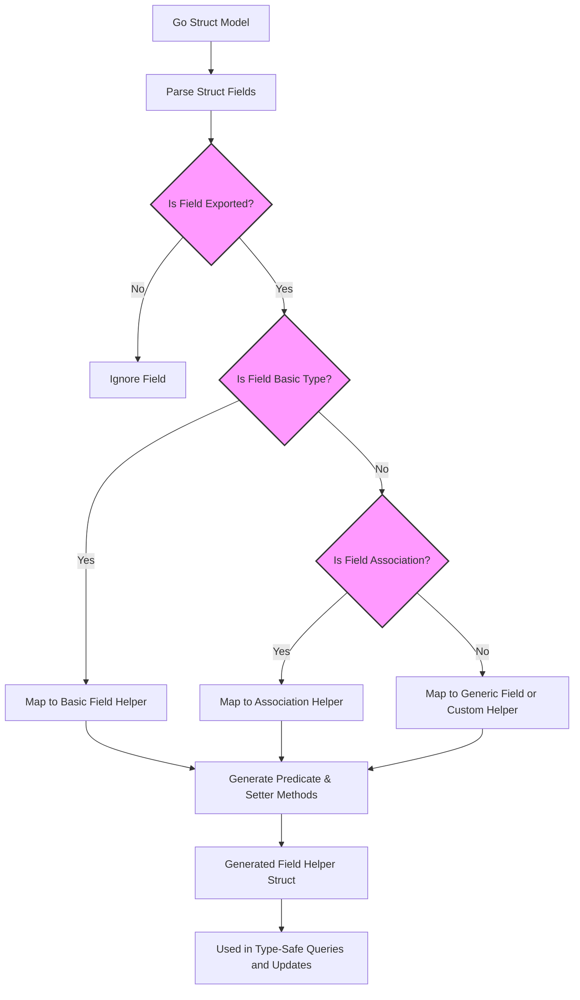

# Model-Driven Field Helpers

Learn how GORM CLI analyzes your Go struct models to generate strongly typed field helpers. This guide reveals which struct fields become helpers, outlines the mapping from basic and complex Go types to generated helper types, and explains how these helpers shape the APIs available for filtering, updating, and managing associations in your database access code.

---

## Introduction to Model-Driven Field Helpers

When you define your Go struct models in a GORM-based project, GORM CLI automatically generates complementary helper objects representing every field within those models. These "field helpers" provide _type-safe_, intuitive accessors that you use to compose queries, updates, and association operations — all backed by compile-time safety and rich IDE support.

### Why Field Helpers Matter

Imagine trying to write database queries or update statements using raw strings for field names. Mistakes in column names or types cause runtime errors or subtle bugs. Field helpers eliminate this risk by:

- Reflecting your Go struct fields as strongly typed helper instances
- Mapping primitive types to specialized helpers for predicates and setters
- Representing associations as nested struct or slice helpers
- Enabling fluent, discoverable filter and update expressions

This allows you to write safer, clearer, and more maintainable data access code.

---

## How Field Helpers Are Derived from Struct Models

### 1. Processing Go Structs

GORM CLI parses your project's Go files to detect struct definitions. For each exported field in these structs, it generates a corresponding field helper.

Fields include:

- Basic Go types such as `int`, `string`, `bool`, `time.Time`.
- Named types implementing `sql.Scanner` and `driver.Valuer` or GORM serialization interfaces.
- Association fields representing relationships like `has one`, `has many`, `belongs to`, and `many2many`.

### 2. Field Helper Type Mapping

The CLI uses sophisticated mapping rules to determine which helper type to generate based on the Go field's type. This mapping ensures that the helper supports the full range of predicates and update operations appropriate to that data type.

| Go Type Example                  | Generated Helper Type           | Description/Usage                                     |
|--------------------------------|--------------------------------|-----------------------------------------------------|
| `string`                       | `field.String`                 | Provides string-based predicate and setter methods.|
| `int`, `uint`, `float64`       | `field.Number[T]` (generic)   | Typed numeric helpers with operators like `Gt()`, `Between()`, `In()`.|
| `bool`                        | `field.Bool`                   | Boolean-specific predicates such as `Eq(true)`.
| `time.Time`                   | `field.Time`                   | Time predicates like `Before()`, `After()`, `IsNull()`.
| `sql.NullInt64`, `sql.NullTime`| `field.Field[T]`               | Nullable fields supporting `IsNull()`, `IsNotNull()`, and null safety.
| Associations (`struct` or slice types)| `field.Struct[T]` or `field.Slice[T]`| Relation helpers for nested models and collections.
| Custom mapped types           | Custom helper (e.g., `JSON`)  | As configured via generation config for specialized behavior.


### 3. Naming & Column Mapping

The helpers preserve accurate database column references for predicates and setters:

- Basic fields include `.WithColumn("column_name")` indicating the exact column
- Association fields use `.WithName("FieldName")` to refer to nested helpers

This naming allows precise SQL generation and supports complex query composition.

### Example: Generated Field Helpers for a User Model

```go
var User = struct {
    ID        field.Number[uint]
    Name      field.String
    Age       field.Number[int]
    IsAdult   field.Bool
    CreatedAt field.Time
    Profile   examples.JSON
    Account   field.Struct[models.Account]
    Pets      field.Slice[models.Pet]
}{
    ID:        field.Number[uint]{}.WithColumn("id"),
    Name:      field.String{}.WithColumn("name"),
    Age:       field.Number[int]{}.WithColumn("age"),
    IsAdult:   field.Bool{}.WithColumn("is_adult"),
    CreatedAt: field.Time{}.WithColumn("created_at"),
    Profile:   examples.JSON{}.WithColumn("profile"),
    Account:   field.Struct[models.Account]{}.WithName("Account"),
    Pets:      field.Slice[models.Pet]{}.WithName("Pets"),
}
```

---

## Using Field Helpers Effectively

These generated helpers empower you to construct expressive, type-safe filters, updates, and association manipulations seamlessly.

### Filtering and Conditional Queries

Use predicate methods on the helpers to build WHERE clauses.

```go
// Find users with Age > 18 AND Role = "active"
db.Where(
    generated.User.Age.Gt(18),
    generated.User.Role.Eq("active"),
).Find(ctx, &users)
```

### Update Assignments with Setters

Compose update assignments with `.Set(value)` or advanced expressions.

```go
// Set role from "pending" to "active"
db.Where(generated.User.Role.Eq("pending")).Set(
    generated.User.Role.Set("active"),
).Update(ctx)

// Increment age by an expression
 db.Where(generated.User.Name.Eq("bob")).Set(
    generated.User.Age.SetExpr(clause.Expr{SQL: "age + ?", Vars: []any{1}}),
).Update(ctx)
```

### Creating Records with Set

Setters are also useful in `Create` workflows to specify field values.

```go
db.Set(
    generated.User.Name.Set("alice"),
    generated.User.Age.Set(29),
    generated.User.IsAdult.Set(true),
).Create(ctx)
```

### Association Field Helpers

Relationship helpers (`field.Struct` and `field.Slice`) provide powerful methods:

- `.Create()` to create and link new associated records
- `.CreateInBatch([]T)` to create multiple associated records
- `.Update(setters...)` to update related records filtered by optional predicates
- `.Unlink()` to clear references without deleting
- `.Delete()` to remove associated records

Example:
```go
// Create a user with one pet
 db.Set(
    generated.User.Name.Set("alice"),
    generated.User.Pets.Create(generated.Pet.Name.Set("fido")),
).Create(ctx)
```

### Handling Zero Values and Nulls

Helpers handle zero-value and nullable fields explicitly, ensuring your updates persist intended values, including NULLs.

```go
// Set Score to NULL and IsAdult to false explicitly
db.Set(
    generated.User.Score.Set(sql.NullInt64{}),
    generated.User.IsAdult.Set(false),
).Update(ctx)
```

---

## How Type Mapping Influences API Shape

The helper type chosen for each field governs the methods exposed to the user, enforcing appropriate predicate and setter signatures:

- Numeric fields gain `Gt`, `Lt`, `Between`, `In`, `Incr` methods.
- Strings provide `Eq`, `Neq`, `Like`, `Contains`, `IsNull` types of logic.
- Time fields offer rich temporal comparisons.
- Nullable fields include null checks.
- Associations enable rich, nested writes and deletes.

This design tightly binds your Go model's structure and semantics to usable, fluid APIs and maintains type integrity throughout.

---

## Customizing Field Helper Generation

You may customize helper generation:

- Use `FieldTypeMap` and `FieldNameMap` in `genconfig.Config` to map specific Go types or struct tags to custom helpers.
- This can enable integration of specialized helpers like JSON field helpers or custom serialization.

Example custom mapping for JSON fields:
```go
var _ = genconfig.Config{
    FieldNameMap: map[string]any{
        "json": JSON{}, // fields tagged with `gen:"json"` use JSON helper
    },
}
```

With this, fields tagged `gen:"json"` generate helpers that produce database-specific JSON operations.

---

## Common Pitfalls & Tips

- **Field visibility:** Only exported (public) struct fields generate helpers.
- **Embedded structs:** Anonymous embedded structs are flattened, and their fields generate helpers as if part of the parent.
- **Zero-value confusion:** Use explicit `.Set` to assign zero or NULL values to avoid unintended omissions.
- **Associations consistency:** Use the provided association methods to preserve relational integrity, avoiding manual FK updates.

---

## Summary

Model-driven field helpers are the cornerstone of type-safe, fluent data operations generated by GORM CLI from your Go struct models. They encapsulate precise column references, reflect field types accurately, and empower you to write expressive, error-proof database code. By understanding how your models map to these helpers, you unlock a powerful API consistent with GORM conventions yet enriched with compile-time safety and productivity gains.

For detailed usage with filters, updates, and association helpers, consult:
- [Field Helper Basics Guide](https://your-doc-site/guides/getting-started-workflows/field-helper-basics)
- [Working With Associations](https://your-doc-site/guides/advanced-usage-patterns/working-with-associations)
- [Customization and Generation Config](https://your-doc-site/guides/advanced-usage-patterns/customization-and-config)

---

## Related Concepts

- [Code Generation Workflow](https://your-doc-site/concepts/architecture-overview/generation-workflow): Understand how parsing and generation happen.
- [Integration with GORM](https://your-doc-site/concepts/architecture-overview/integration-boundaries): How generated helpers plug into standard GORM usage.
- [Using Type-Safe Query APIs](https://your-doc-site/guides/getting-started-workflows/using-type-safe-queries): Combine field helpers with query methods for fluent DB access.

---

## Appendix: Sample Generated Field Helper Snippet for User Model

```go
var User = struct {
	ID        field.Number[uint]
	Name      field.String
	Age       field.Number[int]
	Role      field.String
	IsAdult   field.Bool
	Profile   examples.JSON
	Account   field.Struct[models.Account]
	Pets      field.Slice[models.Pet]
}{
	ID:        field.Number[uint]{}.WithColumn("id"),
	Name:      field.String{}.WithColumn("name"),
	Age:       field.Number[int]{}.WithColumn("age"),
	Role:      field.String{}.WithColumn("role"),
	IsAdult:   field.Bool{}.WithColumn("is_adult"),
	Profile:   examples.JSON{}.WithColumn("profile"),
	Account:   field.Struct[models.Account]{}.WithName("Account"),
	Pets:      field.Slice[models.Pet]{}.WithName("Pets"),
}
```

Users can then use these helpers in predicate and setter expressions, enabling compile-time safe query construction and update logic.


---

# Diagram: Field Helper Generation Overview



This simple workflow shows how each struct field flows through classification and mapping steps to produce the strongly typed field helpers users rely on.
