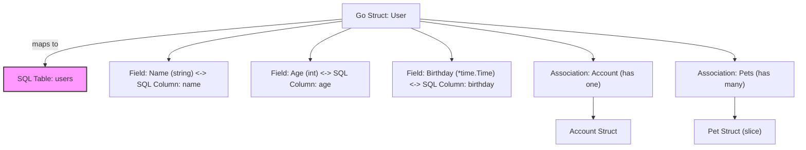

# Struct-Based Data Models: Philosophy and Practice

GORM CLI centers your application’s data logic around Go structs, offering a powerful, type-safe foundation for defining and interacting with your data schema. This guide explores how GORM CLI interprets Go structs to generate query APIs and field helpers, bridging your in-code Go data types with their SQL counterparts naturally and intuitively.

---

## Why Structs Are Core to GORM CLI

Your Go structs represent the single source of truth for your database tables — each field corresponds to one or more database columns or associations. By focusing on struct definitions as the nucleus, GORM CLI:

- Empowers compile-time safety by tightly coupling Go’s type system to SQL operations
- Automates generation of fluent, discoverable APIs reflecting your exact data schema
- Enables consistent and maintainable mappings between Go data and relational database structures

This philosophy aligns perfectly with idiomatic Go development, keeping your data schema definition close to your code logic for clarity and control.

## Mapping Go Struct Fields to SQL Columns

Each exported struct field is analyzed and mapped according to its Go type and optional struct tags. GORM CLI supports:

- **Basic scalar and common types:** `int`, `string`, `bool`, `time.Time`, byte slices, and nullable types like `sql.NullInt64`
- **Named types with custom mapping:** You can opt-in via configuration to treat certain Go named types as specific SQL types
- **Associations:** Structs or slices representing `has one`, `has many`, `belongs to`, or `many2many` relationships

### Type Compatibility and Field Helpers

Learn how field helpers are automatically generated based on the Go type:

| Go Type                 | Field Helper Type               | Purpose & Behavior                                                     |
|-------------------------|--------------------------------|-----------------------------------------------------------------------|
| `string`                | `field.String`                  | String-based predicates and setters                                  |
| Numeric types (int, uint, float) | `field.Number[T]` (generic)      | Numeric comparisons and arithmetic setters                           |
| `bool`                  | `field.Bool`                   | Boolean predicates and setters                                       |
| `time.Time` and variants| `field.Time`                   | Time-based querying and updates                                     |
| Nullable types (e.g., `sql.NullInt64`) | `field.Field[T]` generic wrapper | Handle nullability explicitly                                       |
| Struct types (associations) | `field.Struct[T]`           | Nested struct relations, with association management helpers         |
| Slice types (associations)  | `field.Slice[T]`             | Represent has-many or many-to-many relations                         |

These helpers facilitate fluent predicate creation (like `Eq`, `Gt`, `Between`), updates (e.g., `Set`, `Incr`), and association operations (e.g., `Create`, `Unlink`, `Delete`).

### Example

Consider a simplified `User` struct:

```go
type User struct {
  ID        uint
  Name      string
  Age       int
  Birthday  *time.Time
  Score     sql.NullInt64
  Profile   string `gen:"json"`
}
```

GORM CLI generates corresponding field helpers like:

```go
var User = struct {
  ID       field.Number[uint]
  Name     field.String
  Age      field.Number[int]
  Birthday field.Time
  Score    field.Field[sql.NullInt64]
  Profile  examples.JSON
}{
  ID:       field.Number[uint]{}.WithColumn("id"),
  Name:     field.String{}.WithColumn("name"),
  Age:      field.Number[int]{}.WithColumn("age"),
  Birthday: field.Time{}.WithColumn("birthday"),
  Score:    field.Field[sql.NullInt64]{}.WithColumn("score"),
  Profile:  examples.JSON{}.WithColumn("profile"),
}
```

This generated code provides strongly-typed building blocks for query construction and data updates.

## Field Tagging for Customized Behavior

GORM CLI respects standard GORM struct tags and introduces an optional `gen` struct tag for generation customization.

- Use `gen:"json"` to map fields to custom JSON helpers for JSON column support with database-dependent SQL generation.
- Custom type mappings and name remappings can be specified via the package-level `genconfig.Config` configuration, allowing you to tailor code generation per project conventions.

Example `genconfig.Config`:

```go
var _ = genconfig.Config{
  OutPath: "examples/output",
  FieldNameMap: map[string]any{
    "json": JSON{}, // Maps any field tagged with `gen:"json"` to a JSON field helper
  },
}
```

This extensibility makes the data modeling layer highly adaptable without changing your original structs.

## Handling Associations

Struct fields representing relationships generate specialized field helpers with semantics reflecting the nature of the association:

| Association Type | Go Field Declaration                      | Generated Helper Type    | Semantics of Operations                               |
|------------------|------------------------------------------|-------------------------|-----------------------------------------------------|
| Has One          | `Account Account`                         | `field.Struct[T]`       | FK on child, supports create/update/unlink/delete   |
| Has Many         | `Pets []*Pet`                            | `field.Slice[T]`        | One-to-many child FK, batch operations supported    |
| Belongs To       | `Company Company`                        | `field.Struct[T]`       | FK on parent, unlink clears FK                       |
| Many to Many     | `Languages []Language`                   | `field.Slice[T]`        | Join table rows managed on unlink/delete            |

Operations such as Create, Update, Unlink, and Delete, when applied via generated helpers, propagate changes to related tables safely, improving data integrity and developer productivity.

## Best Practices for Maintainable Data Schemas

- **Keep struct field and tag naming consistent:** This reduces confusion and aligns SQL column names automatically
- **Use pointer types (`*time.Time`, `*int`) for nullable columns:** Clearly signify optional data
- **Leverage `genconfig.Config` for project-specific customizations:** Easily map custom types and customize generators without modifying model structs
- **Model associations explicitly:** Proper struct declarations enable automatic and safe association management through generated helpers
- **Prefer composition over anonymous structs for embedding:** While embedding is supported, clarity aids maintainability

## Practical Example

Here's a typical Go struct for a user with several relations and custom tags:

```go
package models

import (
  "database/sql"
  "time"
  "gorm.io/gorm"
)

type User struct {
  gorm.Model
  Name      string
  Age       int
  Birthday  *time.Time
  Score     sql.NullInt64
  LastLogin sql.NullTime

  Account   Account
  Pets      []*Pet
  CompanyID *int
  Company   Company
  Languages []Language `gorm:"many2many:UserSpeak"`
  Profile   string `gen:"json"`
}
```

And the generated helpers from GORM CLI allow queries like:

```go
users, err := generated.Query[User](db).
  FilterByNameAndAge("jinzhu", 25).
  Find(ctx)

// Query pets of a user
pets, err := gorm.G[User](db).
  Where(generated.User.ID.Eq(1)).
  Select(generated.User.Pets).
  Find(ctx)
```

## Troubleshooting Common Pitfalls

- **Mismatched Types:** Ensure your Go field types closely represent the intended SQL column type to avoid incorrect generated helpers.
- **Missing Exported Fields:** Only exported fields (capitalized) are processed.
- **Tagging Mistakes:** Confirm `gen` tags are exactly as expected; syntax errors or typos prevent proper custom helper assignment.
- **Unintended Exclusions:** Use `genconfig.Config` filters carefully; excluding structs or interfaces unintentionally will omit generation.

If your generated code lacks expected helpers or associations, review struct visibility, type correctness, and configuration carefully.

## Summary

Struct-based data models in GORM CLI provide a clean, idiomatic way to reflect your database schema with full type safety and flexible customization. By mastering struct declarations, tagging, and association modeling, you unlock powerful, generated query APIs and helpers that enhance developer productivity and maintain code clarity.

---

## Additional Resources

- [Core Concepts & Terminology](/overview/architecture-concepts/core-concepts-terminology)
- [Writing Models & Query Interfaces](/getting-started/first-code-gen/writing-models-interfaces)
- [Managing Associations Guide](/guides/advanced-usage/advanced-associations)
- [Customizing Code Generation](/guides/advanced-usage/customizing-generation)
- [Template DSL Principles](/concepts/data-modeling-and-templates/template-dsl-principles)

---

## Visualization of Struct Field Mapping

