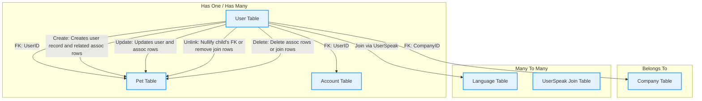

# Associations: Relationships and Operations

GORM CLI automatically detects and generates type-safe helpers for model associations based on your Go struct definitions. This page guides you through the recognition of different association types (`has one`, `has many`, `belongs to`, `many2many`, and **polymorphic**), illustrates the generated association helpers, and explains the supported operations you can perform with compile-time safety in your Go code.

---

## Understanding Model Associations in GORM CLI

### Supported Association Types

GORM CLI supports generating helpers for the following association types, mirroring GORM's own model relationships:

- **Has One:** One-to-one from the parent to another model (e.g., `User` has one `Account`).
- **Has Many:** One-to-many from the parent to a list of associated models (e.g., `User` has many `Pets`).
- **Belongs To:** Many-to-one from the child back to the owning parent (e.g., `User` belongs to `Company`).
- **Many To Many:** Many-to-many relationships usually backed by a join table (e.g., `User` speaks many `Languages`).
- **Polymorphic Associations:** Single related model or collection that could belong to multiple parent types (e.g., `Pet` has one `Toy`, polymorphically).

### How Associations Are Detected

Associations are identified by the presence of fields in your model structs and supported GORM struct tags such as `gorm:"many2many:table_name"` or `gorm:"polymorphic:Owner"`. GORM CLI inspects these fields and generates **association helpers** of type `field.Struct[T]` for single relations, or `field.Slice[T]` for multi-relations, enabling fluent and type-safe operations.

For example, in the `User` model (simplified):

```go
// User model excerpt showing various associations
type User struct {
  Account   Account                // Has One
  Pets      []*Pet                 // Has Many
  CompanyID *int
  Company   Company                // Belongs To
  Languages []Language             `gorm:"many2many:UserSpeak"` // Many to Many
  Friends   []*User                `gorm:"many2many:user_friends"` // Many to Many single-table
}
```

---

## Generated Association Helpers

GORM CLI generates helper variables on the model's generated field helpers, e.g., `generated.User.Account`, `generated.User.Pets`, `generated.User.Company`, mimicking the fields but with rich fluent operations:

- **Single association:** `field.Struct[T]` helpers for `has one`, `belongs to`, and polymorphic single relations.
- **Multiple association:** `field.Slice[T]` helpers for `has many` and `many2many`.

These helpers provide methods such as `Create()`, `Update()`, `Delete()`, `Unlink()`, and `CreateInBatch()` with compile-time type safety.

---

## Operations on Associations

Operations on associations are expressed using these helpers combined with GORM's fluent API and performed atomically with the parent record's update or creation. All operations use `Set(...).Update(ctx)` or `Set(...).Create(ctx)` on `gorm.G[T](db)`, where `T` is the parent model type.

### 1. Creating Associated Records

- **Create**: Creates and associates a new record for each matched parent.

```go
// Create one pet linked to a user with id=1
_, err := gorm.G[models.User](db).
  Where(generated.User.ID.Eq(1)).
  Set(generated.User.Pets.Create(generated.Pet.Name.Set("fido"))).
  Update(ctx)
```

- **CreateInBatch**: Creates multiple records and associates them in batch.

```go
// Batch link multiple pets to the user
pets := []models.Pet{{Name: "bm1"}, {Name: "bm2"}}
_, err := gorm.G[models.User](db).
  Where(generated.User.ID.Eq(1)).
  Set(generated.User.Pets.CreateInBatch(pets)).
  Update(ctx)
```

### 2. Updating Associated Records

You can update associated records conditionally.

```go
// Update user's pet where name='old'
_, err := gorm.G[models.User](db).
  Where(generated.User.ID.Eq(1)).
  Set(generated.User.Pets.Where(generated.Pet.Name.Eq("old")).Update(
    generated.Pet.Name.Set("new"),
  )).
  Update(ctx)
```

### 3. Unlinking Associations

Unlink removes the link between parent and associated records without deleting the associated record.

- For `belongs to`, it nullifies the foreign key on the parent.
- For `has one`/`has many`, it nullifies the child's foreign key.
- For `many2many`, it deletes join table rows only.

```go
// Unlink all pets from user with id=1 (set user_id NULL)
_, err := gorm.G[models.User](db).
  Where(generated.User.ID.Eq(1)).
  Set(generated.User.Pets.Unlink()).
  Update(ctx)
```

### 4. Deleting Associated Records

Delete removes associated records from the database (row deletion).

For `many2many`, this deletes only join table entries, preserving the records on the other table.

```go
// Delete pets named 'a' associated with user id=1
_, err := gorm.G[models.User](db).
  Where(generated.User.ID.Eq(1)).
  Set(generated.User.Pets.Where(generated.Pet.Name.Eq("a")).Delete()).
  Update(ctx)
```

---

## Detailed Semantics by Association Type

| Association Type  | Helper Type     | Unlink Behavior                                  | Delete Behavior                                | Notes
|-------------------|-----------------|-------------------------------------------------|------------------------------------------------|-------
| Has One           | `field.Struct[T]` | Sets child's FK to NULL (unlinks)                | Deletes associated record                      | Single related record
| Has Many          | `field.Slice[T]`  | Sets child FKs to NULL (unlinks all matching)    | Deletes child rows matching filter             | Multi-record relation
| Belongs To        | `field.Struct[T]` | Sets FK on parent to NULL (unlinks)               | Deletes the associated record                  | Single owning parent link
| Many To Many      | `field.Slice[T]`  | Deletes join table rows only (unlink)             | Deletes join table rows only (no cascade delete)| Associated records unaffected
| Polymorphic Has One| `field.Struct[T]` | Zeros polymorphic FK and type fields (unlink)    | Deletes associated polymorphic row             | Supports single polymorphic owner

---

## Polymorphic Associations

Polymorphic associations allow a model to be related to multiple types via a common interface using `OwnerID` and `OwnerType` fields.

For example, `Pet` has one `Toy` polymorphically:

```go
// Pet model
type Pet struct {
  gorm.Model
  UserID *uint
  Name   string
  Toy    Toy `gorm:"polymorphic:Owner;"`
}

// Toy model
type Toy struct {
  gorm.Model
  Name      string
  OwnerID   uint
  OwnerType string
}
```

Operations follow similar semantics:

- **Create**: create and associate a Toy for the Pet.
- **Update**: update the Toy's fields conditionally.
- **Unlink**: zero out polymorphic foreign key and type columns.
- **Delete**: delete the polymorphic Toy record.

Example update:

```go
_, err := gorm.G[models.Pet](db).
  Where(generated.Pet.ID.Eq(p.ID)).
  Set(generated.Pet.Toy.Where(generated.Toy.Name.Eq("ball")).Update(generated.Toy.Name.Set("cube"))).
  Update(ctx)
```

---

## Stepwise User Flow for Associations

<Steps>
<Step title="Prepare Your Models">
Define your Go structs with GORM associations using correct GORM tags and field types, e.g. has one, has many, belongs to, many2many, polymorphic.
</Step>
<Step title="Generate Helpers">
Run GORM CLI to produce generated field helpers for your models.
</Step>
<Step title="Create Associations">
Use generated helpers with Set(...).Create(ctx) or Update(ctx) to create and associate related records.
</Step>
<Step title="Update Associations">
Invoke Update() on filtered associations to modify associated data safely with conditions.
</Step>
<Step title="Unlink Associations">
Call Unlink() to disassociate without deleting data (sets foreign keys to NULL or removes join rows).
</Step>
<Step title="Delete Associations">
Use Delete() carefully to remove related records or join rows, understanding deletion scope (especially in many2many).
</Step>
</Steps>

---

## Practical Examples and Patterns

### Create One Pet for a User

```go
_, err := gorm.G[models.User](db).
  Where(generated.User.ID.Eq(userID)).
  Set(generated.User.Pets.Create(generated.Pet.Name.Set("fido"))).
  Update(ctx)
```

### Create Pets for Multiple Users

```go
_, err := gorm.G[models.User](db).
  Where(generated.User.Name.In("alice", "bob")).
  Set(generated.User.Pets.Create(generated.Pet.Name.Set("multi-pet"))).
  Update(ctx)
```

### Update User's Account Number

```go
_, err := gorm.G[models.User](db).
  Where(generated.User.ID.Eq(userID)).
  Set(generated.User.Account.Update(generated.Account.Number.Set("A-002"))).
  Update(ctx)
```

### Unlink User's Company

```go
// Sets CompanyID on User to NULL
_, err := gorm.G[models.User](db).
  Where(generated.User.ID.Eq(userID)).
  Set(generated.User.Company.Unlink()).
  Update(ctx)
```

### Many2Many Language Association

```go
// Create and link new language
_, err := gorm.G[models.User](db).
  Where(generated.User.ID.Eq(userID)).
  Set(generated.User.Languages.Create(generated.Language.Code.Set("EN"), generated.Language.Name.Set("English"))).
  Update(ctx)

// Unlink language
_, err = gorm.G[models.User](db).
  Where(generated.User.ID.Eq(userID)).
  Set(generated.User.Languages.Where(generated.Language.Code.Eq("EN")).Unlink()).
  Update(ctx)
```

### Polymorphic Toy Update for Pet

```go
_, err := gorm.G[models.Pet](db).
  Where(generated.Pet.ID.Eq(petID)).
  Set(generated.Pet.Toy.Update(generated.Toy.Name.Set("new-toy-name"))).
  Update(ctx)
```

---

## Common Pitfalls and Troubleshooting

- **Unlink vs Delete confusion:** Remember Unlink only disassociates without removing data; Delete removes data.
- **Conditions on associations:** Always apply Where() conditions on association helpers before Update/Delete/Unlink to avoid unintended wide data changes.
- **Polymorphic associations:** When unlinking, foreign keys and type fields are zeroed properly; deleting removes polymorphic rows.
- **Batch operations:** Use `CreateInBatch()` for efficient batch association creation with type safety.

---

## Diagram: Association Operation Data Flow



---

## Additional Tips

- Combine association operations within a single `Set()` to perform multiple changes atomically.
- Use the generated helpers for compile-time safety and avoid runtime errors due to typos or mismatched types.
- For many2many, unlinking or deleting only affects the join table, preserving the linked records.
- Review generated test examples (`models_relations_test.go`) for comprehensive usage scenarios in real code.

---

## Related Documentation

- [Generating Type-Safe Query APIs](/guides/core-workflows/generating-query-apis): Understanding the generation of query methods.
- [Using Model-Driven Field Helpers](/guides/core-workflows/field-helper-generation): Deep dive into fluent field helpers including associations.
- [Writing Powerful Queries with the Template SQL DSL](/guides/advanced-use-cases/template-sql-dsl): Learn to write dynamic, conditional SQL in interfaces.
- [Generator Configuration & Customization](/concepts/extensibility-integration/generation-config): How to customize generation rules and mappings.

For practical examples, explore `examples/output/models_relations_test.go` demonstrating association CRUD patterns.

---