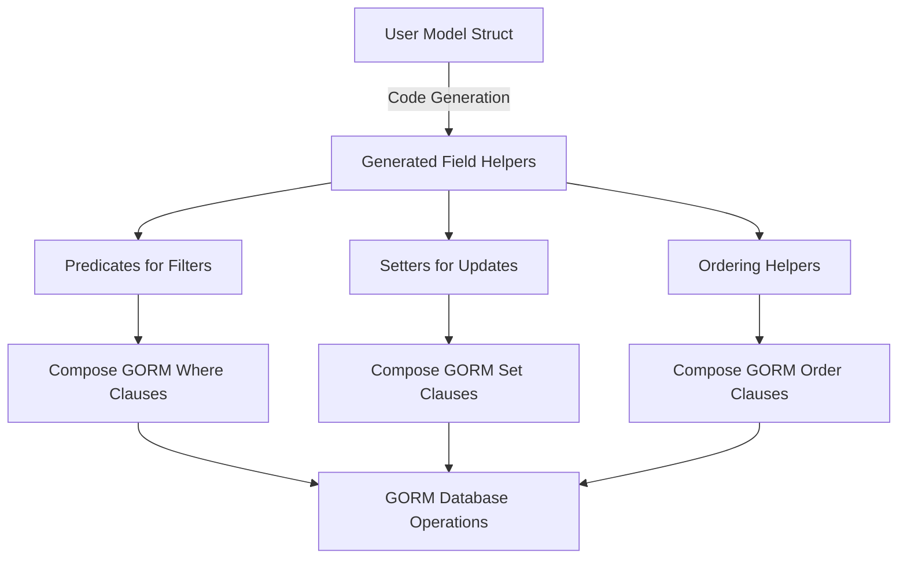

# Field Helpers: Filters, Updates, and Orderings

Explore how GORM CLI extends your basic model fields into powerful, expressive, and chainable field helpers that enable fluent query and update operations. This page details how predicates, setters, and ordering helpers are generated for each supported data type, empowering you to write concise, type-safe, and readable database interaction code.

---

## Introduction

GORM CLI automatically generates model-driven field helpers for each field of your struct models, transforming ordinary Go fields into rich, type-safe interfaces for building SQL predicates, updates, and orderings. These helpers greatly simplify and clarify database operations by providing methods tailored to each field’s Go type and database column.

For example, given a simple `User` struct:

```go
// User model definition
// Fields: ID, Name, Age, IsAdult, etc.
type User struct {
  ID      uint
  Name    string
  Age     int
  IsAdult bool
}
```

The generated `User` struct helpers give you fluent methods like:

- `generated.User.Name.Like("%jinzhu%")` to build SQL LIKE predicates
- `generated.User.Age.Gt(18)` for greater-than filters
- `generated.User.IsAdult.Eq(true)` for equality checks
- `generated.User.Name.Set("alice")` for update assignments
- `generated.User.Age.Incr(1)` for arithmetic updates

This model-driven approach ensures your queries and updates are both type-safe and strongly tied to your model, reducing runtime errors and improving code discoverability.

---

## Basic Concepts

### What Are Field Helpers?

A field helper is a generated wrapper type around a struct field and its database column that provides methods for:

- **Filters (Predicates):** Create where clauses, such as equals, not equals, greater than, less than, `IN` lists, and NULL checks.
- **Updates (Setters):** Create value assignments for insert or update operations, supporting zero values, expressions, and common helper setters.
- **Ordering:** Specify ascending or descending order by the field.

Each field generates a type-specific helper, for example:

- `field.String` methods for `string` fields
- `field.Number[T]` generic for numeric fields
- `field.Bool` for booleans
- `field.Time` for time types
- `field.Field[T]` generic for custom types implementing `Scanner`/`Valuer`

### Types of Basic Fields Supported

GORM CLI supports generating helpers for these model field types:

- Go built-in types: `int`, `float64`, `string`, `bool`, `[]byte`, `time.Time`
- Named types implementing common database interfaces, e.g., `sql.NullInt64`, `gorm.DeletedAt`
- Custom named types that implement `database/sql.Scanner` and `Valuer`

### How Helpers are Named

For each struct field, the generated helper is accessible as `generated.<StructName>.<FieldName>`. For example, for the `User` model’s `Name` field:

```go
generated.User.Name // type: field.String
```

This helper provides the full set of predicate, setter, and ordering methods.

---

## Building Query Filters with Predicates

Use generated field helpers to create strongly-typed SQL predicates that can be passed into GORM’s `Where`, `Or`, or query builder methods.

### Common Predicate Methods

| Method            | Description                                         | Example                                      |
|-------------------|-----------------------------------------------------|----------------------------------------------|
| `Eq(value)`       | Equals predicate (`field = value`)                   | `generated.User.Age.Eq(30)`                    |
| `Neq(value)`      | Not equals predicate                                 | `generated.User.Name.Neq("alice")`           |
| `Gt(value)`       | Greater than                                         | `generated.User.Age.Gt(18)`                    |
| `Gte(value)`      | Greater than or equal                                | `generated.User.Age.Gte(18)`                   |
| `Lt(value)`       | Less than                                            | `generated.User.Age.Lt(65)`                    |
| `Lte(value)`      | Less than or equal                                   | `generated.User.Age.Lte(65)`                   |
| `In(values...)`   | SQL IN list predicate                                | `generated.User.Role.In("admin", "user")` |
| `NotIn(values...)`| SQL NOT IN predicate                                 | `generated.User.Role.NotIn("guest")`         |
| `Like(pattern)`   | LIKE pattern for string fields                       | `generated.User.Name.Like("%jinzhu%")`       |
| `IsNull()`        | Checks if value is null                              | `generated.User.Score.IsNull()`                |
| `IsNotNull()`     | Checks if value is not null                          | `generated.User.LastLogin.IsNotNull()`         |

### Filter Composition

You can combine multiple predicates in `Where` or `Or` clauses:

```go
db.Where(
  generated.User.Age.Gt(18),
  generated.User.Role.Eq("active"),
).Find(&users)
```

This composes SQL `WHERE age > 18 AND role = 'active'`.

### Null and Nullable Types

Field helpers accommodate nullable types like `sql.NullString` and provide `IsNull` and `IsNotNull` predicates to filter by null state.

---

## Performing Updates with Setters

Field helpers also generate setter methods that create assignments to use in `Update` or `Create` operations.

### Common Setter Methods

| Method         | Description                                      | Example                                         |
|----------------|-------------------------------------------------|-------------------------------------------------|
| `Set(value)`  | Set the field value directly                     | `generated.User.Name.Set("alice")`              |
| `SetExpr(expr)`| Set value using SQL expression (`clause.Expr`) | `generated.User.Age.SetExpr(clause.Expr{SQL: "age + ?", Vars: []any{1}})`|
| `Incr(amount)` | Increment numeric fields (shorthand for `SetExpr`)| `generated.User.Age.Incr(1)`                     |
| `Upper()`     | Convenience method for string uppercase update  | `generated.User.Name.Upper()`                     |

### Using Setters in Updates and Creates

You can chain multiple setter assignments in a single `Set` call:

```go
// Update
rows, err := gorm.G[User](db).
  Where(generated.User.Name.Eq("bob")).
  Set(
    generated.User.Age.Incr(1),
    generated.User.Role.Set("active"),
  ).
  Update(ctx)

// Create
err := gorm.G[User](db).
  Set(
    generated.User.Name.Set("alice"),
    generated.User.Age.Set(25),
  ).
  Create(ctx)
```

### Handling Zero Values and Expressions

Setters explicitly handle zero values correctly, enabling you to set fields to zero for numeric types, empty strings, false booleans, or NULL (for nullable fields). Using `SetExpr` lets you apply SQL expressions for updates, such as increments or complex calculations.

---

## Ordering Queries

Although the focus is on filters and updates, field helpers also facilitate specifying order clauses.

### Ordering Methods

| Method        | Description                    | Example                     |
|---------------|-------------------------------|-----------------------------|
| `Asc()`      | Order ascending by the field   | `gorm.G[User](db).Order(generated.User.Name.Asc())` |
| `Desc()`     | Order descending by the field  | `gorm.G[User](db).Order(generated.User.Age.Desc())` |

These simplify writing order clauses in GORM queries.

---

## Examples

### Filtering Users Older Than 18 and Active

```go
var users []User
err := gorm.G[User](db).
  Where(
    generated.User.Age.Gt(18),
    generated.User.Role.Eq("active"),
  ).
  Find(ctx, &users)
```

### Updating a User’s Role

```go
_, err := gorm.G[User](db).
  Where(generated.User.Name.Eq("bob")).
  Set(generated.User.Role.Set("active")).
  Update(ctx)
```

### Creating a New User

```go
err := gorm.G[User](db).
  Set(
    generated.User.Name.Set("alice"),
    generated.User.Age.Set(30),
  ).
  Create(ctx)
```

### Complex Update: Zero Values and Expressions

```go
_, err := gorm.G[User](db).
  Where(generated.User.Name.Eq("cathy")).
  Set(
    generated.User.Role.Set(""),          // Set string to empty
    generated.User.IsAdult.Set(false),     // Set bool to false
    generated.User.Score.Set(sql.NullInt64{}), // Set NULL
    generated.User.Age.SetExpr(clause.Expr{SQL: "age + ?", Vars: []any{2}}),
  ).
  Update(ctx)
```

---

## Best Practices

- **Use the Generated Helpers for Type Safety:** Always prefer generated field helpers rather than raw strings or untyped constructs. This reduces bugs and improves code clarity.

- **Chain Multiple Predicates or Setters:** Combine multiple filters or setters in a single call to keep code concise and expressive.

- **Handle Nullable Types Explicitly:** Use `IsNull` and `IsNotNull` predicates for nullable fields rather than relying on default zero values.

- **Leverage `SetExpr` for Complex Updates:** When incrementing, decrementing, or applying SQL expressions, use `SetExpr` with `clause.Expr` for maximum flexibility.

- **Avoid Manual Column Naming:** The helpers respect GORM’s naming conventions and struct tags. Use the generated helpers to avoid naming mismatches.

---

## Troubleshooting

### Common Issues

- **Using Helpers for Unrecognized Types:** If your struct field type does not implement recognized interfaces like `Scanner` or `Valuer`, helpers may not generate correctly. Define custom field mappings via `genconfig.Config` for such cases.

- **Zero Values Not Updated:** Ensure you use the generated setter methods to explicitly set zero values, as omitting them may leave fields unchanged.

- **Query Methods Return Errors:** Always check returned errors from query chains using helpers to handle edge cases.

### Tips

- Review your generated helpers by inspecting the generated files to understand supported methods.
- Use the `examples/output/models_field_helpers_test.go` as a reference for real usage patterns.

---

## How This Fits Into GORM CLI Documentation

This page focuses exclusively on generated field helpers — the cornerstone of how your model’s fields become expressive, fluent APIs for filtering, updating, and ordering data.

For a broader understanding, you should also explore:

- [Generating Type-Safe Query APIs](/guides/core-workflows/generating-query-apis) — how interface SQL templating complements field helpers
- [Working with Associations: Patterns & Best Practices](/guides/advanced-use-cases/associations-best-practices) — for relation handling helpers
- [Custom Field Mapping and Advanced Columns](/concepts/data-modeling-fields/custom-fields-config) — to extend support beyond basic types

Together, these concepts provide the full picture of GORM CLI’s powerful code generation capabilities.

---

## Reference Diagram: Field Helpers Conceptual Flow



This flow shows how your Go struct fields translate into rich helpers used in database operations.

---

## Additional Examples

### Using Nullability in Filters

```go
// Find users with NULL score
usersNullScore, err := gorm.G[User](db).
  Where(generated.User.Score.IsNull()).
  Find(ctx)

// Find users with non-NULL last login
usersWithLogin, err := gorm.G[User](db).
  Where(generated.User.LastLogin.IsNotNull()).
  Find(ctx)
```

### Updating Using Expressions

```go
// Increment Age by 1
_, err := gorm.G[User](db).
  Where(generated.User.Name.Eq("bob")).
  Set(generated.User.Age.Incr(1)).
  Update(ctx)
```

### Combining Filters

```go
// Users older than 18 with active role
users, err := gorm.G[User](db).
  Where(generated.User.Age.Gt(18), generated.User.Role.Eq("active")).
  Find(ctx)
```

---

Feel empowered to use these richly-generated helpers as the foundation of all your query and update logic with GORM CLI, achieving both type safety and elegant code.


---

# FAQ

**Q:** Can I customize the generated helpers for fields with special types?

**A:** Yes, configure `genconfig.Config` in your package to map custom field types to existing or custom helpers.


**Q:** What if I need to set a field to SQL NULL explicitly?

**A:** Use the `Set` method on the helper with a zero-value of a null-type, e.g., `sql.NullInt64{}`.


**Q:** Are the field helpers compatible with GORM’s regular query API?

**A:** Absolutely. The helpers produce `clause.Expression` implementations that seamlessly integrate with GORM's `Where`, `Set`, and `Order` methods.


---

# See Also

- [Using Model-Driven Field Helpers](https://gorm.io/cli/docs/guides/core-workflows/field-helper-generation)
- [Working with Associations](https://gorm.io/cli/docs/guides/advanced-use-cases/associations-best-practices)
- [Custom Field Mapping and Advanced Columns](https://gorm.io/cli/docs/concepts/data-modeling-fields/custom-fields-config)
- [Template SQL DSL for Query Interfaces](https://gorm.io/cli/docs/guides/advanced-use-cases/template-sql-dsl)

---

# Source Code Reference

You can view the template and logic for generating field helpers in the source code:

<Source url="https://github.com/go-gorm/cli" paths={[{"path": "internal/gen/generator.go", "range": "50-175"},{"path": "internal/gen/utils.go", "range": "30-130"}]} branch="main" />
