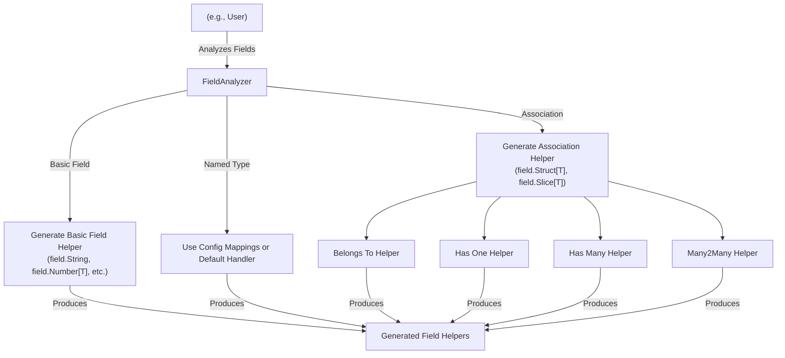

# Field Helpers and Associations

GORM CLI streamlines database operations by generating **field helpers** from your Go model structs. This page explains how GORM CLI analyzes model fields—covering basic types, named types, and associations—to produce strongly-typed helpers for constructing safe, expressive queries, updates, and relationship traversals.

---

## Introduction

When working with GORM, your models define the structure and relationships of your database tables. GORM CLI extends this by generating code helpers from those model structs that empower you to build fluent, type-safe filter predicates, updates, and association operations.

This documentation drills into how the generator interprets various field kinds in your models and how it produces corresponding field helpers. Understanding these concepts lets you harness the full power of generated APIs to write clean and correct database code.

---

## Understanding Model Fields

Your Go struct models act as blueprints for your database tables. GORM CLI inspects these structs to generate field helpers that map to the underlying columns or associations.

### Basic Fields

Basic fields include Go built-in types such as:

- Primitive types: `int`, `float64`, `string`, `bool`
- Time types: `time.Time`
- Byte slices: `[]byte`
- Named types implementing `database/sql.Scanner` and/or `driver.Valuer`

**Examples:**

```go
type User struct {
  ID        uint
  Name      string
  Age       int
  CreatedAt time.Time
}
```

For these fields, GORM CLI generates typed helpers under the model's generated counterpart, such as:

- `generated.User.ID` of type `field.Number[uint]`
- `generated.User.Name` of type `field.String`
- `generated.User.Age` of type `field.Number[int]`
- `generated.User.CreatedAt` of type `field.Time`

These helpers provide chainable predicates and setters like `Eq()`, `Gt()`, `Set()`, `Incr()`, and more, enabling expressive query building.

---

### Named and Custom Types

Fields with named or custom types (e.g., a custom `sql.NullTime`) are supported via configurable type mappings in the generation `genconfig.Config`.

Configure your type mappings in a package-level config to have your custom types mapped to appropriate field helpers:

```go
var _ = genconfig.Config{
  FieldTypeMap: map[any]any{
    sql.NullTime{}: field.Time{},  // Map sql.NullTime to field.Time helper
  },
  FieldNameMap: map[string]any{
    "json": JSON{},  // Custom JSON helper for fields tagged `gen:"json"`
  },
}
```

This approach lets you extend generator support beyond standard types with your tailored logic.

---

### Associations

One of the significant strengths of GORM CLI is automatic generation of **association helpers** to navigate and manipulate relationships between models, including:

- **Belongs To**
- **Has One**
- **Has Many**
- **Many2Many** (including polymorphic associations)

**Example:**

```go
type User struct {
  ID      uint
  Account Account     // Has One
  Pets    []Pet       // Has Many
  Languages []Language `gorm:"many2many:user_languages"`
}
```

For associations, GORM CLI generates helpers like:

- `generated.User.Account` as `field.Struct[Account]`
- `generated.User.Pets` as `field.Slice[Pet]`
- `generated.User.Languages` as `field.Slice[Language]`

These helpers serve multiple purposes:

- **Filtering:** You can filter parents or children using predicates on association fields.
- **Updates:** Update associated rows conditionally.
- **Linking:** Create or link associations easily.
- **Unlinking and Deleting:** Remove links or delete associated rows safely.

---

## How Field Helpers Work in Practice

Using generated helpers transforms plain GORM queries into strongly-typed fluent expressions.

### Filtering Users Based on Conditions

```go
usersOver18Active, err := gorm.G[models.User](db).
  Where(generated.User.Age.Gt(18), generated.User.Role.Eq("active")).
  Find(ctx)
```

Here you harness predicates `Gt()` for "greater than" and `Eq()` for equality on typed fields.

### Updating Fields With Safety

```go
_, err := gorm.G[models.User](db).
  Where(generated.User.Name.Eq("bob")).
  Set(
    generated.User.Age.Incr(1),  // Increment age by 1
    generated.User.IsAdult.Set(true),  // Set boolean field
  ).
  Update(ctx)
```

### Creating Associated Rows

```go
err := gorm.G[models.User](db).
  Set(
    generated.User.Name.Set("alice"),
    generated.User.Pets.Create(generated.Pet.Name.Set("fido")),  // create pet linked to user
  ).
  Create(ctx)
```

### Unlinking Or Deleting Associations

```go
// Remove links to pets (clearing foreign keys)
gorm.G[models.User](db).
  Where(generated.User.ID.Eq(1)).
  Set(generated.User.Pets.Unlink()).
  Update(ctx)

// Delete associated pet rows
gorm.G[models.User](db).
  Where(generated.User.ID.Eq(1)).
  Set(generated.User.Pets.Delete()).
  Update(ctx)
```

---

## Type Mapping and Field Helper Creation Details

### Field Type Resolution

- GORM CLI first checks for explicit mappings from your `genconfig.Config` (via `FieldTypeMap` and `FieldNameMap`).
- It uses Go types and named types to determine the correct helper, such as `field.Number[T]` for numeric fields, `field.String` for strings, and `field.Bool` for booleans.
- Fields implementing certain interfaces (e.g., `database/sql.Scanner`) are also recognized for customized handling.

### Handling Collection and Struct Types

- Slice fields of structs (e.g., `[]Pet`) generate `field.Slice[T]` helpers.
- Embedded struct fields generate `field.Struct[T]` helpers.

### Association Type Semantics

| Association Type | Generated Helper       | Unlink Behavior                 | Delete Behavior                |
|------------------|-----------------------|---------------------------------|-------------------------------|
| Belongs To       | `field.Struct[T]`     | Sets parent FK to NULL          | Deletes associated rows        |
| Has One          | `field.Struct[T]`     | Sets child FK to NULL           | Deletes child row              |
| Has Many         | `field.Slice[T]`      | Sets child FK to NULL           | Deletes child rows             |
| Many2Many        | `field.Slice[T]`      | Removes join rows (unlink)      | Removes join rows only (delete)|

---

## Best Practices & Tips

- **Configure your generation config** to handle custom field or column types for best type safety.
- Use association helpers for complex related data manipulations instead of raw joins or manual FK handling.
- Compose multiple predicates on generated fields for clean and type-safe conditional queries.
- When working with JSON or other complex types, define custom helpers and map them in your config.
- Use generated helpers in conjunction with GORM's native API to maximize developer productivity and runtime safety.

---

## Troubleshooting Common Issues

<AccordionGroup title="Common Challenges with Field Helpers & Associations">
<Accordion title="Generated Field Type Does Not Match Expectation">
Double-check your `genconfig.Config` mappings, especially custom `FieldTypeMap` or `FieldNameMap`. The generator relies heavily on these to translate your Go types or struct tags into helper types.

Ensure your model fields have matching `gen` tags if you expect special handling (e.g., `gen:"json"` for JSON fields).
</Accordion>
<Accordion title="Association Helpers Not Generated or Missing">
Verify your model associations are correctly annotated according to GORM conventions (e.g., `gorm:"many2many:table_name"` for many-to-many).

Remember that unexported or unrecognized fields won't generate helpers. Embedding structs and slices must be properly defined.
</Accordion>
<Accordion title="Unlink or Delete Behavior Is Unexpected">
Review the association semantics for your association type. Unlink and Delete behave differently depending on Belongs To, Has Many, etc.

When in doubt, test behavior on your dev database and consult best practices in association management.
</Accordion>
</AccordionGroup>

---

## Visualizing Field Helper Generation



This simplified flow shows how each field type in your struct leads to the creation of appropriate field helper types supporting clean and safe usage.

---

## Related Documentation

- [Type-safe Query API Generation](https://documentation/concepts/data-modeling-safety/type-safe-apis)
- [Association Operation Semantics](https://documentation/concepts/data-modeling-safety/association-semantics)
- [Mastering the SQL Template DSL](https://documentation/guides/real-world-examples/template-sql-dsl)
- [Custom Field Helpers and JSON Mapping](https://documentation/concepts/customization-integration/custom-field-helpers)
- [Getting Started: Your First Code Generation](https://documentation/getting-started/first-run-configuration/your-first-generate)

---

With a solid grasp of model fields and generated field helpers, you can seamlessly build powerful and type-safe database queries and mutations with GORM CLI, accelerating development and reducing runtime errors.