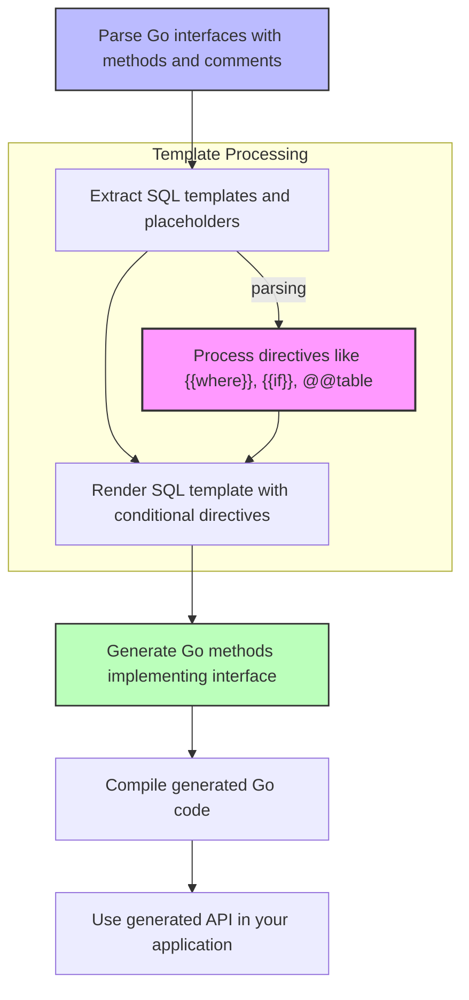

# Type-safe Query API Generation

Understand how GORM CLI transforms your interface definitions and annotated method comments into concrete, type-safe query APIs. This page explains the core concepts behind placeholder binding, the use of a SQL template DSL, and how the SQL intent in your interface methods manifests as generated Go methods that offer compile-time safety and developer ergonomics.

---

## Overview

At the heart of GORM CLI's power lies its ability to generate type-safe query APIs directly from Go interfaces adorned with SQL templates in method comments. This enables you to write clean, maintainable abstractions that query your database without sacrificing the safety and autocompletion that Go developers expect.

The generated code converts annotated interface methods into Go implementations that build SQL queries dynamically but safely, using placeholders to avoid SQL injection and binding parameters with strong typing.

---

## User Journey: From Interface to Type-safe API

Imagine you want to query users by their ID or filter them by dynamic columns. You write an interface like this:

```go
// Query[T any] is your query contract.
type Query[T any] interface {
  // SELECT * FROM @@table WHERE id=@id AND name = "@name"
  GetByID(id int) (T, error)

  // SELECT * FROM @@table WHERE @@column=@value
  FilterWithColumn(column string, value string) (T, error)

  // where("name=@name AND age=@age")
  FilterByNameAndAge(name string, age int)

  // More methods with templated SQL...
}
```

When you run the `gorm gen` command, GORM CLI parses your interface methods and the annotated SQL templates. It then generates Go code that implements these methods using GORM's DSL to bind parameters safely and construct queries tailored to your models.

For example, `GetByID` will generate a method that builds a `SELECT` statement filtering by `id` and `name`, using placeholders and passing the values as method parameters. This eliminates manual error-prone query building.

---

## Key Concepts

### 1. SQL Templates in Comments

You embed SQL queries and dynamic instructions as comments on your interface methods. These can include:

- **Plain SQL with placeholders:**
  ```sql
  SELECT * FROM @@table WHERE id=@id
  ```
- **Template directives (DSL):**
  ```sql
  {{where}}
    {{if user.Age > 0}} age=@user.Age {{end}}
  {{end}}
  ```

This lets you express complex, conditional queries declaratively.

### 2. Placeholder Binding

Placeholders use `@` syntax to bind Go method parameters to query parameters safely:

- `@param` binds a Go parameter directly
- `@@table` dynamically resolves the table name for the model
- `@@column` allows dynamic column names

The generator replaces these placeholders by building parameterized queries and supplying parameters in the correct order.

### 3. Template DSL Directives

GORM CLI supports a simple yet expressive template DSL to manage query conditions and updates dynamically.

| Directive   | Purpose                           | Description and Example                      |
|-------------|---------------------------------|---------------------------------------------|
| `@@table`   | Model's SQL table name           | `SELECT * FROM @@table WHERE id=@id`        |
| `@@column`  | Dynamic column binding           | `WHERE @@column=@value`                      |
| `@param`    | Go parameters bound as SQL params| `WHERE name=@name`                           |
| `{{where}}` | Wraps conditional WHERE clauses  | `{{where}} age>18 {{end}}`                    |
| `{{set}}`   | Wraps conditional SET clauses for UPDATE| `{{set}} name=@name {{end}}`        |
| `{{if}}`    | Conditional logic in SQL templates| `{{if age > 0}} age=@age {{end}}`            |
| `{{for}}`   | Iteration over a slice/collection| `{{for _, tag := range tags}} ... {{end}}`  |

---

## What Happens Under the Hood

When you run the generator, GORM CLI follows these steps:

1. **Parse Interfaces**: Reads your Go interfaces and extracts each method's name, parameters, and appended SQL comments.

2. **Extract SQL Fragments**: Parses the comment to isolate raw SQL or directives like `where()`, `select()`.

3. **Render Template**: A template engine processes your SQL comment template, replacing placeholders with snippet-generating code. It builds a parameter list and uses a string builder internally.

4. **Generate Type-safe Go Methods**: Using the rendered template, the generator emits Go methods implementing your interface. These methods construct SQL statements with parameters safely bound.

5. **Compile and Use**: The generated Go code compiles alongside your project, providing you compile-time checked query methods.

---

## Worked Example

Consider the method:

```go
// SELECT * FROM @@table WHERE id=@id AND name = "@name"
GetByID(id int) (T, error)
```

The generator creates code that performs:
- Builds a SQL statement with `SELECT * FROM [table] WHERE id=? AND name = ?`
- Binds `id` and `name` parameters in order
- Runs the query returning a typed result `T`

Internally, this aligns with code like:

```go
var sb strings.Builder
params := make([]any, 0, 2)
sb.WriteString("SELECT * FROM ? WHERE id=? AND name = \"@name\"")
params = append(params, clause.Table{Name: clause.CurrentTable}, id)
// Execute query with params
```

This ensures the query is dynamically safe and parameters are correctly inserted.

---

## Handling More Complex Queries

GORM CLI supports:

- **Conditional clauses** with `{{if}}` to include SQL parts only when certain values are present.
- **Iterating collections** to build complex `WHERE` conditions or `IN` clauses with `{{for}}`.
- **Dynamic filtering and updates** using `{{where}}` and `{{set}}` blocks.

For instance, to update user information selectively:

```sql
UPDATE @@table
{{set}}
  {{if user.Name != ""}} name=@user.Name, {{end}}
  {{if user.Age > 0}} age=@user.Age, {{end}}
  {{if user.Age >= 18}} is_adult=1 {{else}} is_adult=0 {{end}}
{{end}}
WHERE id=@id
```

The generator emits Go code that assembles this SQL dynamically by checking the conditionals and includes only valid fields.

---

## Practical Tips & Best Practices

- **Use Interface Naming Patterns**: By convention, interfaces prefixed with `Query` are targeted by the generator — helps scope generation.

- **Annotate Your Comments Clearly**: The generator depends on accurate, formatted SQL or DSL comments. Follow the DSL syntax strictly.

- **Bind Parameters Explicitly**: Use `@param` syntax to link method parameters safely — avoid string concatenation for query construction.

- **Leverage Template DSL for Flexibility**: Use `{{if}}` and `{{for}}` to handle optional criteria, filters, and batch queries elegantly.

- **Test Generated Methods**: Unit tests such as those verifying generated SQL strings against expected outcomes safeguard your query correctness.

- **Avoid Overly Complex Logic**: Keep SQL template comments clear and focused; delegate complex filtering to method parameters or separate queries if needed.

---

## Common Pitfalls & Troubleshooting

<AccordionGroup title="Common Issues in Type-safe Query API Generation">
<Accordion title="Empty or Missing SQL Comments">
If your interface method lacks the expected SQL comment or template, the generator will skip generating the method implementation.

**Solution**: Ensure every query method has properly formatted SQL comment.
</Accordion>
<Accordion title="Incorrect Placeholder Usage">
Placeholders like `@param` and `@@table` must be used accurately. Mistyping or missing `@` will cause generation errors or invalid SQL.

**Solution**: Validate placeholder syntax carefully.
</Accordion>
<Accordion title="Dynamic Column Names Not Binding Correctly">
Using `@@column` requires passing the dynamic column as a method argument and binding correctly.

**Solution**: Confirm method signatures align with placeholders.
</Accordion>
<Accordion title="Compilation Errors in Generated Code">
Generated code depends on proper typing and package imports.

**Solution**: Check for missing or incorrect model imports and ensure Go generics version 1.18+.
</Accordion>
</AccordionGroup>

---

## Diagram: Generation Flow for Type-safe Query APIs



---

## Related Documentation

- [Mastering the SQL Template DSL](../real-world-examples/template-sql-dsl) — Understand all template directives in detail.
- [Working With Field Helpers](../real-world-examples/working-with-field-helpers) — How generated field helpers complement query methods.
- [Associations: Patterns and Best Practices](../real-world-examples/associations-in-practice) — Manage associations alongside query APIs.
- [Configuring the Generator](../../customization-integration/generator-config-concept) — Customize generation via config.

---

This page anchors your understanding of how expressive, type-safe query APIs emerge from annotated interfaces, empowering safe, maintainable data access code without manual query construction.