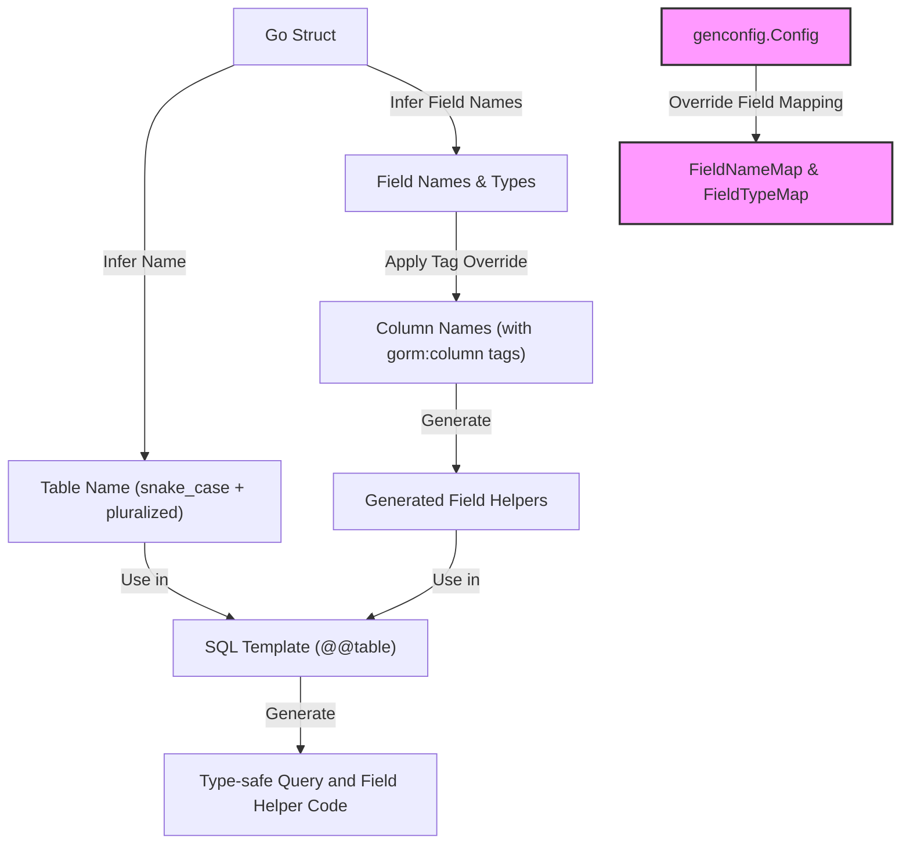

# Schema Inference and Naming Conventions

GORM CLI seamlessly integrates with GORM's conventions for inferring table and column names from your Go model structs, while providing flexible options for customization via struct tags and generation configuration. This page guides you through how names are derived automatically by default, how GORM CLI respects or extends these mechanisms, and the ways you can tailor naming for your project needs.

---

## How Table Names are Inferred

By default, GORM CLI follows GORM's strategy for resolving the database table name linked to a Go struct type:

- The struct name is converted to snake_case.
- Pluralization is applied to yield the table name.

### Example

```go
// Go struct representing a user
// struct name: User

type User struct {
    ID   uint
    Name string
}
```

This results in the table named `users` being inferred.

The table name placeholder `@@table` in SQL templates automatically resolves to this inferred name, letting you write concise, consistent queries.

### Key Points

- Pluralization and naming logic comes from GORM's [NamingStrategy](https://gorm.io/docs/naming.html) with default settings.
- If you override naming behavior in your GORM configuration at runtime, be aware that the generated code's inferred names are based on static analysis aligned with the default strategy.

<Info>
If your project requires a different naming style (e.g., no pluralization or camelCase), consider customizing via configuration or explicit tags described below.
</Info>

---

## Column Name Inference

GORM CLI extracts column names corresponding to each struct field based on GORM's standard conversion rules:

- Field names in PascalCase are translated to snake_case column names.
- If a `gorm:"column:<name>"` tag is present, that name overrides the default.

### Example

```go
type User struct {
    ID        uint      // column: id
    CreatedAt time.Time // column: created_at
    UserName  string    `gorm:"column:username"`  // column: username (tag override)
}
```

Generated field helpers access columns using these inferred or overridden column names.

---

## Customizing Names with Struct Tags

GORM CLI respects the `gorm` struct tags, especially the `column` tag, for precise naming control.

```go
// User with explicit column name for display name

type User struct {
    DisplayName string `gorm:"column:display_name"`
}
```

This influences generated field helpers and query builders to use `display_name` instead of a default derived column.

---

## Adjustments and Overrides with Generation Config

For use cases requiring non-standard mappings or additional typing considerations, utilize the package-level `genconfig.Config` struct.

### Key Configuration Options

- **FieldNameMap**: Allows mapping struct field names (via `gen` tags) to custom field helper types.
- **FieldTypeMap**: Lets you map Go types to specialized field helper types.
- **Include/Exclude filters**: Select which interfaces and structs to generate, enabling granular control.

### Example: JSON Field Mapping

```go
package examples

import "gorm.io/cli/gorm/genconfig"

var _ = genconfig.Config{
    OutPath: "examples/output",
    FieldNameMap: map[string]any{
        "json": JSON{}, // Map fields with gen:"json" tag to custom helper
    },
}
```

```go
// Model file
package models

type User struct {
    Profile string `gen:"json"`
}
```

This configures the generator to map the `Profile` field to a special JSON helper instead of a string field helper.

---

## Practical Tips and Best Practices

- Keep Go struct names clear and idiomatic; GORM CLI will infer sane table names generally.
- Use `gorm:"column:<name>"` tags where explicit column naming is necessary, especially for legacy schemas.
- Use `gen:"<tag>"` tags combined with `FieldNameMap` or `FieldTypeMap` to extend helper behavior for custom types.
- Avoid relying on runtime naming strategies in GORM that differ from default conventions, as code generation is static and based on source code.

<Warning>
Mismatch between generated naming and GORM runtime naming strategies can lead to confusing query results or runtime errors.
Verify that naming is consistent across generation and runtime.
</Warning>

---

## Troubleshooting Common Naming Issues

- **Generated code queries incorrect tables or columns:** Review your struct tags and generation config overrides.
- **Conflicts in field names or ambiguous mappings:** Use explicit `gorm:"column:..."` tags.
- **Custom types not behaving as expected:** Map these types in `FieldTypeMap` or `FieldNameMap`.

Refer to the [Basic Configuration](https://docs.gorm.io/getting-started/configuration-troubleshooting/basic-configuration) and [Using Generated Field Helpers](https://docs.gorm.io/guides/getting-started-workflows/using-field-helpers) for more resolutions.

---

## Summary Diagram: Naming and Mapping Workflow



---

## Related Documentation

- [Core Concepts & Terminology](https://docs.gorm.io/overview/concepts-architecture-flow/core-concepts-terminology): Understand foundational terms used by GORM CLI including naming and code generation.
- [Model-Driven Field Helpers](https://docs.gorm.io/concepts/core-architecture/model-field-helpers): Learn how field helpers are built from inferred column names.
- [Basic Configuration](https://docs.gorm.io/getting-started/configuration-troubleshooting/basic-configuration): Customize and control code generation, including naming.
- [Using Generated Field Helpers](https://docs.gorm.io/guides/getting-started-workflows/using-field-helpers): Practical guide on leveraging generated helpers with inferred names.

---

Harnessing GORM CLI's schema inference and naming conventions ensures your generated code aligns perfectly with your database schema. By understanding default behaviors and configuration hooks, you gain precise, type-safe control over how your Go structs map to your database, streamlining your GORM-based development.


